# IMPLEMENTATION_PLAN.md — Personal AI Trading Platform (NSE / Zerodha Kite Connect)

**Status:** Design-complete, ready for phased implementation.
**Date:** 2026-06-11.
**Re-verification note (2026-06-11, web, per "How to work"):** **D3 confirmed** (Agent SDK credit $100/mo Max 5x, $200/mo Max 20x, effective 15 Jun 2026; overflow to pay-as-you-go only if explicitly enabled). **A7 confirmed** (15:25 square-off since 26 Dec 2025; ₹50 + 18% GST per auto-squared position). **A9 confirmed** (static IP on order endpoints only, 1 primary + 1 optional secondary on developers.kite.trade; data endpoints exempt; market protection must be non-zero, −1 = auto; slicing ≤ 10). **D1 version drift:** `claude-agent-sdk` is now **0.2.97** on PyPI and `@anthropic-ai/claude-agent-sdk` **0.3.173** on npm; current official docs state the Claude Code CLI is **bundled with the SDK package** (no separate Node/CLI install documented) — Phase 0 pins whatever is current at implementation time; subprocess architecture confirmed. **A2 scope correction:** official docs scope the limits **per API key**, not aggregated per client across apps, and document the counters as "order requests" without explicitly enumerating place+modify+cancel; this plan keeps the conservative interpretation (one shared budget counting place+modify+cancel) because it only makes the self-throttle stricter. Discrepancies are also noted inline where D1/A2 are cited.

**Engineering-invariants note (2026-07-12):** the **§3.2 hot-path & storage invariants** were added from *measured* Phase-1 incidents (row-at-a-time DuckDB I/O, sample-based Decimal type inference, µs-vs-ns timestamp resolution, event-loop-blocking flushes, a reproduced shutdown lock-order deadlock, backfill checkpoint over-advance). They bind every subsequent phase; §3.2.3 (checkpoint advance rule), §2.6 (teardown order), §4.4 job 3, §8.2 (backtest universe resolution), §8.4 (ReplayHarness performance), §9.1 and chaos case 23 carry the corresponding rules and regression coverage.

**Conventions used throughout this document:**

- `A1…E7` cite the verified fact sheet; `O1…O10` cite non-negotiable owner decisions (**O11–O13 added 2026-07-06** — the news-integration decisions, defined in §2.7 and recorded in §14 Q16); `R1…R10` cite hard architecture requirements. Every load-bearing design choice cites the IDs it depends on.
- `[tunable]` marks a starting value expected to be tuned. If it is *learnable* it also appears in the envelope table (§6.3); if it is not in that table, only the owner may change it.
- All times are IST. All file paths are relative to the repository root `market_trading/`.
- "Engine" = the main Python process. "Platform" = the whole system. "Owner" = the single human user.

---

## 1. Executive summary

### 1.1 What is being built

A single-user platform for Indian equities (NSE) on a Zerodha account, running on the owner's Windows 11 PC (O7), that operates in three modes (O2): **RECOMMEND** (fully-specified trade recommendations over Telegram + dashboard, human executes manually, the platform places *zero* API orders — B7), **AUTO** (the platform trades via Kite Connect, gated behind paper-trading acceptance criteria, §8.5), and **OFF** (data + learning continue; only risk-reducing actions on already-tracked positions are permitted — R3). Capital is hard-capped at ₹20,000 (O1). Intraday (MIS), swing and position (CNC) styles are supported architecturally from day one (O3). The intelligence layer is Claude agents on the Claude Agent SDK under the owner's Max subscription (O6); the safety layer is pure deterministic Python (R1); capital preservation outranks returns (O10).

The defining safety property is **three-tier separation (R1)**: Claude proposes, a deterministic risk gate disposes, a deterministic OMS executes — and the platform must remain *safe with the LLM tier completely dead*. The second defining property is **broker-resident protection (R3)**: every live position is protected by an order resting at the broker/exchange (SL-M for MIS, GTT OCO for CNC), so capital protection survives process death, PC death, and token expiry.

### 1.2 Honest economics (C9 — read before anything else)

This section is deliberately first. SEBI's own research: **71% of retail intraday equity traders lose money** (80% for those making >500 trades/year); 91% of F&O traders lost money in FY25; academic evidence puts persistently profitable day traders below 1%. There is no credible basis to expect this platform to be net profitable in its first year.

The fixed cost base makes the math harder, not easier: ₹500/month Kite Connect data plan, ~₹1,500/year static IP (AUTO phase), plus electricity/compute (lower now that the engine runs only during active periods, §2.6) — **≈ ₹550–675/month ≈ 2.75–3.4% of the ₹20,000 capital, every month** (computed in §11.1; inside C9's 3–5% envelope once any incidentals land; the Claude Max subscription is a pre-existing sunk cost and excluded — see §11 footnote). Friction on trades compounds this: a leveraged MIS round trip costs ≈0.41% of the *notional* per turn (illustrated at the broker-max 5× for worst-case friction; the platform cap is 3×, §7.1 `max_leverage`); ten such turns a month ≈4.1% of capital in costs alone (C3).

**Therefore the success metric for Phases 0–3 is explicitly NOT profit.** It is: process quality (zero risk-gate bypasses, zero unprotected positions, clean reconciliation), capital preservation (drawdown inside limits), and learning per rupee of tuition — a measured, attributed record of what works and what doesn't (R4 learning ledger). Profit becomes a *tracked* metric in Phase 4 and a *target* only in Phase 5, and even then subordinate to O10. The plan optimizes the cost of being wrong, because the base rates say we will often be wrong.

### 1.3 What "success" means, per phase (full gates in §8)

| Phase | Success means |
|---|---|
| 0 — Foundations | Clean skeleton; secrets in DPAPI; daily token workflow works end-to-end from the owner's phone; install smoke test green on pinned Python (A4); A11 empirically answered. |
| 1 — Data + backtest + baselines | Ticker subprocess survives a full week; self-built bars reconcile vs Kite candles within tolerance daily (A13); backfill complete for the universe; 4 rule-based baselines backtested with walk-forward + CPCV (E2), with cost model applied (C2/C3). |
| 2 — RECOMMEND live | Recommendations flow daily through the *same* risk gate as live trading would use (R1), delivered on Telegram + dashboard with cost math and manual protective-order checklist (B7); paper ledger tracks them. Zero API orders placed (B7). |
| 3 — AUTO in paper | Full OMS incl. protection manager runs against the conservative paper broker (R9) for ≥30 sessions; all chaos tests (§9.4) pass; acceptance criteria (§8.5) met. |
| 4 — AUTO live, small | Static IP live (R7/A9); 1× leverage, MIS longs + CNC swing only, tightest limits; live-vs-paper fill deviation tracked and fed back (R9); zero R3-invariant violations. |
| 5 — Learning online + ramp | Champion/challenger loop promotes/rolls back autonomously inside the envelope (R4); leverage/style ramp completes per gates (O3); platform runs ≥4 weeks with no owner intervention beyond the daily login + approvals — active periods start (manually or via the wake-capable Scheduled Task) and every startup self-recovers and catches up (§2.6). |

### 1.4 Key architectural decisions (rationale inline, detail in cited sections)

1. **One supervised process tree, not microservices** (§2.2): a single asyncio engine process (NSSM service) owning a Twisted ticker subprocess (A4 forces the subprocess), with FastAPI dashboard and Telegram bot in-process. One box, one writer per store, no distributed state (E4, O7). **The process is up only during active periods and may be intentionally stopped in between (§2.6); every startup is a full reconcile + catch-up, and being off outside an active period is normal, not a fault.**
2. **The risk gate and OMS are LLM-free by construction** (R1): the `engine.risk` and `engine.oms` packages import nothing from `engine.intelligence`; proposals arrive only as schema-validated data (§3.5). The LLM tier is removable: budget exhaustion, SDK death, or OFF mode all resolve to the same "no proposals" state (D6/D7) while Tiers 2–3 keep managing positions.
3. **Broker-resident protection always** (R3): SL-M placed immediately after every MIS fill; GTT OCO after every CNC fill (AUTO/paper only — B7); the chaos invariant "platform dead + token expired ⇒ position still stop-protected" is tested, not assumed (§9.4).
4. **Event-triggered, single-shot LLM calls intraday** (D5): deterministic scanners pre-screen; Claude is invoked ~10–30×/day with fully pre-assembled context, no tools, structured output; agentic multi-turn runs only nightly/weekly with hard caps. Budget governor meters locally (no balance API — D6) against the $100/month Agent SDK credit (D3, parameterized per O6).
5. **RECOMMEND mode places zero API orders of any kind** (B7): no GTT staging, no one-tap execute button. Protective orders are part of the human's manual checklist inside the recommendation payload. This keeps RECOMMEND entirely outside the algo-**execution** framework (B4) and needs no static IP (R7).
6. **≤10 OPS by construction** (B3): a token-bucket self-throttle at 1 order-API call/second sustained (place+modify+cancel counted, A2) — entry calls hard-capped at 70/day, risk-reducing orders uncapped-but-paced and never budget-rejected (R3, §7.1) — the 1/s pace keeps even a saturated day (~≤390 calls) an order of magnitude under 10 OPS and well under the broker's 5,000/day cap. Self-learning therefore never enters the registration regime (B3).
7. **Online learning runs inside a Tier-2-owned envelope** (R4): learnable parameters and ranges live in a hash-verified protected store the learner cannot write; promotion requires validation → shadow → gate; strategy *code* changes always require owner approval.
8. **Backtesting = vectorbt for sweeps + the platform's own event-driven replay harness** (substituting NautilusTrader, E1, with reasoning): R9 demands paper mode share the live code path; building the replay simulator on the real OMS + paper broker gives backtest≈paper≈live consistency and avoids building a Kite/NSE adapter for NautilusTrader that would duplicate the OMS. vectorbt remains for fast vectorized parameter sweeps; skfolio supplies CPCV (E2). Sequencing: Phase 1 validates baselines with vectorbt; the replay harness arrives with the OMS in Phase 3 (§8.2).
9. **Shorting policy (C8):** MIS shorts disabled at AUTO go-live; enable no earlier than Phase 5 via owner-approved gate, then F&O-list stocks only, 14:00 entry cutoff, 14:45 square-off, half the long size cap. RECOMMEND may flag short ideas, separately marked higher-tail-risk. Rationale: an un-coverable MIS short into an upper circuit settles via exchange auction with penalties that can exceed the entire capital at 5× (C8).
10. **NSE-only trading venue** (trading scope): deepest liquidity in the universe stocks and a single instrument-token namespace; dual-venue routing is wasted design surface at ₹20,000. BSE data optional for cross-checks only (§13).
11. **User-set daily trade window** (O2 refinement): all platform-initiated entries and **entry recommendations (`kind='entry'`)** — MIS *and* CNC — occur only inside a single owner-configured clock window (e.g. 10:00–10:30 IST; a **sticky control-plane value** in SQLite `trade_window_state`, seeded from the `config/settings.yaml` default and **owner-adjustable at runtime** via Telegram `/trade_window` / dashboard `POST /config/trade_window` — §3.2.7/§7.1), composed most-restrictive-wins with the §7.1 style entry windows and the market session. **MIS positions are opened *and* closed within the window** (platform square-off at window end while the engine is up; the 15:05–15:10 self-sweep and the broker 15:25 cutover are the sanctioned backstops if the engine is offline across window-end — §2.6); **CNC swing/position trades are merely *decided* in-window, then held to their normal holding limits — protected by their resting broker GTT, with live management and ex-date adjustment caught up on the next startup (§2.6), since the engine is not up the whole session.** Data, bar-building, and feature warm-up run **whenever the engine is up** (backfilled on startup for any offline span, §2.6); broker-resident protection (R3) runs regardless of the engine. The window gates *entry decisions and order-opening only, never a risk-reducing action* (R3): exit/adjust recommendations, stop-tightens, exits and square-offs are issued/executed whenever the engine is up (§5.2 trigger b). **Entry-seeking** intraday LLM calls (signal scans + heartbeat) fire only in-window (cost drops); the News Analyst and the deterministic pre-screen scanners are not trade-window-gated — they run on their §5.4 schedule / whenever the engine is up (§5.4/§5.6/§11.2).
12. **News-intelligence layer with guarded origination (O11/O12/O13, §2.7 — added 2026-07-06):** the platform digests the last ~24 h of market/sector/theme/stock news into a pre-open **catalyst watchlist** with deterministic trade levels; a 5th deterministic baseline (`cat`, §6.1) may **originate** entries from that watchlist **only in AND-combination with price/volume confirmation** — news proposes the watchlist, price confirms the entry, the gate disposes (trust-boundary carve-out §2.4 item 4). LLM-scored news never reaches Tier 2, never sizes a trade, never relaxes a limit; the scorer dying disables catalyst origination and nothing else (fails to zero, D7/§2.7). There is deliberately **no mid-day breaking-news origination path** (O12): intraday headlines feed context/features and the §5.2(b) held-position trigger only.

---

## 2. System architecture

### 2.1 Component diagram

```mermaid
flowchart TB
    subgraph EXT[External]
        KITE[Kite Connect REST]
        KWS[KiteTicker WebSocket]
        NSE[NSE/UDiFF/calendars/RSS/GDELT]
        TG[Telegram API]
        CLAUDE[Claude Agent SDK -> Claude Code CLI subprocess]
    end

    subgraph PC[Windows 11 PC - NSSM service 'mt-engine']
        subgraph ENGINE[Main engine process - Python 3.12 asyncio]
            SCHED[ops.Scheduler + NSE calendar R6]
            SESS[broker.SessionManager - daily token A5]
            MD[marketdata - BarBuilder, Backfill, Reconcile]
            UNI[universe + datafeeds - daily jobs]
            FEAT[features.FeatureEngine]
            SCAN[strategy scanners + SignalPreScreen]
            subgraph T1[Tier 1 - intelligence proposes]
                HARN[AgentHarness + ContextAssembler]
                GOV[BudgetGovernor D6]
            end
            subgraph T2[Tier 2 - risk disposes, no LLM]
                GATE[RiskGate + LimitsEngine]
                MODE[ModeManager + RiskState]
                KILL[KillSwitch - sticky R10]
            end
            subgraph T3[Tier 3 - OMS executes]
                OMSM[OrderManager state machine]
                PROT[ProtectionManager SL-M/GTT R3]
                RECON[Reconciler + SquareOffScheduler]
            end
            PAPER[paper.PaperBroker R9]
            LEARN[learning - ledger, River, champ/chall R4]
            TGB[notify.TelegramBot O8]
            API[api.FastAPI + Kite login callback R6]
        end
        TICKER[Ticker subprocess - Twisted A4]
        DUCK[(DuckDB + Parquet)]
        SQL[(SQLite state.db)]
        DASH[React dashboard O8]
    end

    OWNERPH[Owner phone: Telegram + browser]

    KWS <--> TICKER
    TICKER -- ticks+order updates, localhost TCP --> ENGINE
    KITE <--> SESS
    KITE <--> OMSM
    NSE --> UNI
    CLAUDE <--> HARN
    TG <--> TGB
    OWNERPH <--> TG
    OWNERPH -- LAN http + bearer token --> API
    API --> DASH
    SCAN -- signal candidates --> HARN
    HARN -- ActionProposal --> GATE
    GATE -- GateVerdict --> OMSM
    GATE -- verdict+payload --> TGB
    OMSM <--> PAPER
    MD --> DUCK
    OMSM --> SQL
    LEARN --> SQL
    GOV --> SQL
```



### 2.2 Process model on Windows (O7, A4, E7, D11)

| Process | Runtime | Owner | Why separate / why not |
|---|---|---|---|
| **`mt-engine`** (NSSM service) | Python 3.12, single asyncio loop | NSSM **manual/demand start** (started manually or by a wake-capable Scheduled Task for active periods, §2.6); restart-on-failure gated to a "I intend to run" sentinel so a clean self-initiated stop is **not** auto-restarted, while a crash during an active period is | Hosts everything deterministic plus the SDK harness. One process ⇒ one SQLite writer, no IPC for state, startup recovery is one code path. FastAPI (uvicorn) and the Telegram bot run as tasks on the same loop — crash isolation is *not* worth distributed state on one box. Up only during active periods (§2.6); intentional stop ≠ crash. |
| **`mt-ticker`** (child of engine) | Python 3.12, Twisted reactor | Spawned + supervised by the engine | **Forced by A4**: KiteTicker is Twisted-based; the reactor cannot restart in-process. The engine kills/respawns it freely (new token at 08:55, reconnect storms, hangs). Ships ticks + order updates to the engine over localhost TCP `127.0.0.1:8401`, length-prefixed msgpack frames, with an in-band heartbeat frame every 1 s. Silence >10 s ⇒ engine kills + respawns + raises the stale-data guard (R2). |
| **Claude Code CLI** (child of engine, per SDK call) | Bundled with `claude-agent-sdk` (re-verified: current docs bundle the CLI with the package — no separate Node install; D1) | Spawned by `claude-agent-sdk` | The SDK package version is pinned in the lockfile, which pins the bundled CLI; auto-update disabled; installed into the service account's venv (D11). |
| **Dashboard** | Static React build served by FastAPI | — | No separate Node server in production; `npm run build` output served from `engine.api`. |

**Service environment (D11, E7):** all secrets including `CLAUDE_CODE_OAUTH_TOKEN` live in DPAPI (§2.4); the engine loads the token at startup and sets it in its own process environment before spawning the SDK's CLI child — a deliberate deviation from D11's NSSM-`AppEnvironmentExtra` suggestion, chosen because R10 requires secrets in an encrypted store and the CLI is a child of the engine anyway (NSSM env injection remains the documented fallback). The token is minted by `claude setup-token` run as the service user via the CLI bundled with the SDK package (invocation path recorded during the Phase-0 smoke test; if the package exposes no callable entry point, a one-off global CLI install is used solely for minting, then removed — D1 re-verified). A startup self-test runs on **every startup** (process boot, scheduled or manual — not a fixed 08:00 clock job) and makes one cheap Haiku SDK call (skipped on non-trading-day starts; deduped per trading day), alerting on failure (D11). Power: `SetThreadExecutionState(ES_SYSTEM_REQUIRED|ES_CONTINUOUS)` is held **only while an active period / catch-up run is actually executing** (§2.6), not a blanket 08:00–16:00 window, and released when the engine enters a planned stop; a wake-capable Scheduled Task wakes the PC for scheduled active periods (incl. EOD jobs). Documented power-plan setup (disable Modern Standby network throttling, set Windows Update active hours) lives in the runbook (§10.7, E7). A stray `ANTHROPIC_API_KEY` in the service environment silently outranks the OAuth token (D2) — the startup self-test asserts it is absent unless the owner has deliberately configured pay-as-you-go overflow (D6).

**Startup recovery (E7) — every startup, scheduled or manual, after a clean stop or a crash, gap of minutes or days:** the engine may be killed by Windows Update *and* is deliberately stopped during non-trading windows (§2.6). The **authoritative startup recovery & catch-up sequence is §2.6** (read sticky state → reconcile vs broker → square off any overdue MIS → backfill the data gap → catch up missed jobs → cold-start warm-up gate → re-arm/resume/verify/alert). Open positions are never unprotected meanwhile — their SL-M/GTT rests at the broker (R3). This supersedes the older same-day "crash recovery" framing: the sequence must tolerate arbitrary off-duration, not just a quick Windows-Update reboot.

**Lifecycle notifications & liveness (O8/R8 — the owner is told when the engine starts and when it stops).** This subsection is the single source of truth for the mechanism; §3.2.12/§4.2/§10.7/§10.8 reference it rather than restate it. Three **process-lifecycle** Telegram alerts, distinct from the *functional-degradation* alerts (`FEED_STALE`/`TOKEN_INVALID`/`BUDGET_TIER(DG4)`/`RISK_STATE`, which fire while the engine is **alive**):
- **`ENGINE_STARTED(mode, routing, active_period, version)`** — sent immediately on boot, **before** the §2.6 recovery/catch-up (so the owner knows it is alive even if catch-up is slow); the fuller `STARTUP_REPORT` follows on completion. Emitted **exactly once per OS-process start**, gated by `lifecycle.notify_started` (default true) — NOT re-emitted when a still-running process transitions into a later active period.
- **`ENGINE_STOPPED(reason, positions_protected, next_start)`** — sent as the **last act** of a clean/planned shutdown (reason ∈ {owner, window-idle, update, service-stop}); gated by `lifecycle.notify_planned_stop` (default true). Best-effort: a failed send never blocks exit — the owner reconciles it against the next `STARTUP_REPORT` (silence = off-is-normal); **the watchdog does NOT backstop a lost `ENGINE_STOPPED`** (it is deliberately silent for a clean stop), only the crash path.
- **`ENGINE_DOWN(reason=crash|wedged, since, downtime, positions_broker_protected)`** — the unexpected-death/wedge alarm, **sent out-of-band by the watchdog only** (a dead engine can't send it; the engine's own `TelegramBot` never emits it). Never suppressible. A crash the watchdog *cannot* catch (total power/PC loss — the on-box watchdog died too) is instead surfaced retrospectively by the next startup's `STARTUP_REPORT(crash_recovered)` — there is no `detected_by=restart` real-time alert.

**State machine — one SQLite row `engine_lifecycle` (§4.2); a tri-state replaces the old boolean "I intend to run" sentinel** (a boolean cannot distinguish "cleanly shutting down" from "running-and-wedged"). The alias *"intend to run" ≡ `state != STOPPED`* still gates NSSM restart-on-failure:
- **`STOPPED`** (default) — nothing running/intended; **the watchdog is silent** (being off between active periods is normal, §2.6).
- **`RUNNING`** — set at boot in §2.6 **step 0, atomically with a fresh `last_alive_at`, `pid`, `started_at`, and clearing the watchdog re-arm** (below). While RUNNING, `last_alive_at` is refreshed every `lifecycle.heartbeat_write_s` (default 20 s) **by a dedicated OS thread doing a direct `sqlite3` UPDATE — NOT the asyncio loop** — so a legitimately busy loop (multi-day catch-up backfill, a long query) cannot starve the heartbeat and self-alarm. **Invariant (tested, §9.1/§9.2): all CPU-bound/native work (vectorbt/numba backtests, pandas warm-up, large DuckDB scans) runs in a thread/process executor so the loop is never blocked > `heartbeat_write_s`** — this is also why the nightly in-process backtest queue (§5.5) must be executor-offloaded.
- **`STOPPING`** — set as the **FIRST** step of a clean stop, *before* the shutdown-guard work (flatten MIS / verify every CNC `PROTECTED` / cancel resting entries / backup — §10.8); the watchdog treats STOPPING as **not-a-crash** (intentional). Only after the guard fully completes does the engine commit **`STOPPED` + `last_clean_stop_at`**, send `ENGINE_STOPPED`, and exit. **The `STOPPED` commit is the point of no return that certifies all capital-relevant work is done — nothing capital-critical runs after it.** A crash *during* STOPPING therefore leaves `state=STOPPING` (not STOPPED): the watchdog fires `ENGINE_DOWN` (pid dead — see below) and the next startup sees an interrupted shutdown and re-verifies protection — the incomplete shutdown is **never** silently mislabeled clean.

**The watchdog** (`scripts/watchdog.py`, §3.2.12/§10.7) — a standalone **non-wake** Windows Scheduled Task every `lifecycle.watchdog_poll_s` (~60 s), **run-as the mt-engine service account** (so the per-user DPAPI bot token is decryptable), importing only `core.secrets` (bot token) + `core.config` (owner chat_id, a non-secret) + `httpx`, so it survives the engine's death. It opens `state.db` **read-only** and keeps its **own** debounce state in a small private file (`data/watchdog_state.json`) — it is **not** a second writer to `state.db` (preserving the one-writer invariant; immune to the engine's disk-full/write-lock failure modes). Per tick, two out-of-band checks:
- **(a) missed scheduled start** — on a trading day, clock is > `lifecycle.start_grace_s` past a `lifecycle.active_period_starts` time (settings.yaml — the schedule source, since a never-started engine leaves `state=STOPPED` and cannot signal intent) with `started_at` not ≥ that start ⇒ `SCHEDULED_START_MISSED`. Detection latency is bounded by the next PC wake (non-wake task); a failed wake for the day's *final* active period may not be caught until the next wake or the owner's phone check.
- **(b) engine down** — `state != STOPPED` **AND** [ **the recorded `pid` is not alive** (OS check — a crash/kill/OOM; `reason=crash`, detected within ~`watchdog_poll_s`) **OR** (`state==RUNNING` AND pid alive AND `COALESCE(last_alive_at, started_at)` stale > `down_stale_s` AND `now − started_at > lifecycle.catchup_grace_s`) (a *wedged* live process; `reason=wedged`) ] **AND** the re-arm predicate `watchdog_state.last_down_alert_at < last_alive_at` (or unset). Worst-case detection is `[watchdog_poll_s, down_stale_s + watchdog_poll_s]` ≈ **60–150 s**. On a wedge, the watchdog (or a small privileged helper) **force-kills the recorded `pid`** so NSSM's exit-triggered restart can take over (detection *and* remediation — a wedged process holds the SQLite writer lock and ports 8400/8401, so a bare restart would collide). The alert is **sent first; `last_down_alert_at` is stamped only on a confirmed successful send**, so a *correlated* network/Telegram outage (router down → engine wedged → send fails) retries every tick until connectivity returns rather than losing the one real-time alert. A fresh restart heartbeat re-arms the alarm automatically (boot clears it), giving exactly one alert per outage.

**Startup crash/interruption + single-instance (§2.6 step 0):** before overwriting the row the engine reads the prior `state` + `pid`. Prior `state ∈ {RUNNING, STOPPING}` with the prior **`pid` still alive ⇒ another instance owns the box**: the new process **refuses to start** (single-instance lock — named mutex / lock file) rather than double-run recovery and corrupt the single-writer stores (O7/E4). Prior `state ∈ {RUNNING, STOPPING}` with the prior **`pid` dead ⇒ the previous run crashed (RUNNING) or its shutdown was interrupted (STOPPING)** — the reconcile re-verifies protection and the `STARTUP_REPORT` leads with a crash-recovered notice. A **crash-loop** (repeated fast NSSM respawns) is bounded: NSSM restart-on-failure carries a backoff + give-up threshold (§10.7), `ENGINE_STARTED`/crash-recovered reports coalesce into a single `ENGINE_CRASHLOOP` alert when boots recur within `lifecycle.crashloop_window_s`, and on give-up the engine stays down so the watchdog's `ENGINE_DOWN` stands.

**Honest limitations (capital is broker-protected throughout — R3 — so every miss is operational, never a capital emergency):** (1) **total power/PC loss** kills the on-box watchdog too → surfaced only by the absent readiness/`STARTUP_REPORT` + phone check (chaos 19), never a real-time `ENGINE_DOWN`. (2) An owner who **hard-kills** via Task Manager (instead of the controlled stop, §10.8) leaves `state=RUNNING` and will — correctly by design — get `ENGINE_DOWN` + a crash-recovered report. (3) A **wedged-but-alive** process is reported `ENGINE_DOWN(wedged)` and force-restarted; a transient wedge that self-clears before the kill is reconciled by the next fresh heartbeat (no separate all-clear alert — a subsequent healthy `ENGINE_STARTED`/report is the signal).

### 2.3 The three-tier boundary (R1)

- **Tier 1 — `engine.intelligence`** (non-deterministic): produces only schema-validated `ActionProposal` objects (§3.5) and analysis artifacts (sentiment scores, regime notes, review reports). It cannot place orders, cannot touch limit config, and its outputs are *data*, never code or config. Any Tier-1 failure (timeout, schema-invalid after retries, CLI death, 429, credit exhaustion) resolves to no-proposal + alert (D7).
- **Tier 2 — `engine.risk`** (deterministic): validates **every** Tier-1-originated action type (`enter`, `exit`, `modify-stop`, `modify-target`, `cancel`) against the limit table (§7.1) with monotone rules: stops only tighten autonomously; protective orders never cancelled without a validated replacement; stop-widening/target-extension requires owner approval; position-opening actions may only be rejected or shrunk, never enlarged or initiated; after a shrink the cost model re-runs and rejects sub-viable sizes (C2/C3). All gate inputs come from deterministic broker/exchange sources only. RECOMMEND-mode recommendations pass the identical gate before delivery; the verdict + headroom ship in the payload (R1).
- **Tier 3 — `engine.oms`** (deterministic): order state machine (incl. broker-initiated terminal states, A8), protection manager (R3), reconciliation, square-off scheduling, GTT lifecycle.
- **Deterministic risk-reducing actions need no proposal**: stop execution, scheduled square-off, kill-switch flatten are Tier-2/3-originated and permitted in every mode (R1/R3).

**Enforcement is structural, not conventional:** `engine.risk` and `engine.oms` do not import `engine.intelligence` (a unit test asserts the import graph, §9.1). The OMS accepts work only as `(ActionProposal, GateVerdict)` pairs where the verdict row exists in SQLite and `verdict ∈ {approve, shrink}` — there is no code path from LLM output to an order that bypasses a persisted verdict.

### 2.4 Trust boundaries

1. **Learner ↛ limits (R4):** `config/limits.yaml` and `config/envelope.yaml` live in a *protected store*: the risk gate loads them only if their SHA-256 matches the signature record in SQLite table `protected_config` (written solely by the owner-confirmed change flow — Telegram two-step or dashboard with token). The learning system has read-only logical access and no code path that writes these files. **Integrity-failure rule (single rule, cited by §7.2 and tested in §9.1):** hash mismatch at startup load with no platform-tracked positions or open orders ⇒ FROZEN (no new entries) + alert; mismatch detected at runtime, or at startup with a live book ⇒ kill switch (§7.2). Chosen over a second Windows account + ACLs because it is auditable, testable, and robust to the learner and gate running in one process; the ACL approach is documented as a hardening option in §7.2. (Single-user Windows cannot give true process isolation — this is integrity verification, not access prevention; accepted and flagged in §12.)
2. **Control plane (R10):** Telegram commands accepted only from the owner's chat ID; destructive/mode-up commands (`/kill_reset`, `/mode AUTO`) require a two-step confirmation with a one-time phrase. Owner-only operational settings that are not destructive — e.g. the trade-window adjustment (`/trade_window`, `POST /config/trade_window`) — are single-step (owner chat-ID / bearer token) but still validated and audited (§3.2.7/§7.1). Dashboard binds to LAN with a bearer token (needed for the phone login redirect, R6); the only unauthenticated route is `GET /kite/callback` (receives the request_token; it can only *complete a login*, never read state or place orders). Secrets (Kite API secret, daily access token, Telegram bot token, Claude OAuth token) in Windows Credential Manager via DPAPI (`keyring`) per R10; the engine injects the OAuth token into its own process environment at startup (§2.2). Dashboard traffic is plain HTTP on the trusted home LAN — accepted deliberately: the bearer token and the single-use, seconds-lived `request_token` transit the owner's own Wi-Fi only; TLS/Tailscale is the upgrade path (§14 Q11). Nothing secret in the repo or YAML.
3. **Kill switch (R10):** Tier-2-owned; state persisted in SQLite `kill_state` and checked before *any* order on startup — sticky across crash/reboot/NSSM restart; reset only by owner via authenticated two-step flow. Dead-platform fallback is broker-native and pre-staged in the runbook: Kite app flatten, Kite Console kill switch, Call & Trade number (§10.6).
4. **Scraped news is untrusted Tier-1 input (E6, §4.4 job 10) — with ONE precisely-guarded origination carve-out (O11, 2026-07-06; full design §2.7, strategy rules §6.1 `cat`):** news can bias proposals, and LLM-scored news may additionally gate **candidate origination** — but **only** through the deterministic catalyst scanner's AND-rule: `symbol ∈ catalyst_watchlist` at grade `originating` (which itself requires **≥2 distinct source domains**, materiality ≥ `cat.materiality_min`, sentiment ≥ `catalyst_guard.sentiment_min_long`, novelty ≥ `cat.novelty_min`, an event type on the owner-fixed originating list, universe membership, and no surveillance/flagged/results-day-T status — full condition list §2.7 step 5) **∧ deterministic price/volume confirmation computed from broker data** (live Kite bars — §6.1 `cat`). The carve-out is bounded: news scores are *data* consumed by deterministic code (never code or config); they can never relax, widen, or size anything; every catalyst candidate passes the same §5.2 analyst step and the **identical Tier-2 gate** — and **no news-derived value is ever a Tier-2 gate input** (`GateContext` remains broker/exchange-source-only, §3.2.7). Blast radius of a manipulated headline cluster: at most `catalyst_guard.max_catalyst_entries_day` (default 2, §7.1) normally-sized, price-confirmed, gate-approved entries **per day** (a story persisting across its event age can re-qualify on later days — the multi-day ceiling and its loss-ladder bound are stated honestly in §2.7's guards paragraph) — and single-source demotion plus the `pump_promo_suspect` event class suppress the laziest pump patterns before that (§2.7 guards; residual risk §12 A5r). Scorer/LLM death ⇒ empty digest ⇒ the carve-out produces nothing (fails to zero, D7).

### 2.5 Data flow (summary; schemas in §4)

Ticks flow `KiteTicker → mt-ticker → TCP → BarBuilder → DuckDB` with pre-open exclusion (A14) and cumulative-volume-delta bar volume (A13). Order updates flow on the same socket (A3) into the OMS event queue. Daily jobs (08:00–09:00) refresh instruments/tick sizes (A10), MIS leverage + surveillance lists (A8), calendars, bhavcopy, corporate actions, news. Scanners read DuckDB features and emit signal candidates; the ContextAssembler packs deterministic context; Tier-1 returns proposals; the gate persists verdicts; OMS (AUTO/paper) or Telegram+dashboard (RECOMMEND) consume them. Data flow and feature collection run **whenever the engine is up** (§2.6 — the engine is not up the entire day); only the proposal/recommendation/order-opening steps are gated to the owner-set daily trade window (§1.4 item 11, §7.1 `trade_window`) — risk-reducing actions are never gated. News flows `RSS/GDELT → HeadlineClusterer → EntityResolver → News Analyst (LLM score) → pre-open CatalystDigest → catalyst_watchlist` (§2.7); the watchlist is the **single seam** through which news may contribute to candidate origination (O11), and no news-derived value ever enters Tier 2. Every decision artifact lands in SQLite (R8).

### 2.6 Operating model: active periods, intentional stop/start, and startup catch-up

The engine does **not** run continuously through the day. It is **up only during active periods** and may be **deliberately stopped** (and the PC slept) in between. Being off outside an active period is **NORMAL, not a fault** — no alert is raised for it. The defining invariant: **every startup is a full recovery** — scheduled or manual, after a clean stop or a crash, after a gap of minutes or days — and the platform never breaks because it was off. This is safe because capital protection is **broker-resident (R3)**: every open position's SL-M/GTT rests at the exchange and fires with the engine and PC dead.

**Active periods** (the engine intends to be up; it holds `SetThreadExecutionState` only while actually working, §10.7): (a) **morning prep** — login, daily data jobs, pre-open planner, ticker start, warm-up backfill; (b) **trade window + square-off** — the §7.1 `trade_window` plus its window-end MIS square-off; (c) **EOD jobs** — reconcile, bhavcopy/corp-actions/earnings/deals, nightly reviewer, backups. Between (b) and (c), and overnight, the engine may be stopped.

**Start trigger (§14 Q14):** manual owner start is first-class and is the *same code path* as any scheduled start. A Windows **Scheduled Task with "wake the computer"** may optionally auto-start the engine for each active period (covering EOD jobs that fall outside any wake window); default is manual-primary with catch-up. Because manual/demand start replaces NSSM "always restart," a missed scheduled start no longer self-heals — a lightweight watchdog (separate scheduled task / phone check) alerts if an expected active-period start did not occur (`SCHEDULED_START_MISSED`) **or if a running engine dies or wedges while `state != STOPPED` (`ENGINE_DOWN`, §2.2)** (§10.3/§10.4), and an open MIS then rides to the broker 15:25 backstop (below).

**Every-startup recovery & catch-up sequence** (supersedes the old "crash recovery" list; §2.2):
0. **Lifecycle boot (§2.2):** read the prior `engine_lifecycle` row first. Prior `state ∈ {RUNNING, STOPPING}` with the prior **`pid` still alive ⇒ refuse to start** (single-instance lock — another instance owns the single-writer stores, O7/E4). Prior `state ∈ {RUNNING, STOPPING}` with the prior **`pid` dead ⇒ the previous run crashed/was-interrupted** — flag it so step 7's report leads with a crash-recovered notice (the watchdog may already have sent the real-time `ENGINE_DOWN`). Then **atomically** set `state='RUNNING'`, a fresh `last_alive_at`, `pid`, `started_at`, and clear the watchdog re-arm (so the just-booted engine can't be mistaken for the outage it is recovering from); start the dedicated-thread heartbeat writer; and **emit `ENGINE_STARTED`** — all before step 1.
1. Read sticky **kill / mode / trade-window** state from SQLite before anything else (R10).
2. **Reconcile** orders/positions/GTTs against the broker = truth (R5) — catches anything that happened while offline (a GTT/SL-M that fired, an RMS close, a broker square-off). **Rebuild day-scoped risk counters for the current session from the ledger** (`consecutive_losses`, `max_new_trades_day` used, day-MTM baseline) — folding in any position closed while offline — so a same-day restart can't reset exhausted entry capacity (§7.1). **Run the REC_FILL_SUSPECTED match against any recommendation whose validity *overlapped* the offline span** (§3.6), so an owner fill during an off-period is captured, not mislabeled `no_action`. **Re-evaluate the continuous equity-based halt ladder (`weekly_drawdown`, `equity_floor_rung` −10%, `cumulative_floor` −15%) against the freshly-reconciled platform equity and apply each breached rung's FULL §7.1 action — state transition AND the forced exit-all where the rung specifies it (e.g. `equity_floor_rung` go-flat) AND the mode downgrade (AUTO→RECOMMEND) — BEFORE entries reopen, so a startup trip is behaviorally identical to a live trip (not merely a CLOSE_ONLY state set)** — a loss realized while offline (e.g. a held CNC's GTT firing deep, or a broker square-off) can put equity below a floor that was never *tripped* while the engine was down; kill-state stickiness (§7.2) only preserves a kill that already fired, so the floor ladder must be re-checked on startup, not assumed.
3. **Overdue-MIS square-off:** for every open platform MIS whose effective window-end (sticky `trade_window_state`, session-clamped) is ≤ now, immediately `SquareOffScheduler.run_window_squareoff()` (risk-reducing; cancel-and-replace the resting SL-M, §3.2.8) **before** arming any future job — a past-due window-end job cannot fire, so it must be caught up; the close is tagged `square_off_overdue_startup` (§3.5.2). (If now > 15:25 the broker already squared it — reconcile records that as `broker_squareoff_offline`.)
4. **Data-gap backfill:** compute off-duration since the last clean checkpoint; backfill bars from the Kite candle API for the offline span and rebuild feature warm-up (ORB range, ATR, VWAP, last-30-bar) — **including the NIFTY 50 index and India VIX history the market-context/regime features need (§7.1 `regime_data_ready`)** — official candles are canonical, so warm-up does **not** require live tick capture since 09:15.
5. **Missed-job catch-up** (the `CatchUpRunner`, §3.2.12): per-job `job_runs` watermarks (§4.2) drive re-running every scheduled job whose fire-time fell in the off-window and is still meaningful, in dependency order, classified as:
   - **Safety/deadline-critical — must run or verify before entries open, else FROZEN-for-entries + alert:** instruments+tick-size (A10), surveillance lists (A8) + held-position migration diff over the gap, earnings calendar, and **corp-action ex-date GTT adjustment** — on every startup, scan held CNC against `NSECalendar.ex_dates`; adjust any imminent ex-date GTT immediately (risk-reducing). If a T-1 deadline already passed unadjusted while offline, **re-derive the corp-action-adjusted trigger and cancel-and-replace the resting GTT to repair protection** (risk-reducing) — *and* alert high-severity + FROZEN-for-that-symbol; a freeze alone does not fix the already-held position's stale trigger (§3.2.8/A12).
   - **Idempotent run-latest (single catch-up, run-latest-once):** pre-open planner (today's DayPlan must exist before the first entry-seeking LLM call), sector map, universe build, **the news chain — backfill → cluster → resolve → pre-open scoring batch → catalyst digest (§4.4 jobs 10+14, in that dependency order; never entry-blocking — a failed/late chain just leaves `cat` disabled for the day, §2.7)**, **champion/challenger evaluation** (`last_evaluated_at` watermark; ingests all gap-session outcomes in one run, before promoted params influence any new entry — §6.4), **backups** (single current snapshot, `last_backup_at` watermark — §10.5; not per-missed-day), **label expired-unconfirmed recommendations `no_action`** (recs whose `valid_until` lapsed entirely during the off-span — guarantees the unbiased non-fill training signal, §3.6/§6.5, even after a long gap rather than leaving it to EOD-reconcile timing).
   - **Date-keyed backfill (run each missed trading day):** bhavcopy, deals (`flagged_instrument_days`), official-candle reconcile, daily bars, nightly reviewer (reviews each un-reviewed closed day).
6. **Cold-start warm-up gate (§7.1 `warmup_ready`):** entries stay FROZEN until enough contiguous bars (backfilled or live) cover each strategy's feature lookbacks; if started too close to the window to warm up, stay FROZEN-for-entries + alert — never trade on thin data. This is distinct from the feed-staleness guard and from a feed failure.
7. Re-arm remaining schedules; resume the ticker (entering a **WARMING** state, §3.2.12, that suppresses false feed-stale alarms until first ticks + warm-up complete); verify protection on every open position; alert the owner with a **startup/recovery report** (off-duration, what reconciled, jobs caught up, MIS squared, FROZEN reasons) — **and, if step 0 detected an unclean prior exit (prior `state != STOPPED` + dead pid), the report leads with a `crash-recovered` notice + measured downtime, complementing any real-time `ENGINE_DOWN` the watchdog sent (or standing in for it after a total power loss the watchdog couldn't catch).**

**Shutdown guard (§3.2.8/§3.5.3):** a planned/manual stop requested while a platform **MIS is open and its window-end has not completed** must first flatten the MIS (run_window_squareoff) and verify flat, **or** require explicit owner override acknowledging the MIS will fall to the broker 15:25 backstop. **The teardown ORDER is pinned: quiesce the event bus FIRST — `EventBus.publish` is fire-and-forget (`loop.create_task`), and `ticker.stop()` cancels only its own tasks, so in-flight tick/bar handler tasks must be cancelled-or-awaited (bounded drain) BEFORE the stores close; an orphaned handler racing `store.close()` is a use-after-close / lost-final-tick-batch window (Phase-1 review finding; the store degrades gracefully but the drain is the correct fix — chaos case 23).** **Before the engine exits, (i) cancel and verify every working/unfilled entry order** (a resting entry left at the broker could fill while the engine+PC sleep, leaving an unprotected MIS until next startup; a SUBMITTED/unacked entry has its broker_order_id resolved via orders-API/pending-correlation before the cancel — §3.5.1 — never exit with a SUBMITTED entry outstanding), **and (ii) verify every open CNC is `PROTECTED` (live resting GTT)** — for any CNC in `PROTECTION_PENDING`/`PROTECTION_FAILED`, place/repair the GTT and verify the ack, or block the stop / require owner override (mirroring the §7.2 kill sequence's "verify CNC GTTs live"); never leave the engine and PC dead with a working entry order or an unprotected position (R3). A protected CNC may be left (it gets **no live intraday management** while offline — only the resting GTT). A clean shutdown is also a good moment to snapshot a backup (§10.5).

**Broker 15:25 auto-square-off — two cases (A7):** while the engine is alive at window-end, the platform window square-off is primary and a broker 15:25 firing is a logged anomaly to investigate; when the engine is intentionally/crash offline across window-end, the 15:05–15:10 self-sweep and the broker 15:25 cutover are the **sanctioned backstops** for the offline MIS (₹50 + 18% GST per position, ledger-attributed as an offline-window cost, not strategy). Capital is protected throughout by the resting SL-M; only the intraday-discipline ("opened *and* closed in-window") degrades.

### 2.7 News-intelligence subsystem (E6+; owner decisions O11–O13, resolved 2026-07-06 — recorded in §14 Q16)

**Owner decisions (first-class O-IDs, cited like O1–O10):**

- **O11 — guarded origination:** LLM-scored news may help ORIGINATE trade candidates, but **only** in deterministic AND-combination with price/volume confirmation, multi-source corroboration, and every existing limit (§2.4 item 4). No per-trade owner approval is required — AUTO semantics are unchanged; the guards are structural, not procedural.
- **O12 — news is for daily selection, not reaction:** the news layer's job is to digest the **last ~24 h** (since the previous trading day's digest; weekend/holiday-aware lookback) into *which stocks to keep in concern today and at what levels* — a pre-open **catalyst watchlist**. There is **no mid-day breaking-news origination path**: a headline that breaks intraday enters features/context and (for held symbols) the §5.2(b) risk-reducing trigger, but cannot mint a same-day candidate for a symbol not already on the watchlist. Latency reality makes this the right cut: RSS polling (5–15 min) + batch scoring (≤30 min) means the platform can never front-run news — the tradeable edge at this latency is **post-event drift/continuation**, not reaction speed.
- **O13 — earnings policy:** results-day entries stay banned (`no_entry_on_results_day`, day T only); the catalyst scanner explicitly trades **T+1 post-earnings drift (PEAD)** with direction = scored surprise sign agreeing with the T-day price reaction (§6.1 `cat`).
- **Budget:** funded by rebalancing within the $100/month credit (§5.6/§11.2 — News Analyst $14; intraday $42; weekly $12); overflow stays off.

**Four scope levels** (every scored cluster carries `scope`): `market` (macro/policy/global risk — feeds regime context and market-level sentiment only, **never** origination), `sector` (mapped to NSE sector indices; fans out to constituents via `sector_map`), `theme` (cross-sector narratives — EV, defence, railways, capex — via the owner-approved `theme_map`), `stock` (named-entity resolution to a tradingsymbol). Sector/theme clusters fan OUT to universe constituent symbols at reduced weight; stock clusters resolve directly; unresolved or out-of-universe entities are recorded for the weekly alias-map suggestion loop (§5.5) and are **never traded**.

**End-to-end flow (every step deterministic except the two marked LLM):**

1. **Ingest** — `NewsIngest.poll` (§3.2.4): ET RSS + Moneycontrol RSS + GDELT DOC, **headline-level only** (title, source domain, url, published_at); article bodies are never fetched — cheap, and keeps the prompt-injection surface headline-sized (A3r). Off-period backfill per §4.4 job 10.
2. **Cluster** — `HeadlineClusterer` (§3.2.4): deterministic near-duplicate grouping into `news_clusters`; the cluster's distinct `source_domains` count is the corroboration input (§7.1 `catalyst_guard.min_source_domains`).
3. **Resolve** — `EntityResolver` (§3.2.4): deterministic alias map (instruments-dump company names + curated `entity_aliases`) → symbols; sector/theme tagging via `sector_map` + `theme_map` keyword match. Ambiguous ⇒ **no match, never a guess**. The News Analyst may emit verbatim entity *strings* for unmatched clusters; those strings re-enter this resolver — **the LLM never assigns a symbol directly**.
4. **Score (LLM)** — News Analyst (§5.4): per cluster `{scope, entities[], sectors[], themes[], sentiment −1..+1, materiality 0..1, event_type (closed taxonomy), novelty 0..1}`; schema-validated single-shot Haiku; scores persisted on `news_clusters`, always untrusted.
5. **Digest** — `CatalystDigestJob` (§3.2.4; §4.4 job 14; ~08:35, before the 08:50 planner; idempotent run-latest catch-up §2.6): two outputs, precisely defined.
   **(i) `sentiment_agg`** — for each scope_key (symbol/sector/theme/market): `clip( Σᵢ sentimentᵢ · materialityᵢ · wᵢ · 0.5^(age_hᵢ / cat.decay_halflife_h), −1, +1 )` over scored clusters with age_h ≤ 6× the half-life, where `wᵢ = cat.fanout_weight` (default 0.5, owner-only, settings.yaml) for a sector/theme cluster's contribution to a *symbol* row and 1 otherwise; age runs from cluster `first_seen` to the digest run time (`Clock`). A decayed **sum** (clipped), not a mean — old news fades toward neutral, never lingers at full strength.
   **(ii) the day's `catalyst_watchlist`** — the candidate set is **ALL scored clusters with event age ≤ `cat.max_event_age_days`** (the O12 "~24 h" describes headline *ingest*, not eligibility — an `originating` entry whose price confirmation never triggered **reappears on subsequent days' watchlists until the event ages out**). **Event age is counted in completed trading sessions from cluster `first_seen`** (weekend/holiday-aware via `NSECalendar`) — a Friday-evening or weekend event is age 1 at Monday's digest, so Friday reporters stay T+1-PEAD-eligible (O13); `event_age_h` on the row is informational only. A symbol qualifies as **`originating`** iff its best cluster satisfies ALL of: materiality ≥ `cat.materiality_min` ∧ sentiment ≥ `catalyst_guard.sentiment_min_long` (+0.30, owner-only — §7.1) for the long direction ∧ `event_type` ∈ `catalyst_guard.originating_event_types` ∧ **≥ `catalyst_guard.min_source_domains` (2) distinct source domains** ∧ novelty ≥ `cat.novelty_min` ∧ symbol ∈ universe ∧ not surveillance/`flagged_instrument_days`/results-day-T. For a **fanned-out sector/theme cluster**, `cat.fanout_weight` multiplies materiality AND |sentiment| *before* the threshold comparison — so sector/theme catalysts usually yield `context` entries and reach `originating` only for exceptionally material sector events. Anything less than all conditions ⇒ grade **`context`** (feeds features/context only, can never originate) — with an inclusion floor of weighted materiality ≥ 0.2 (the §5.4 rubric noise line; below it, clusters feed `sentiment_agg` only, no watchlist row). Short-direction entries (sentiment ≤ −`sentiment_min_long`) are written but graded at most `context` until the §1.4.9 short gate opens. Each `originating` entry carries **deterministic levels**: confirmation trigger, invalidation, ATR-anchored stop/target bands per the §6.1 `cat` rules.
6. **Plan (LLM)** — Pre-open Planner (§5.3): receives the digest + watchlist; writes catalyst focus into the DayPlan with advisory level commentary. **Advisory only — "binding" covers the origination side: the confirmation trigger and invalidation the scanner acts on are the watchlist's deterministic ones.** (A `cat` proposal's *executed* stop/target remain LLM-emitted `EnterAction` fields within the normal gate bounds — §3.3/§7.1 `per_trade_risk` gap-adjustment applies as for every strategy.) Planner death does not affect the scanner path.
7. **Trade** — in-window, the `cat` scanner (§6.1): `symbol ∈ watchlist(originating)` ∧ live price/volume confirmation ⇒ `SignalCandidate` → §5.2 analyst (veto/confirm, thesis) → Tier-2 gate → OMS or RECOMMEND. Identical downstream path, schemas, and limits as every other baseline; the candidate carries `catalyst_ref` (watchlist entry id) for end-to-end audit (§6.5).

**Fail-safe ladder (D7-consistent — every failure fails to LESS activity, never more):** feeds down ⇒ clusters age out ⇒ empty watchlist; scorer down / DG3 ⇒ clusters unscored ⇒ empty watchlist ⇒ `cat` originates nothing (all other scanners unaffected); digest stale (> `catalyst_guard.digest_stale_max_h`) or absent ⇒ `cat` disabled for the day + `CATALYST_DISABLED` alert; planner down ⇒ watchlist still valid (scanner path is planner-independent); everything down ⇒ the platform trades exactly as it did before this subsystem existed. News remains **never load-bearing** (E5): no news-layer failure may ever FREEZE the platform or block another strategy.

**Anti-manipulation guards (threat model: pump headline + coincident price pump — §12 A5r):** ≥2 **distinct** source domains for `originating` grade (single-source ⇒ `context` only — note honestly: this counts distinct domain *strings*, not editorial independence; a syndicated press release can clear it, and `pump_promo_suspect` classification is itself LLM-judged — **the load-bearing anti-pump guard is really the NIFTY200 ∩ ₹5 cr-liquidity ∩ surveillance-clean universe plus the caps below**, which is what the owner accepts in A5r); `pump_promo_suspect` and `other` event classes never originate; `flagged_instrument_days` suppression; `catalyst_guard.max_catalyst_entries_day` (2) inside `max_new_trades_day` (5) — **per day: a persistent manipulated story can re-qualify across its event age (≤ `cat.max_event_age_days`), so the true ceiling is ~2 entries/day × 2–3 sessions on one story, bounded then by `consecutive_losses` and the daily/weekly loss ladders (§7.1)**; fixed risk-based sizing — **no conviction upsizing exists anywhere** (§6.1, gate shrink-only R1); and every entry still needs analyst confidence ≥ `analyst_confidence_min` plus the full §7.1 gate. The **exit side** is also in scope: a fabricated *negative* headline on a held symbol can trigger §5.2(b) risk-reducing exit proposals — this fails toward safety (less exposure, R3 intact) but is a real slippage/forfeited-position cost channel, owner-flagged in A5r and exercised by chaos case 21. The `catalyst_guard` block is owner-only and never learnable (§6.3/§7.1). Residual risk accepted by the owner (§12 A5r).

**Validation reality (E2, honest):** no historical archive exists for ET/Moneycontrol RSS headlines, so `cat` cannot be conventionally backtested at design time. Therefore: the platform **records its own news corpus from Phase 1** (§8.2); interim evidence comes from an **event-study proxy backtest** (historical earnings dates + bhavcopy gap/volume events — validates the price-confirmation and PEAD legs without headlines); and full validation is **forward-first** — §6.4 shadow for ≥30 sessions *and* ≥20 signals on the recorded live corpus. `cat` is new strategy *logic*, so live origination additionally requires explicit owner approval (R4) at the §8.6 gate. Until that gate passes, `cat` contributes to paper/RECOMMEND only.

### 2.8 Corporate filings & fundamentals subsystem (owner-directed 2026-07-16 — **O14**)

**O14 — exchange filings become a first-class deterministic data layer** (insider/PIT trades, shareholding patterns incl. pledge/encumbrance, results filings & dates), under three pinned rules: (i) **point-in-time or nothing** — every stored row carries the exchange broadcast/dissemination timestamp (`broadcast_dt`), and every backtest/feature/event join is as-of that timestamp, never the reporting-period label (a 2023-broadcast filing for FY2021 was observed live — period labels lie); (ii) **evidence before origination** — filings-typed events may reach the §2.7 catalyst watchlist only after the §2.8.4 filings event study clears that event type, and live origination sits behind the same §8.6 owner gate as `cat`; until then the layer is features/risk-context only; (iii) news-equal fail-safety (E5) — never load-bearing, every failure fails to LESS activity, no filings failure ever blocks another strategy.

**Source verdicts (all live-verified 2026-07-16 through the repo's `nse_http` client / probe scripts; §14):**

| Source | Verdict | Basis |
|---|---|---|
| NSE `corporates-pit` | **PRIMARY — insider trades** | structured JSON (person category, acq mode, buy/sell, qty, value, before/after %), `symbol` filter works, broadcast timestamp to the minute (`date`) + `intimDt`, history ≥ Jan 2023 |
| NSE `corporate-announcements` | **PRIMARY — filing events/dates** | second-granularity `an_dt`/`exchdisstime`, category + summary text, ISIN on-row, ~10k rows/month, history ≥ Jan 2023 |
| NSE `corporates-financial-results` | **PRIMARY — results filings** | filing metadata (period, audited, consolidated, `broadCastDate`/`exchdisstime`, XBRL link), history ≥ Jan 2023; **date filter keys off broadcast date** (correct for point-in-time). Listing carries NO line items; structured numbers via `results-comparision?symbol=` (shape unverified) or XBRL — staged, §2.8.1 |
| NSE `event-calendar` | **PRIMARY — board-meeting dates, past AND future** | confirmed historical service (630 rows for Jan-2023); date-only granularity — the historical results-date source the §2.7 event study lacked |
| NSE `corporate-share-holdings-master` | **SECONDARY — SHP daily incremental** | latest submissions cross-section with promoter/public % + `broadcastDate` + ISIN + revision flags; per-symbol history untested |
| BSE `CorporatesSHPSecuritybeta/w` + `SHPQNewFormat/w` | **PRIMARY — SHP + pledge history** | full SEBI-format quarterly tables per scrip **incl. per-category pledged/encumbered shares & %**, complete filed-quarter index, `Fld_AuthoriseDate` timestamps |
| BSE `AnnSubCategoryGetData/w` | **REDUNDANCY — announcements** | per-scrip ≥3y depth with ISO timestamps + `DissemDT`; market-wide scans limited to narrow windows (server-side guard) ⇒ daily incremental market-wide, per-scrip backfill loops. Insider/SAST category is PDF-only ⇒ NSE PIT stays the structured primary |
| BSE `PeerSmartSearch/w` | **UTILITY — ISIN→scrip-code** | resolves ISIN exactly; returns HTML `<li>` (regex-parse, not JSON). BSE 404s masquerade as 200+`error_Bse.html` redirects ⇒ health checks must verify JSON parse, never status alone |
| BSE `getCorp_Regulation_ng/w` | **PRIMARY — FRESH insider disclosures** (found 2026-07-19 via browser capture) | fully structured PIT rows SAME-DAY fresh (`Fld_CreateDate` full timestamp; person+category, Acquisition/Disposal/Revoke + mode incl. "Market Purchase"/"Market Sale", qty, value, pre/post %, XBRL link). `Isdefault=1` = rolling ~100-row/~4-week latest view (the daily-pull surface); `Isdefault=2&fromDT=YYYYMMDD&ToDate=...` filtered but hard-capped ~25 rows/call, wide ranges silently return `{}` ⇒ narrow windows only; no pagination. **Solves the NSE PIT ~70-day rolling embargo (re-verified 2026-07-19: boundary 2026-05-10)**; NSE announcements carry only trading-window closures, not transactions |
| Tickertape (unofficial APIs) | **REJECTED** | ToS bars reverse-engineering/redistribution; **no disclosure timestamps anywhere** (period-end labels only ⇒ fails rule (i) unconditionally); no SHP-history endpoint; scorecards/forecasts paywalled; unversioned endpoints with a breakage track record. Adds normalization convenience only — not information. Fine as a manual research UI; never wired into the pipeline |
| Kite Connect | **N/A for this layer** | verified: no fundamentals/filings surface at all; instruments dump has no ISIN |

**2.8.1 Data layer.** New DuckDB tables (MarketStore conventions: `CREATE TABLE IF NOT EXISTS`, `_TABLE_SPEC` + `_upsert_rows` idempotent upserts, every row `ingested_at`-stamped):
- `symbol_isin` (PK symbol): ISIN + BSE scrip code + as-of date. Fed by the NIFTY-constituents CSV (its ISIN column is currently parsed-and-dropped) + `sm_isin` from announcements as fallback; BSE scrip code resolved once via `PeerSmartSearch` and cached. ISIN is the stable cross-exchange join key (symbols change; ISINs survive renames).
- `insider_trades` (PK content-hash id): symbol, person_name, person_category, acq_mode, txn_type, qty, value, before_pct, after_pct, txn window, intim_dt, **broadcast_dt**, xbrl ref. Source NSE PIT.
- `shp_quarterly` (PK symbol, qtr_end, category): holders, shares, pct, **pledged_shares, pledged_pct**, locked shares, authorise/broadcast dt, source (bse|nse), revised flag. Source BSE SHP stack; NSE master as daily freshness check.
- `results_filings` (PK symbol, period_end, consolidated): audited flag, **broadcast_dt**, exchdisstime, xbrl ref; line items (revenue, PAT, EPS) NULL in stage 1, populated in stage 2 once `results-comparision`/XBRL parsing is verified. Board-meeting dates (past+future) merge into the existing `earnings_calendar` flow (its provider gains the historical leg).
Jobs (§4.4 jobs 15–17; all run post-close, catch-up-eligible, E5 never entry-blocking): `filings_pit` (~18:35, date-keyed), `filings_results` (~18:45, date-keyed), `filings_shp` (~18:50, run-latest; per-symbol BSE detail fetch only for new submissions). One-time seed via `scripts/backfill_filings.py` — month-windowed for NSE endpoints, per-scrip quarter loops for BSE SHP, checkpointed per (source, symbol/window) exactly like the bars backfill, ≥1.5 s spacing (observed safe; no throttling seen at that cadence).

**2.8.2 Event typing (deterministic — no LLM in this path).** A `FilingsEventBuilder` maps stored filings to typed candidate events with deterministic materiality: `insider_net_buy` (aggregated open-market promoter/director buys over a trailing session window, thresholded on absolute value AND value/20d-ADV; **ESOP/Gift/inter-se transfers/pledge-invocations excluded by acq_mode+category taxonomy** — pinned list in code), `pledge_delta` (QoQ promoter pledged-% change — negative catalyst: context/risk-flag only while the §1.4.9 short gate is closed), `results_filing` (feeds the existing O13 PEAD mechanism — direction from T-day reaction sign; no analyst-estimate "surprise" metric is invented, none exists without a rejected vendor). Filings events are **exchange-authenticated**: when (and only when) §2.8.4 clears an event type, it enters the §2.7 digest as a cluster-equivalent with `catalyst_guard` extended by an owner-approved `exchange_filing_event_types` list for which `min_source_domains` is waived (falsifying a filing = securities fraud, a different threat class than pump headlines) — **every other guard (price/volume confirmation, caps, universe, surveillance, flagged-days, sizing) applies unchanged**, and the watchlist stays the single origination seam (O11).
**2.8.3 Features (v3, deferred).** Candidate `feature_set_version=3` block — `promoter_pledge_pct` + QoQ delta, `insider_net_buy_90d_over_adv`, `days_since_results`, `promoter_holding_delta_q` — enters only after §2.8.4 evidence, via the pinned §6.4 bump mechanics (N resets, neutral-fill for pre-bump rows).
**2.8.4 Validation sequencing (the over-optimization guard).** Stage 1: ingest + 3y backfill (no decision path touched). Stage 2: extend `scripts/event_study.py` with filings legs (insider-buy clusters, results filings with true broadcast dates — replacing the n=0 earnings leg; pledge deltas) — **archives exist, so unlike news these ARE conventionally backtestable**; report net-of-cost drift per event type, honest negatives stand (C9). Stage 3 (per event type, only if stage 2 is positive): catalyst wiring + `catalyst_guard` extension (owner/R4) + §6.4 validation with cited N + §8.6 owner gate before live origination. **No new envelope-learnable parameters in stages 1–2**; event thresholds live in an owner-only `filings:` settings block. Deliberately NOT built: Tickertape integration, analyst estimates, full XBRL financial-statement parsing (until stage 2 earns it), any mcap/valuation feature derived from unverified share counts.
**Stage-2 verdict (2026-07-17, `data/reports/event_study.md`, 200 symbols, 2023-08→2026-07):**
`insider_net_buy` **PASSED** — T+10 net +0.75% (median +0.90%, hit 56.4%), T+20 net +1.61% (median +0.92%), n=110, broad-based (median≈mean at T+10) — the platform's first cost-clearing candidate edge; proceed to stage 3 for THIS event type only (robustness slices: year-by-year, person-category, liquidity tiers — then §6.4 + §8.6). `results_filing` **FAILED as origination** (n=1,352: gross +0.2–0.35% at every horizon but net ≈ 0 at the ₹20k CNC cost base) — park as §6.2 v3 feature material. `pledge_delta` **INCONCLUSIVE** (quarterly frequency ⇒ n too small for any claim; also the §2.8.2 derivation treats BSE's NULL pledged-% as missing where it economically means ZERO pledged — pin NULL≡0-when-category-row-exists in stage 3 before re-measuring; keep as risk-context feature candidate, never origination on current evidence). The `cat`-style +1%-confirmation mechanic was **refuted a third time** (typed-results sub-leg n=266: net −0.17…−0.44% at every horizon) — an owner review of the §6.1 `cat` confirmation design is recommended before Phase-2 live wiring. NSE PIT staleness (~2.5 months trailing, last row 2026-05-02) means the stage-3 DAILY insider feed must use the announcements category as its fresh-events source with PIT as the structured historical backbone.

**Robustness addendum (2026-07-17, experiments E1–E3, reports `experiment_e*_20260717T*`):** `insider_net_buy` **passed** the slices — T+20 net positive across every year (2023H2…2026H1), person-category (promoter cohort the consistent core: +1.13% net, median +1.30%), and liquidity tercile; caveats: 2024 is the weak year and the largest gains sit low-tercile (slippage watch in paper). **Catalyst-conditioning does NOT rescue intraday ORB** (conditioned breakout cohorts gross-negative vs +0.03% unconditioned, n=177/826) — the drift is a 2–4-week phenomenon; the intraday slot is parked with all hypotheses exhausted. A filings-based RSI2 veto is **unbuildable on evidence** (adverse-context flag rate ≈ 1% of champion trades).

**Edge cases (pinned):** amended/revised filings (revision flags; content-hash PKs; corrections logged, latest wins) · consolidated-vs-standalone duplicates (both stored, consolidated preferred downstream) · late filings (event age counts from `broadcast_dt`, never period; period-anchored logic drops rows with broadcast−period_end beyond threshold) · after-hours broadcasts (event age in completed trading sessions via `NSECalendar`, Friday-evening ⇒ age 1 Monday — §2.7 convention) · trading-window-closure announcements are NOT insider events (structured PIT rows only) · pledge invocation by lenders classified separately from promoter pledging · symbol renames (ISIN key) · IPOs/partial history (warm-up guards) · BSE narrow-window guard + HTML-error-as-200 handling · duplicate cross-exchange filings deduped on (ISIN, type, broadcast window).

---

## 3. Module specifications

### 3.1 Repository layout

```
market_trading/
├── IMPLEMENTATION_PLAN.md
├── pyproject.toml                  # uv-managed; Python pinned 3.12.x (A4: River≥3.11, pykiteconnect pins)
├── uv.lock
├── .env.example                    # names only, never values
├── config/
│   ├── settings.yaml               # non-secret runtime config (paths, ports, schedules, feature flags); trade_window SEED default (§7.1; runtime value sticky in SQLite, owner-adjustable)
│   ├── limits.yaml                 # Tier-2 risk limit table (§7.1) — PROTECTED STORE (R4)
│   ├── envelope.yaml               # learnable-parameter envelope (§6.3) — PROTECTED STORE (R4)
│   ├── agents.yaml                 # Tier-1 roster: model, max_tokens, triggers, budget allocations (D9)
│   ├── costs.yaml                  # brokerage/STT/txn/GST/DP rates (C2) — re-scraped each release
│   ├── themes.yaml                 # theme → keyword seed map (§2.7); owner-editable, weekly-suggested updates (§5.5)
│   └── calendar/                   # NSE holiday + special-session files, annual refresh (R6)
├── src/engine/
│   ├── core/        # eventbus.py, clock.py, calendar.py, config.py, protected_store.py, secrets.py, log.py
│   ├── broker/      # kite_client.py, session.py, instruments.py, ticker_supervisor.py, rate_limiter.py
│   ├── marketdata/  # bar_builder.py, backfill.py, reconcile.py, store.py
│   ├── universe/    # builder.py, surveillance.py, leverage.py
│   ├── datafeeds/   # bhavcopy.py, corp_actions.py, earnings_calendar.py, deals.py, news.py (ingest),
│   │                #   news_pipeline.py (HeadlineClusterer + EntityResolver + CatalystDigestJob, §2.7)
│   ├── features/    # engine.py, snapshots.py
│   ├── strategy/    # scanners/{orb,rsi2,trend,momentum,catalyst}.py, prescreen.py, cost_model.py
│   ├── intelligence/# harness.py, context.py, schemas.py, governor.py, agents/{intraday,preopen,news_analyst,nightly,weekly}.py
│   ├── risk/        # gate.py, limits.py, exposure.py, mode.py, kill.py
│   ├── oms/         # orders.py, positions.py, protection.py, gtt.py, reconciler.py, squareoff.py
│   ├── paper/       # broker.py (fill model), replay.py
│   ├── learning/    # ledger.py, online.py (River), champion.py, validate.py (vectorbt+skfolio)
│   ├── notify/      # telegram.py, catalog.py
│   ├── api/         # app.py (FastAPI), kite_callback.py, routes/, ws.py
│   └── ops/         # scheduler.py, lifecycle.py, health.py, selftest.py, main.py (entrypoint)
├── ticker/          # main.py — Twisted KiteTicker subprocess (A4), msgpack TCP publisher
├── dashboard/       # React + TypeScript + Vite (O8); built output served by engine.api
├── scripts/         # backfill.py, smoke_test.py, setup_token.ps1, nssm_install.ps1, schedule_tasks.ps1,
│                     #   watchdog.py (standalone liveness/missed-start watchdog, §2.2/§3.2.12), a11_check.py, dpapi_set.py
├── runbooks/        # RUNBOOK.md (§10), CHAOS_DRILLS.md
├── tests/           # unit/, property/, replay/, chaos/
└── data/            # market.duckdb, parquet/, state.db, logs/   (gitignored)
```

### 3.2 Module specs

Conventions: all public interfaces are `async` unless trivially CPU-bound; all models are Pydantic v2; **all dates/times/timestamps are timezone-aware IST and produced *only* by the Python stdlib (`datetime`, `zoneinfo`/`ZoneInfo("Asia/Kolkata")`, `timedelta`) via `core.Clock`/`NSECalendar` — never originated, parsed, computed, or arithmetic'd by the LLM, and never via naive `datetime.now()` scattered in modules (Clock is the single source of "now", for IST correctness *and* deterministic replay)**; money is `Decimal`. Only load-bearing signatures are listed — an implementing agent may add private helpers but not new public surface or new cross-module dependencies.

**Hot-path & storage engineering invariants (pinned 2026-07-12 — each traces to a MEASURED Phase-1 incident; they bind every phase's implementation, cited as "§3.2 hot-path invariants"):**

1. **Bulk store I/O only.** DuckDB's Python `executemany` executes row-at-a-time (~6 ms/row measured; a 15k-row bar chunk took ~92 s — turned a 9-min backfill into ~32 h). Every multi-row DuckDB write goes through `MarketStore`'s vectorized bulk path (registered-frame `INSERT…SELECT…ON CONFLICT`); **never call a single-row store method inside a loop** (the N+1 shape — the bhavcopy job's per-symbol read+write cost ~45 s nightly vs sub-second batched). Analytical/bulk reads (backtest frames, replay feeds, feature history) use the store's bulk float `*_frame` readers — per-row pydantic model construction costs ~50 µs/row (a 9M-row load ≈ 7.5 min of pure overhead) and is reserved for exactness-critical consumers (ledger, reconcile, protection math).
2. **Decimals cross into DuckDB bulk writes as strings.** DuckDB's pandas object-column analyzer infers ONE `DECIMAL(w,s)` for a whole column from a ~1000-row stride *sample*; a rare wider value that dodges the sample fails the entire chunk (measured: a 4-bar ₹100.06 spike among 15k ₹8x.xx bars → `cast to DECIMAL(4,2)` aborting the write). Strings scan as VARCHAR and cast per value against the real column type — exact and inference-free. Free-form dict-row upserts (heterogeneous tables) stay on per-row binding, which tolerates mixed `date`/`datetime` and naive/aware values a single-typed column cannot.
3. **Nanosecond timestamps everywhere in pandas land.** DuckDB `.df()` returns `datetime64[us]`; every store-boundary frame normalizes to ns (`.as_unit("ns")`). Int64-ns index arithmetic (signal builders, session-window math) silently breaks by 1000× on a µs index — caught only because the equivalence test compared dtypes exactly.
4. **Vectorize research/replay loops.** No per-element `.iloc`/boxed-Timestamp scans, per-(group) full-index masks, or per-candidate Series construction over minute-scale frames (measured: the orb signal builder at ~8 min/config → 10 h/sweep; numpy/int64-ns rewrite ~32 s/config, bit-identical). Anything O(rows × configs) is numpy-first; period-fixed indicator series compute once per dataset and are cached across grid configs; validation providers memoize series already computed by the sweep instead of re-running backtests.
5. **Event-loop discipline (extends the §2.2 RUNNING invariant).** The live tick path only *stages* ticks (its own lock, no DuckDB); the Parquet flush is thread-offloaded — DuckDB/Parquet work never runs on the asyncio loop, **including "emergency"/fallback branches** (an inline fallback flush was measured freezing the loop ~2 s per ~5 s of live trading). The store lock is held per-statement, never across a multi-statement flush; lock ORDER is global and documented (flush-serialization lock → store lock — `close()` flushes *before* taking the store lock; the inverted order is a reproduced AB-BA shutdown deadlock, chaos case 23).
6. **Implementation swaps on these paths ship an old-vs-new EXACT equivalence test** (bit-identical outputs / `check_exact` frames, on branch-covering inputs) before the old path is deleted — this discipline caught both the µs/ns and the decimal-width regressions before they shipped (§9.1).

#### 3.2.1 `engine.core`

**Responsibility:** event bus, IST clock + NTP skew check, NSE trading calendar, config loading, protected store verification, DPAPI secrets, structured logging.

```python
class EventBus:                      # in-process pub/sub; the only coupling mechanism between modules
    def publish(self, topic: str, event: BaseModel) -> None
    def subscribe(self, topic: str, handler: Callable[[BaseModel], Awaitable[None]]) -> None
# topics (canonical): "tick", "bar.1m", "order.update", "position.update", "signal.candidate",
# "proposal.created", "verdict.issued", "risk.state", "mode.changed", "budget.state", "feed.health"

class Clock:                                           # the SINGLE source of "now"; all date/time values + arithmetic
                                                       # use stdlib datetime/zoneinfo via Clock/NSECalendar — never the
                                                       # LLM, never a bare datetime.now() (IST correctness + replay)
    def now(self) -> datetime                          # IST always, tz-aware (ZoneInfo "Asia/Kolkata")
    async def check_skew(self) -> timedelta            # vs NTP (w32tm/ntplib); >2s ⇒ publish risk event (R6)

class NSECalendar:                                     # R6 — consumed by scheduler, lifecycle, square-off, governor
    def is_trading_day(self, d: date) -> bool
    def session(self, d: date) -> Session | None       # open/close/pre_open times; handles muhurat & shortened days
    def next_trading_day(self, d: date) -> date
    def ex_dates(self, symbol: str, within_days: int) -> list[CorpAction]
    def trade_window(self, d: date) -> tuple[datetime, datetime]   # current sticky window (SQLite trade_window_state,
                                                                   # seeded from settings.yaml) clamped to the day's session
                                                                   # (shortened/muhurat-aware) — the single source the gate
                                                                   # + scheduler read; owner-adjustable at runtime (§3.2.7)

class ProtectedStore:                                  # R4/R10 — limits.yaml + envelope.yaml integrity
    def load_verified(self, name: str) -> dict         # raises IntegrityError on SHA-256 mismatch vs SQLite record
    def owner_update(self, name: str, content: str, confirmation: OwnerConfirmation) -> None

class Secrets:                                         # Windows Credential Manager via keyring/DPAPI (R10)
    def get(self, key: str) -> str
    def set(self, key: str, value: str) -> None
# keys: kite_api_key, kite_api_secret, kite_access_token, telegram_bot_token, dashboard_token
```

**Dependencies:** none on other engine packages (root of the graph).

#### 3.2.2 `engine.broker`

**Responsibility:** the only module that talks to Kite REST; daily session lifecycle (A5); instruments dump (A10); ticker subprocess supervision (A4); client-side rate limiting (A2).

```python
class RateLimiter:
    # token buckets per endpoint class (A2): conservative SHARED budget per client account across all apps,
    # counting place+modify+cancel — kept despite the per-API-key re-verification because it is strictly stricter
    async def acquire(self, endpoint_class: Literal["quote","historical","orders"],
                      intent: Literal["entry","risk_reducing"] = "entry") -> None
    # order budget is split (§7.1 order_rate): entry calls hard-stop at 70/day [tunable]; risk-reducing calls are
    # UNCAPPED but PACED behind the 1/s bucket and NEVER rejected on budget (R3) — no single "100/day total" cap;
    # the real ceiling is the broker 5,000/day limit, unreachable at 1/s (~≤390/day saturated)
    def orders_today(self) -> tuple[int, int]   # (entry_calls, risk_reducing_calls); entry hard-cap 70/day (B3)

class KiteClient:                        # thin wrapper over pykiteconnect 5.2.0; every call rate-limited + logged
    async def place_order(self, req: OrderRequest) -> str           # returns broker order_id
    async def modify_order(self, order_id: str, req: OrderModify) -> str
    async def cancel_order(self, order_id: str) -> str
    async def orders(self) -> list[BrokerOrder]
    async def positions(self) -> BrokerPositions
    async def holdings(self) -> list[BrokerHolding]
    async def margins(self) -> MarginData                            # checked before every order (C6)
    async def place_gtt(self, req: GTTRequest) -> int                # Kite caps active GTTs per account [RE-VERIFY value];
                                                                     # shared with the owner's manual GTTs — reserve headroom,
                                                                     # surface a cap-rejection as a distinct PROTECTION_FAILED reason (§3.2.8)
    async def modify_gtt(self, gtt_id: int, req: GTTRequest) -> int
    async def delete_gtt(self, gtt_id: int) -> None
    async def gtts(self) -> list[BrokerGTT]
    async def historical(self, token: int, frm: datetime, to: datetime, interval: str) -> list[Candle]
    async def ltp(self, tokens: list[int]) -> dict[int, Decimal]

class SessionManager:                                                # R6/A5
    def login_url(self) -> str                                       # sent to owner via Telegram at 08:30
    async def complete_login(self, request_token: str) -> None       # checksum exchange; stores token via Secrets
    def token_valid(self) -> bool                                    # driven off last successful call / 403s — NOT a hard clock;
                                                                     # token dies ~06:00 IST [RE-VERIFY: A5 06:00 vs forum 07:30] until re-login
    async def on_token_rejected(self) -> None                        # mid-day invalidation: freeze entries, alert (R6)

class InstrumentStore:                                               # refreshed daily 08:15 (A8/A10)
    def by_symbol(self, tradingsymbol: str) -> Instrument            # incl. tick_size, lot_size, token, segment
    def round_to_tick(self, symbol: str, price: Decimal) -> Decimal  # A10 — used by gate and OMS, never inline math
    def is_fno(self, symbol: str) -> bool                            # C7 — dynamic-band membership

class TickerSupervisor:                                              # A4 — owns the mt-ticker subprocess
    async def start(self, tokens: list[int], access_token: str) -> None
    async def update_subscriptions(self, tokens: list[int]) -> None  # via control frame on the TCP link
    async def stop(self) -> None
    def health(self) -> FeedHealth                                   # last_tick_age, heartbeat_age; drives stale-data guard (R2)
    # kills + respawns on heartbeat silence >10s; publishes "feed.health" transitions
    # subscription set = universe watchlist + held symbols + NIFTY 50 index + India VIX tokens
    # (index/VIX feed §6.2 features and the §7.1 stale-data guard; advance-decline derived from universe ticks)
```

**Dependencies:** `core`. The ticker subprocess (`ticker/main.py`) is a separate Twisted program: connects KiteTicker (≤3,000 instruments/conn, A3), forwards ticks + order updates (`type:"order"`, A3) as msgpack frames on `127.0.0.1:8401`, heartbeat frame every 1 s, exits on stdin close (orphan protection). **Trust boundary (§2.4):** the socket binds `127.0.0.1` only (loopback, not routable) + a per-spawn shared-secret handshake + parent-PID check — order updates drive the OMS state machine, so a fabricated frame must not be able to inject a phantom fill; reconciliation against the REST orderbook is the backstop.

#### 3.2.3 `engine.marketdata`

**Responsibility:** ticks → 1-minute bars (A13/A14), historical backfill within 3 req/s (A2), daily self-built-vs-official reconciliation (A13), DuckDB/Parquet persistence (E4).

```python
class BarBuilder:
    def on_tick(self, tick: Tick) -> None             # ignores ticks before 09:15:00 (pre-open, A14);
                                                      # volume = cumulative-volume delta (A13); finalize at minute+5s grace
    # publishes "bar.1m"; writes batches to DuckDB; stores auction open price separately (A14)

class BackfillJob:
    async def run(self, symbols: list[str], interval: str, start: date, end: date) -> BackfillReport
    # ≤3 req/s (A2), resumable via checkpoint table, chunked per Kite max-range rules
    # CHECKPOINT ADVANCE RULE (pinned — Phase-1 finding): a (symbol, interval) checkpoint may never
    # advance past min(chunk_end, today). An empty candle response for a span reaching into the
    # future/an incomplete day must NOT advance the checkpoint beyond the last date data could exist —
    # the checkpoint is MONOTONIC, so an over-advance silently masks that span from every later run
    # (incl. the nightly incremental) with zero errors. Callers passing arbitrary ranges (the
    # scripts/backfill.py CLI) must reject end > today for the same reason.
    async def warmup_gap(self, symbols: list[str], frm: datetime, to: datetime) -> BackfillReport
    # §2.6 cold-start/restart same-session gap-fill at minute granularity (frm = last-bar-seen): rebuilds the warm-up
    # window from official candles so warmup does NOT require live tick capture since 09:15; the reference catch-up pattern

class ReconcileJob:                                   # nightly (A13), AND a startup catch-up (§2.6)
    async def run(self, d: date) -> ReconcileReport   # self-built 1m bars vs kite historical; alert if |Δvol|>2% or |Δclose|>1 tick on >1% of bars [tunable]
    # catch-up: on startup, run for any past trading day lacking a reconcile_log entry (per-day checkpoint). An offline
    # span (no self-built bars) is filled from official candles and EXCLUDED from the drift denominator — not flagged as drift
```

**Dependencies:** `core`, `broker`.

#### 3.2.4 `engine.universe` + `engine.datafeeds`

**Responsibility:** daily pre-open refresh of the tradeable universe and all supplementary data (A8, E5, E6, trading-scope universe rule).

```python
class UniverseBuilder:                                # runs 08:30 daily; publishes universe_daily snapshot
    async def build(self, d: date) -> Universe
    # rule: NIFTY200 ∩ MIS-eligible (Zerodha leverage file) ∩ not in GSM/ASM/T2T/ESM (A8)
    #       ∩ median 20d traded value ≥ ₹5cr [tunable]; mis_candidates ⊆ F&O list (C7);
    #       active intraday watchlist capped at 50 symbols [tunable] (A3 capacity is not the binding constraint; focus is)

class SurveillanceIngest:
    async def refresh(self) -> SurveillanceLists      # GSM/ASM/T2T/ESM + unsolicited-SMS list; alert on held-position migration (A8)

class NewsIngest:                                     # E6 — best-effort enrichment, never load-bearing (E5); §2.7 step 1
    async def poll(self) -> list[Headline]            # ET RSS (5 min), Moneycontrol RSS (15 min, polite), GDELT DOC (15 min)
    # HEADLINE-LEVEL ONLY (title, source domain, url, published_at) — article bodies are never fetched (§2.7;
    # keeps cost tiny and the prompt-injection surface headline-sized, A3r). Output is UNTRUSTED Tier-1 input
    # only (§2.4). Off-period backfill from feed lookback windows per §4.4 job 10.
    # Feed set is CONFIG (`settings.yaml news.feeds`): seed = ET Markets RSS + Moneycontrol markets/business RSS +
    # one pinned GDELT DOC query (sourcecountry:IN + business/markets keywords, domain-filtered to major Indian
    # financial press). Changing the feed set is an owner config change (config_audit).

class HeadlineClusterer:                              # §2.7 step 2 — deterministic dedup, NO LLM
    def cluster(self, hs: list[Headline]) -> list[NewsCluster]
    # ALGORITHM (pinned — cluster membership drives the corroboration count, so zero implementation latitude):
    # normalize a title to its sorted set of unique lowercase alphanumeric tokens; similarity(a, b) =
    # difflib.SequenceMatcher(None, " ".join(tokens_a), " ".join(tokens_b)).ratio(); process headlines in
    # published_at order, assigning each greedily to the earliest-first_seen existing cluster whose REPRESENTATIVE
    # headline scores ≥ `news.cluster_sim_threshold` (default 0.75, settings.yaml [tunable, owner]) among clusters
    # with last_seen inside the `cat.max_event_age_days` window; no match ⇒ open a new cluster with this headline
    # as representative. A cluster carries its distinct source_domains set — the §7.1 catalyst_guard.
    # min_source_domains corroboration input. Deterministic and golden-file unit-tested (§9.1): same headlines
    # in ⇒ same clusters out.

class EntityResolver:                                 # §2.7 step 3 — deterministic-first symbol/sector/theme tagging
    def resolve(self, c: NewsCluster) -> ResolvedCluster
    # MATCH RULE (pinned): case-insensitive WHOLE-WORD PHRASE containment of the normalized alias in the normalized
    # title. Alias seed = instruments-dump company names with legal suffixes stripped (LTD/LIMITED/& CO/CORP/INDIA…)
    # MINUS a curated stoplist of aliases that are common English words (TRENT/IDEA/… — owner-reviewed once in
    # Phase 1); `entity_aliases` (DuckDB) starts as exactly this seed. AMBIGUOUS = a matched alias mapping to >1
    # distinct tradingsymbol, OR two different companies' aliases matching overlapping title spans ⇒ NO match,
    # never a guess — logged to the unresolved-entity table (weekly suggestion loop, §5.5). Out-of-universe
    # entities recorded, never traded. sector/theme tags via sector_map + theme_map keyword match (same whole-word
    # rule), fanned out to universe constituents at `cat.fanout_weight` (§2.7 step 5). Entity STRINGS emitted by
    # the News Analyst for unmatched clusters re-enter this resolver — the LLM never assigns a symbol; fan-out
    # consumes ONLY this resolver's deterministic sector/theme tags — LLM-emitted scope/sectors/themes are advisory
    # and are INTERSECTED with (never a superset of) the resolver's tags (asserted in §9.1).

class CatalystDigestJob:                              # §2.7 step 5; §4.4 job 14 (~08:35; idempotent run-latest catch-up §2.6)
    async def run(self, d: date) -> CatalystDigest
    # implements the §2.7 step-5 spec EXACTLY: sentiment_agg = clipped decay-weighted SUM (formula §2.7 step 5(i) —
    # NOT a weighted mean, which would never decay toward neutral); watchlist candidate set = ALL scored clusters
    # with trading-session event age ≤ cat.max_event_age_days (§2.7 step 5(ii) — unconfirmed eligibility PERSISTS
    # across days until the event ages out); grades + DETERMINISTIC levels (confirmation trigger, invalidation,
    # ATR stop/target bands — §6.1 `cat` rules). Reads the `catalyst_guard` block via ProtectedStore.
    # load_verified("limits.yaml") — the enforcement site of the anti-manipulation surface loads it hash-verified,
    # same as the gate (§2.4 item 1). Unscored clusters are excluded ⇒ an absent scorer yields an EMPTY-but-FRESH
    # digest: CATALYST_WATCHLIST(0, 0) and `cat` simply originates nothing; only a STALE (> catalyst_guard.
    # digest_stale_max_h) or MISSING digest disables `cat` for the day with CATALYST_DISABLED(reason) (§2.7
    # fail-safe ladder — one convention, also asserted by chaos case 20). Never load-bearing (E5).
```

`datafeeds` jobs (all EOD/pre-open, all best-effort with Kite as load-bearing source, E5): `BhavcopyJob` (UDiFF format, new URLs), `CorpActionsJob` (ex-dates → GTT adjustment triggers, A12; feeds A11 verification), `EarningsCalendarJob` (results days → no-trade windows, R2; **also feeds the §6.1 `cat` T+1 PEAD eligibility, O13**), `DealsJob` (bulk/block deals → `flagged_instrument_days`, fake-volume-breakout suppression), `CatalystDigestJob` (§2.7 step 5, job 14).

**Dependencies:** `core`, `broker`.

#### 3.2.5 `engine.features` + `engine.strategy`

**Responsibility:** deterministic feature computation; rule-based scanners that (a) are the measurable non-LLM baselines (§6.1) and (b) pre-screen candidates so Tier-1 is event-triggered, not polling (D5); the cost model used identically everywhere (C3).

```python
class FeatureEngine:
    def daily_snapshot(self, d: date) -> None                       # writes features_daily to DuckDB
    def intraday_snapshot(self, symbol: str) -> FeatureVector       # from live bars; used in context assembly + ledger

class SignalPreScreen:                                              # D5 — the deterministic trigger for Tier-1
    def on_bar(self, bar: Bar) -> list[SignalCandidate]             # runs all enabled scanners; dedupe; per-day caps
    # SignalCandidate: {signal_id, strategy_id, symbol, side, style, raw_levels, score, features_snapshot_id,
    #                   catalyst_ref: str | None}   # catalyst_ref = catalyst_watchlist entry id (audit chain, §2.7/§6.5)
    # the catalyst scanner (§6.1 `cat`) is a peer of the other scanners here — its candidates additionally respect
    # §7.1 catalyst_guard.max_catalyst_entries_day (enforced at this pre-screen, before the ≤6/day forward cap)

class CostModel:                                                    # C1/C2/C3 — single source of truth, config/costs.yaml
    def round_trip(self, notional: Decimal, product: Literal["MIS","CNC"], n_scrips_sell_day: int = 1) -> CostBreakdown
    def breakeven_pct(self, notional: Decimal, product: str) -> Decimal
    def min_viable_qty(self, symbol: str, entry: Decimal, stop: Decimal, target: Decimal, product: str) -> int
    # used by: backtests, gate (reject below min expected edge ≥ 2× breakeven [tunable]), recommendations (C3)
    # expected_edge_pct = (first target − entry)/entry, unweighted — deliberately excludes hit-probability
    # weighting (simple, auditable); changing this formula is a strategy-logic change ⇒ owner approval (R4)
```

**Dependencies:** `core`, `marketdata`, `universe`.

#### 3.2.6 `engine.intelligence` (Tier 1 — full agent design in §5)

**Responsibility:** the only module that calls the Claude Agent SDK. Assembles context deterministically, invokes agents per §5, validates outputs against schemas, meters every call into the budget ledger (D6).

```python
class AgentHarness:
    async def run_single_shot(self, agent: AgentDef, context: AssembledContext) -> AgentResult
    # AgentResult = Ok(payload: BaseModel) | Failed(reason)  — Failed ⇒ no-proposal + alert, never retried into prose parsing (D7)
    async def run_agentic(self, agent: AgentDef, task: str, caps: RunCaps) -> AgentResult   # nightly/weekly only (D5)

class ContextAssembler:                                  # deterministic Python only; LLM never fetches its own data (D5)
    def for_signal(self, c: SignalCandidate) -> AssembledContext
    def for_position_event(self, e: PositionEvent) -> AssembledContext
    def for_heartbeat(self) -> AssembledContext
    # layout: byte-stable system prompt | stable day-context block | volatile market block LAST (D8)

class BudgetGovernor:                                    # D6 — full spec §5.6
    def record(self, agent_id: str, usage: TokenUsage) -> None       # prices at D4 rates incl. cache tiers; SQLite ledger
    def can_invoke(self, agent_id: str) -> InvokeDecision            # Allowed | Degraded(tier) | Blocked(reason)
    def degrade_tier(self) -> DegradeTier                            # DG0..DG4 (§5.6); published on "budget.state"
```

**Dependencies:** `core`, `features`, `strategy`, `universe` (read-only context sources). **Imported by nothing in `risk`/`oms`** (R1, enforced by test).

#### 3.2.7 `engine.risk` (Tier 2)

**Responsibility:** the deterministic gate (R1), limit table evaluation (R2/§7.1), exposure tracking, mode/risk-state machines (R5), sticky kill switch (R10).

```python
class RiskGate:
    def evaluate(self, action: ActionProposal, ctx: GateContext) -> GateVerdict
    # GateContext is assembled by the gate itself from deterministic sources ONLY (R1):
    # InstrumentStore (tick size, F&O flag), UniverseBuilder snapshot, SurveillanceLists, leverage file,
    # live LTP/feed health, margins API, PositionTracker exposure, NSECalendar (incl. the owner-set trade_window),
    # CostModel, LimitsEngine. Entries proposed outside the active trade window are rejected by the `trade_window`
    # rule (§7.1); risk-reducing actions are never gated by it (R3).

class LimitsEngine:
    def load(self) -> LimitTable                          # via ProtectedStore.load_verified("limits.yaml") (R4)
    def check(self, rule_id: str, value: Any) -> CheckResult

class ModeManager:                                        # R5 — mode + risk-state machines (§3.5.3)
    def mode(self) -> Mode                                # OFF | RECOMMEND | AUTO  (sticky in SQLite)
    def routing(self) -> Literal["paper", "live"]         # orthogonal, valid only with AUTO (§3.5.3); sticky
    def risk_state(self) -> RiskState                     # NORMAL | FROZEN | CLOSE_ONLY | KILLED (sticky)
    async def request_transition(self, to: Mode, who: Actor, confirmation: OwnerConfirmation | None) -> bool
    async def force_downgrade(self, to: Mode, reason: str) -> None   # risk-triggered; re-arm is owner-only (R3)
    async def set_trade_window(self, start: time, end: time, who: Actor) -> bool  # owner-only, SINGLE-step (§7.1/§3.5.3):
        # validate (within session + non-empty MIS sub-window after buffer; reject invalid, value unchanged) → persist
        # sticky (trade_window_state) → audit (config_audit) + alert TRADE_WINDOW_CHANGED → apply IMMEDIATELY: re-gate
        # entries, re-arm window-end square-off; if new end ≤ now with an MIS open, square it off at the new end via
        # SquareOffScheduler.run_window_squareoff() (risk-reducing). Read path is NSECalendar.trade_window().
        # Not learnable (R4); never Tier-1-callable.

class KillSwitch:                                         # R10
    async def trigger(self, reason: str, flatten: bool) -> None      # persists KILLED before acting; then cancels opens,
                                                                     # flattens MIS, verifies CNC GTTs, alerts
    def is_killed(self) -> bool                                      # blocks position-opening and non-kill-originated
                                                                     # orders, incl. at startup; the kill sequence's own
                                                                     # flatten/cancel and Tier-2/3 risk-reducing orders
                                                                     # are exempt (no self-deadlock)
    async def owner_reset(self, confirmation: OwnerConfirmation) -> None
```

**Monotone rules implemented in `RiskGate.evaluate` per action type (R1):**

| Action | Gate may | Gate must reject when |
|---|---|---|
| `enter` | approve / **shrink qty only** / reject | any §7.1 limit breached; expected edge < 2× breakeven after shrink (C3); instrument ineligible (A8/C7); margin insufficient ×1.1 (C6); stale data (R2); sanity band violated; mode/risk-state disallows entries |
| `exit` | approve / reject (reject only on stale ref — exits are favored) | references unknown position; **never** rejected for "limits" — risk-reducing |
| `modify-stop` | approve if **tightens**; route to owner if widens | widening without owner approval (R1); modification budget for the order < 2 remaining (A2 self-cap 20) |
| `modify-target` | approve if tightens/cancels target; route to owner if extends | extension without owner approval (R1) |
| `cancel` | approve for non-protective orders only (pending entries, stale exit orders) | targeting a protective order — protective orders are never cancellable by proposal: stops move via `modify-stop`, and only Tier 3 may cancel-and-replace them mechanically (R1/R3) |

#### 3.2.8 `engine.oms` (Tier 3)

**Responsibility:** order/position state machines (§3.5), broker-resident protection lifecycle (R3), reconciliation (R5), square-off scheduling (A7), GTT lifecycle (A12).

```python
class OrderManager:
    async def submit(self, proposal: ActionProposal, verdict: GateVerdict) -> PlatformOrder   # only entry point (R1)
    async def on_broker_update(self, upd: BrokerOrderUpdate) -> None   # from ticker socket order channel (A3)
    # state machine §3.5.1; tracks modification count, self-cap 20 (A2); retries with backoff on 429/5xx;
    # market & SL-M orders always carry market protection −1 (A9)

class ProtectionManager:                                   # R3 — the capital-preservation core
    async def on_fill(self, pos: Position) -> None
    # MIS: place SL-M (protection −1) within p95 < 2s of fill; verify ack; retry ladder (3 attempts, then
    #      market-exit the position + alert — an unprotected leveraged position is never left standing)
    # partial fills: SL-M placed for the filled qty on the FIRST partial fill, qty-modified upward as fills
    #      accrete (counted against the 20-modification budget; past 18 ⇒ cancel-and-replace) — §9.2 covers this
    # CNC (AUTO/paper only, B7): place GTT OCO after fill confirmation
    async def tighten_stop(self, pos: Position, new_stop: Decimal) -> None     # only direction software moves stops (R3)
    async def verify_all(self) -> ProtectionReport         # every reconcile pass: each open position has live SL-M/GTT
    # all protective placement/tighten/exit order calls pass intent="risk_reducing" — reserved pool, never budget-rejected (§7.1/§3.2.2)

class GTTManager:                                          # A12 — trigger ≠ fill, no re-arm, no corp-action adjustment
    async def on_gtt_event(self, e: GTTEvent) -> None      # fired-but-rejected/unfilled ⇒ re-arm once; if still unprotected
                                                           # ⇒ immediate market exit + owner alert [policy, tunable]
    async def adjust_for_ex_date(self, pos: Position, ca: CorpAction) -> None  # cancel+recreate at adjusted prices T-1 before ex-date
    async def catch_up_ex_dates(self) -> None              # §2.6 startup: scan held CNC vs NSECalendar.ex_dates; adjust any
                                                           # imminent ex-date GTT now (risk-reducing). If a T-1 deadline already
                                                           # passed unadjusted while offline ⇒ RE-DERIVE the adjusted trigger and
                                                           # cancel-and-replace the GTT to REPAIR protection (risk-reducing) — AND
                                                           # FROZEN-for-that-symbol + high-sev alert (a freeze alone leaves the held
                                                           # position on a stale trigger across the ex-date gap)
    # GTT-IP fail-safe (§14 Q9): if GTT endpoints are IP-checked and a place/repair can't run (stale token / changed IP
    #   after a long gap), do NOT force-exit the CNC — HOLD + high-sev alert + prompt owner to fix protection via the Kite
    #   app until token+IP restored; an active-GTT-count cap rejection (broker limit, shared account) is surfaced as a
    #   DISTINCT PROTECTION_FAILED reason (not the re-arm-then-market-exit path, which a cap-rejection doesn't cure)

class Reconciler:                                          # R5 — every 5 min whenever the engine is up + on every startup (§2.6)
    async def run(self) -> ReconcileResult
    # diffs platform orders/positions/GTTs vs broker; classifies: external position (owner manual → track, don't manage,
    # alert — configurable; but if it MATCHES an open RECOMMEND recommendation (symbol+side, within valid_until — or whose
    # validity OVERLAPPED an offline span, §2.6) it is flagged as a suspected rec fill → owner gets a one-tap confirm prompt
    # (REC_FILL_SUSPECTED) pre-filled with the observed qty/price (§3.6) — NEVER auto-adopted as a recommended/managed
    # position without owner confirmation; **an external position that is LEVERAGED (MIS) and unprotected raises a DISTINCT
    # high-severity "unprotected leverage" alert, not a generic diff — owner-decided: track+alert only, never auto-managed**),
    # broker-RMS closure (A8 → terminal state BROKER_CLOSED, ledger entry), missing protection (→ ProtectionManager),
    # unknown GTT, qty drift. All diffs alerted.

class SquareOffScheduler:                                  # A7 — never rely on broker square-off WHILE the engine is up
    # MIS opened in the trade window is squared off at WINDOW END (entries cut off at window_end − buffer; square-off
    #   completes by window_end) — the PRIMARY MIS exit (§7.1 trade_window/max_holding). Two-case backstop (§2.6):
    #   while the engine is up at window-end, the 15:05–15:10 self-sweep and broker 15:25 are no-op backstops and any
    #   firing is a logged anomaly; if the engine is OFFLINE across window-end, they are the SANCTIONED backstop for the
    #   offline MIS (broker 15:25 = ₹50+GST, ledger-attributed as an offline-window cost, not strategy).
    # Shutdown guard (§2.6/§3.5.3): a planned stop with an open platform MIS before window-end completion must flatten it
    #   first (run_window_squareoff, verify flat) OR require explicit owner override accepting the broker 15:25 backstop.
    #   Before exit, VERIFY every open CNC is PROTECTED (live resting GTT); place/repair any PROTECTION_PENDING/FAILED GTT
    #   and verify ack (or block the stop) — never leave engine+PC dead with an unprotected CNC (R3, §7.2 kill parity).
    # Protective-order coordination (all square-off paths, MIS SL-M and CNC GTT-OCO alike): cancel-and-replace so the
    #   resting protective order and the square-off market order never both execute (no double-exit / unintended short, R3)
    #   — cancel the protective order, verify the cancel ack, THEN market-exit; if the exit then fails, fall into the
    #   PROTECTION_FAILED retry ladder. **If the cancel is REJECTED because the protective order already triggered/filled in
    #   the gap, do NOT send the market exit — treat the triggered protective order as the exit, await its fill, reconcile
    #   flat (sending the market order anyway is the double-exit-into-a-short hazard).** For a mid-fill/partial position,
    #   act on the filled qty only and cancel its (qty-modified) protective order.
    # market orders w/ protection −1; band-locked instrument (C7): queue limit at band, alert, evaluate MIS→CNC
    #   conversion for longs (margin permitting — R3). Window-end square-off failure ⇒ retry ladder → market exit + alert
    #   (PROTECTION_FAILED path) — an MIS is never left open past window_end.
    # square-off order calls pass intent="risk_reducing" (reserved pool, never budget-rejected — §7.1/§3.2.2)
    async def run_window_squareoff(self) -> SquareOffReport   # fired at the scheduled window end; callable ON-DEMAND by
                                                              # ModeManager.set_trade_window on a runtime shrink (end ≤ now,
                                                              # §3.2.7/§3.5.3); and called at STARTUP for an already-elapsed
                                                              # window-end with an open MIS (§2.6 overdue-MIS catch-up). Force-flat in-window MIS
    async def run_eod(self) -> SquareOffReport                # 15:05–15:10 backstop sweep (catches any residual MIS)
```

**Dependencies:** `core`, `broker`, `risk` (state checks), `paper` (when in paper routing). Never imports `intelligence` (R1).

#### 3.2.9 `engine.paper` (R9)

**Responsibility:** conservative fill simulation and same-code-path replay. **Dependencies:** `core`; implements the broker order/GTT interface consumed by `oms`. Built in Phase 3 alongside the OMS it wraps (§8.2/§8.4).

```python
class PaperBroker:        # implements the same interface as KiteClient's order/GTT surface; OMS is routing-agnostic
    # Fill model (conservative, §9.3): limit fills require trade-through (strictly beyond limit, not touch);
    # stop fills gap-aware (long SL sell: bar opens below stop ⇒ fill at open); slippage = half-spread + k·σ_1m.
    # **k is calibrated PER TIME-OF-DAY BUCKET (open / mid / close), not a single global value** — the recorded-tick
    #   corpus is window-biased (the engine runs mostly in the morning window, §2.6), so a single k would understate
    #   close/square-off-period slippage, which the G4 go-live gate measures; conservative defaults where a bucket is thin.
    # **half-spread fallback:** when L1 depth is absent (backfilled/WARMING spans, §2.6), use a deterministic fallback
    #   (tick_size × multiple, or the persisted per-symbol median) and mark the spread feature `estimated` — never 0
    #   (a zero half-spread makes the model non-conservative on restart days). latency 700ms simulated; partial fills
    # (participation ≤ 10% of bar volume); injected rejections (0.5% base) + scripted 429/RMS storms for chaos tests.
class ReplayHarness:      # feeds recorded ticks/bars through BarBuilder→scanners→gate→OMS→PaperBroker (backtest = same path)
    async def run(self, days: list[date], config_overlay: dict) -> ReplayReport
```

#### 3.2.10 `engine.learning` (R4 — full design §6)

**Responsibility:** learning ledger, online models, champion/challenger lifecycle, validation. **Dependencies:** `core`, `marketdata`, `features`, `strategy`, `paper` (shadow fills); no imports of `risk`/`oms` internals.

```python
class LearningLedger:                                  # §6.5 schema; every trade: thesis, features, outcome, attribution
    def record_decision(self, ...) -> None
    def record_outcome(self, position_id: str, outcome: TradeOutcome) -> None   # tags ex-date effects (A12)

class ChampionChallenger:                              # §6.4
    def active_params(self, strategy_id: str) -> ParamSet            # champion params, from within envelope
    async def propose(self, candidate: ParamSet) -> CandidateId      # → validate → shadow → promotion gate
    async def evaluate_promotions(self) -> list[PromotionDecision]   # nightly OR startup catch-up (`last_evaluated_at`
                                                                     # watermark, §2.6); if stale by >1 trading day, runs
                                                                     # BEFORE the first entry that would use promoted params,
                                                                     # so rollback triggers are re-checked against gap trades

class ValidationPipeline:                              # E2
    async def validate(self, strategy_id: str, params: ParamSet) -> ValidationReport
    # walk-forward (anchored, 6m train/1m test) + CPCV via skfolio (purge 5d, embargo 5d) on cost-adjusted returns;
    # ValidationReport CITES trial count N = optimizer-reported count of configurations evaluated for this strategy
    # over the rolling N-window (NOT COUNT(param_sets) — param_sets rows are the surfaced-candidate audit trail); the CPCV
    # fold-pass threshold tightens with N (§6.4 step 2) — lightweight multiple-testing deflation, no N ⇒ not promotable
```

**Write access:** `learning` writes only to its own tables and `envelope_state` (current values *within* bounds); it has no code path to `limits.yaml`/`envelope.yaml` and the gate re-verifies bounds on every read (R4).

#### 3.2.11 `engine.notify` + `engine.api`

**Responsibility:** the owner I/O surfaces (O8, R8, R10). **Dependencies:** `core`, plus read-only views over `risk`/`oms`/`learning`/`intelligence` state; these modules never originate orders — owner commands route through `ModeManager`/`KillSwitch`/`OrderManager` interfaces.

```python
class TelegramBot:                                     # O8/R10; python-telegram-bot v21+
    # inbound: only owner chat ID; two-step confirm for /mode AUTO, /kill_reset, stop-widening approvals
    # commands: /status /positions /pnl /mode <m> /veto <id> /close <pos> /approve <id> /reject <id>
    #           /token <request_token> /kill /kill_reset /budget /limits /pause_entries /resume_entries
    #           /trade_window [<start> <end>]   (show current, or set; SINGLE-step, owner-ID + validation + audit, §3.2.7/§7.1)
    #           /taken <rec_id> <qty> <price> /closed <rec_id> <price>   (RECOMMEND outcome capture, §3.6;
    #           /taken is also the action behind the REC_FILL_SUSPECTED one-tap confirm prompt)
    async def send(self, msg: CatalogMessage) -> None  # catalog in §8/R8: recommendation, fill, breach, kill, budget,
                                                       # ENGINE_STARTED/ENGINE_STOPPED (process-lifecycle, §2.2), summaries
    # NOTE: ENGINE_DOWN is NOT sent from here — a crashed engine cannot run this bot. It is emitted out-of-band by the
    # standalone watchdog (scripts/watchdog.py, §3.2.12/§10.7/§2.2) via a direct HTTPS call using the bot TOKEN from DPAPI
    # (core.secrets) + the owner chat_id from settings.yaml telegram.owner_chat_id (core.config — a non-secret, NOT in DPAPI).
    # All three lifecycle alerts render identically on the owner's side.

# engine.api (FastAPI):
#   GET  /kite/callback?request_token=...   # UNAUTHENTICATED, completes daily login (R6)
#   auth: bearer token (Secrets.dashboard_token) on everything else; binds LAN :8400
#   REST: /positions /orders /decisions /verdicts /risk/headroom /budget /learning/status /mode /config/audit
#         /config/trade_window  (GET current; POST {start,end} sets it — bearer auth, single-step, validated + audited, §3.2.7)
#         /config/params  (GET owner-only tunables incl. analyst_confidence_min + any nightly-reviewer SUGGESTED value
#                          with its reasoning/numbers; POST {name,value} = owner applies — the platform SUGGESTS, only the
#                          owner SETS; every change audited to config_audit; §6.3/§5.5)
#   WS:   /ws/live  (ticks for held+watch, position P&L, alerts)                          (R8)
```

#### 3.2.12 `engine.ops`

**Responsibility:** composition root — scheduling, session lifecycle, health, self-test, service entrypoint. **Dependencies:** all packages (the only module allowed to import everything; it wires the graph).

```python
class Scheduler:        # APScheduler AsyncIOScheduler, IST tz; EVERY job wrapped by NSECalendar guard (R6).
                        # APScheduler misfire/coalesce is a fast-path only; the authoritative gap mechanism is CatchUpRunner.
class SessionLifecycle: # may ENTER the §10.1 schedule at ANY point based on current time (not a top-of-table start);
                        # drives the §2.6 every-startup recovery + catch-up; engine may be intentionally stopped between active periods.
                        # Owns the process-lifecycle signals (§2.2 is the normative spec): on boot (§2.6 step 0) does the
                        # single-instance/crash check, atomically sets state='RUNNING' + fresh last_alive_at/pid/started_at,
                        # clears the watchdog re-arm, and sends ENGINE_STARTED (before recovery). Clean stop: set state='STOPPING'
                        # FIRST → run the shutdown guard (flatten MIS / verify CNC PROTECTED / cancel entries / backup, §10.8) →
                        # commit state='STOPPED' + last_clean_stop_at → send ENGINE_STOPPED (best-effort) → exit. The STOPPED
                        # commit is the point of no return; a crash while STOPPING stays STOPPING (⇒ watchdog ENGINE_DOWN,
                        # never silently "clean"). NSSM restart-on-failure keys off state!='STOPPED'
class CatchUpRunner:    # §2.6 — on every startup, per-job `job_runs` watermark (§4.2) drives re-running jobs whose
                        # scheduled time fell in the off-window, in dependency order, by class: safety/deadline-critical
                        # (instruments/surveillance/earnings/ex-date GTT adjust — run/verify-before-entries or FROZEN),
                        # idempotent run-latest (pre-open planner/sector map/universe/news chain jobs 10+14 in dependency
                        # order (never entry-blocking, §2.7)/champ-chall eval/backups — single run-latest, NOT per-day),
                        # date-keyed backfill (bhavcopy/deals/reconcile/bars/nightly review, one run per missed trading day)
class HealthMonitor:    # feed staleness, clock skew, disk, ticker subprocess, SQLite WAL size; alerts via Telegram.
                        # Distinguishes WARMING (just started, ticker reconnecting + warm-up backfilling — suppress feed-stale
                        # alarm/respawn) from feed-lost-while-running (real incident) and intentionally-off (normal, no alarm).
                        # In-engine (dies with the process — cannot detect its OWN death). The engine_lifecycle.last_alive_at
                        # liveness heartbeat is written every lifecycle.heartbeat_write_s by a DEDICATED OS THREAD (not this loop,
                        # §2.2) so long CPU work never starves it; all CPU-bound/native work runs in an executor (§9.1 invariant).

# scripts/watchdog.py — a SEPARATE non-wake process (Windows Scheduled Task ~lifecycle.watchdog_poll_s, run-as the mt-engine
#   service account so the per-user DPAPI bot token decrypts, §10.7), NOT part of the engine, importing only core.secrets +
#   core.config + httpx so it survives the engine's death. Opens state.db READ-ONLY; keeps its debounce in its OWN file
#   (data/watchdog_state.json) — never a second writer to state.db. Full algorithm in §2.2; in brief, two out-of-band checks:
#   (a) missed scheduled start vs lifecycle.active_period_starts ⇒ SCHEDULED_START_MISSED; (b) state!='STOPPED' AND
#   (pid dead ⇒ reason=crash | pid alive+heartbeat stale+past catchup_grace ⇒ reason=wedged, then force-kill the pid so
#   NSSM restarts it) ⇒ ENGINE_DOWN — sent FIRST, debounce stamped only on send success (retries a correlated network
#   outage), re-armed by a fresh boot heartbeat. state=='STOPPED' ⇒ SILENT (intentional off is normal, §2.6). A total
#   power/PC loss takes the watchdog with it (§2.2 limitation)
class SelfTest:         # runs on EVERY startup (process boot, scheduled or manual): secrets present, token valid?
                        # (non-fatal ⇒ FROZEN + login prompt, owner may start before login), one cheap SDK call (D11;
                        # skipped on non-trading-day starts, deduped per trading day), ANTHROPIC_API_KEY absent (D2),
                        # protected-store hashes verified (R4), kill-state honored (R10), clock skew < 2s (R6),
                        # trade_window present & valid (set, within session, MIS sub-window non-empty after the buffer; §7.1),
                        # day-scoped risk counters rebuilt from the ledger for the current session (consecutive_losses,
                        #   max_new_trades_day used, day-MTM baseline — §2.6), AND the continuous equity halt ladder
                        #   (weekly_drawdown/equity_floor_rung/cumulative_floor) re-evaluated against reconciled equity,
                        #   applying each breached rung's FULL §7.1 action (state + forced exit-all where specified +
                        #   AUTO→RECOMMEND) — behaviorally identical to a live trip — all before entries reopen,
                        # and DATA-FRESHNESS before entries: today-dated instruments + surveillance + earnings present,
                        # no held CNC with an unadjusted imminent ex-date GTT, warm-up sufficient — else run the catch-up
                        # job, and if unsatisfiable ⇒ refuse to open entries (FROZEN-for-entries) + alert (§2.6)
```

### 3.3 Action-object schemas (R1)

All Tier-1 trade actions are exactly one of these five Pydantic models (discriminated union on `action`). The SDK call uses this as its structured-output schema (D5/D7); anything that fails validation after 2 retries is dropped with an alert — **never parsed from prose** (D7). **Temporal and identity fields (`valid_until`, `proposal_id`, `inputs_digest`, `agent_id`) are platform-stamped — the LLM emits only decision content (side, prices, qty, stop/target, thesis, confidence) and never a date/time/timestamp; any temporal value the model emits is ignored and overwritten by `Clock` (§3.2.1/§5.1).** Prices/quantities are values (Decimal/int), not times — the only datetime in the union is the platform-stamped `valid_until`.

```python
class ActionBase(BaseModel):
    schema_version: Literal[1]
    proposal_id: str                     # ULID, platform-assigned
    agent_id: str                        # which Tier-1 agent produced it
    thesis: str = Field(min_length=20, max_length=600)    # 3–5 lines
    confidence: float = Field(ge=0.0, le=1.0)
    valid_until: datetime                # PLATFORM-STAMPED, never LLM-emitted: Clock.now() + per-style TTL (§3.2.1);
                                         # gate rejects stale proposals. The LLM never produces a date/time value.
    inputs_digest: str                   # hash of AssembledContext for audit/replay (R8)

class EnterAction(ActionBase):
    action: Literal["enter"]
    tradingsymbol: str;  exchange: Literal["NSE"]
    side: Literal["BUY", "SELL"]
    style: Literal["intraday", "swing", "position"]       # O3 → product mapping: intraday=MIS, else CNC
    entry_type: Literal["LIMIT", "MARKET"]
    entry_price: Decimal | None          # required if LIMIT; gate checks sanity band vs LTP (R2)
    stop_price: Decimal                  # mandatory — no stopless proposals exist
    target_price: Decimal | None
    quantity: int = Field(gt=0)          # gate may only shrink (R1)
    signal_id: str                       # links to a live SignalPreScreen candidate — REQUIRED: heartbeat calls may
                                         # not propose entries (§5.2); the gate rejects entries without one
    strategy_id: str
    features_snapshot_id: str

class ExitAction(ActionBase):
    action: Literal["exit"]
    position_id: str
    exit_type: Literal["MARKET", "LIMIT"]
    limit_price: Decimal | None
    reason: Literal["thesis_invalidated", "target_neared", "risk_event", "time_stop", "other"]

class ModifyStopAction(ActionBase):
    action: Literal["modify-stop"]
    position_id: str
    new_stop: Decimal                    # gate: tighten ⇒ auto-eligible; widen ⇒ owner approval queue (R1)

class ModifyTargetAction(ActionBase):
    action: Literal["modify-target"]
    position_id: str
    new_target: Decimal | None           # None = remove target (let stop trail); extend ⇒ owner approval (R1)

class CancelAction(ActionBase):
    action: Literal["cancel"]
    order_id: str                        # platform order id — NON-PROTECTIVE orders only (pending entries, stale
                                         # exit orders). Protective orders are never cancellable by proposal: stops
                                         # move via modify-stop; only Tier 3 cancel-and-replaces them mechanically
                                         # (R1/R3 — no naked-protective-cancel path exists)

ActionProposal = Annotated[EnterAction | ExitAction | ModifyStopAction | ModifyTargetAction | CancelAction,
                           Field(discriminator="action")]
```

### 3.4 `GateVerdict` (R1)

```python
class CheckResult(BaseModel):
    rule_id: str           # e.g. "per_trade_risk", "circuit_proximity", "margin_buffer" — §7.1 ids
    passed: bool
    value: str;  limit: str
    headroom: str          # human-readable, ships in recommendations (R1)

class CostBreakdown(BaseModel):        # from CostModel (C2/C3)
    notional: Decimal; total_cost: Decimal; breakeven_pct: Decimal
    expected_edge_pct: Decimal; edge_multiple: Decimal              # must be ≥ 2.0 [tunable]
    components: dict[str, Decimal]     # brokerage, stt, txn, sebi, stamp, gst, dp

class GateVerdict(BaseModel):
    verdict_id: str; proposal_id: str
    verdict: Literal["approve", "shrink", "reject", "owner_approval_required"]
    original_qty: int | None;  approved_qty: int | None             # shrink: cost model re-run on approved_qty (R1)
    checks: list[CheckResult]          # every rule evaluated, pass or fail — full audit (R8)
    cost: CostBreakdown | None
    reasons: list[str]
    mode: Mode; risk_state: RiskState; degrade_tier: str
    evaluated_at: datetime
```

### 3.5 State machines

#### 3.5.1 Order state machine (Tier 3)

```
DRAFT → VALIDATED → SUBMITTED → ACKED(OPEN) → PARTIALLY_FILLED → FILLED
                       │   │         │               │
                       │   ├→ CANCEL_PENDING → CANCELLED   [cancel a working/unacked entry: resolve broker_order_id first
                       │   │                                via orders-API/pending-correlation, then cancel-and-verify]
                       │             │               ├→ CANCEL_PENDING → CANCELLED   [residual cancelled; filled_qty preserved]
                       │             │               ├→ MODIFY_PENDING → PARTIALLY_FILLED  [qty/price modify; filled_qty preserved; count ≤ 20]
                       │             │               └→ LAPSED   [validity expired; filled_qty preserved]
                       │             ├→ CANCEL_PENDING → CANCELLED
                       │             ├→ MODIFY_PENDING → ACKED(OPEN)     [count ≤ 20 self-cap; broker 25, A2]
                       │             └→ LAPSED (validity expired)
                       └→ REJECTED (broker reject incl. IP/algo/margin/band/surveillance — reason captured, A9/A8)
Terminal: FILLED, CANCELLED, REJECTED, LAPSED
```

A **partially-filled entry whose residual must be cancelled** (the common thin-order MIS case) takes PARTIALLY_FILLED→CANCEL_PENDING→CANCELLED with **`filled_qty` preserved** — the filled portion is an open Position protected per §3.2.8 (SL-M sized to `filled_qty`); the cancelled residual is recorded as fill-then-cancel, never an orphan. Validity expiry of a partial → LAPSED, also preserving `filled_qty`. `filled_qty` is conserved across the residual cancel (§9.2 quantity-conservation property).

Transitions are driven only by broker order updates (WebSocket, A3) and reconciliation; the platform never assumes a fill. **Postback-before-response race (A3): an order update can arrive on the socket BEFORE the synchronous `place_order()` call returns the broker order_id. The state machine must tolerate this — an update for a broker order_id the platform has not yet recorded is held in a pending-correlation buffer and applied once the place call returns that id, never dropped and never mistaken for a stray/duplicate order that would trigger a defensive cancel.** Every transition is persisted with the raw broker payload (R8). Retry policy: SUBMITTED with no ack in 10 s → query orders API; 429 → exponential backoff within rate budget; rejection storm (≥3 rejects in 60 s) → FROZEN risk state + alert (§9.4).

#### 3.5.2 Position state machine

```
PENDING_ENTRY → OPEN → PENDING_EXIT → CLOSED(reason)
  │              │
  └→ DISCARDED   └→ (protection states, orthogonal): PROTECTED / PROTECTION_PENDING / PROTECTION_FAILED!
  [from PENDING_ENTRY: entry order terminal REJECTED/LAPSED with zero fills ⇒ no position; no OPEN, no CLOSED row]
CLOSED reasons: target | stop | square_off | square_off_overdue_startup (§2.6) | manual_owner | broker_rms (A8)
              | broker_squareoff_offline (§2.6 — broker 15:25 closed an MIS the offline engine couldn't) | kill_switch
              | llm_exit | time_stop | gtt_failure_exit (A12) | auction_settled (C8) | external_unknown
```

`PROTECTION_FAILED` is an emergency state: ProtectionManager market-exits the position rather than leave it unprotected (R3). `broker_rms` and `auction_settled` are first-class terminal states with ledger attribution (A8/C8) — broker-initiated exits are normal events, not anomalies. Positions discovered via reconciliation that the platform didn't open get `origin=external` and are tracked-not-managed by default (R5) [configurable].

#### 3.5.3 Mode × risk-state (R5, O2)

Two orthogonal machines plus a routing flag, all sticky in SQLite:

- **Mode** (owner-controlled, gate can only downgrade): `OFF ↔ RECOMMEND ↔ AUTO`, with an orthogonal sticky **`routing: paper | live`** flag valid only in AUTO. `AUTO+paper` (Phase 3) requires only gate G2 passed — no static IP and no §8.5 gate (it *is* what the §8.5 gate evaluates); orders route to `PaperBroker`. `AUTO+live` requires: §8.5 gate passed, static IP verified (A9), risk_state == NORMAL. Owner transitions via two-step Telegram/dashboard (R10).
- **Order-surface predicate (single source of truth; §8.3 and §9.1 restate it):** a broker order call is permitted iff **(a)** it is a position-OPENING call and **mode == AUTO ∧ risk_state == NORMAL ∧ time ∈ trade_window** (§7.1) — routing then selects PaperBroker vs live KiteClient; opening calls under FROZEN/CLOSE_ONLY/KILLED or outside the window are rejected — **or (b)** it is a deterministic Tier-2/3 *risk-reducing* action on a platform-tracked position — protective placement/tightening, exit, square-off, kill-flatten — which is callable in **every** mode and risk state, including OFF and RECOMMEND (R3 mode invariant). Position-opening calls outside AUTO+NORMAL+in-window are structurally impossible.
- **Trade-window predicate (composes with the order-surface predicate):** a position-*opening* call additionally requires the current time to be inside the owner-set daily trade window (§7.1 `trade_window`); outside it, entries are rejected in **both** AUTO and RECOMMEND. The window **never** gates risk-reducing actions (protective placement/tighten, exit, square-off, kill-flatten) — those run whenever the engine is up, in every mode (R3). MIS opened in-window is force-flat at window end (§3.2.8); CNC opened in-window persists and is managed in future windows (or caught up on the next startup if the engine was off, §2.6). **Runtime change (owner-only, §3.2.7 `set_trade_window`):** the owner adjusts the window via Telegram/dashboard (single-step, validated, audited, sticky); it applies **immediately** — entries re-gate to the new window and the window-end square-off re-arms; if the new `end` is at-or-before now while an MIS is open, **working/unfilled entry orders for in-window MIS are cancelled first (CANCEL_PENDING — a SUBMITTED/unacked entry has its broker_order_id resolved via orders-API/pending-correlation before the cancel, §3.5.1), then open MIS are squared off at the new end, then any order that filled in the interim is squared off via `run_window_squareoff()`** (a risk-reducing Tier-3 action, never held past it) — so a late fill can't slip past the square-off; the same race is handled identically at the natural scheduled window-end. Extending the window never forces an early exit, and moving `start` later (with `end` still after now) never squares off an already-open MIS — the window gates entries only, so the open MIS rides to the (possibly new) `end`; only `end ≤ now` triggers the immediate square-off. **Shutdown guard (§2.6):** a planned stop with an open platform MIS before window-end completion flattens it first or requires owner override (broker 15:25 backstop); if the engine is offline across window-end, startup squares off the overdue MIS (§2.6) — or the broker 15:25 already did, reconciled on startup.
- **RiskState** (Tier-2-controlled; states `NORMAL | FROZEN | CLOSE_ONLY | KILLED` reached by **direct per-cause entry edges, not a linear chain** — most-restrictive-wins; re-arm = every latching cause cleared):
  - **→ FROZEN** (no new entries; manage/exit continue): daily soft-loss, stale feed, clock skew, token invalid, consecutive_losses, rejection storm (≥3 rejects/60 s, §3.5.1), `warmup_ready`/`regime_data_ready` not met. **Recovery:** *data/auth-quality* causes (stale feed, clock skew, warm-up/regime, **token invalid — clears on successful re-login, §10.2**) auto-recover to NORMAL when the condition clears; *behavioral* causes (consecutive_losses, daily soft-loss) auto-clear at next session; a **rejection-storm** freeze needs owner `/resume_entries`.
  - **→ CLOSE_ONLY** (manage/exit only; risk-forced): daily hard-loss, `equity_floor_rung` (−10%), weekly drawdown — **latch until explicit owner re-arm, never timer/auto** (R3/R5). Direct NORMAL→CLOSE_ONLY edges exist (need not pass through FROZEN).
  - **→ KILLED** (kill switch / `cumulative_floor`; sticky, owner two-step reset only). Direct NORMAL→KILLED edge exists.
- **Invariants (R3):** risk-reducing orders for platform-tracked positions are permitted in every mode incl. OFF; risk-forced downgrades land in CLOSE_ONLY; re-arming AUTO after any risk-forced downgrade requires explicit owner action, never timer expiry. In RECOMMEND, "risk-reducing orders" applies only to positions opened earlier under AUTO/paper that remain platform-tracked — RECOMMEND never opens positions via API (B7).

On AUTO→RECOMMEND (owner-initiated): open AUTO positions remain platform-managed to completion (protective orders maintained), no new entries. On →OFF: same, but recommendations also stop. Owner manual trades and broker-RMS actions are detected via order-update stream + reconciliation and alerted (R5).

### 3.6 Recommendation payload (RECOMMEND mode; trading-scope spec)

```python
class Recommendation(BaseModel):
    rec_id: str; created_at: datetime; valid_until: datetime
    kind: Literal["entry", "exit", "adjust"]          # exit/adjust manage previously-recommended positions
                                                      # (§7.1 max_holding zombie protection); they carry a
                                                      # position reference + urgency instead of entry fields
    instrument: str; side: Literal["BUY","SELL"]; style: Literal["intraday","swing","position"]
    product: Literal["MIS","CNC"]
    entry_zone: tuple[Decimal, Decimal]; stop: Decimal; targets: list[Decimal]
    qty: int; notional: Decimal                       # gate-approved size (R1)
    thesis: str; confidence: float
    short_flag_higher_tail_risk: bool                 # shorts marked per shorting policy (C8)
    gate: GateVerdict                                  # verdict + per-rule headroom ship in payload (R1)
    cost: CostBreakdown                                # this trade's specific breakeven math (C3)
    manual_checklist: list[str]                        # B7/R3: e.g. "after entry fills, place SL-M at ₹X (or GTT OCO
                                                       #  stop ₹X / target ₹Y)", "set alert at ₹Z", "square off by <trade-window end> (e.g. 10:30); 15:10 is only a session backstop"
```

Delivered via Telegram (formatted) + dashboard (full object). The platform places **zero API orders** in this mode — including GTTs (B7); the checklist transfers protective-order responsibility to the human explicitly.

**Tracked human positions:** when the owner confirms execution (`/taken <rec_id> <qty> <price>`, later `/closed <rec_id> <price>`), a `positions` row with `origin='recommended'` is created. **Confirmation is owner-initiated either way, but capture is assisted: the 5-min Reconciler (§3.2.8) matches new broker positions in the connected account against open recommendations (symbol+side, within `valid_until`) and, on a match, pushes a one-tap confirm prompt (`REC_FILL_SUSPECTED`) pre-filled with the observed qty/price — the owner confirms or dismisses. The platform never adopts a position as `recommended` without that confirmation; off-platform executions (a different broker — O2 allows execution anywhere) remain visible only via an explicit `/taken`.** Confirmed recommended positions **count toward every §7.1 exposure and risk limit** when gating subsequent recommendations (R1: same limit table, same sizing), emit §5.2 position events (stop-approach, news hits) while the symbol is in the ticker watchlist, and age against `max_holding` (exit recommendations issued as `kind='exit'`). **Recommendations that reach `valid_until` with no confirmation are recorded as a labelled `no_action` outcome in the learning ledger (§6.5) — a non-fill is itself training signal, so attribution is not biased toward only the trades the owner happened to take.** The platform never *manages* these positions with orders — they are human-owned; tracking exists for gating, alerts, and the learning ledger (§6.5).

---

## 4. Data architecture

### 4.1 Storage split (E4)

- **DuckDB (`data/market.duckdb`) + Parquet (`data/parquet/`)** — analytical/time-series: ticks, bars, features, news, universe history. Single writer (the engine); dashboard reads via the engine API, never directly.
- **SQLite (`data/state.db`, WAL mode)** — transactional state: orders, positions, proposals, verdicts, mode/kill state, budget ledger, learning ledger, protected-config hashes, config audit. WAL gives crash-safe single-box durability; checkpointed at EOD; backed up nightly (§10.5).
- No server DB, no message broker — one machine, one process tree (E4, O7).

### 4.2 SQLite schema (transactional state; abridged DDL — implementing agent generates full migrations with Alembic-style numbered SQL files in `src/engine/core/migrations/`)

```sql
CREATE TABLE proposals (
  proposal_id TEXT PRIMARY KEY, agent_id TEXT NOT NULL, action TEXT NOT NULL,        -- enter/exit/...
  payload JSON NOT NULL,            -- full ActionProposal
  inputs_digest TEXT NOT NULL, created_at TEXT NOT NULL
);
CREATE TABLE verdicts (
  verdict_id TEXT PRIMARY KEY, proposal_id TEXT NOT NULL REFERENCES proposals,
  verdict TEXT NOT NULL, payload JSON NOT NULL,                                       -- full GateVerdict
  evaluated_at TEXT NOT NULL
);
CREATE TABLE orders (
  order_id TEXT PRIMARY KEY,        -- platform ULID
  broker_order_id TEXT, position_id TEXT, proposal_id TEXT, verdict_id TEXT,          -- provenance chain (R1/R8)
  role TEXT NOT NULL CHECK (role IN ('entry','protective_sl','target','squareoff','exit','gtt_leg')),
  is_paper INTEGER NOT NULL DEFAULT 0,                                                -- §3.5.3 routing; R9 live-vs-paper joins
  state TEXT NOT NULL, product TEXT NOT NULL, side TEXT, qty INTEGER, filled_qty INTEGER DEFAULT 0,
  price TEXT, trigger_price TEXT, modifications INTEGER DEFAULT 0,                    -- self-cap 20 (A2)
  reject_reason TEXT, raw_broker_payload JSON, created_at TEXT, updated_at TEXT
);
CREATE TABLE order_events ( id INTEGER PRIMARY KEY, order_id TEXT, from_state TEXT, to_state TEXT,
  payload JSON, at TEXT );                                                            -- full transition audit (R8)
CREATE TABLE positions (
  position_id TEXT PRIMARY KEY, symbol TEXT, side TEXT, style TEXT, product TEXT,
  qty INTEGER, avg_entry TEXT, stop TEXT, target TEXT, state TEXT, protection_state TEXT,
  is_paper INTEGER NOT NULL DEFAULT 0,
  origin TEXT NOT NULL CHECK (origin IN ('platform','external','recommended')),       -- R5; 'recommended' = §3.6
  close_reason TEXT, opened_at TEXT, closed_at TEXT, realized_pnl TEXT, costs TEXT
);
CREATE TABLE gtts ( gtt_id INTEGER PRIMARY KEY, position_id TEXT, state TEXT,         -- A12 lifecycle
  trigger_low TEXT, trigger_high TEXT, last_verified_at TEXT, ex_date_adjusted_for TEXT );
CREATE TABLE mode_state   ( id INTEGER PRIMARY KEY CHECK (id=1), mode TEXT,
  routing TEXT CHECK (routing IN ('paper','live')), risk_state TEXT,                  -- routing valid only with AUTO (§3.5.3)
  reason TEXT, changed_by TEXT, changed_at TEXT );                                    -- sticky (R5/R10)
CREATE TABLE kill_state   ( id INTEGER PRIMARY KEY CHECK (id=1), killed INTEGER, reason TEXT,
  at TEXT, reset_by TEXT, reset_at TEXT );                                            -- checked pre-order (R10)
CREATE TABLE engine_lifecycle ( id INTEGER PRIMARY KEY CHECK (id=1),                  -- §2.2 process-lifecycle + liveness
  state TEXT NOT NULL DEFAULT 'STOPPED'          -- tri-state (replaces the old boolean sentinel; "intend to run" == state!='STOPPED')
    CHECK (state IN ('RUNNING','STOPPING','STOPPED')),  -- RUNNING=up; STOPPING=clean teardown in progress (watchdog: not-a-crash);
                                                --   STOPPED=clean/idle (watchdog silent). Crash/interrupt is read off `state`
                                                --   (RUNNING|STOPPING + dead pid), never a timestamp compare (§2.2/§2.6 step 0)
  last_alive_at TEXT,                           -- liveness heartbeat; written every lifecycle.heartbeat_write_s by a DEDICATED
                                                --   OS THREAD (NOT the asyncio loop, §2.2), reset atomically at boot (step 0)
  pid INTEGER,                                  -- OS pid of the current owner; watchdog cross-checks it is ALIVE before ENGINE_DOWN
                                                --   (busy/wedged-but-alive ≠ crash) and for the single-instance guard (§2.6 step 0)
  started_at TEXT, last_clean_stop_at TEXT, version TEXT );  -- reporting / ENGINE_STARTED / STARTUP_REPORT
  -- Watchdog debounce (last_down_alert_at) lives in the watchdog's OWN file (data/watchdog_state.json), NOT here — the watchdog
  -- is never a second writer to state.db (preserves the one-writer invariant; immune to the engine's disk-full/lock failures, §2.2)
CREATE TABLE trade_window_state ( id INTEGER PRIMARY KEY CHECK (id=1), start_ist TEXT, end_ist TEXT,
  squareoff_buffer_min INTEGER, set_by TEXT, changed_at TEXT );                       -- sticky owner-set window (§7.1);
  -- seeded from settings.yaml default; changed via owner-authenticated single-step control flow (§3.2.7); → config_audit
CREATE TABLE job_runs ( job_id TEXT, run_for_date TEXT, last_success_at TEXT, last_attempt_at TEXT, status TEXT,
  PRIMARY KEY (job_id, run_for_date) );                                               -- §2.6 CatchUpRunner watermarks:
  -- on every startup, any scheduled job whose fire-time fell in the off-window and is not recorded done is caught up
CREATE TABLE budget_ledger ( id INTEGER PRIMARY KEY, agent_id TEXT, model TEXT, at TEXT,
  in_tokens INTEGER, out_tokens INTEGER, cache_read INTEGER, cache_write INTEGER,
  cost_usd TEXT, month TEXT );                                                        -- D6
CREATE TABLE protected_config ( name TEXT PRIMARY KEY, sha256 TEXT, updated_by TEXT,
  updated_at TEXT, content_snapshot TEXT );                                           -- R4 integrity record
CREATE TABLE config_audit ( id INTEGER PRIMARY KEY, name TEXT, diff TEXT, actor TEXT, at TEXT );
CREATE TABLE owner_approvals ( approval_id TEXT PRIMARY KEY, kind TEXT,               -- stop-widen etc. (R1)
  payload JSON, status TEXT, requested_at TEXT, resolved_at TEXT );
CREATE TABLE learning_ledger ( ... );                                                 -- §6.5
CREATE TABLE recommendations ( rec_id TEXT PRIMARY KEY, payload JSON, delivered_at TEXT,
  human_action TEXT, human_fill_price TEXT, outcome JSON );                           -- RECOMMEND paper ledger
CREATE TABLE backfill_checkpoints ( symbol TEXT, interval TEXT, through_date TEXT,
  PRIMARY KEY (symbol, interval) );
```

### 4.3 DuckDB / Parquet schema (analytical)

| Table / dataset | Layout | Notes |
|---|---|---|
| `ticks` | Parquet, partitioned `date/symbol`, written in 5 s batches | raw frames incl. cumulative volume + depth snapshot (A13); 30-day retention |
| `bars_1m` | DuckDB table, also Parquet monthly archive | OHLCV from cumulative-volume deltas (A13); `src` column: `self` \| `kite_official` \| `gap_backfilled` (offline-span fill, §2.6); pre-open excluded (A14); `auction_open` stored on the 09:15 bar row |
| `corrections_log` | DuckDB | late ticks arriving past the minute+5 s grace (§4.4 job 1): `symbol, minute, tick_ts, value`; whether the late tick amended its bar before the nightly reconcile is recorded; 90-day retention (§4.5) — bounded, not unbounded |
| `bars_1d` | DuckDB | from Kite historical (adjusted per A11 finding) + bhavcopy cross-check |
| `reconcile_log` | DuckDB | nightly self-vs-official drift per A13; alert threshold §3.2.3 |
| `instruments_daily` | DuckDB, snapshot per day | full Kite dump incl. `tick_size` (A10), MIS leverage, surveillance flags (A8), F&O membership (C7) |
| `universe_daily` | DuckDB | resolved universe + mis_candidates + exclusion reasons (auditable) |
| `features_daily`, `feature_snapshots` | DuckDB | §6.2 feature set; snapshots keyed by `features_snapshot_id` referenced in proposals/ledger |
| `news` | DuckDB | raw headlines: headline, source domain, url, published_at, `cluster_id` → `news_clusters`, `untrusted=true` always (§2.4). LLM scores live on the **cluster**, not the headline (§5.4) |
| `news_clusters` | DuckDB | cluster_id, representative headline, source_domains[] (distinct — the §7.1 corroboration input), first_seen, last_seen, scope, entities[] (verbatim strings), symbols[] (EntityResolver output only, §2.7 step 3), sectors[], themes[], sentiment, materiality, event_type, novelty, scored_at, scorer_model; `untrusted=true` always. **Replay/backtest consume these persisted scores — the LLM is never re-invoked for a past cluster (R8, §9.6)** |
| `entity_aliases` | DuckDB | alias → tradingsymbol; seeded from the instruments-dump company names + curated additions; weekly researcher SUGGESTS new aliases from unresolved-entity logs, owner approves (§5.5; platform-suggests-owner-sets, §6.3) |
| `theme_map` | DuckDB (seed: `config/themes.yaml`) | theme → {keywords[], symbols[]}; fan-out source for `theme`-scope clusters (§2.7). Updates owner-approved only |
| `sentiment_agg` | DuckDB | decay-weighted sentiment per (scope_key ∈ symbol/sector/theme/market, as_of) — half-life `cat.decay_halflife_h`; the §6.2 features-v2 source |
| `catalyst_watchlist` | DuckDB, per trading day | symbol, grade (`originating`\|`context`), direction, event_type, cluster_refs[], materiality, source_domain_count, event_age_h, levels {confirm_trigger, invalidation, stop_band, target_band}, expires_at (event age ≤ `cat.max_event_age_days`) — §2.7 step-5 output; **the `cat` scanner's ONLY news input (single seam, O11)** |
| `calendar` | DuckDB + YAML source in `config/calendar/` | trading days, session times, muhurat/shortened sessions (R6) |
| `corp_actions` | DuckDB | ex-dates, splits, bonuses, dividends → GTT adjustment + ledger attribution (A12) |
| `earnings_calendar` | DuckDB | results/board-meeting dates → no-trade windows (R2) |
| `flagged_instrument_days` | DuckDB | bulk/block-deal days — scanners suppress volume-breakout signals on flagged days (§4 spec) |
| `sector_map` | DuckDB, weekly snapshot | symbol → sector from NSE sectoral-index constituent lists — the deterministic source for §7.1 `per_sector_exposure` (R1) |

### 4.4 Ingestion jobs (all calendar-guarded, R6; schedule in §10.1)

1. **Ticks → bars (live whenever the engine is up; §2.6 — not necessarily the whole 09:15–15:30 session):** ticker subprocess frames → `BarBuilder`. Pre-open ticks (09:00–09:15) are dropped from bars; the auction-derived open is captured separately (A14). Bar volume = Δ(cumulative day volume) (A13). Bars finalize at minute close + 5 s grace; late ticks beyond grace go to a corrections log. On any (re)start during a trading day, `BackfillJob.warmup_gap` fills `[last-bar-seen .. now)` from official candles (marked `src='kite_official'`) before resuming live building — a feed-coverage gap is backfilled, not just logged.
2. **Daily reconciliation (15:50, or startup catch-up for any un-reconciled past day — §2.6):** fetch Kite official 1-minute candles for the day for all actively-ticked symbols (within 3 req/s, A2), diff vs self-built bars, write `reconcile_log`, alert on drift (A13). Official candles become the canonical `bars_1m` rows (`src='kite_official'`) where they exist; self-built fill gaps. A span the engine was offline for has no self-built bars — it is backfilled from official candles and excluded from the drift denominator (not counted as a failure), distinct from genuine self-vs-official divergence.
3. **Historical backfill (Phase 1, then nightly incremental):** 2 years daily + 1 year minute bars for the NIFTY200 universe [tunable]; driven by `scripts/backfill.py` (seed/run/status). At 3 req/s with per-request range caps the seed is **API-paced, not write-paced: measured ~10–15 min for 200 symbols × 1 y minute with bulk writes (§3.2 hot-path invariants; the old ~3–4 h estimate reflected a row-at-a-time write path)** — checkpointed per (symbol, interval), resumable (A2/A11). **Choose the full seed window up front:** checkpoints are monotonic (§3.2.3 advance rule), so extending history further BACK later requires clearing the affected checkpoints and re-fetching (idempotent upserts make that safe, merely wasteful). Indicator lookbacks (200-DMA, 4-week momentum) need daily history well before any backtest window start — seed daily generously (Phase 1 used 4 y).
4. **Instruments dump (08:15):** full NSE dump; extract `tick_size` (A10), instrument tokens; join Zerodha MIS-margins file for per-stock leverage (A8).
5. **Surveillance lists (08:20):** GSM/ASM/T2T/ESM + SMS lists from NSE/Zerodha pages (E5; best-effort scrape with `[likely]` anti-bot caveat — on failure, reuse yesterday's lists + alert + gate refuses *new* entries in any symbol whose status cannot be confirmed [conservative default]). Held-position migrations alert immediately (A8).
6. **Bhavcopy (18:00):** UDiFF format, current URL scheme (E5); cross-check daily bars, feed traded-value universe filter.
7. **Corporate actions / ex-dates (18:15):** NSE feeds (E5); drives `GTTManager.adjust_for_ex_date` (A12) and ledger attribution tags.
8. **Earnings/board-meeting calendar (18:30):** feeds R2 no-trade windows; checked at gate time per instrument.
9. **Bulk/block deals (18:45):** writes `flagged_instrument_days`.
10. **News pipeline (every 5–15 min, 07:00–22:00, trading days; §2.7 steps 1–4):** ET RSS, Moneycontrol RSS (polite), GDELT DOC 2.0 (15-min updates; ~3-month window only — no deep backfill dependency, E6). Headlines → `HeadlineClusterer` (dedup, source-domain corroboration count) → `EntityResolver` (deterministic symbol/sector/theme tagging; ambiguous ⇒ unmatched) → scored per **cluster** by the Tier-1 News Analyst in batches (§5.4); never load-bearing (E5). News is polled only while the engine is up; for any off period (overnight, weekend, or a deliberate stop — §2.6) headlines are **backfilled on the next startup** from the RSS/GDELT lookback windows (GDELT ~3-month), clustered/resolved, and scored in that startup's pre-open batch — which must complete before job 14 (the digest) for the watchlist to be fresh (§2.7 step 5) — preserving the governor's no-burn-on-holidays property (§5.6). A long off period may lose some older headlines permanently; acceptable since news is non-load-bearing (E5/E6) and catalysts older than `cat.max_event_age_days` are ineligible anyway.
11. **A11 verification task (Phase 0/1, one-off):** `scripts/a11_check.py` — pull minute candles across a known recent split/bonus ex-date; compare pre/post adjustment behavior vs daily candles; record the answer in this plan's §14 and configure the bar-stitching job accordingly (A11).
12. **Trading calendar (R6):** source = NSE published holiday calendar + exchange circulars. The YAML files in `config/calendar/` are maintained by an **owner task each December** (annual refresh, prompted by a scheduled Telegram reminder — §10.1), plus a weekly automated best-effort cross-check against the NSE holiday page (E5 anti-bot caveat applies) that alerts on divergence. Fail-safe: the scheduler refuses to schedule trading sessions beyond the calendar's verified horizon — no calendar, no trading.
13. **Sector map + theme map (weekly, Sunday):** NSE sectoral-index constituent lists (Bank, IT, Pharma, FMCG, Auto, Metal, Energy, Realty, PSU Bank, Financial Services, …) → `sector_map` table — the deterministic source for the §7.1 `per_sector_exposure` gate input **and the §2.7 sector fan-out** (R1; the Kite instruments dump carries no sector field). Best-effort scrape with a frozen fallback copy; symbols with no classification map to sector `UNCLASSIFIED`, capped at 1 open position [conservative]. The same job refreshes `theme_map` from the `config/themes.yaml` seed plus owner-approved additions (weekly-researcher suggestions from unresolved-entity/theme logs, §5.5 — never auto-applied).
14. **Catalyst digest (~08:35, after the pre-open scoring batch, before the 08:50 planner; §2.7 step 5):** `CatalystDigestJob` — decay-weighted `sentiment_agg` rows (symbol/sector/theme/market) + the day's graded `catalyst_watchlist` with deterministic levels. Idempotent run-latest on startup catch-up (§2.6). Emits `CATALYST_WATCHLIST(n_originating, n_context)` on every successful run — including an empty-but-fresh `(0, 0)` when nothing qualifies or the scorer was down; only a stale (> `catalyst_guard.digest_stale_max_h`) or missing digest disables `cat` for the day + `CATALYST_DISABLED(reason)` alert (§2.7 fail-safe ladder, one convention with §3.2.4 and chaos case 20).

### 4.5 Retention policy

| Data | Retention |
|---|---|
| Raw ticks (Parquet) | 30 days rolling (≈2–4 GB for 50–100 symbols) — enough to calibrate the fill model (R9) |
| 1-minute bars | 5 years |
| Daily bars, bhavcopy, corp actions, calendars | indefinite |
| News + sentiment scores | 1 year |
| SQLite decision/audit/ledger tables | indefinite (they are the learning corpus and the audit trail, R4/R8) |
| Logs | 90 days rolling |

Nightly backup (§10.5): SQLite `VACUUM INTO` + DuckDB checkpoint copy + `config/` → `data/backups/YYYY-MM-DD/`, 14 generations, optionally mirrored to OneDrive (owner choice — §14 Q8).

---

## 5. Agent design (Tier 1)

### 5.1 Common rules (apply to every agent)

- **Invocation shape (D5):** intraday agents are **single-shot**: SDK `query()` with tools disabled in options, a minimal byte-stable custom system prompt, context fully pre-assembled by `ContextAssembler`, a structured-output schema, one response. Agentic multi-turn use is permitted only for the nightly and weekly agents, with hard `max_turns` and token caps (D5/D9).
- **Session strategy (D10):** fresh `query()` per invocation for all intraday agents; the nightly/weekly agents use a single session per run, discarded afterwards. `setting_sources` is explicitly set to load **nothing** from the filesystem — the service runs from a different working directory and must not pick up stray CLAUDE.md/settings (D10).
- **Model is always set explicitly** in `config/agents.yaml` — the SDK defaults to Opus on Max plans and would burn credit at 5× Haiku rates (D4). Every cost-control knob (model, max output tokens, max turns, thinking config) is verified against the actual SDK surface during Phase 0's smoke test; note `effort` does not exist on Haiku 4.5 (D9).
- **Failure semantics (D7):** schema-invalid after 2 retries, timeout (45 s single-shot; one documented exception — the pre-open planner runs at 60 s per `agents.yaml`, its 2k-token DayPlan output needs the headroom and it is not latency-critical, §5.3), CLI subprocess death, 429/overload, or governor block all resolve to **no-proposal/no-action + Telegram alert + `AgentResult.Failed` row**. Exits, stops, and square-offs never depend on an LLM response (R1). Credit-exhausted errors resolve to the same state as LLM-unavailable (D6).
- **No LLM-originated time (§3.2 convention):** the LLM never produces or computes a date, time, timestamp, duration, or "now". Every temporal value the model might need (current IST, session/window times, ex-date proximity, bar timestamps, time-to-stop) is **pre-computed deterministically by Python (`Clock`/`NSECalendar`, stdlib `datetime`/`zoneinfo`) and placed in the assembled context**; every temporal *output* field (`valid_until`) is platform-stamped post-parse and any model-supplied value is discarded. This removes a whole class of confabulation (the model inventing a date/TTL) and keeps decisions deterministically replayable (R8).
- **Cache strategy (D8):** the SDK manages caching; our levers are — byte-stable system prompt per agent (no timestamps/mode flags interpolated; date goes in the *context* block), stable blocks ordered before volatile blocks (volatile market data last), one model per agent per day, and awareness that event-triggered calls spaced >5 min apart will usually be **cache misses** — so §11 prices the intraday analyst at miss rates and treats hits as upside. Haiku's 4,096-token minimum cacheable prefix means the News Analyst's (§5.4) lean stable prefix never caches — priced 100% miss by design (D8).
- **Tool allowlisting is explicit and mandatory (D5/D10):** `AgentHarness` passes an **explicit allowed-tools list on every SDK call** — empty for all single-shot agents; exactly the §5.5 read-only MCP set for the nightly/weekly agents. The SDK's built-in tools (WebSearch, WebFetch, Bash, file tools) are **explicitly disabled in the call options**; `tools_enabled: true` in `agents.yaml` never means "SDK defaults". A §9.1 unit test asserts the harness refuses to run an agent definition that lacks an explicit allowlist — the "no filesystem, no network, no order surface" guarantee (§5.5) is enforced in code, not prose.
- **Auditability (R8):** every call persists: `inputs_digest`, full context snapshot (gzipped), raw structured output, token usage, cost. Replayable offline.

### 5.2 Intraday Analyst

| | |
|---|---|
| Job | Turn a deterministic trigger into at most one `ActionProposal` (§3.3) or an explicit `no_action` with reason |
| Triggers (D5) | **(a) and (c) fire only inside the owner-set trade window (§7.1 `trade_window`); (b) fires whenever the engine is up (§2.6), for open positions, and can only yield risk-reducing exits/stop-tightens or owner-approval requests, never new entries (R3).** (a) `SignalCandidate` from `SignalPreScreen` (pre-screen caps: ≤6 candidates/day forwarded [tunable]); (b) position events — fill confirmed, price within 0.5×ATR of stop, news hit on held symbol, time-stop approaching; (c) heartbeat every 20 min [tunable] *within the window* for regime context only (may not propose entries — heartbeat outputs feed the next context block) |
| Model | **Sonnet 4.6** (D9): thesis quality materially better than Haiku for entry decisions; cost still fits (§11). `max_output_tokens=1200`. |
| Shape | Single-shot, no tools (D5) |
| Context (assembled) | system prompt (~1.5k tok, byte-stable): role, hard rules ("you propose, a deterministic gate disposes; never assume execution"), output schema description. Context block (~6–8k tok): day plan (from Pre-open Planner incl. catalyst focus, §5.3), regime note (last heartbeat), candidate details + feature vector + last 30 bars summary, **catalyst block for the symbol (watchlist entry + event_type + materiality + sector/theme/market sentiment lines, §2.7 — present for `cat` candidates, and for any candidate whose symbol has a watchlist entry)**, position state, sector exposure, sentiment scores for the symbol, cost/breakeven for the candidate size, remaining risk headroom (informational — the gate re-checks everything). Volatile block last (D8). |
| Output schema | `ActionProposal` ∪ `{action:"no_action", reason, regime_note}` |
| Budget | 25 calls/day typical ceiling; governor-allocated $42/month (§5.6 — rebalanced 2026-07-06) |

### 5.3 Pre-open Planner

| | |
|---|---|
| Job | 08:50 daily: produce the day plan — regime read, 3–8 focus symbols from the universe with reasoning, levels to watch, event warnings (results days, expiry, ex-dates), explicitly grounded in pre-open auction mechanics: indicative pre-open prices are auction artifacts, the real open prints at 09:15 via auction; plan entries accordingly and never off pre-open indicative ticks (A14) |
| Trigger | Scheduled, trading days only (R6) |
| Model | Sonnet 4.6, single-shot, no tools; `max_output_tokens=2000` |
| Context | overnight bhavcopy movers, gap scan vs prior close, **the catalyst digest + graded watchlist (§2.7 step 5 — sector/theme/market sentiment lines + per-symbol catalyst entries with their deterministic levels)**, earnings calendar today, surveillance-list changes (A8), open positions + their overnight risk, yesterday's review summary |
| Output schema | `DayPlan{regime, focus:[{symbol, bias, levels, why}], catalyst_focus:[{symbol, event_type, direction, advisory_levels, drift_note}], warnings:[], no_trade_today: bool}` — persisted as one SQLite row per trading day (table `day_plans(date PRIMARY KEY, payload JSON, created_at)`, distinct from the raw agent-call audit record), fed into intraday contexts (stable block, D8). **`catalyst_focus` is advisory commentary on watchlist entries — the binding origination levels remain the scanner's deterministic ones (§2.7 step 6); the planner can highlight/deprioritize but cannot add a symbol to the watchlist or upgrade a `context` entry to `originating`** |

### 5.4 News Analyst (formerly "Sentiment Scorer"; §2.7 step 4)

| | |
|---|---|
| Job | Score queued headline **clusters** (§3.2.4): per-cluster `{scope: market\|sector\|theme\|stock, entities[] (verbatim strings — resolved to symbols ONLY by EntityResolver, never by the LLM, §2.7 step 3), sectors[], themes[] (from the theme_map vocabulary supplied in-prompt), sentiment −1..+1, materiality 0..1 (rubric-anchored), event_type (closed taxonomy below), novelty 0..1 (is this NEW information vs rehash of an already-scored story)}` (E6 — own LLM scoring, not GDELT tone) |
| Event taxonomy (closed enum — schema-validated; out-of-enum ⇒ cluster dropped + logged, D7) | `earnings_result, earnings_guidance, order_win, capacity_expansion, m_and_a, mgmt_change, regulatory_policy, govt_program, rating_change, analyst_action, legal_action, dividend_corp_action, macro_data, global_market, sector_policy, disruption, pump_promo_suspect, other`. The **originating subset** (the only event types eligible for an `originating` watchlist grade) is owner-fixed in `limits.yaml catalyst_guard.originating_event_types` — default `{earnings_result, earnings_guidance, order_win, m_and_a, regulatory_policy, govt_program, sector_policy, rating_change}`; `pump_promo_suspect` and `other` **never** originate (§2.4/§2.7) |
| Materiality rubric (anchored in-prompt) | ≥0.8 company-transforming (order ≥ ~10% of annual revenue, M&A, direct regulatory action on the company, major govt program naming the sector); 0.5–0.8 clearly price-relevant; 0.2–0.5 routine coverage; <0.2 noise/PR. One score per cluster |
| Trigger | Batch of ≥8 clusters or 30 min elapsed with queue non-empty; market hours + 19:00–22:00 sweep + **the pre-open batch, which must complete before the ~08:35 digest (§4.4 job 14)** — if late, the digest runs with whatever is scored (unscored clusters are excluded from origination; fails to zero, §2.7) |
| Model | **Haiku 4.5**; single-shot, no tools; batched ≤30 clusters/call; priced 100% cache-miss (stable prefix ~2.5k < Haiku's 4,096-token minimum cacheable prefix, D8 — the *prefix*, not the whole ~5.5k prompt, is what falls under the cache minimum) |
| Pre-open batch rule | fires when startup news backfill + clustering + resolution complete **or at 08:15, whichever is later**; scores ALL unscored clusters regardless of the ≥8 minimum; must finish before the ~08:35 digest (late ⇒ digest runs with what is scored) |
| Failure | Scores absent ⇒ clusters stay unscored ⇒ excluded from the watchlist (`cat` originates nothing — §2.7 fail-safe ladder); analyst context marks "sentiment unavailable" (D7) — never blocks anything else |

### 5.5 Nightly Post-Trade Reviewer & Weekly Strategy Researcher

| | Nightly Reviewer | Weekly Researcher |
|---|---|---|
| Job | Review the day: every closed trade vs thesis (from learning ledger §6.5), attribution incl. ex-date/flagged-day/`catalyst_ref` tags (A12/§2.7), process errors, gate rejections; emit structured lessons + envelope-parameter *suggestions* (→ validation pipeline §6.4, never applied directly, R4) | Deep weekly review: strategy performance vs baselines, regime analysis, champion/challenger recommendations, *proposed* strategy-logic changes (always owner-approval, R4); **the §2.7 suggestion loop: propose `entity_aliases` / `theme_map` additions from the unresolved-entity/theme logs (owner approves via dashboard — platform suggests, owner sets, §6.3) and review catalyst-watchlist precision** |
| Trigger | 21:00 trading days (aligned to `agents.yaml` 2026-07-07; §10.1) | Sunday 18:00 (aligned to `agents.yaml` 2026-07-07 — after the Sunday sector/theme-map job, §4.4.13) |
| Model & caps | Sonnet 4.6, **agentic**, `max_turns=12` (`agents.yaml`), per-call `max_output_tokens` 6k; total **billed** cap 120k in/10k out tokens (governor-enforced run budget from `agents.yaml run_budget_tokens` — the per-call knob and the cumulative cap are different levers) | Opus 4.8 (D9), agentic, `max_turns=20` (`agents.yaml`), per-call `max_output_tokens` 10k; billed cap 200k in/16k out (`run_budget_tokens`) |
| Tools | Read-only MCP tools over the platform's own data: `query_ledger`, `query_bars`, `query_decisions`, `query_news` — no filesystem, no network, no order surface | same + `query_backtest` — an in-engine asyncio job queue (same process, read-only DuckDB connection, 10-min wall-clock cap per job, ≤3 jobs per researcher run) |
| Session (D10) | one session per run, multi-turn genuinely helps here; discarded after | same |
| Output | `NightlyReview{lessons[], param_suggestions: [{parameter, proposed_value, evidence_refs}], process_errors[], trade_attributions[], summary}` → ledger + Telegram daily summary (`param_suggestions` feed §6.4 step 1, never applied directly) | `WeeklyResearch{strategy_assessments[], champ_chall_recommendations[], proposed_logic_changes[] (owner approval, R4), alias_theme_suggestions[] (§2.7 — owner approves, never auto-applied), action_items[]}` → dashboard report + owner action items |

### 5.6 Token-budget governor (D6) — concrete numbers for the $100/month credit (D3, re-verified)

**Mechanism:** no credit-balance API exists (D6). The governor reads per-call usage (input/output/cache-read/cache-write) from SDK result messages, prices at standard rates from `config/agents.yaml` (D4 table), appends to `budget_ledger` (SQLite), and reconciles monthly against the Anthropic console (manual runbook step, §10.1). `llm.monthly_credit_usd: 100` is config (O6: Max tier to confirm; D3: $200 on 20x). Pay-as-you-go overflow default **off**; if the owner enables it, a hard monthly cap `llm.overflow_cap_usd: 25` applies (D6).

**Monthly allocations** [tunable] (worksheet math in §11.2; **rebalanced 2026-07-06 for the news layer — §2.7 owner decision, no overflow**): Intraday Analyst **$42** · Nightly Reviewer **$20** · Weekly Researcher **$12** · News Analyst **$14** · Pre-open Planner **$5** · Reserve **$7**. Per-agent allocation exhausted ⇒ that agent blocked for the month (reserve assignable by owner via `/budget`). The catalyst digest itself is deterministic — $0.

**Degrade ladder (cache-aware per D8: shrink context and cut call classes before lengthening intervals or switching models — a model switch invalidates cache and can cost more than it saves):**

| Tier | Trip condition (whichever first) | LLM behavior | Mode capability mapping (D6) |
|---|---|---|---|
| DG0 | below the DG1 trip condition (≤110% pace, all agents ≤85% allocation) | full operation | AUTO may originate entries; RECOMMEND full |
| DG1 | >110% pro-rata or agent >85% allocation | heartbeat 20→45 min; context trimmed (drop bar history to 10 bars, drop sector block); pre-screen cap 6→4/day | unchanged — analysis quality still "full" grade |
| DG2 | >125% pro-rata or global >85% | heartbeats off; signal + position events only; nightly reviewer context halved; weekly deferred if global >90%; news-analyst batching coarsens (60-min cadence, pre-open batch kept) | **AUTO stops opening new positions (manage-only) + owner notified** — below the defined full-analysis tier, entries are not LLM-originated (D6); RECOMMEND continues (marked DG2) |
| DG3 | global ≥ 95% ($95) | all intraday LLM calls off; news analyst off ⇒ **clusters unscored ⇒ empty catalyst watchlist ⇒ `cat` origination disabled (fails to zero, §2.7)** | AUTO manage-only persists (Tier 2/3 deterministic); RECOMMEND suspends LLM recommendations — dashboard/Telegram clearly switch to "scanner-only alerts (non-LLM)" |
| DG4 | credit exhausted / SDK billing errors | zero SDK calls until month rollover or owner enables overflow | identical to LLM-unavailable safe state (D6/D7); all R3 protection unaffected |

Governor state is published on `budget.state`, shown on the dashboard, and Telegram-alerted on every tier change (R8). Trading-calendar-aware (R6): no burn on holidays; pro-rata pace computed over *trading* days. **Trade-window-aware (§1.4 item 11): the Intraday Analyst's entry-seeking triggers (signal candidates + heartbeat) fire only inside the owner-set window, so its §11.2 call count is a window-bounded ceiling — a 30–60 min window spends well under it. Its position-event trigger (§5.2 b, risk-reducing only) still fires whenever the engine is up. The News Analyst (market hours + 19:00–22:00 sweep + pre-open batch, §5.4) and the deterministic pre-screen scanners incl. `cat` (whenever the engine is up, feeding features/baselines — §3.2.5/§6.1) are NOT window-gated; only candidate-forwarding to the analyst is. The pre-open planner (08:50), catalyst digest (~08:35, deterministic), and nightly/weekly agents are unaffected.**

---

## 6. Strategy & learning design

### 6.1 Initial strategy set — rule-based baselines the LLM layer enhances

Four **price-only** deterministic baselines — each independently backtestable and paper-tradeable **without any LLM**, the non-LLM controls (output-spec §6 requirement) — plus the news-catalyst baseline `cat` (§2.7, added 2026-07-06), whose scanner is equally deterministic but consumes persisted LLM news scores through the watchlist seam (replayable without re-invoking the LLM, §9.6; the four price baselines remain the fully-LLM-free control group). The LLM's role on top of each: veto/confirm candidates with context the rules can't see (news, regime, correlated moves), pick among simultaneous candidates, and write the thesis. Attribution in the ledger separates "baseline alone" from "baseline + LLM filter" (shadow-recorded both ways); **for `cat`, baseline signals are recorded only on in-window confirmation bars — identical to the tradeable rule — so baseline-vs-LLM comparisons share one signal population.**

| ID | Style | Rule sketch | Why this baseline |
|---|---|---|---|
| `orb` | intraday (MIS) | Opening-range breakout: range = first `orb_minutes` after 09:15 (auction open per A14); enter on close beyond range with volume ≥ `vol_mult`×20-bar median (suppressed on `flagged_instrument_days`); stop = `stop_range_frac`×(entry − range low) for BUY (mirror: ×(range high − entry) for SELL) — anchored at the **opposite opening-range edge** (**v2 2026-07-12, owner-directed**: replaced `stop_atr_mult`×ATR(14,1m) — the 1m-ATR stop unit, ~0.14% of price median, sat below the cost floor: the ₹20k MIS round-trip ≈ 40–90% of the stop distance, making negative net expectancy structural; 2026-07-12 CPCV 0/15 folds at textbook zero-edge win rates); a candidate whose risk < 2× round-trip breakeven is not economically viable (C3) — enforced live by the §7.1 cost gate, modelled as an entry skip in Phase-1 sweeps; target = `rr_target`×risk; entries 09:30–14:30 **further intersected with the owner-set `trade_window`, and the position squared off by window end (§7.1 `trade_window`/`max_holding`)** | Classic, well-studied, cheaply computed; stop at the structural invalidation level (range far edge), not a noise-scale unit; the binding intraday constraint is now the trade window |
| `rsi2` | swing (CNC) | RSI(2) < `rsi_entry` on stocks above 200-DMA in an uptrending index; exit RSI(2) > `rsi_exit` or `max_hold_days`; stop = `stop_pct` gap-adjusted (R2) | Mean reversion with regime filter; T+1-friendly (C5) |
| `trend` | position (CNC) | 20/50 EMA cross with ADX > `adx_min`; trail `trail_atr_mult`×ATR(14,1d); max hold 120 td (R2) | Slow, low-churn — DP-charge-friendly (C4) |
| `mom` | swing (CNC) | 4-week momentum rank within universe, top `top_n`, hold `rebalance_days`, ex-date aware (A12) | Cross-sectional control; few, larger positions (C4) |
| `cat` | swing (CNC), **long-only** until the §1.4.9 short gate | **News-catalyst drift (O11/O12/O13, §2.7 — added 2026-07-06).** Eligibility: symbol on today's `catalyst_watchlist` at grade `originating` with direction long and event age ≤ `cat.max_event_age_days`. **Entry only on price/volume confirmation** — an in-window 1-minute bar close ≥ max(prior_close × (1 + `cat.confirm_move_pct`/100), high of the day's first 30 minutes — a fixed 30-min range, deliberately independent of the `orb` envelope) with relative volume ≥ `cat.confirm_vol_mult` × 20-bar median (suppressed on `flagged_instrument_days`). Stop = entry − `cat.stop_atr_mult` × ATR(14,1d); target = entry + `cat.rr_target` × (entry − stop); time-exit at `cat.max_hold_days` td. **Earnings events (O13):** day-T entry is banned by `no_trade_windows.no_entry_on_results_day`; the symbol becomes `cat`-eligible from **T+1**, requiring agreement = sign(qualifying earnings cluster's sentiment) == sign(close_T − open_T) from `bars_1d`; close_T == open_T ⇒ reaction sign 0 ⇒ NOT eligible (conservative) — classic PEAD. **Warm-up:** the 30-min range exists only once the 09:15–09:45 bars do (live or gap-backfilled, §2.6 — `warmup_ready` covers this lookback for `cat` too); no `cat` confirmation can trigger before 09:45 or with any of those bars missing | The only baseline that consumes news — through exactly **one seam** (the watchlist, §2.7); targets post-event drift, which fits the platform's 5–15 min news latency (O12); validation is forward-first (§2.7/§8.6) |

All signals respect the universe (trading scope), the cost gate (expected edge ≥ 2× breakeven, C3 [tunable; envelope row `edge_multiple_min`]), and every §7.1 limit. At ₹20,000 the practical book is 1–3 concurrent positions — `mom.top_n` defaults to 2 (C4: never ₹2,000 × 10 scrips). `cat` is deliberately **swing-only and long-only** at introduction (O12 horizon; §1.4.9 shorts gate); an MIS same-day variant is deferred (§13). Its news dependence flows through the single persisted watchlist artifact, so the §9 replay/backtest path stays fully reproducible from persisted scores — no LLM in the replay loop (R8/§9.6).

### 6.2 Feature set (deterministic, versioned; `feature_set_version` stamped everywhere)

- **Price/volatility:** returns (1/5/20 d), ATR(14) 1m+1d, realized vol 20d, gap stats, distance to 20/50/200-DMA, day range position.
- **Volume/liquidity:** 20d median traded value, relative volume, spread estimate from depth snapshots, cumulative-delta-derived bar volume features (A13).
- **Market context:** NIFTY/sector index returns + trend state, India VIX level/Δ (E5), advance-decline, expiry-day flag, results-day flag, ex-date proximity (A12), surveillance status (A8), `flagged_instrument_day` (block deals).
- **Sentiment / catalyst (features v2 — `feature_set_version` bumps to 2 when the §2.7 layer lands, §8.3):** decay-weighted sentiment at **symbol, sector, theme, and market** level from `sentiment_agg` (§2.7 step 5; half-life `cat.decay_halflife_h`), plus per-symbol catalyst fields `{on_watchlist, grade, event_type, event_age_h, materiality, source_domain_count}` and a boolean **`sentiment_available`** — all **untrusted, feature-only** (§2.4): they feed River and LLM context; only the `cat` scanner's watchlist seam may originate from them (O11, §2.4 item 4). **Absent-news defaults are pinned (so a news outage cannot shift non-`cat` candidate ranking — chaos case 20):** sentiment fields = 0, `on_watchlist` = false, `materiality` = 0, `sentiment_available` = false — an in-distribution "no news" vector, never missing/NaN. **Bump mechanics:** on the v2 bump, the §6.4 trial-count window N resets per `feature_set_version`; River challengers train on v2-stamped rows, including pre-v2 rows only under explicit neutral-fill (the same defaults above) — and every post-bump model still enters via the normal §6.4 challenger gate.
- **Microstructure (intraday):** opening-range stats, VWAP distance, last-30-bar pattern summary.

### 6.3 Learnable-parameter envelope (R4) — **Tier-2-owned `config/envelope.yaml`, hash-verified (§2.4); nothing outside this table is learnable**

| Parameter | Range | Default | Used by |
|---|---|---|---|
| `orb.orb_minutes` | 15–45 | 30 | orb |
| `orb.vol_mult` | 1.2–3.0 | 1.5 | orb |
| `orb.stop_range_frac` | 0.5–1.0 | 1.0 | orb (v2 2026-07-12 — replaces `stop_atr_mult`; stop anchors to the opposite opening-range edge, see §6.1) |
| `orb.rr_target` | 1.0–3.0 | 1.5 | orb |
| `rsi2.rsi_entry` | 2–15 | 10 | rsi2 |
| `rsi2.rsi_exit` | 50–80 | 65 | rsi2 |
| `rsi2.stop_pct` | 2.0–6.0 | 4.0 | rsi2 |
| `rsi2.max_hold_days` | 3–15 | 10 | rsi2 |
| `trend.adx_min` | 15–30 | 20 | trend |
| `trend.trail_atr_mult` | 1.5–4.0 | 2.5 | trend |
| `mom.top_n` | 1–3 | 2 | mom |
| `mom.rebalance_days` | 10–20 | 15 | mom (upper bound = §7.1 swing 20-td holding cap; envelope ranges must lie within §7.1 limits — asserted by a CI test) |
| `cat.materiality_min` | 0.55–0.85 | 0.70 | cat (watchlist `originating` threshold, §2.7 step 5) |
| `cat.confirm_move_pct` | 0.5–3.0 (%) | 1.0 | cat (price-confirmation move vs prior close) |
| `cat.confirm_vol_mult` | 1.2–3.0 | 1.5 | cat (relative-volume confirmation) |
| `cat.stop_atr_mult` | 1.0–2.5 | 1.5 | cat |
| `cat.rr_target` | 1.0–3.0 | 1.5 | cat |
| `cat.max_hold_days` | 3–10 | 5 | cat (≤ §7.1 swing 20-td cap; CI-asserted) |
| `cat.max_event_age_days` | 1–3 | 2 | cat (catalyst staleness bound — **counted in trading sessions from cluster `first_seen`**, §2.7 step 5) |
| `cat.novelty_min` | 0.3–0.8 | 0.5 | cat (freshness condition for `originating` grade, §2.7 step 5 — a behaviour param like its `cat.*` siblings, NOT part of the owner-only guard block) |
| `cat.decay_halflife_h` | 12–48 | 24 | sentiment_agg decay (§2.7 step 5 / §6.2 features v2) |
| `signal_quality_threshold` | 0.55–0.80 | 0.60 | River filter (§6.4); River output **calibrated to historical hit-rate before thresholding**, range re-derived from Phase-1/2 data |
| `edge_multiple_min` | 1.5–3.0 | 2.0 | cost gate (C3) — the **only** learner-movable gate knob |

**Explicitly NOT learnable (Tier-2/owner-only, R4):** every §7.1 risk limit, the leverage cap (envelope is [1×, cap], cap moves only by owner phase-gate approval — trading scope), kill-switch config, budget allocations, mode gates, the bounds of this table itself, **and the entire §7.1 `catalyst_guard` block (min source domains, long-direction sentiment floor, per-day catalyst entry cap, originating event types, digest staleness bound) — it is the anti-manipulation surface (§2.4 item 4/§2.7) and must never be learner-movable even though the adjacent `cat.*` behaviour parameters are.** The joint envelope-floor state of those behaviour params (materiality 0.55, move 0.5%, vol 1.2×, novelty 0.3, age 3 td — all reachable together via legitimate promotions) was **adversarially reviewed 2026-07-06 and judged safe**: every manipulation-specific guard (corroboration, event-type exclusion, surveillance/liquidity universe, per-day cap, shrink-only fixed sizing) is independent of them and non-learnable, so softening the behaviour legs weakens signal quality, not the security boundary. **Deliberate carve-out (the only one):** `edge_multiple_min` is a gate-enforced *strategy-quality* threshold the gate reads from `envelope_state` (§6.5), learner-movable strictly inside the hash-verified bounds above; the §7.1 preamble restates this exception. **`analyst_confidence_min` is NOT learner-movable** — it is owner-only (gate-enforced, defined here in §6.3 / dashboard §3.2.11; it has no §7.1 limit-table row; **starting value 0.55, stored top-level in `limits.yaml` — inside the protected store but outside the `limits:` rule map**), calibrated to historical hit-rate, and changed via the dashboard parameter-suggest/approve surface: the nightly reviewer proposes a value *with reasoning/numbers*, the owner verifies and applies (§5.5/§3.2.11). This generalises to every owner-only tunable — the platform may *suggest*, only the owner *sets*.

### 6.4 Online learning + champion/challenger lifecycle (O4, E3, R4)

- **Online model:** a River incremental classifier (logistic regression baseline; ARF as challenger class) predicting P(signal reaches target before stop | features), trained on ledger outcomes as they close. Used only as a *filter/rank* on pre-screen candidates via `signal_quality_threshold` — it cannot size, place, or modify anything; its output is **calibrated to historical hit-rate before thresholding** (§6.3). **The LIVE-serving model is a frozen version, not the continuously-updated learner (R4 promotion invariant):** retraining runs continuously in the background, but each retrained model is a *challenger* that must pass the shadow/validation gate (steps 3–4) before it replaces the live-serving version — the live model never silently swaps mid-cycle. **Training population is split by `is_paper`:** the live-serving model trains only on live-routed outcomes (paper/RECOMMEND rows are a separate model or a routing feature), so paper/live distribution shift can't contaminate live serving. Drift detection (ADWIN) on feature and outcome streams; drift alarm ⇒ live model demoted to the last-good frozen version + alert (E3). **Across an engine-off gap (§2.6), ADWIN windows are session-keyed and fed the backfilled gap-session outcomes in chronological session order on startup catch-up (same source as the promotion evaluator) — so a wall-clock offline discontinuity neither spuriously fires nor masks drift.**
- **Lifecycle (every change, incl. envelope-parameter moves):**
  1. **Propose** — nightly reviewer suggestion, scheduled re-optimization, or River retrain. **The trial count N counts *every internally-evaluated configuration* (the full sweep/grid cardinality), not just the surfaced `param_sets` candidate rows** — the optimizer reports the number of configs it scored, so a sweep that tries 200 grid points cannot log N=1 and keep the bar lenient (closes the gaming hole). Every *surfaced* candidate is still logged as a `param_sets` row (`status='candidate'`, `evaluated_at`) for audit; the deflating N is the evaluated-config count (E2 multiple-testing discipline — the AI both generates and selects, so untracked trials would silently inflate any expectancy).
  2. **Validate (E2)** — anchored walk-forward (6 m train / 1 m test, rolling) **and** CPCV via skfolio (purge 5 d, embargo 5 d) on cost-adjusted returns (C3). The `ValidationReport` **must cite the trial count N** (the evaluated-config count from step 1, windowed — *not* the count of surfaced `param_sets` rows) — a report with no cited N is not promotable (E2). Pass: out-of-sample expectancy > 0 after costs in **≥`fold_pass_min(N)`** of CPCV folds and max DD ≤ 1.25× champion's, where `fold_pass_min` **tightens monotonically with N** [tunable]: 60% for N ≤ 10, 70% for 11 ≤ N ≤ 30, 80% for N > 30 — a lightweight deflation that raises the out-of-sample bar with the number of things tried. **N is windowed over a rolling lookback (or reset per `feature_set_version`), not a never-resetting lifetime count** — so a mature strategy isn't permanently frozen at the strictest bar, and a stale strategy can't keep a lenient one. The quarantined final holdout is **consumed once and rolled forward to a fresh out-of-sample slice — never re-used across candidates** (re-using it N times turns it into a selection set and biases out-of-sample expectancy). (Full Deflated-Sharpe(N)/PBO/MinTRL machinery is deliberately deferred at ₹20k sample sizes — owner-chosen, §12 / §14; the seam to add it is this same cited-N report.)
  3. **Shadow** — challenger runs on live data, paper-only, alongside champion ≥ 15 trading days *and* ≥ 20 signals (E3). Mechanics: challenger scanners run in-engine against the same live bars; fills are simulated by a dedicated `PaperBroker` instance; results land in `shadow_trades` (§6.5), keyed by `param_set_id` — never in `learning_ledger`. Shadow **reuses** the champion pipeline's Tier-1 outputs — challengers trigger no extra LLM calls (the §11.2 worksheet budgets none); the same applies to §6.1's baseline-vs-baseline+LLM shadow recording.
  4. **Promotion gate (deterministic)** — challenger beats champion on shadow: cost-adjusted expectancy ≥ champion + 0.05% per trade, hit-rate not worse by >5 pts, no new §7.1 violations, gate-rejection rate not higher by >10%. Promotion is logged, Telegram-announced, and reversible.
  5. **Auto-rollback triggers** — any of: live expectancy < shadow expectancy − 0.15%/trade over 10 trades; 5 consecutive losers attributable to the promoted change; ADWIN drift alarm; process-error spike (≥3 Failed agent results/day). The "over 10 trades" / "per-day" windows are counted over actual elapsed **trading sessions**, not wall-clock days, so a multi-day engine-off period (§2.6) does not dilute them; evaluation is run as a startup catch-up before promoted params influence any new entry. Rollback = instant revert to champion + that strategy's `enabled` flag (in `param_sets`, honored by `SignalPreScreen`) set false pending owner review + alert — a per-strategy freeze, distinct from the global FROZEN risk state. **In-flight semantics: rollback freezes NEW entries only — positions already opened under the rolled-back params are left on their existing stops/targets to complete (they remain broker-protected, R3); the platform does not re-derive/re-place their stops to champion logic** (avoids mid-life order churn; a position is exited by its own resting protection or normal management).
- **Strategy *logic* changes (new code) always require owner approval** (R4); only envelope parameters move autonomously, and only via this lifecycle. AUTO-live influence of learning begins Phase 5 (§8.7); before that, promotions affect paper/RECOMMEND only (O4 risk accepted by owner — flagged in §12).

### 6.5 Learning-ledger schema (SQLite `learning_ledger` + satellite tables)

```sql
CREATE TABLE learning_ledger (
  entry_id TEXT PRIMARY KEY, position_id TEXT, rec_id TEXT,           -- AUTO/paper or RECOMMEND provenance
  is_paper INTEGER NOT NULL DEFAULT 0,                                -- R9 live-vs-paper analysis joins on this
  strategy_id TEXT, param_set_id TEXT, feature_set_version TEXT,
  features_snapshot_id TEXT,                                          -- exact features at decision time
  thesis TEXT, confidence REAL, agent_id TEXT, proposal_id TEXT, verdict_id TEXT,
  baseline_signal INTEGER, llm_filter_decision TEXT,                  -- attribution: baseline vs baseline+LLM
  catalyst_ref TEXT,                                                  -- §2.7: catalyst_watchlist entry id for cat trades
                                                                      -- (NULL otherwise) — news→trade audit chain (R8)
  entry_px TEXT, exit_px TEXT, qty INTEGER, costs TEXT, gross_pnl TEXT, net_pnl TEXT,
  mae TEXT, mfe TEXT, holding_minutes INTEGER, close_reason TEXT,     -- §3.5.2 reasons incl. broker_rms
  slippage_entry TEXT, slippage_exit TEXT,                            -- live-vs-paper feedback (R9)
  ex_date_effect INTEGER, flagged_day INTEGER, regime_label TEXT,     -- attribution tags (A12)
  outcome_label TEXT,                                                 -- win/loss/scratch/process_error/no_action (expired-unconfirmed rec, §3.6)
  created_at TEXT, closed_at TEXT
);
CREATE TABLE param_sets   ( param_set_id TEXT PRIMARY KEY, strategy_id TEXT, params JSON,
  status TEXT CHECK (status IN ('candidate','shadow','champion','retired','rolled_back')),
  validation_report JSON, evaluated_at TEXT, enabled INTEGER NOT NULL DEFAULT 1, promoted_at TEXT, retired_at TEXT );
  -- EVERY surfaced candidate gets a row (≥ status 'candidate', with evaluated_at) as the audit trail; NOTE the deflating
  -- trial count N (which deflates the CPCV fold-pass threshold, §6.4 step 2, E2) is the optimizer-reported EVALUATED-CONFIG
  -- count over a rolling window, NOT COUNT(*) of these rows. No validation report is promotable without a cited N —
  -- the param_sets rows are the multiple-testing audit trail for a system where the AI both generates and selects.
  -- `enabled` is the per-strategy freeze flag SignalPreScreen honors (§3.2.5); §6.4 step 5 auto-rollback sets it false.
CREATE TABLE model_registry ( model_id TEXT PRIMARY KEY, kind TEXT, artifact_path TEXT,
  trained_through TEXT, status TEXT, drift_state TEXT );
CREATE TABLE envelope_state ( parameter TEXT PRIMARY KEY, value TEXT,
  bounds_sha256 TEXT NOT NULL,                          -- must match protected_config row for envelope.yaml (R4)
  set_by TEXT CHECK (set_by IN ('default','owner','promotion')), param_set_id TEXT, updated_at TEXT );
  -- R4: the ONE learner-writable config surface; the gate re-validates value ∈ bounds on every read
CREATE TABLE shadow_trades ( id INTEGER PRIMARY KEY, param_set_id TEXT, symbol TEXT, side TEXT,
  entry_px TEXT, exit_px TEXT, qty INTEGER, costs TEXT, gross_pnl TEXT, net_pnl TEXT,
  outcome_label TEXT, gate_rejected INTEGER, regime_label TEXT,                       -- so the §6.4 step-4 gate is computable:
  baseline_signal INTEGER, llm_filter_decision TEXT,                                  -- hit-rate, gate-rejection rate, baseline-vs-LLM
  opened_at TEXT, closed_at TEXT );   -- §6.4 step 3 (columns mirror learning_ledger so promotion metrics are directly comparable)
```

RECOMMEND-mode recommendations get ledger entries too (human action + outcome recorded via `/taken`/`/closed` Telegram confirmations — assisted by the reconciler's `REC_FILL_SUSPECTED` prompt, §3.6 — and EOD reconciliation against the broker; an expired-unconfirmed rec sets `recommendations.human_action='expired'` and a `no_action` ledger label so non-fills are unbiased training signal), so learning starts in Phase 2, not Phase 4.

---

## 7. Risk & compliance

### 7.1 Tier-2 limit table (`config/limits.yaml`, protected store) — starting values

Every value `[tunable]` by the **owner only** — with exactly **one** deliberate exception: `edge_multiple_min` (the `min_viable_size` multiplier) is a strategy-quality threshold whose operating value the gate reads from `envelope_state`, learner-movable strictly inside its Tier-2-owned §6.3 bounds. **`analyst_confidence_min` is owner-only** (calibrated to hit-rate, dashboard-suggested-then-owner-approved — §6.3/§3.2.11), no longer learner-movable. Everything else here is non-learnable (R4). "MTM basis" = realized + open mark-to-market.

**Platform equity** (the basis for every percentage and halt threshold): ₹20,000 + Σ platform-attributed realized net P&L − costs + open platform-position MTM, computed by `ExposureTracker`, persisted each minute. **The floor ladder (`weekly_drawdown`/`equity_floor_rung`/`cumulative_floor`) is evaluated on every minute-persist AND immediately after every reconcile and on startup (§2.6); a breach forces the §3.5.3 transition (and the rung's full action) before any entry can reopen — an offline-realized loss that drops equity below a rung must still trip it on restart. On a cold/WARMING start the open-MTM term uses the broker-reported last_price from reconcile (broker = truth) until the live feed warms.** `origin='external'` positions and owner cash movements in the shared account are excluded (O5); confirmed `origin='recommended'` positions count (§3.6). The ₹20,000 base changes only via the owner-confirmed protected-config flow (O1). **Deployed *capital* (margin for MIS, cash/notional for CNC) never exceeds ₹20,000 (O1, `capital_cap`) — this bounds deployed cash, NOT economic exposure: at the 3× MIS cap, long exposure can reach ~₹40–60k. Economic exposure is bounded separately by `max_leverage` (capital × leverage), not by `capital_cap`.**

| `rule_id` | Limit (starting value) | On breach |
|---|---|---|
| `capital_cap` | total **deployed capital** ≤ ₹20,000 — **margin (cash blocked) for MIS, cash/notional for CNC; bounds deployed cash, not economic exposure** (O1; exposure bounded by `max_leverage`); CNC sale proceeds redeployable only from T+1 settlement (C5 — margins API checked too, never overrides T+1) | reject entry |
| `per_trade_risk` | risk-at-stop ≤ 1.0% (₹200) intraday; ≤ 2.0% (₹400) swing/position where overnight risk = qty × max(2.5 × stop distance, instrument daily band %) (R2 gap adjustment) — *owner-confirmed 2026-07-07: the looser 2% (not the earlier draft 1.5%) is the chosen value; `limits.yaml` is authoritative* | shrink, else reject |
| `daily_loss_soft` | day MTM ≤ −5% (−₹1,000) ⇒ **freeze**: no new entries rest of day, manage existing to plan (*owner-confirmed 2026-07-07, aligned to `limits.yaml`*) | risk_state FROZEN |
| `daily_loss_hard` | day MTM ≤ −7% (−₹1,400) ⇒ **flatten MIS immediately**, CNC keep broker protection, CLOSE_ONLY, AUTO→RECOMMEND (*owner-confirmed 2026-07-07, aligned to `limits.yaml`*) | forced downgrade (R5) |
| `weekly_drawdown` | rolling-5-session equity drawdown ≥ 8% ⇒ AUTO→RECOMMEND, CLOSE_ONLY; owner re-arm only (R2/R3) | forced downgrade |
| `equity_floor_rung` | equity ≤ −10% (₹18,000) ⇒ **go flat: exit ALL open positions** (risk-reducing market exits) + CLOSE_ONLY + AUTO→RECOMMEND (at least as restrictive as the milder −7%/weekly rungs); owner re-arm only — a hard de-risk step between the −7% hard-halt and the −15% kill, short of the kill's forced-OFF/owner-reset (O10 best-effort floor) | forced exit + CLOSE_ONLY |
| `cumulative_floor` | equity < ₹17,000 (−15%) ⇒ kill-switch sequence (§7.2: flatten MIS, verify CNC GTTs) **and** mode forced OFF pending owner review; owner reset only (R2; O10 best-effort floor) | kill + forced OFF |
| `consecutive_losses` | 3 losing closes in a **trading session** ("day" = session, not wall-clock) ⇒ no new entries until next session; **positions closed while the engine was offline are folded into the current session's count on restart before entries reopen (§2.6)** | FROZEN (entries) |
| `max_new_trades_day` | 5 (C3 churn protection) | reject entry |
| `max_open_positions` | 3 total; ≤2 MIS; ≤2 CNC | reject entry |
| `per_stock_exposure` | 1 position per symbol; CNC notional ≤ ₹8,000/symbol (40%) (C4) | reject/shrink |
| `per_sector_exposure` | ≤2 open positions per sector (NSE sector classification from the **weekly `sector_map` job, §4.4 — not the instruments dump, which carries no sector field; UNCLASSIFIED → cap 1**) | reject entry |
| `co_movement_cap` | deterministic Tier-2 concentration guard (R1 — survives with the LLM dead): reject a new entry whose 20-day return correlation with an open position (or shared-sector + high-beta proxy from `sector_map`/returns features) exceeds `corr_max` (default 0.7 [tunable]) — three correlated longs at the 3-position cap are otherwise one 3× bet | reject entry |
| `max_leverage` | platform cap 3.0× (envelope [1×, cap]; Phase 4 starts at 1.0× — cap raised only by owner at phase gates, never learnable) | shrink to cap, else reject |
| `no_trade_windows` | MIS entries only 09:30–14:30; **CNC entries only 09:20–15:00 [tunable]** (nightly-staged CNC candidates re-validated against current price at trade-window open — the generalized confirmation step, §10.1 window-start row, §14 Q5; intraday-signalled CNC entries allowed across the window); no entry in a symbol on its results day (earnings calendar, R2 — **day T only: T+1 entries are legal, and §6.1 `cat` explicitly trades the T+1 PEAD continuation, O13**); index-derivative expiry days: no new MIS in NIFTY50 constituents after 14:00 [tunable]; **all of the above is further intersected with the owner-set `trade_window` (below)** | reject entry |
| `catalyst_guard` | news-origination guards (O11 — §2.4 item 4, §2.7; **owner-only, never learnable: this block is the anti-manipulation surface, §6.3**): `min_source_domains: 2` — an `originating` watchlist grade requires ≥2 distinct source domains in the cluster (single-source ⇒ `context` grade, can never originate); `sentiment_min_long: 0.30` — long-direction sentiment floor for origination (§2.7 step 5); `max_catalyst_entries_day: 2` — `cat` entries per day, enforced at the pre-screen (§3.2.5), counted **within** `max_new_trades_day`; `originating_event_types` — the owner-fixed §5.4 subset (`pump_promo_suspect`/`other` never originate); `digest_stale_max_h: 20` — a missing or stale digest disables `cat` for the day (fails to zero, §2.7) + `CATALYST_DISABLED` alert. **Enforcement locus: stored in this protected table for governance, but enforced upstream in deterministic digest/pre-screen code (§3.2.4/§3.2.5), which loads it via `ProtectedStore.load_verified` — NEVER evaluated inside `RiskGate` from news data (GateContext stays news-free, §2.4 item 4/§3.2.7); its tests are the §9.1 news-pipeline bullet, not the per-rule_id gate suite** | reject catalyst entry / disable `cat` for the day (digest/pre-screen-enforced) |
| `trade_window` | all entries and **entry recommendations (`kind='entry'`)** (MIS + CNC) only within the owner-set daily window `[start, end]` IST, composed most-restrictive-wins with `no_trade_windows` and the session; **MIS entries cut off at `end − squareoff_buffer` and MIS is force-flat by `end`** (§3.2.8/`max_holding`); CNC entries decided in-window, held normally and managed in future windows; **exit/adjust recommendations (`kind='exit'`/`adjust`), stop-tightens, exits and square-offs are risk-reducing and issued/executed whenever the engine is up — never gated by the window (R3, §5.2 b)**; validated at startup (§3.2.12). **Governance:** the window is a **sticky control-plane value** (SQLite `trade_window_state`, like mode/kill state), seeded from the `config/settings.yaml` default and **owner-adjustable at runtime via Telegram (`/trade_window`, single-step) and the dashboard (`POST /config/trade_window`)** — owner-authenticated, validated, audited (`config_audit`), applied immediately and safely (§3.2.7/§3.5.3), and **not learnable** (absent from §6.3, never Tier-1-callable). Governed like mode/kill sticky state rather than the hash-verified limits store, because it sets *when* (timing), not *how much* (per-trade/daily/floor limits still bind) | reject entry (outside window) |
| `stale_data_guard` | max tick age 5 s (entry-time, per symbol + index); feed heartbeat silence 10 s ⇒ FROZEN + ticker respawn (A4/R2). On a fresh startup the engine is in **WARMING** (§2.6/§3.2.12): feed-stale respawn/alarm suppressed until first ticks + warm-up complete — distinct from feed-lost-while-running. Never blocks risk-reducing actions | reject entry / FROZEN |
| `warmup_ready` | entries FROZEN until enough contiguous bars (live or startup-backfilled from official candles) cover each strategy's feature lookbacks (ORB opening range, ATR(14,1m), last-30-bar). A cold start too close to the window ⇒ FROZEN-for-entries + alert — never trade on thin data (§2.6 risk; backfill latency §14) | FROZEN (entries) until sufficient |
| `regime_data_ready` | NIFTY 50 index + India VIX history present (live or startup-backfilled, §2.6) for the lookbacks the market-context features / regime filters need; if missing on a cold/late start, **regime-dependent strategies are FROZEN-for-entries** (not traded on empty market-context) + alert | FROZEN (regime strategies) |
| `clock_skew` | NTP skew > 2 s ⇒ no new entries until resync (R6) | FROZEN (entries) |
| `entry_sanity_band` | LIMIT entry within ±1% of LTP (MIS) / ±2% (CNC) | reject |
| `circuit_proximity` | LTP within 2% of band edge ⇒ no entry; MIS candidates must be F&O-list (dynamic band) (C7) | reject |
| `max_holding` | **MIS: hard square-off at trade-window end (§7.1 `trade_window` / §3.2.8). While the engine is up that is the platform square-off; if offline across window-end, the 15:05–15:10 self-sweep / broker 15:25 are the sanctioned backstops and startup squares off any overdue MIS (§2.6).** swing: 20 trading days; position: 120 trading days ⇒ AUTO exits at market / RECOMMEND issues exit recommendation — age re-evaluated as a startup catch-up so an exit that came due while offline is issued on restart (R2 zombie protection, §2.6) | forced exit / alert |
| `min_residual_window` | reject a new **MIS** entry when less than `min_hold_min` (default 10 min [tunable]) remains to (`trade_window` end − `squareoff_buffer`) — avoids opening a position that must square off minutes later, paying a full round-trip cost (~0.41% at 5×, C3) for a near-zero hold (§2.6) | reject entry |
| `order_rate` | token bucket: 1 order-API call/s sustained, burst 2, counting place+modify+cancel (A2 conservative reading — re-verification: docs scope per API key; conservative shared budget kept) — **≤10 OPS by construction** (B3). **Budget split [tunable]: entry-related calls (entry place/modify/cancel) hard-capped at 70/day; risk-reducing orders (protective placement/tighten, exit, square-off, kill-flatten) are PACED behind the 1/s bucket but UNCAPPED and never budget-rejected — so a churny entry day can never starve the flatten (R3). There is therefore no single "100/day total" hard cap (the risk-reducing pool is uncapped by construction); the real hard ceiling is the broker 5,000-orders/day limit, made unreachable by the 1/s pace (~≤390/day even saturated).** | entry calls: queue then reject at the 70/day entry budget; risk-reducing calls: pace only, never reject; alert at 80% of the entry budget |
| `order_modifications` | ≤20 per order (broker cap 25, A2) | stop modifying, replace order |
| `margin_buffer` | available margin ≥ 1.1 × requirement, checked via margins API before **every** order (C6) | reject |
| `min_viable_size` | post-shrink expected edge ≥ `edge_multiple_min` × breakeven (C2/C3) | reject (R1) |

**Halt semantics:** FREEZE = no new entries, management and exits continue. FLATTEN = market-exit MIS with protection −1 (A9), keep CNC broker-protected. All halt states sticky in SQLite, survive restart (R10), and alert the owner with the tripping rule + values (R8).

### 7.2 Kill-switch design (R10)

- **Owner triggers:** Telegram `/kill` (single step — killing must be fast; only *reset* is two-step), dashboard button, or physical fallback below.
- **Automatic triggers:** cumulative floor breach (composed with forced mode OFF, §7.1); reconciliation finds an unprotected leveraged position that ProtectionManager cannot fix within 60 s; ≥3 order rejection storms in a session; protected-store integrity failure at runtime or with a live book (startup mismatch with a flat book ⇒ FROZEN instead — single rule in §2.4).
- **Action sequence:** persist `kill_state=KILLED` (SQLite, fsync) **before** any order action → cancel all open non-protective orders → flatten MIS (market, protection −1) → verify CNC GTTs live → suspend Tier-1 invocations → alert owner (Telegram + dashboard banner). All kill-sequence order calls are `intent="risk_reducing"` and draw from the §7.1 reserved budget — paced behind the rate bucket, never rejected on budget exhaustion (R3).
- **Stickiness:** checked before any order on **every** startup — no startup path (manual, scheduled-task, or NSSM crash-restart) can resurrect trading post-kill (R10, §2.6). Reset only via owner two-step authenticated flow.
- **Dead-platform fallback (pre-staged in §10.6):** Kite app manual flatten; Kite Console kill switch (blocks the account's API + trading); Call & Trade number on a printed card. R3 means resting SL-M/GTT protect positions even with the platform and token dead.
- **Hardening option (documented, not default):** separate Windows account running the learner with ACL-denied write on `config/limits.yaml`/`envelope.yaml` (§2.4 trade-off discussion).

### 7.3 Compliance posture (B1–B7)

- **Framework:** SEBI's retail-algo framework is fully in force since 1 Apr 2026 (B1). This platform stays **≤10 orders/second by construction** — self-throttled at 1/s sustained (burst 2), counting place+modify+cancel, with entry order-API calls hard-capped at 70/day and risk-reducing calls uncapped-but-paced (no single per-day total cap; §7.1 `order_rate`, §3.2.2 — the broker 5,000/day cap is the only hard ceiling, unreachable at 1/s) (B3/A2) — so it remains an *unregistered* algo using the broker's generic exchange algo ID (B2), and the continuous-learning loop stays outside the registration/re-approval regime (B3). No platform code path can exceed the throttle (single rate-limiter chokepoint in `engine.broker`, §3.2.2).
- **RECOMMEND mode** places zero API orders of any kind — no GTT staging, no execute buttons (B7). It is therefore outside the algo-**execution** framework (B4): no static IP, no algo tagging. (Note this is about the order-API obligations only — RECOMMEND *output* is still RA-regulated content bound by the single-user/self-family carve-out, B5; distributing it would raise RA/IA questions.) The moment any API order flows, A9 applies — that is the Phase-3/4 boundary, not a RECOMMEND feature. One narrow, sanctioned exception: the Phase-3 GTT IP-check probe (§8.4) — a single expected-to-be-rejected call under a strict safety protocol, run to resolve B7's open question before Phase 4 relies on the answer.
- **AUTO mode:** static IP whitelisted before first live order (A9/R7); market/SL-M orders carry protection −1 (A9); GTT-specific IP-checking is unconfirmed — Phase 3 verifies before any pre-AUTO GTT use (B7, §14 Q9).
- **Single-user boundary (B5):** the platform serves the owner's own account only. **Distributing signals or execution to anyone outside self/spouse/dependent children/dependent parents would make the owner an unregistered Research Analyst / algo provider — a SEBI violation.** No multi-user features exist or are planned (§13).
- **Owner-accepted risk items (flagged plainly here and in §12; per instructions these are accepted, not redesigned):**
  1. **Scripted TOTP auto-login** (A5): violates Zerodha policy; documented risk of account/API suspension. Shipped behind `auth.totp_automation.enabled: false`, default off; enabling is an explicit owner act.
  2. **Online learning influencing live AUTO trading** (O4): accepted with the R4 envelope as containment.
  3. **Max-autonomy posture generally** (per owner risk memory): the plan flags, the owner decides.
- **Recommendation:** obtain professional legal/compliance review **before enabling AUTO mode** (Phase 4 gate item, §8.6). Non-compliance consequences at this scale are primarily access-level (rejections, 429s, suspension, kill-switch — B6), but the review is cheap insurance.

---

## 8. Phased roadmap with acceptance gates

Effort unit: **1 session ≈ one focused 2–3 hour AI-agent implementation session.** Estimates assume the implementing agent follows this plan without architectural decisions; gate conditions are owner-checked (with Telegram/dashboard evidence) before the next phase starts. Phases are strictly sequential; within a phase, work items may parallelize.

### 8.1 Phase 0 — Foundations (6 sessions)

**Scope:** repo skeleton (§3.1), `pyproject.toml` with pinned Python 3.12 + locked deps, config loading + protected store (R4), DPAPI secrets (R10), Kite session workflow end-to-end (R6: login URL → phone tap → LAN callback → checksum exchange → stored token; manual paste fallback), Telegram bot skeleton (owner-ID lock + two-step confirm scaffold), NSE calendar module v1 (R6), clock/NTP check, structured logging, NSSM install script + service env (D11/E7), SQLite migrations v1 (incl. the `engine_lifecycle` table, §4.2). **Lifecycle notifications land as soon as the run loop exists: `ENGINE_STARTED`/`ENGINE_STOPPED` on the Phase-0 skeleton's clean boot/stop; the liveness heartbeat + standalone `scripts/watchdog.py` + `ENGINE_DOWN` are wired with the ops/lifecycle layer in Phase 1 (§8.2/§2.2/§3.2.12).**

**Verification deliverables (from the fact sheet):**
- **Install smoke test (A4):** one venv, pinned interpreter, import + minimal-run of `pykiteconnect` (REST + a KiteTicker connect in a subprocess), `claude-agent-sdk` (one Haiku call; verify model/max-token knobs per D9; assert bundled-CLI works under the service account — D1 re-verified: CLI ships with the package), River, DuckDB, vectorbt, skfolio. CI-style script: `scripts/smoke_test.py`.
- **A11 check (`scripts/a11_check.py`):** empirical answer to "are minute candles corp-action adjusted?" — result recorded in §14 Q10 and in `config/settings.yaml` (`data.minute_candles_adjusted`).
- **Structured-output schema round-trip (D5/D7):** assert the full `ActionProposal` discriminated union (§3.3) is accepted as an SDK structured-output schema and that a generated instance of each of the five action types validates back into the Pydantic models. **Pin the price-serialization policy explicitly** — JSON Schema has no decimal type, so confirm whether `Decimal` price/stop/target fields round-trip as strings or numbers and lock the convention (strings recommended, to avoid float corruption of prices/ticks) in `engine.intelligence.schemas`. Record any structured-output constraints the SDK rejects (e.g. `Field(gt=0)`/min_length numeric-or-length constraints, mandatory `additionalProperties:false`, no recursive schemas) so those invariants are enforced client-side post-parse rather than in the schema. **Assert temporal handling:** a model output that supplies a `valid_until` (or any datetime) has it ignored/overwritten by `Clock.now() + per-style TTL` post-parse; all timestamps emitted by the platform are tz-aware IST via stdlib `datetime`/`zoneinfo` (no naive datetimes) — the LLM is never the source of a date/time (§3.2/§5.1).
- **Claude Max ToS check (T8 / §14 Q1):** verify the consumer-plan usage terms permit unattended/scheduled/service-account use of the Agent SDK credit; record the finding. If not sanctioned, configure the metered `ANTHROPIC_API_KEY` fallback via the `agents.yaml` seam (§5.6/§13) before any reliance on the Max credit.

**Gate G0:** owner completes the full morning login from their phone in <60 s; smoke test green; secrets demonstrably absent from repo (`git grep` audit); kill-state stickiness demonstrated (set kill → restart service → order path blocked); Claude Max ToS for headless use confirmed, or the metered-key fallback configured (T8).

### 8.2 Phase 1 — Data, backtesting, baselines (14 sessions)

**Scope:** ticker subprocess + supervisor (A4/A13), BarBuilder with pre-open exclusion + cumulative-volume deltas (A13/A14), daily reconciliation (A13), historical backfill (A2 throttle, checkpointed) **plus the §2.6 cold-start/restart machinery for the data side: `BackfillJob.warmup_gap` intraday gap-fill, the `CatchUpRunner` + `job_runs` watermarks for missed data jobs, the WARMING/`warmup_ready` startup gate, and the §2.2 lifecycle layer — `HealthMonitor` liveness heartbeat, the standalone `scripts/watchdog.py` + `schedule_tasks.ps1` non-wake watchdog task, and `ENGINE_DOWN`/crash-recovered reporting (chaos case 22)**, all §4.4 daily jobs incl. universe builder (A8) and calendars (R6), **the news pipeline's data side (§2.7 steps 1–3: `NewsIngest` + `HeadlineClusterer` + `EntityResolver` + the `news`/`news_clusters`/`entity_aliases`/`theme_map`/`sentiment_agg`/`catalyst_watchlist` DuckDB schema, §4.3) — the platform starts RECORDING its news corpus here, the `cat` validation prerequisite (§2.7 validation reality)**, feature engine v1, CostModel (C1–C4) with `config/costs.yaml` re-scrape script, the four price baselines (§6.1 — `cat` code lands Phase 3), vectorbt sweep + skfolio CPCV validation pipeline (E2), walk-forward reports, **and the §2.7 event-study proxy backtest (historical earnings dates + bhavcopy gap/volume events — validates the `cat` price-confirmation and PEAD legs before any headline corpus exists).** **Backtest universe resolution (removes a real ambiguity):** `universe_daily` snapshots exist only for live-operated days and are never reconstructed retroactively (they depend on that day's MIS/surveillance feeds) — a HISTORICAL-window backtest therefore resolves its symbol set explicitly (`--symbols` from the NIFTY200 list) and the CLI must fail loudly, not silently no-op, when neither source resolves. The intraday official-candle availability/latency (§14 Q15) is measured here. (The OMS-side offline resilience — overdue-MIS startup square-off, ex-date GTT catch-up, shutdown guard — is built and gated with the OMS in Phase 3.) **Phase-1 backtests are vectorbt-vectorized only**: the same-code-path ReplayHarness + PaperBroker (§1.4.8, R9) depend on the gate (Phase 2) and OMS (Phase 3) and are built in Phase 3, where they re-validate the baselines event-driven before the paper soak begins.

**Gate G1:** ticker runs 5 consecutive sessions without manual intervention (auto-respawn allowed, counted + alerted); bar reconciliation drift within §3.2.3 thresholds on ≥95% of symbol-days (offline spans backfilled from official candles, excluded from the drift denominator — §4.4 job 2); backfill complete for universe; **the engine started after a simulated multi-day gap backfills the candle gap (`warmup_gap`) and catches up missed data jobs via `job_runs` watermarks, and intraday official-candle latency is measured (§14 Q15) with the `warmup_ready` FROZEN fallback verified**; all four price baselines produce walk-forward + CPCV reports with cost-adjusted expectancy and honest negative results if negative (C9); cost model spot-checked against an actual Zerodha contract note of a manual trade (C2); **news pipeline ingesting + clustering + resolving on live feeds for ≥5 sessions, with entity-resolution precision spot-checked on a 50-headline sample (≥95% of resolved symbols correct; ambiguous names correctly UNmatched — §9.1).**

### 8.3 Phase 2 — RECOMMEND live (11 sessions)

**Scope:** Tier-1 intraday analyst + pre-open planner + **News Analyst (§5.4 cluster scoring with the closed taxonomy) + `CatalystDigestJob` + planner catalyst integration (§2.7 steps 4–6) + features v2 (`feature_set_version=2`, §6.2) + a dashboard news/watchlist panel**, ContextAssembler, budget governor v1 with ledger + degrade ladder (D6), RiskGate v1 with the full §7.1 table (every recommendation passes it, R1; `catalyst_guard` is the one §7.1 block enforced upstream at the digest/pre-screen, not in the gate — §7.1 row), Recommendation pipeline → Telegram + dashboard (O8), recommendation paper-ledger + human-outcome capture (§6.5), dashboard v1 (positions/recs/decisions/budget/headroom — R8), nightly reviewer v1, mode manager with OFF/RECOMMEND + the runtime trade-window control plane (`ModeManager.set_trade_window` single-step setter, Telegram `/trade_window`, `POST /config/trade_window`, `TRADE_WINDOW_CHANGED` alert, `config_audit` row — §3.2.7/§3.2.11/§10.3; `trade_window_state` table ships with SQLite migrations v1 in Phase 0), with the §9.1 control-plane test a Phase-2 gate item.

**Hard constraint verified continuously: zero API order calls in this phase** (B7) — position-opening order calls are structurally impossible outside AUTO (order-surface predicate, §3.5.3), and in Phase 2 no platform-tracked broker positions exist yet, so the risk-reducing branch is vacuously dark too; a test asserts opening calls raise in RECOMMEND (§9.1) and the G2 audit checks the broker order book.

**Gate G2:** 4 weeks of daily recommendations with gate verdicts + cost math + manual checklist in every payload; ≥90% of recommendations delivered before their validity window opens; budget governor tracking within 10% of console-reconciled spend (D6); owner has executed ≥5 recommendations manually and outcomes captured in the ledger; zero API orders placed (broker order book empty of platform orders — audited); **catalyst digest + watchlist produced before window-open on ≥90% of sessions, News Analyst batches schema-valid on ≥95% of calls, and the owner has reviewed watchlist precision on at least two weekly samples (are `originating` entries genuinely material catalysts?).**

### 8.4 Phase 3 — AUTO in paper (10 sessions)

**Scope:** full OMS (§3.2.8): order state machine, ProtectionManager (SL-M + GTT OCO paths), GTTManager incl. fired-but-rejected handling (A12), Reconciler, SquareOffScheduler (A7), kill switch end-to-end (R10), PaperBroker conservative fill model v2 calibrated from recorded ticks (R9), paper-AUTO mode wiring (same code path, paper routing), **ReplayHarness performance requirement (§3.2 hot-path invariants): replay consumes recorded ticks/bars through the store's bulk readers with batched event feeds — a session-day replay is O(10⁶–10⁷) rows and must complete in minutes; a per-row pydantic/DB round-trip event loop re-creates the measured Phase-1 pathologies at 100× the cost (fill-model calibration over 30 days of ticks is the same class),** **the `cat` catalyst scanner (§6.1) running in the paper soak alongside the other baselines (its §2.7 forward-validation clock starts here), incl. chaos cases 20–21 and the §9.3 catalyst replay fixtures**, chaos test suite (§9.4), GTT IP-check verification (B7 unconfirmed; §7.3 sanctions exactly this one probe): a single GTT placement attempt from a non-whitelisted IP, **expected to be rejected**. Safety protocol in case it unexpectedly succeeds: trigger set >40% away from LTP (unreachable), qty 1, deleted immediately, deletion verified via `gtts()`; both outcomes logged for §14 Q9 — resolved before any reliance on GTT in Phase 4.

**Gate G3 = the AUTO acceptance gate (§8.5).**

### 8.5 AUTO acceptance criteria (paper → live; R9, gate G3)

All must hold, evidenced from persisted data (R8):

1. **Duration & volume:** ≥30 consecutive trading sessions of paper-AUTO; ≥25 completed round-trip trades across ≥2 styles.
2. **Safety invariants:** zero gate bypasses (every order row chains to a verdict row, audited by query); zero instances of an open position without live broker-resident protection (paper-simulated) for >2 s p95 / >10 s max (R3); zero unhandled process errors (crash without clean recovery + alert).
3. **Risk conformance:** every §7.1 limit enforced when tested (chaos suite green, §9.4 — cases run against the live soak system per §9.5/§10.6; the circuit/outage/auction cases 7–10 are CI/replay/mocked-broker only, not live-fired); max paper drawdown ≤6%; daily-loss halts fired correctly when simulated.
4. **Process quality:** reconciliation clean (no unexplained diffs) on ≥98% of passes; **on every MIS day where the engine was up at window-end, the position was force-flat by trade-window end via `run_window_squareoff()` (§3.2.8) and the 15:05–15:10 / broker 15:25 sweeps fired only as no-op backstops — an unexplained backstop firing is a failure to investigate; a startup-caught-up overdue square-off (close_reason `square_off_overdue_startup`) or a broker backstop firing attributable to a recorded intentional/crash offline interval across window-end (close_reason `broker_squareoff_offline`, §2.6) is EXPECTED and reconciled, not a gate failure**; startup recovery + catch-up verified clean after at least one intentional stop/start and one simulated multi-day-offline gap (§9.4 cases 15–19); budget governor never hit DG3 unexpectedly.
5. **Economics honesty (C9):** cost-adjusted paper expectancy reported to the owner — **profitability is NOT a gate condition**, but the owner must explicitly acknowledge the number before going live.
6. **Ops readiness:** owner has run the dead-platform drill (§10.6) once; static IP acquired and whitelisted (A9/R7); legal review obtained or explicitly waived in writing by owner (§7.3).

### 8.6 Phase 4 — AUTO live, small (5 sessions + 4-week soak)

**Scope:** static-IP setup (R7: default = ISP static-IP add-on ~₹1,500/yr on the home connection — no extra hop, no second machine to secure; the small-VPS order-proxy is the documented alternative if the ISP can't provide one, §14 Q2); live routing behind the tightest limits: **1.0× leverage, MIS longs only + CNC swing, max 2 open positions, max 3 new trades/day** — implemented as `config/limits_overlay.phase4.yaml` in the same protected store, loaded with most-restrictive-wins precedence over `limits.yaml`, lifted only via the owner-confirmed flow at each ramp gate; live-vs-paper fill-deviation tracker feeding the fill model (R9); daily owner summary with deviation report. **`cat` live-origination gate (O11/R4 — separate from G4, may pass before or after it):** `cat` stays paper/RECOMMEND-only in live AUTO until ALL of — ≥60 recorded trading sessions of news corpus (§8.2), §6.4-shadow ≥30 sessions *and* ≥20 `cat` signals with cost-adjusted expectancy > 0, zero `catalyst_guard` violations in the soak, and **explicit owner approval as new strategy logic (R4)**. Until then the `phase4` overlay pins `cat` `enabled=false` for live routing.

**Gate G4 (→ Phase 5):** 4 weeks live; zero R3-invariant violations (§9.4 invariant holds in production); fill-model deviation median <0.05% notional with model recalibrated; all halts/downgrades that fired behaved per spec; owner signs off on ramp step 1 (leverage 1×→2×, position style enabled per O3 — the ramp is sequencing, already decided).

### 8.7 Phase 5 — Learning fully online + ramp completion (7 sessions, ongoing)

**Scope:** champion/challenger promotions allowed to affect AUTO live within the envelope (O4/R4); River filter active on live entries; weekly researcher in full agentic mode; leverage ramp 2× → 3× (platform cap) and MIS-short enablement decision (shorting policy §1.4.9, owner gate, C8) each gated on: 4 more clean weeks + drawdown within limits + no rollback events in the period; VPS migration plan execution **deferred** until the owner chooses (O7, §13).

**Gate G5 (steady state):** 4 consecutive weeks where the platform ran with no owner intervention beyond daily login + approvals; all promotions/rollbacks autonomous within envelope and correctly logged; quarterly review cadence established (§10.5/§10.6 — restore drill + dead-platform re-drill + chaos re-run).

---

## 9. Testing strategy

### 9.1 Unit tests (`tests/unit/`)

- **RiskGate exhaustively (R2):** every `rule_id` in §7.1 gets: a passing case, a failing case, a boundary case, and a shrink-then-recheck case (min-viable-size rejection after shrink, R1/C3). Table-driven so adding a limit without tests fails CI. **Exception: `catalyst_guard` is enforced at the digest/pre-screen, not the gate (§7.1 row) — its cases live in the news-pipeline bullet below; the gate suite instead asserts `GateContext` construction has NO code path touching `news`/`news_clusters`/`catalyst_watchlist`/`sentiment_agg` (the news-free-Tier-2 invariant, §2.4 item 4).**
- **Monotone rules (R1):** stop-widen → `owner_approval_required`; protective-cancel without replacement → reject; enlarge attempt → impossible by construction (gate output qty ≤ input qty asserted as a property test too).
- **Import-graph guard:** `engine.risk` and `engine.oms` import trees contain no `engine.intelligence` module (R1, §2.3); position-opening order methods raise **outside AUTO ∧ NORMAL ∧ in-window** (the full order-surface predicate incl. the RiskState + trade-window terms, §3.5.3 — assert an opening call is rejected under CLOSE_ONLY/FROZEN and outside the window), while risk-reducing calls on a platform-tracked position succeed in every mode/state — asserted with a fixture holding an adopted open position in RECOMMEND and OFF (B7/R3, §8.3).
- **CostModel (C1–C4):** worked examples from C3 asserted to the paisa (intraday ₹20k ≈ ₹21; delivery ₹20k ≈ ₹60; 5× MIS ₹1L ≈ ₹83), parameterized from `config/costs.yaml`; DP-charge multi-scrip case (C4); tick rounding via `InstrumentStore.round_to_tick` for banded tick sizes (A10).
- **Temporal handling (§3.2/§5.1):** `valid_until` is platform-stamped from `Clock.now() + per-style TTL` and any LLM-supplied `valid_until`/datetime is discarded; all platform timestamps are tz-aware IST via stdlib `datetime`/`zoneinfo` (a property test rejects naive datetimes on persisted models); with `Clock` frozen, the golden-replay decision log is byte-identical (R8) — proving no hidden `datetime.now()`/LLM time leaked in.
- **Calendar/clock (R6):** holiday, muhurat session, shortened session, skew injection.
- **Budget governor (D6):** ledger pricing math per D4 incl. cache tiers; degrade-tier transitions at exact thresholds; DG2 ⇒ AUTO entry-origination blocked.
- **Protected store (R4):** tampered `limits.yaml` at startup with a flat book ⇒ `IntegrityError` ⇒ FROZEN + alert; tampered at runtime / with open positions ⇒ kill switch (single rule, §2.4/§7.2) — both branches tested.
- **Order-rate split (R3 / §7.1 `order_rate`):** drive entry-intent `RateLimiter.acquire()` to the 70/day cap ⇒ further entry acquires reject, while `intent="risk_reducing"` acquires still succeed (paced, never budget-rejected); `orders_today()` returns the `(entry, risk_reducing)` tuple correctly.
- **Validation pipeline (E2 / §6.4):** `fold_pass_min(N)` returns 60/70/80% at the exact N boundaries (N = 10, 11, 30, 31); `ValidationPipeline.validate` marks a report non-promotable when N is absent, and promotable iff the CPCV fold-pass fraction ≥ `fold_pass_min(N)`.
- **Reconciler rec-match (R5 / §3.6):** a broker position matching an open RECOMMEND rec ⇒ exactly one `REC_FILL_SUSPECTED` prompt, zero `positions` rows and zero order calls before confirmation; on confirm ⇒ `origin='recommended'` row that counts toward §7.1 limits but triggers no protective/entry order; on dismiss/expiry ⇒ no position + `no_action` ledger label.
- **Trade window (§7.1 `trade_window` / §3.5.3):** entries (MIS + CNC) proposed outside `[start, end]` are rejected and inside are accepted (subject to other rules); composition with `no_trade_windows` is most-restrictive-wins (e.g. a 09:00–09:40 window still blocks MIS before 09:30); MIS entry cutoff = `end − buffer`; a risk-reducing action on an open position succeeds outside the window (R3), **and a `kind='exit'`/`adjust` (risk-reducing) recommendation triggered by a position event outside the window is still produced and delivered (R3, §5.2 b)**; startup validation alerts (and refuses to open entries) on an unset window, a window outside the session, or one with an empty MIS sub-window.
- **Trade-window control plane (§3.2.7 `set_trade_window` / R10):** a non-owner change attempt is rejected (auth); an invalid window (outside session, or empty MIS sub-window after the buffer) is rejected with the stored value unchanged; a valid change persists stickily (survives restart), writes a `config_audit` row, and emits `TRADE_WINDOW_CHANGED`; **shrinking `end` to at-or-before now with an open MIS squares that MIS off at the new end** (risk-reducing), while extending `end` never forces an early exit; the setter is not reachable from Tier-1/the learner (R4).
- **News pipeline determinism + catalyst guards (§2.7 — table-driven like the gate tests):** `HeadlineClusterer` golden-file test (same headlines in ⇒ byte-identical clusters out); `EntityResolver` — exact alias resolves, **ambiguous alias resolves to NOTHING** (never guesses), out-of-universe entity never reaches the watchlist; decay math at half-life boundaries and a property test that decay-weighted sentiment stays in [−1, 1]; digest corroboration — a single-source cluster can NEVER produce grade `originating` (swept over source counts); the catalyst AND-rule — news-without-price-confirmation and price-without-watchlist both yield **zero** `cat` candidates; scorer-absent ⇒ empty watchlist ⇒ `cat` emits nothing; digest staleness > `digest_stale_max_h` ⇒ `cat` disabled + `CATALYST_DISABLED` alert; earnings T vs T+1 (day-T entry rejected by the gate, T+1 candidate allowed iff sentiment sign agrees with the T-day reaction, close_T == open_T ⇒ ineligible — O13); `catalyst_guard.max_catalyst_entries_day` enforced at the pre-screen; an out-of-enum `event_type` from the scorer drops the cluster (D7); **fan-out purity: an LLM-emitted `sectors[]`/`themes[]` value absent from the EntityResolver's deterministic tags causes NO fan-out (§3.2.4)**; trading-session event-age math (Friday event = age 1 on Monday).
- **Agent tool allowlisting (§5.1):** the harness refuses to run an agent definition lacking an explicit allowed-tools list; single-shot agents run with an empty list; nightly/weekly run with exactly the §5.5 read-only MCP set — WebSearch/WebFetch/Bash/file tools asserted absent from the effective options of every call.
- **Hot-path invariants regressions (§3.2 — each pins a measured Phase-1 incident):** bulk-vs-reference store paths equivalence-tested EXACTLY (`check_exact` frames: values, tz, **ns dtype**, Decimal round-trip, NaN columns); DuckDB decimal-width inference (mixed-magnitude Decimals with rare wide values that dodge a ~1000-row stride sample) regression-pinned on the bulk write; a threaded lock-order test drives `store.close()` against an in-flight tick flush (no AB-BA deadlock; graceful restage after close); the tick path never flushes on the calling thread (stage-only + offload asserted); N+1 guards on batch jobs (bhavcopy-style persist executes O(1) store calls per run, not O(symbols)).
- **Lifecycle signals + watchdog logic (§2.2/§3.2.12 — pure functions over `engine_lifecycle`, no live process):** a clean stop sets `intend_to_run=false` + `last_clean_stop_at` **before** `ENGINE_STOPPED` is emitted; the watchdog's decision function returns `ENGINE_DOWN` iff `intend_to_run==true ∧ (now − last_alive_at) > down_stale_s`, **SILENT** when `intend_to_run==false` (planned stop / intentional off — a stop-then-idle sequence produces exactly one `ENGINE_STOPPED` and zero `ENGINE_DOWN`), and is edge-triggered (a persistently-stale heartbeat yields one alert per outage via `last_down_alert_at`, not one per poll); startup crash-detection returns `crash_recovered=true` iff the sentinel was `true` with no matching `last_clean_stop_at`; `ENGINE_STARTED` fires before the §2.6 recovery runs. Frozen-`Clock` fixtures; the watchdog function imports nothing from `risk`/`oms`/`intelligence`.

### 9.2 Property-based tests (`tests/property/`, Hypothesis)

OMS state machine (§3.5) driven by random event sequences (acks, partial fills, rejects, broker-initiated closes, modify storms, duplicate/out-of-order updates — the WebSocket can replay):

- No transition out of terminal states; every transition persisted before side effects.
- Modification counter never exceeds 20 (A2); past 18, replace-don't-modify.
- **R3 invariant as a property:** in any reachable state where `position.state == OPEN ∧ product == MIS`, either a protective SL-M is ACKED or the position is in `PROTECTION_FAILED` emergency-exit handling — never silently unprotected, including across partial-fill sequences (protection qty tracks filled qty, §3.2.8).
- Position quantity conservation: fills + closes always reconcile to zero residual; **a PARTIALLY_FILLED entry whose residual is cancelled (PARTIALLY_FILLED→CANCEL_PENDING→CANCELLED, §3.5.1) preserves `filled_qty` — the filled portion is a protected Position, the residual a recorded cancel, never an orphan or a quantity leak.**
- **Postback-before-correlation (A3, §3.5.1):** an order update arrives for a broker `order_id` *before* `place_order()` returns it ⇒ buffered in pending-correlation and applied on id resolution; property: no live order is ever dropped, and none is ever defensively cancelled as a "stray" solely because its update preceded its place-call return.

### 9.3 Replay tests (`tests/replay/`, recorded tick data via ReplayHarness)

Recorded real days (from Phase-1 tick capture) + synthetically edited variants:

- A normal trending day and a choppy day per baseline strategy (signal → proposal → gate → paper fill → ledger, end-to-end).
- **Results-day gap through a stop:** stock gaps −6% through a swing stop at open ⇒ gap-aware fill at open (not stop price), loss exceeds per-trade risk, ledger records the excess, daily-loss accounting correct (R9 fill model).
- Pre-open exclusion: synthetic pre-open ticks present ⇒ zero bar contamination; open = auction price (A14).
- Volume integrity: cumulative-volume resets/glitches ⇒ no negative bar volumes (A13).
- Fill-model conservatism: limit-touch-no-trade-through days produce **no** paper fill (R9).
- **Trade-window MIS lifecycle (§1.4 item 11 / §3.2.8):** an MIS entered inside the window is force-flat by window end (`run_window_squareoff`); a CNC entered in-window persists past window end and is managed in a later window; an MIS whose window-end square-off order is rejected ⇒ retry ladder → market exit + alert (`PROTECTION_FAILED`), never left open past `end`.
- **Catalyst day end-to-end (§2.7; injected scored-cluster fixtures + recorded ticks):** watchlist built by the digest → confirmation bar trips the `cat` scanner in-window → analyst context contains the catalyst block → gate approves → paper fill → ledger row with `strategy_id='cat'` and `catalyst_ref` chaining back to the watchlist entry and clusters (R8 audit chain).
- **Manipulated-headline day (A5r):** a single-source pump cluster with materiality 0.95 + a genuine coincident price pump ⇒ `context` grade only, **zero** `cat` candidates (corroboration guard); the two-source variant on a GSM-listed symbol ⇒ excluded by surveillance; the two-source variant on a clean symbol ⇒ at most `max_catalyst_entries_day` normally-sized, gate-checked entries (the accepted residual, §12 A5r).

### 9.4 Chaos suite (`tests/chaos/`) — every case from the output spec, asserting the R3 invariant

Each case is a scripted scenario against paper/replay infrastructure (some with mocked broker API), with pass criteria:

| # | Case | Must hold |
|---|---|---|
| 1 | `kill -9` engine with open 3×-leveraged MIS position | SL-M already resting broker-side (R3); restart: kill/mode state honored, reconcile adopts position, protection verified, owner alerted |
| 2a | Reboot/restart that recovers BEFORE window-end (NSSM/scheduled/manual) | same as 1 + scheduler re-arms the window-end square-off (and the 15:05–15:10 backstop); an in-window MIS surviving the restart is still force-flat by window end (R6, §3.2.8) |
| 2b | Engine OFFLINE across window-end with an open MIS (crash or intentional stop) | restart after window-end but before 15:25: startup catch-up squares off the overdue MIS (§2.6 step 3), close_reason `square_off_overdue_startup`; restart after 15:25: the broker already squared it ⇒ reconcile records `broker_squareoff_offline` + ₹50+GST cost; owner alerted; no double-exit; both are EXPECTED for a recorded offline interval, not a §8.5 gate failure |
| 3 | WebSocket drop mid-position | stale-data guard FROZEN at 10 s (R2); ticker respawned (A4); positions remain broker-protected; entries resume only after feed healthy |
| 4 | Token expiry / mid-day invalidation (A5) | order placement fails-safe; FROZEN; protection already resting; owner alerted with re-login link (R6) |
| 5 | LLM timeout / garbage output / credit exhaustion | no-proposal + alert (D7); DG4 ⇒ same path; exits/square-offs unaffected (R1) |
| 6 | Broker rejection storm (incl. 429s) | retry/backoff inside rate budget (A2); ≥3 rejects/60 s ⇒ FROZEN + alert (§3.5.1); no order spam (B3); with the 70/day entry budget exhausted, a triggered kill-flatten/square-off/exit still places from the uncapped-but-paced risk-reducing lane — never starved (R3, §7.1) |
| 7 | Lower-circuit lock, open leveraged MIS long (C7) | lock detected (LTP at band, one-sided depth); exit queued at band; owner alerted; MIS→CNC conversion evaluated incl. margin check (R3); auction/T+1 outcomes accounted |
| 8 | **Upper-circuit lock against an MIS short, un-coverable through the window-end square-off and the 15:05–15:10 backstop (shorts: 14:45 cutoff per §1.4.9); broker square-off also fails ⇒ auction-settled short delivery (C8)** | platform marks `auction_settled` pending; models worst-case auction penalty (~20% over close) into projected loss; auction debit expected on the T+1 contract note, occasionally T+2 — reconciler tolerates one extra day before alarming (same wording as §10.4); owner alerted at every step; ledger attribution `process/market-structure`, not strategy |
| 9 | Index circuit-breaker halt with open MIS (C7) | market-halt detected (index trigger + feed quiesce); entries frozen; square-off recomputed against curtailed/reopened session schedule; positions remain protected |
| 10 | Full Kite/Zerodha outage ≥30 min with open positions | platform-side: alert escalation + runbook prompt (Call & Trade card, §10.6); on recovery: full reconcile incl. broker-side fills during outage; R3 means exchange-resident SL-M still worked |
| 11 | GTT fired-but-rejected / fired-but-unfilled (A12) | GTTManager re-arms once; still unprotected ⇒ market exit + alert (§3.2.8); ledger close_reason `gtt_failure_exit` |
| 12 | Broker RMS force-close before platform stop (A8) | order-update recognized as not-platform-originated ⇒ `broker_rms` terminal state; protective orders for the closed qty cancelled; ledger + alert; **no retaliation re-entry** |
| 13 | Platform starts on exchange holiday (R6) | calendar guard: no session, no LLM calls (governor), jobs skip, heartbeat-only health |
| 14 | Clock skew beyond 2 s (R6) | FROZEN entries until resync; alert |
| 15 | Intentional clean stop + restart same day (§2.6) | clean stop honored (not auto-restarted as a crash); off-window raises no fault alarm; restart runs reconcile + catch-up cleanly; no spurious FEED_STALE/incident alerts; resumes correctly |
| 16 | Offline across the EOD-jobs window | next startup catches up every missed EOD job idempotently via `job_runs` watermarks (§2.6/§4.2): date-keyed jobs (reconcile/bhavcopy/corp-actions/deals/nightly review) run once per missed trading day; champ/chall eval + backup are single run-latest snapshots; startup report lists what was caught up |
| 17 | Offline MULTI-DAY (e.g. 4 days incl. a weekend) | startup backfills the bar/candle gap from the Kite candle API; re-runs each missed day's EOD jobs; **detects any ex-date that fell in the gap, re-derives the adjusted trigger and cancel-and-replaces the held-CNC GTT to repair protection, AND FROZEN-for-symbol + high-sev alert if T-1 passed unadjusted**; verifies open CNC GTTs still resting; re-arms schedules; cold-start `warmup_ready` enforced |
| 18 | Cold start TOO CLOSE to the window (warm-up insufficient) | `warmup_ready` FROZEN-for-entries + alert; backfill attempted from official candles; entries open only once lookbacks are covered — never trades on thin data (§2.6 risk; §14 intraday-candle-latency) |
| 19 | Scheduled active-period start FAILS to fire (PC asleep / task disabled / power loss) | watchdog detects no readiness report at expected start (§10.3/§10.4) + alerts owner; an open MIS rides to the broker 15:25 backstop; on eventual manual start, full reconcile adopts the broker square-off |
| 20 | News feeds dead / News Analyst down / DG3 during pre-open (§2.7) | **Two distinct rungs, one convention (§3.2.4):** feeds/scorer dead but digest RUNS ⇒ empty-but-fresh digest, `CATALYST_WATCHLIST(0, 0)` (+ the D7 per-call Failed alert from the scorer itself), `cat` simply originates nothing; digest STALE (> `digest_stale_max_h`) or MISSING ⇒ `cat` disabled + `CATALYST_DISABLED(reason)`. Either way: **all other scanners, agents, and recommendations unaffected; no FROZEN state** — news is never load-bearing (E5); **non-`cat` candidate ranking is identical with the news layer up-but-quiet vs down (neutral feature defaults, §6.2)**; next healthy pre-open restores `cat` with no owner action |
| 21 | Adversarial/prompt-injection headline batch (A3r/A5r) — entry AND exit side | scorer output schema-validated — an out-of-enum `event_type` or out-of-range score drops the cluster (D7) with an audit row; an injected "BUY NOW" cluster is single-source ⇒ `context` grade at most; **a syndicated identical-headline PR fanned across N low-tier domains is caught by clustering (one cluster) and still cannot mint more than the guarded entries**; watchlist entries for other symbols unaffected; zero `cat` candidates originate from the injected cluster; **exit side: an injected single-source "fraud alleged" cluster on a HELD symbol may trigger at most one gate-approved risk-reducing exit (never a panic re-entry or stop-widen), ledger-attributed to the news trigger for post-hoc review (§2.7 guards)**; the dropped-cluster audit trail is queryable |
| 22 | **Lifecycle notifications (§2.2): (a) clean planned stop, (b) crash mid-active-period, (c) crash during intentional-off** | (a) clean stop ⇒ exactly one `ENGINE_STOPPED` (reason + positions-protected); `intend_to_run=false`; watchdog then **silent** — no `ENGINE_DOWN`, no false alarm across the idle gap (§2.6 "off is normal"); restart ⇒ `ENGINE_STARTED` then clean `STARTUP_REPORT` (no crash notice). (b) `kill -9` while `intend_to_run=true` ⇒ watchdog fires **one** `ENGINE_DOWN` within `down_stale_s` (~90 s) — positions broker-protected (R3); NSSM restart (gated to the true sentinel) ⇒ `ENGINE_STARTED` + `STARTUP_REPORT(crash_recovered)`; no duplicate `ENGINE_DOWN` on the next poll (edge-triggered). (c) engine killed while `intend_to_run=false` ⇒ watchdog stays silent (it *should* be off). All three: capital protection unaffected; alerts are operational, not capital emergencies |
| 23 | **Shutdown races an in-flight tick flush (§2.6 teardown order / §3.2 hot-path invariant 5)** | with a due tick batch mid-flush on a background thread, a concurrent clean stop neither deadlocks (lock order: flush-serialization → store; `close()` flushes before taking the store lock) nor crashes: the flush completes or degrades gracefully (batch restaged + explicit `tick_flush_skipped_store_closed` log — never a swallowed traceback); event-bus handlers are drained before store close; `ENGINE_STOPPED` still emitted |

### 9.5 Paper soak test (Phase 3)

The 30-session paper-AUTO run of §8.5 *is* the soak test: chaos cases 1–6, 11–14, and the stop/start set 15–19 are additionally executed at least once each **against the running soak system** (not just CI) per the drill schedule in §10.6; results logged as gate evidence (the stop/start cases are G3-blocking, §8.5 item 4).

### 9.6 CI & regression

All unit/property/replay tests on every commit (local runner; GitHub Actions optional later). The chaos suite is tagged slow, run weekly + before every phase gate. A frozen "golden replay day" guards against behavior drift: same inputs ⇒ byte-identical decision log, diffed in CI (catches accidental nondeterminism in Tiers 2–3, R1). **News scores are LLM outputs persisted at score time (`news_clusters`, §4.3); replay and backtest consume the persisted scores and never re-invoke the LLM — so the golden replay day stays byte-identical even though the pipeline contains an LLM step (R8/§2.7).**

---

## 10. Operations runbook (full text maintained in `runbooks/RUNBOOK.md`; this section is its specification)

### 10.1 Daily schedule & checklists (IST, trading days per calendar — R6)

**The engine is up only during ACTIVE PERIODS and may be intentionally stopped (PC slept) in between — off outside an active period is NORMAL, not a fault (§2.6).** The times below are job *fire-times*, not a single timeline a live process walks. Every time block is preceded by an **ANY STARTUP** row that must complete first.

| Time | What (automated unless marked OWNER) |
|---|---|
| **ANY STARTUP** (scheduled or manual; clean-stop or crash; gap minutes→days) | §2.6 recovery + catch-up: read sticky state → reconcile vs broker → **square off any overdue MIS** → backfill data gap → **run every missed job whose fire-time passed (catch-up, in dependency order)** → cold-start `warmup_ready` gate → re-arm/resume (WARMING)/verify protection → startup self-test (§3.2.12) → **startup/recovery report to Telegram**. Entries open only once safety/deadline jobs are fresh and warm-up is sufficient, else FROZEN-for-entries + alert |
| — *morning-prep active period* — | (engine started manually or by a wake-capable Scheduled Task, §2.6) |
| 06:00 | Kite token expires (A5). If the engine is off it simply isn't running; on the next startup SessionManager finds no/expired token and drives the login flow before any entry |
| ~before window | Self-test + daily jobs run as a startup catch-up if not already done today: instruments + tick sizes (A10), MIS leverage + surveillance (A8), calendars, universe build (failures alert + conservative fallbacks, §4.4); **news backfill → cluster → resolve → pre-open scoring batch (§5.4) → catalyst digest ~08:35 (§4.4 job 14: `sentiment_agg` + graded `catalyst_watchlist`; stale/missing ⇒ `cat` disabled today + alert, §2.7)**; pre-open planner (§5.3, 08:50) → DayPlan incl. catalyst focus; ticker started; warm-up backfilled from official candles (§2.6) |
| 08:30 [tunable] | **OWNER:** Telegram login ping → tap link → done (§10.2). Login may also be completed at any later startup before trading; until valid token + clean startup recovery, entries are FROZEN, broker-resident protection persists (R6/R3) |
| 09:00–09:15 | Pre-open auction: ticks observed, excluded from bars (A14) — only if the engine is up then |
| 09:15 | Session open; readiness report to Telegram (mode, risk state, feed health, budget tier, positions) when the engine is up |
| **trade window `[start, end]`** (owner-set sticky window, e.g. 10:00–10:30; adjustable via Telegram/dashboard, §3.2.7) | all entries + **entry** recommendations (MIS + CNC), intersected with §7.1 `no_trade_windows`; event-triggered Tier-1 flow (D5); **entry-seeking intraday LLM calls fire only here** — exit/adjust recommendations, News-Analyst scoring (on its §5.4 schedule) and feature scanners are not window-gated and run whenever the engine is up (R3/§5.6). At window open, overnight-staged CNC candidates re-validated against current price (the old 09:20–09:30 confirmation, generalized; §14 Q5). MIS entries cut off at `end − squareoff_buffer` |
| **trade window `end`** | MIS force-flat — window square-off completes by `end` (§3.2.8 `run_window_squareoff`); CNC held to normal limits, managed in future windows / startup catch-up |
| 15:05–15:10 | Self square-off of any residual MIS — **two-case backstop (§2.6):** a no-op when the engine was up at window-end (any firing then is a logged anomaly); the **sanctioned backstop** for an MIS the engine was offline across window-end for (broker 15:25 cutover, ₹50+GST, A7) |
| — *engine may be intentionally STOPPED here until the EOD active period (or overnight)* — | broker-resident protection (R3) holds; CNC has only its resting GTT until next startup (§2.6) |
| — *EOD active period* (Scheduled-Task-woken or manual; each job is catch-up-eligible on next startup if missed) — | |
| 15:50 [or catch-up] | Bar reconciliation vs official candles (A13) — catch-up job, keyed per trading day |
| 18:00–19:00 [or catch-up] | Bhavcopy, corp actions (drives ex-date GTT adjustment, A12/§2.6), earnings, deals jobs (§4.4) |
| 21:00 [or catch-up] | Nightly reviewer (§5.5, aligned to `agents.yaml`); ledger updates; champion/challenger evaluation (§6.4) |
| 21:00 [or on clean stop / next startup] | Backups (§10.5) — watermark-driven, not pinned to the engine being up at 21:00 |
| Monthly (1st) | **OWNER:** reconcile budget ledger vs Anthropic console (D6); re-scrape `config/costs.yaml` and diff (C2); check Max-tier credit unchanged (D3); check OAuth-token age — re-mint via `claude setup-token` once older than 330 days (D2: 1-year validity) |
| Annually (Dec) | **OWNER:** refresh `config/calendar/` from the NSE holiday circular for the new year (R6, §4.4.12); the weekly cross-check job verifies it |

### 10.2 Morning login flow (R6 — device problem solved explicitly)

1. 08:30: Telegram message with the Kite login URL (`SessionManager.login_url()`).
2. Owner opens the login link (+ TOTP) via the registered login method. Kite allows a **single** redirect URL per app and it **must exactly match the Kite app registration** (configured once in Phase 0); `/kite/callback` is the only unauthenticated route (§2.4). Two supported methods:
   - **Phone-based** (the daily one-touch flow): tap the Telegram link on the **phone** → Kite redirects to `http://<pc-lan-ip>:8400/kite/callback` — reachable because the phone is on the same LAN/Wi-Fi.
   - **PC-based** (simplest, no networking setup): open the link in a browser **on the PC** running the engine → Kite redirects to `http://localhost:8400/kite/callback` — browser and engine share the host, so **no LAN IP or static lease is needed**.
3. Engine exchanges request_token + checksum, stores the access token via DPAPI, confirms on Telegram ("Session live ✅").
4. **Fallbacks:** (a) off-LAN / redirect can't reach the callback: copy the `request_token` from the browser address bar and send `/token <value>` on Telegram, or paste into the dashboard; (b) to switch login method later, update the registered redirect URL on the Kite app (`localhost` ↔ `<pc-lan-ip>`).
5. **TOTP automation** (owner-accepted policy violation, A5/§7.3): if ever enabled, replaces steps 1–3 with a scripted login at 08:30; default **off**.

### 10.3 Monitoring & alert meanings (R8)

Telegram alert catalog (every alert names its trigger + the runbook anchor): `RECOMMENDATION`, `FILL`, `PROTECTION_PLACED/FAILED`, `LIMIT_BREACH(rule_id)`, `RISK_STATE(FROZEN/CLOSE_ONLY)`, `MODE_CHANGE`, `TRADE_WINDOW_CHANGED`, `KILL/KILL_RESET`, `FEED_STALE`, `TOKEN_INVALID`, `RECON_DIFF(class)`, `REC_FILL_SUSPECTED(rec_id)`, `GTT_EVENT(fired/rejected/rearmed)`, `BROKER_RMS_CLOSE`, `BUDGET_TIER(DGn)`, `BACKUP_OK/FAIL`, `SELFTEST_FAIL`, `SURVEILLANCE_MIGRATION(symbol)`, `ENGINE_STARTED(mode, routing, active_period, version)` and `ENGINE_STOPPED(reason, positions_protected, next_start)` (process-lifecycle, engine-sent, §2.2), `ENGINE_DOWN(reason=crash|wedged, since, downtime, positions_broker_protected)` (unexpected-death/wedge alarm, **watchdog-sent out-of-band** — a dead engine can't self-report, §2.2/§3.2.12), `ENGINE_CRASHLOOP(restarts, window)` (coalesced repeated fast respawns, §2.2/§10.7), `STARTUP_REPORT(off_duration, jobs_caught_up, mis_squared, frozen_reasons, crash_recovered?)`, `SCHEDULED_START_MISSED` (watchdog — an expected active-period start did not fire, §2.6/§10.4), `WARMUP_FROZEN(symbol/strategy)`, `CATALYST_WATCHLIST(n_originating, n_context)` (§4.4 job 14), `CATALYST_DISABLED(reason)` (§2.7 fail-safe ladder), `DAILY_SUMMARY`, `WEEKLY_SUMMARY`. Dashboard mirrors all of it with history (R8). HealthMonitor (in-engine) watches: tick age, heartbeat, clock skew, disk, WAL size, ticker restarts/day (>3 ⇒ investigate), order-rate budget consumption; a dedicated OS thread writes the `last_alive_at` liveness heartbeat (§2.2). The **out-of-band watchdog** (run-as the service account, §10.7) watches for a missed scheduled start and for a dead-or-wedged engine while `state != STOPPED` (`ENGINE_DOWN`). Lifecycle alerts are process-level and orthogonal to the alive-but-degraded alerts (`FEED_STALE`/`TOKEN_INVALID`/`BUDGET_TIER`/`RISK_STATE`).

### 10.4 Recovery procedures (one per §9.4 chaos case, same numbering — abbreviated here, full steps in RUNBOOK.md)

1/2 **Engine down:** first distinguish — **intentional stop during a non-trading window is NORMAL, no action** (you received an `ENGINE_STOPPED` courtesy message, not `ENGINE_DOWN`; §2.6). For an *unexpected* down during an active period you get an `ENGINE_DOWN` alert (real-time from the watchdog, or crash-recovered on the next `STARTUP_REPORT`): capital was broker-protected throughout (R3), so it is operational, not an emergency — confirm the PC/power/Scheduled-Task state, then on restart confirm reconcile clean + catch-up ran + protection verified. **Planned stop/start** has its own procedure (§10.8). **15/16/17 (new — offline across window-end / EOD / multi-day):** on restart, confirm the startup report shows the overdue MIS squared (or broker `broker_squareoff_offline` reconciled), missed EOD jobs caught up, and any ex-date GTT repaired (§2.6). **19 Scheduled active-period start failed to fire:** symptom = no readiness/startup report at the expected time + `SCHEDULED_START_MISSED` alert; check the Scheduled Task history + PC power/sleep state; manual start runs the full reconcile/catch-up; an open MIS was protected by its SL-M and, past window-end, by the broker 15:25 backstop (₹50+GST).
3 **Feed stale:** auto-handled (respawn). If recurring >3×/day: check Wi-Fi/router, Zerodha status page; consider closing MIS early.
4 **Token invalid mid-day:** re-login via §10.2; until then platform is FROZEN; protective orders rest at broker.
5 **LLM down/exhausted:** nothing to do for safety; decide whether to enable overflow (`/budget`) or run scanner-only.
6 **Rejection storm:** platform froze itself; check Kite app for RMS/surveillance reasons before `/resume_entries`.
7/8 **Circuit locks:** platform queues/alerts; owner monitors auction windows; for case 8 the auction debit is expected on the T+1 contract note, occasionally T+2 (reconciler tolerates one extra day before alarming — §9.4 case 8) — verify contract note, confirm ledger entry matches.
9 **Index halt:** platform recomputes; owner: do nothing, verify square-off after reopen.
10 **Broker outage:** use the **manual fallback card** (§10.6); platform reconciles on recovery — do not manually duplicate exits it may replay; check order book in Kite app first.
11 **GTT failure:** auto-handled (re-arm or exit); verify position state after.
12 **RMS force-close:** informational; review margin headroom before next session.
13/14 **Holiday start / clock skew:** no action; fix Windows time service if recurring.

### 10.5 Backup / restore

Backup (SQLite `VACUUM INTO data/backups/<date>/state.db`; DuckDB `CHECKPOINT` + file copy; `config/` + `protected_config` snapshot) runs in the EOD active period (~21:00) **or is caught up on the next startup if missed, and on a clean shutdown** — watermark-driven (`last_backup_at`), since the engine may be off at 21:00 (§2.6); N generations regardless of calendar gaps. Optional OneDrive mirror (§14 Q8). **Restore drill (quarterly):** restore to a scratch dir, start engine in OFF mode against it, verify positions/ledger integrity. Token/secrets are *not* in backups (DPAPI, machine-bound) — re-enter after a machine rebuild (documented).

### 10.6 Dead-platform manual fallback (pre-staged before Phase 4 — R10)

A printed card next to the PC + pinned Telegram message: (1) **Kite mobile app** → Positions → exit all (manual trading is always compliant, B4); (2) **Kite Console kill switch** — disables the account's trading/API (location + steps documented with screenshots); (3) **Zerodha Call & Trade:** number printed, account ID + verification answers staged; (4) statement: *resting SL-M/GTT orders are already at the broker — the platform being dead does not remove protection (R3)*. Drill executed once before G3 (§8.5) and re-drilled quarterly.

**Soak-drill schedule (maintained in `runbooks/CHAOS_DRILLS.md`; referenced by §9.5):** during the 30-session paper soak — week 1: chaos cases 1–2a/2b; week 2: cases 3–4; week 3: cases 5–6; week 4: cases 11–12; week 5: cases 13–14; week 6: **the stop/start set — 15 (intentional stop/start), 16 (offline across EOD), 17 (multi-day offline), 18 (cold-start warm-up), 19 (missed scheduled start)** + the dead-platform drill. Quarterly thereafter: dead-platform drill + cases 1, 3, 11, 15, 17. The stop/start cases are **G3 gate evidence (§8.5)**.

### 10.7 Windows service setup (E7 + D11)

`scripts/nssm_install.ps1` (idempotent): installs NSSM service `mt-engine` (**start = manual/demand, not auto** — started manually or by a wake-capable Scheduled Task for active periods, §2.6; restart-on-failure gated to a crash during an active period (`state != STOPPED`) so a clean self-initiated stop is not fought, **with an `AppThrottle`/max-restarts-in-window backoff + give-up threshold so a persistent startup crash cannot restart-loop forever — on give-up the engine stays down and the watchdog's `ENGINE_DOWN` stands, and fast respawns coalesce into one `ENGINE_CRASHLOOP` alert, §2.2**); **no secrets in the service environment** — the engine loads `CLAUDE_CODE_OAUTH_TOKEN` and all other secrets from DPAPI at startup and injects the token into its own process env (§2.2/§2.4; token minted per §2.2 as the service user); working directory = repo root; stdout/err to rotating logs. `scripts/schedule_tasks.ps1` (recommended once lifecycle alerts are wanted): registers wake-capable Windows Scheduled Tasks ("wake the computer to run this task") for each active period (morning prep, trade window, EOD jobs) + **a NON-wake watchdog task (`scripts/watchdog.py`, every ~60 s — `lifecycle.watchdog_poll_s`) that runs whenever the PC is awake and makes both out-of-band checks: a missed scheduled start (`SCHEDULED_START_MISSED`) and a stale liveness heartbeat while `intend_to_run` is set (`ENGINE_DOWN`, §2.2/§3.2.12). It is deliberately non-wake — waking the PC would defeat sleep-between-periods (§2.6); it therefore covers engine-death-while-the-PC-is-awake (all active periods) but not a total power loss, which surfaces via the missing readiness report + phone check.** Power configuration: High-Performance plan or Modern-Standby network-throttling disabled (E7 `[likely]` — verified empirically in Phase 1 by overnight feed test); `SetThreadExecutionState` sleep-inhibit is held **only while the engine is actually running an active period / catch-up** (released on planned stop, §2.2) — not a blanket 08:00–16:00 window; the PC is allowed to sleep when the engine is intentionally off and is woken by the Scheduled Task; Windows Update active hours + restart deferral; UPS recommended (§14 Q7). The engine also runs fine as a console app for development (`python -m engine.ops.main --console`).

### 10.8 Planned stop / start (the new normal — §2.6)

**Clean stop:** invoke the controlled stop (Telegram/dashboard or `nssm stop`). The engine refuses (or requires explicit override for) a stop while a platform MIS is open before window-end completion — it flattens the MIS first (shutdown guard, §3.2.8) — **verifies every open CNC is PROTECTED (live resting GTT; place/repair any PENDING/FAILED before exit, R3)** — records `job_runs` markers, snapshots a backup if due (§10.5), **sets `engine_lifecycle.intend_to_run=false` + `last_clean_stop_at` and sends `ENGINE_STOPPED` (reason, positions-protected status, next expected start) as its last act (§2.2)** — so the watchdog stays silent (a planned stop is never `ENGINE_DOWN`) — releases the sleep-inhibit, and exits with the clean-stop code (not auto-restarted). A protected CNC may be left — GTT-protected (R3) but unmanaged until next startup. **Start (manual or scheduled):** the engine sends `ENGINE_STARTED` immediately (§2.6 step 0), runs the §2.6 every-startup recovery + catch-up, and sends a `STARTUP_REPORT` (leading with a crash-recovered notice if the prior exit was unclean); verify it shows reconcile clean, jobs caught up, any overdue MIS squared, protection verified, and `warmup_ready` satisfied (or the FROZEN reason). Being off between active periods needs no action — it is expected.

---

## 11. Cost & budget

### 11.1 Fixed monthly ₹ costs vs capital (C9)

| Item | ₹/month | Notes |
|---|---|---|
| Kite Connect data plan | 500 | A1; order APIs free |
| Static IP (Phase 4+) | 125 | ~₹1,500/yr ISP add-on (R7) |
| Electricity (PC, active periods only) | ~40–60 | engine runs only during active periods (§2.6): ~60 W × ~3–4 h/active day × 21–22 d; PC sleeps otherwise (down from the old all-session ~8 h ≈ ₹100) |
| Telegram, DuckDB/SQLite, dashboard | 0 | self-hosted |
| **Total** | **~550 (Phases 1–3) / ~675 (Phase 4+)** | **≈ 2.75–3.4% of ₹20,000 every month** (C9; lower than the old ~600/725 since the engine no longer runs all session — §2.6) |
| Claude Max subscription | — | *Footnote: pre-existing sunk cost held independently of this project (owner-state spec); not attributable — but its Agent SDK credit ($100/mo on Max 5x, D3 re-verified) is the binding LLM budget below.* |

The platform must overcome ~2.75–3.4%/month in fixed costs (rising toward C9's 3–5% envelope once incidentals land) plus per-trade friction (C3) before breaking even — restated here because it shapes every sizing and churn limit above (C9).

### 11.2 Per-agent monthly LLM cost worksheet (D4 rates; 21 trading days; cache math per D8)

Cache pricing: read = 0.1× input rate, **write = 1.25× input rate, applied to the cacheable prefix in the miss column** (the harness always attempts caching, D8). Token counts include a **+1.5k/call harness-overhead allowance** (D2: the Claude Code harness system prompt is billed even with tools disabled; measured empirically in the Phase-0 smoke test and corrected in `config/agents.yaml`). Event-triggered calls >5 min apart usually **miss** (D8), so plans/allocations use the miss column; hits are upside.

| Agent | Model | Calls/mo | Tokens/call (in incl. overhead / out) | $/call miss† | $/call hit‡ | $/mo @miss | Allocation |
|---|---|---|---|---|---|---|---|
| Intraday Analyst | Sonnet 4.6 (owner-confirmed 2026-07-07; `agents.yaml` matches — worksheet priced at Sonnet rates) | ≤25/d × 21 = 525 (ceiling: window-bounded entry/heartbeat calls + event-rare full-session position-event risk-reducing calls — far fewer for a 30–60 min window, §1.4 item 11/§5.6; catalyst context block adds ~0.3k tok, inside the 10k figure) | 10k (7k cacheable prefix) / 1.0k | $0.050 | $0.026 | **$26.3** | **$42** |
| Pre-open Planner | Sonnet 4.6 | 21 | 15.5k (10.5k prefix; +2k digest/watchlist block, §5.3) / 2k | $0.084 | n/a (1/day, cold) | **$1.8** | **$5** |
| News Analyst (§5.4) | Haiku 4.5 | ~18/d × 21 = 378 (cluster batches incl. pre-open + evening sweep) | 5.5k / 1.5k (richer per-cluster schema, §2.7 step 4) | $0.013 (plain rates — stable prefix ~2.5k < 4,096 ⇒ never caches, D8) | n/a | **$4.9** | **$14** |
| Nightly Reviewer | Sonnet 4.6 (agentic ≤12 turns, §5.5) | 21 runs | ≤120k / 10k **cumulative billed cap, incl. overhead** | ≤$0.51/run | in-session caching typically ~$0.35 | **$10.7** | **$20** |
| Weekly Researcher | Opus 4.8 (agentic ≤20 turns, §5.5) | 4–5 runs | ≤200k / 16k cap | ≤$1.40/run | ~$1.00 | **$6.3** | **$12** |
| Reserve (owner-assignable) | — | — | — | — | — | — | **$7** |
| **Total** | | | | | | **~$50 conservative** | **$100** (D3) |

† miss = prefix × 1.25 × input rate + remainder × input rate + output × output rate (e.g., analyst: 7k×$3.75/M + 3k×$3/M + 1k×$15/M = $0.050).
‡ hit: stable prefix cache-read at 0.1× (system + day-plan blocks), volatile remainder fresh (e.g., analyst: 7k×$0.30/M + 3k×$3/M + 1k×$15/M = $0.026).

**Derived degrade thresholds (§5.6):** pro-rata pace = $100 / 21 ≈ **$4.76/trading day**; DG1 at >110% pace ($5.24/day month-to-date avg) or any agent >85% of allocation; DG2 at >125% ($5.95/day) or global >85% ($85); DG3 at $95; DG4 at $100. The ~2× headroom between the $50 conservative expectation and the $100 credit is deliberate — volatile-news months, retries, and the weekly researcher's variance fit without touching DG2, and the intraday analyst can rise ~1.36× over its $26.3 expected spend before its own >85%-of-$42-allocation DG1 trips (not 2× — that figure is the global $50-vs-$100 headroom). If the owner confirms Max 20x ($200, D3), config scales allocations proportionally; nothing else changes (O6).

---

## 12. Risk register

L/I = likelihood / impact (H/M/L). **Bold** = owner-accepted (knowingly chosen; flagged per instructions, not redesigned).

| # | Risk | L | I | Mitigation / treatment |
|---|---|---|---|---|
| T1 | Ticker subprocess stalls silently (Twisted, A4) | M | H | Heartbeat + stale-data guard (R2); kill/respawn (A4); entries frozen on staleness; chaos case 3 |
| T2 | Engine down mid-session — Windows Update reboot OR a deliberate stop (§2.6) | M | M | Sticky state + every-startup reconcile/backfill/catch-up (§2.6); restart-on-failure gated to crash-during-active-period; **owner-visible via `ENGINE_STARTED`/`ENGINE_STOPPED`/`ENGINE_DOWN` lifecycle alerts (§2.2) — the out-of-band watchdog reports a crash in ~90 s, a planned stop is a silent-to-the-watchdog courtesy `ENGINE_STOPPED`**; chaos cases 2a/2b/15–19/22; R3 makes it survivable. Deliberate multi-day stop is a normal mode, not a fault |
| T3 | Self-built bars drift from official (A13) | M | M | Nightly reconciliation + alert; official candles canonical (§4.4.2) |
| T4 | NSE scrape sources break (E5 anti-bot) | H | L | Best-effort tier only; Kite load-bearing; conservative fallback (refuse entries on unconfirmable surveillance status, §4.4.5) |
| T5 | SQLite/DuckDB corruption on power loss | L | H | WAL + nightly backups + quarterly restore drill (§10.5); UPS recommended (§14 Q7) |
| T6 | LLM credit exhaustion mid-month (D3) | M | M | Governor + degrade ladder (D6/§5.6); DG4 = safe state; ~$50 planned headroom (§11.2) |
| T7 | Stray `ANTHROPIC_API_KEY` silently bills pay-as-you-go (D2) | L | M | Startup self-test asserts absence (§3.2.12) |
| T8 | **Claude Max consumer-plan terms may not sanction unattended, scheduled, service-account use** of the Agent SDK credit (D3) — the credit existing does not by itself settle whether headless automation is within the usage policy | M | M | Re-verify the consumer-plan usage terms for headless/service use before relying on it (Phase-0 task); the seam for a metered pay-as-you-go `ANTHROPIC_API_KEY` already exists (`agents.yaml`, §13), fallback ≈ $50/mo at §11.2 worksheet rates. **Owner knowingly chose Max (O6); flagged, not redesigned (§14 Q1)** |
| **T9** | **Offline across window-end with an open MIS (§2.6) ⇒ no platform window square-off; reliance on the broker 15:25 auto-square-off** (₹50+GST/position, slippage at the broker's time not the owner's chosen window) | M | M | Shutdown guard flattens MIS or requires owner override before a planned stop; startup squares off any overdue MIS; broker square-off reconciled + ledger-attributed `broker_squareoff_offline`; chaos 2b/19. **Capital still protected by the resting SL-M (R3)** |
| **T10** | **Cold-start warm-up insufficiency** (engine started too close to the window; intraday official-candle latency, §14) ⇒ risk of trading on thin data | M | M | `warmup_ready` gate (§7.1): FROZEN-for-entries + alert until backfilled candles cover lookbacks; never trade on thin data; chaos 18. New failure mode that always-on did not have — accepted for the offline benefit |
| **T11** | **Missed EOD/daily jobs while offline** ⇒ stale instruments/surveillance/earnings, no reconcile/nightly/backup | M | M | `CatchUpRunner` + `job_runs` watermarks (§2.6/§4.2): safety/deadline-critical jobs run/verified before entries (else FROZEN); date-keyed jobs backfilled per missed day; chaos 16/17 |
| **T12** | **Missed T-1 ex-date GTT adjustment while offline** ⇒ a held CNC's GTT trigger sits at un-adjusted prices across the ex-date gap | L | H | `GTTManager.catch_up_ex_dates` on every startup scans held CNC vs `NSECalendar.ex_dates`; adjusts imminent ex-dates immediately; if T-1 already passed unadjusted ⇒ FROZEN-for-symbol + high-sev alert + re-derive adjusted trigger; chaos 17 (A12) |
| T13 | SEBI **peak-margin** intraday-snapshot penalty (0.5–1% of shortfall) — can apply even if squared off before EOD, esp. on a broker intraday leverage cut to an existing position | L | L | `margin_buffer` 1.1× (entry-time only) + 3× cap (< broker 5×) keep shortfall unlikely; **not pre-modeled in the cost model (≈₹0 normally — would just be noise); the Reconciler observes-and-attributes any actual penalty debit from the contract note as a cost when it occurs** (owner-chosen) |
| **M1** | **Gap through stop ⇒ loss ≫ per-trade limit (R2)** | M | H | Gap-adjusted overnight sizing; results-day no-trade windows; SL-M (not GTT-limit) for MIS. **Residual accepted by owner — stops are best-effort, not guarantees (A12, O10)** |
| M2 | Band-locked exit impossible (C7) | L | H | F&O-only MIS; circuit-proximity entry rejection; band-lock playbook (R3); chaos cases 7–8 |
| **M3** | **MIS short → upper circuit → auction short delivery, loss can exceed capital at 5× (C8)** | L | **H** | **Shorts disabled at AUTO go-live; Phase-5 owner gate, F&O-only, earlier cutoffs, half size (§1.4.9). Residual risk accepted by owner if shorts enabled** |
| M4 | Broker RMS force-close at leverage (A8) | M | M | First-class OMS state; margin buffer 1.1×; platform cap 3× < broker 5×; chaos case 12 |
| M5 | Sustained losses — base rates (C9) | H | H | This is the honest default expectation. Containment: drawdown ladder → floor at −15% ⇒ kill + OFF (§7.1); success metric = learning per rupee (§1.2) |
| R1r | SEBI/exchange framework changes again (B1) | M | M | Compliance posture reviewed each phase gate; ≤10 OPS + unregistered posture is the low-surface option (B3) |
| **R2r** | **Scripted TOTP login (if enabled) ⇒ account/API suspension (A5)** | M | H | **Default off; documented as policy violation; owner-accepted if enabled (§7.3)** |
| R3r | Static-IP misconfig ⇒ all AUTO orders rejected (A9) | L | M | Phase-4 setup checklist + order-path smoke test pre-open; exits unaffected for resting orders (R3) |
| **A1r** | **Online learning degrades live AUTO quality (O4)** | M | M | **Envelope + validation + shadow + promotion gate + auto-rollback (R4/§6.4); accepted by owner** |
| A2r | LLM proposes plausible-but-wrong trades (hallucinated context) | M | M | Gate validates every action against deterministic sources only (R1); `inputs_digest` audit; churn caps bound blast radius |
| A3r | Prompt-injection via scraped news headlines (E6) | M | M | News is untrusted Tier-1 input (§2.4); never reaches Tier 2; structured-output schema constrains effect to at-most-a-proposal (or, via the O11 carve-out, at most a `context`-grade cluster — chaos case 21); churn/exposure limits cap damage |
| **A5r** | **Manipulated news vs the catalyst carve-out (O11, §2.7) — both directions: pump headline + coincident price pump passes the AND-gate (entry side), and a fabricated negative headline on a HELD symbol triggers §5.2(b) exit proposals (exit side — fails toward safety but costs slippage/forfeited position)** | M | M | Entry: ≥2 distinct-source-domain corroboration (honestly: distinct domain *strings* — the load-bearing guard is the NIFTY200/₹5 cr/surveillance universe plus the caps, §2.7); `pump_promo_suspect`/`other` never originate; flagged-day exclusions; ≤2 catalyst entries/day (per day — multi-day ceiling bounded by the loss ladders, §2.7) at normal fixed size (no conviction upsizing); full gate + `analyst_confidence_min` still apply (§2.4 item 4, §7.1 `catalyst_guard`). Exit: at most one gate-approved risk-reducing exit, ledger-attributed for review. Replay §9.3 + chaos 21 exercise both sides. **Residual accepted by owner (O11)** |
| A6r | News Analyst misclassifies event type / materiality (Haiku, headline-only input) ⇒ noisy watchlist | M | L | Price/volume confirmation required before any entry; `catalyst_guard` caps bound churn; nightly reviewer attributes every `cat` trade via `catalyst_ref` (§6.5); owner reviews watchlist precision at G2 and weekly; thresholds owner-/envelope-tunable (§6.3) |
| T14 | No historical headline archive ⇒ weak conventional backtest for `cat` (E2) | H | M | Forward-first validation (§2.7): corpus recording starts Phase 1; event-study proxy backtest on earnings dates + bhavcopy gap/volume events; §6.4 shadow ≥30 sessions & ≥20 signals; `cat` live-origination is owner-gated (R4, §8.6) and disabled in the Phase-4 overlay until the gate passes |
| **A4r** | **Single in-process trust domain: learner/gate/OMS share a process — integrity (hash) not isolation (R4)** | L | M | Protected-store hash verification + owner-confirmed change flow; ACL/second-account hardening documented (§7.2). **Single-box reality accepted by owner** |
| **G1r** | **General max-autonomy posture: the owner knowingly chose options carrying policy/compliance risk (§7.3 item 3)** | — | — | **Accepted by owner; each specific instance is flagged at its own row (R2r, A1r, M1, M3, A4r)** |

---

## 13. Out of scope / deferred

**Out of scope (will not be built):** F&O/derivatives trading (data may inform regime; no trading); multi-user anything; signal distribution beyond the owner (B5 — SEBI violation); mobile app (Telegram + responsive dashboard suffice); T+0 settlement reliance (C5); BSE trading (NSE-only per trading scope; BSE data optional cross-check); social-media (X/Twitter) sentiment (E6 — API economics); **full-article scraping/NLP (the news layer is headline-level only, §2.7 — cost + prompt-injection surface); paid news APIs/archives (RavenPack-class — economics at ₹20k); sub-minute news-reaction trading (structurally impossible at RSS latency and deliberately excluded, O12).**

**Deferred (designed-for, not built now):** VPS/cloud migration (O7 — path below; revisit after G5); pay-as-you-go API-key swap for the LLM (O6 — config seam exists in `agents.yaml`); MIS shorts (Phase-5 owner gate); leverage above 3× (owner decision to raise the platform cap); BSE data cross-checks; **an MIS same-day catalyst variant of `cat` (§6.1 — introduce only as a challenger after the swing variant's live gate passes, §8.6).**

**VPS migration path (O7 — recorded now so the deferral is executable later):**
1. **Portable unchanged:** repo, `config/`, DuckDB/Parquet, SQLite state, dashboard build — copy and go.
2. **Re-provisioned on the target:** secrets re-entered into the new host's credential store (DPAPI is machine-bound — §10.5); `claude setup-token` re-run on the VPS; static IP re-whitelisted on developers.kite.trade — A9 allows a secondary IP, so stage the VPS as secondary *before* cutover for a zero-gap switch; service install (NSSM if Windows VPS; systemd if Linux — the engine is OS-portable Python, and the only Windows-specific seams are isolated in `engine.core.secrets` and `engine.ops` power/service handling).
3. **Known regression:** NSE best-effort scrapes are blocked from datacenter IPs (E5) — route those jobs through the home connection, or accept Kite-only enrichment; Kite data endpoints work from any IP (A9).
4. **Login flow:** the dashboard/`/kite/callback` moves behind Tailscale/VPN for the phone redirect (§14 Q11); the Kite app's registered redirect URL must be updated to match (R6).
5. **Cutover:** parallel-run AUTO+paper on the VPS ≥5 sessions, then move live routing in a maintenance window with the kill switch armed and the home machine kept warm for rollback.

---

## 14. Open questions for the owner

Each question has a **provisional default already assumed by this plan** — the plan is complete and buildable on the defaults; a question flags a default the owner may want to change.

| # | Question | Provisional default assumed |
|---|---|---|
| Q1 | Max tier — 5x or 20x (D3)? **And: do the consumer-plan terms permit unattended/service-account use of the SDK credit (risk T8)?** | $100/mo Agent SDK credit (Max 5x), parameterized `llm.monthly_credit_usd` (O6). **RESOLVED 2026-07-07 (T8): owner CONFIRMED the consumer Max-plan ToS permits unattended/scheduled/service-account use of the Agent SDK credit — recorded in `agents.yaml` `llm.tos_headless_confirmed:true`; the engine relies on the Max OAuth credit (`auth_mode:oauth_subscription`) and the metered `ANTHROPIC_API_KEY` fallback (§13 seam) stays configured-but-unused. Satisfies the G0 ToS condition.** |
| Q2 | Can the home ISP provide a static IP (~₹1,500/yr)? | Yes — ISP add-on; else the documented small static-IP VPS order-proxy (R7, §8.6) |
| Q3 | Enable scripted TOTP auto-login (policy violation, A5)? | **Off** — manual phone-tap flow (§10.2) |
| Q4 | Accept §7.1 starting limit values (1% intraday / 2% swing per-trade, 5%/7% daily, 8% weekly, **−10% go-flat rung**, −15% floor, 3 positions, 5 trades/day)? | Yes as starting values; owner-only changes via protected store. **RESOLVED 2026-07-07: plan-vs-config drift reconciled — the owner kept `limits.yaml`'s values (swing 2%/₹400, soft −5%, hard −7%); the plan's earlier 1.5%/−3%/−5% draft numbers were superseded and this table now matches the protected store** |
| Q5 | Swing/position entries: nightly AMO into pre-open auction (A14) or morning confirmation? | **Morning confirmation at trade-window open** — overnight-staged CNC candidates re-validated against current price when the owner-set `trade_window` opens (§10.1 window-start row, §7.1 `trade_window`), not at a fixed clock time; avoids auction-price uncertainty and keeps one entry code path; AMO revisit-able in Phase 5 |
| Q6 | When (if ever) to enable MIS shorts (C8)? | Not before Phase-5 gate; owner explicit approval; F&O-only, 14:00 cutoff, 14:45 square-off, half size |
| Q7 | Buy a UPS for the PC? | Recommended, not assumed; R3 keeps positions protected through power loss either way |
| Q8 | Mirror nightly backups off-machine (OneDrive)? | Local-only 14 generations (§10.5); decisions/ledger are irreplaceable — mirror recommended |
| Q9 | Are GTT endpoints IP-checked (B7 unconfirmed)? | Assume **yes** (treated as order endpoints); verified empirically in Phase 3 (§8.4) before reliance |
| Q10 | A11 — are Kite minute candles corp-action adjusted? | Assume **not adjusted**; `scripts/a11_check.py` answers it in Phase 0; bar-stitching configured from the result. **RESOLVED 2026-07-05 → ADJUSTED (`data.minute_candles_adjusted: true`), provisional default OVERTURNED:** Kite's historical candle API returns corp-action-adjusted minute candles. Verified against the **BSE** 2:1 bonus (ex-date **2025-05-23**, factor R≈3): Kite's pre-ex minute close **2338.5 ≈ raw ₹7,015 ÷ 3**, continuous into the ex-date open **₹2,358** (no raw jump); daily agrees (2332). ⇒ the backfill / bar-stitching job needs **NO** re-adjustment of Kite minute history across ex-dates (A11/A12). (An earlier INFY/2026-07-02 run was a false positive — no corp action on that date, so nothing to measure.) |
| Q11 | Dashboard exposure: LAN-bind + token acceptable, or localhost-only + Tailscale for the phone? | LAN + bearer token (R10); only `/kite/callback` unauthenticated |
| Q12 | Telegram as the sole push channel (no SMS/email fallback)? | Yes — Telegram + dashboard (O8); broker's own SMS/email alerts remain an independent channel |
| Q13 | The single daily **trade window** `[start, end]` (all entries + entry recommendations confined here; MIS opened *and* closed within it; CNC decided here, then held normally and managed in future windows) — what start/end clock times? | Sticky control-plane value seeded from `config/settings.yaml` (provisional default **09:30–10:00 IST [tunable]**, `squareoff_buffer_min: 5`); **owner-adjustable at runtime via Telegram (`/trade_window`, single-step) and dashboard (`POST /config/trade_window`)** — validated, audited, applied immediately with safe square-off (§3.2.7/§3.5.3). Startup self-test (§3.2.12) refuses to open entries if unset, outside the session, or with no MIS sub-window after the buffer (§1.4 item 11, §7.1 `trade_window`). *Resolves the earlier protected-store question: governed like mode/kill sticky state, not the hash-verified limits store.* |
| Q14 | **Start trigger** — how does the engine come up for active periods (§2.6)? | **Manual owner start is primary** (matches "start it when I want to trade"; every start is the same reconcile + catch-up path, so it is safe); a wake-capable Windows Scheduled Task for active periods (incl. EOD jobs) is **optional documented config**. A watchdog alerts if an expected scheduled start did not fire (§10.3/§10.4). Owner may flip the default to scheduled-auto if they want on-time evening analytics without a manual start |
| Q15 | **Minimum pre-window lead time + intraday official-candle latency** — how long before window-start must the engine be up so daily jobs + candle-API warm-up backfill complete, and are today's minute candles queryable mid-session with low latency (the §2.6 cold-start enabler)? | Provisional: start with enough lead that `warmup_ready` (§7.1) is satisfied from backfilled candles, else FROZEN-for-entries + alert (T10). **Intraday minute-candle availability/latency is verified empirically in Phase 0/1** (a validation gate); if today's candles lag too much, the lead time must cover live warm-up instead, or that day is no-trade |
| Q16 | **News integration (§2.7) — how should market/sector/theme/stock news drive stock selection and levels?** | **RESOLVED 2026-07-06 (owner, recorded as O11–O13):** **O11** — guarded origination: LLM-scored news may gate candidate origination ONLY in AND-combination with deterministic price/volume confirmation + ≥2-source corroboration + owner-only `catalyst_guard` limits; no per-trade owner approval. **O12** — daily-selection role: pre-open ~24 h digest → graded catalyst watchlist with deterministic levels; NO mid-day breaking-news origination. **O13** — earnings: sit out day T (`no_entry_on_results_day`), trade T+1 PEAD drift via `cat`. Budget: rebalanced within $100/mo (News Analyst $14 — §11.2). Full design §2.7; strategy §6.1 `cat`; guards §7.1 `catalyst_guard`; validation forward-first (§2.7/§8.6) |
