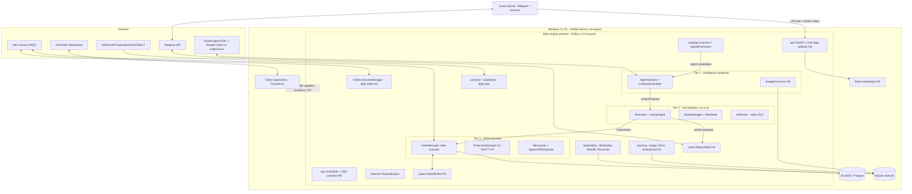

# IMPLEMENTATION_PLAN.md — Personal AI Trading Platform (NSE / Zerodha Kite Connect)

**Status:** Design-complete, ready for phased implementation.
**Date:** 2026-06-11.
**Re-verification note (2026-06-11, web, per "How to work"):** **D3 confirmed** (Agent SDK credit $100/mo Max 5x, $200/mo Max 20x, effective 15 Jun 2026; overflow to pay-as-you-go only if explicitly enabled). **A7 confirmed** (15:25 square-off since 26 Dec 2025; ₹50 + 18% GST per auto-squared position). **A9 confirmed** (static IP on order endpoints only, 1 primary + 1 optional secondary on developers.kite.trade; data endpoints exempt; market protection must be non-zero, −1 = auto; slicing ≤ 10). **D1 version drift:** `claude-agent-sdk` is now **0.2.97** on PyPI and `@anthropic-ai/claude-agent-sdk` **0.3.173** on npm; current official docs state the Claude Code CLI is **bundled with the SDK package** (no separate Node/CLI install documented) — Phase 0 pins whatever is current at implementation time; subprocess architecture confirmed. **A2 scope correction:** official docs scope the limits **per API key**, not aggregated per client across apps, and document the counters as "order requests" without explicitly enumerating place+modify+cancel; this plan keeps the conservative interpretation (one shared budget counting place+modify+cancel) because it only makes the self-throttle stricter. Discrepancies are also noted inline where D1/A2 are cited.

**Engineering-invariants note (2026-07-12):** the **§3.2 hot-path & storage invariants** were added from *measured* Phase-1 incidents (row-at-a-time DuckDB I/O, sample-based Decimal type inference, µs-vs-ns timestamp resolution, event-loop-blocking flushes, a reproduced shutdown lock-order deadlock, backfill checkpoint over-advance). They bind every subsequent phase; §3.2.3 (checkpoint advance rule), §2.6 (teardown order), §4.4 job 3, §8.2 (backtest universe resolution), §8.4 (ReplayHarness performance), §9.1 and chaos case 23 carry the corresponding rules and regression coverage.

**Conventions used throughout this document:**

- `A1…E7` cite the verified fact sheet; `O1…O10` cite non-negotiable owner decisions (**O11–O13 added 2026-07-06** — the news-integration decisions, defined in §2.7 and recorded in §14 Q16); `R1…R10` cite hard architecture requirements. Every load-bearing design choice cites the IDs it depends on.
- `[tunable]` marks a starting value expected to be tuned. If it is *learnable* it also appears in the envelope table (§6.3); if it is not in that table, only the owner may change it.
- All times are IST. All file paths are relative to the repository root `market_trading/`.
- "Engine" = the main Python process. "Platform" = the whole system. "Owner" = the single human user.

---

## 1. Executive summary

### 1.1 What is being built

A single-user platform for Indian equities (NSE) on a Zerodha account, running on the owner's Windows 11 PC (O7), that operates in three modes (O2): **RECOMMEND** (fully-specified trade recommendations over Telegram + dashboard, human executes manually, the platform places *zero* API orders — B7), **AUTO** (the platform trades via Kite Connect, gated behind paper-trading acceptance criteria, §8.5), and **OFF** (data + learning continue; only risk-reducing actions on already-tracked positions are permitted — R3). Capital is hard-capped at ₹20,000 (O1). Intraday (MIS), swing and position (CNC) styles are supported architecturally from day one (O3). The intelligence layer is Claude agents on the Claude Agent SDK under the owner's Max subscription (O6); the safety layer is pure deterministic Python (R1); capital preservation outranks returns (O10).

The defining safety property is **three-tier separation (R1)**: Claude proposes, a deterministic risk gate disposes, a deterministic OMS executes — and the platform must remain *safe with the LLM tier completely dead*. The second defining property is **broker-resident protection (R3)**: every live position is protected by an order resting at the broker/exchange (SL-M for MIS, GTT OCO for CNC), so capital protection survives process death, PC death, and token expiry.

### 1.2 Honest economics (C9 — read before anything else)

This section is deliberately first. SEBI's own research: **71% of retail intraday equity traders lose money** (80% for those making >500 trades/year); 91% of F&O traders lost money in FY25; academic evidence puts persistently profitable day traders below 1%. There is no credible basis to expect this platform to be net profitable in its first year.

The fixed cost base makes the math harder, not easier: ₹500/month Kite Connect data plan, ~₹1,500/year static IP (AUTO phase), plus electricity/compute (lower now that the engine runs only during active periods, §2.6) — **≈ ₹550–675/month ≈ 2.75–3.4% of the ₹20,000 capital, every month** (computed in §11.1; inside C9's 3–5% envelope once any incidentals land; the Claude Max subscription is a pre-existing sunk cost and excluded — see §11 footnote). Friction on trades compounds this: a leveraged MIS round trip costs ≈0.41% of the *notional* per turn (illustrated at the broker-max 5× for worst-case friction; the platform cap is 3×, §7.1 `max_leverage`); ten such turns a month ≈4.1% of capital in costs alone (C3).

**Therefore the success metric for Phases 0–3 is explicitly NOT profit.** It is: process quality (zero risk-gate bypasses, zero unprotected positions, clean reconciliation), capital preservation (drawdown inside limits), and learning per rupee of tuition — a measured, attributed record of what works and what doesn't (R4 learning ledger). Profit becomes a *tracked* metric in Phase 4 and a *target* only in Phase 5, and even then subordinate to O10. The plan optimizes the cost of being wrong, because the base rates say we will often be wrong.

### 1.3 What "success" means, per phase (full gates in §8)

| Phase | Success means |
|---|---|
| 0 — Foundations | Clean skeleton; secrets in DPAPI; daily token workflow works end-to-end from the owner's phone; install smoke test green on pinned Python (A4); A11 empirically answered. |
| 1 — Data + backtest + baselines | Ticker subprocess survives a full week; self-built bars reconcile vs Kite candles within tolerance daily (A13); backfill complete for the universe; 4 rule-based baselines backtested with walk-forward + CPCV (E2), with cost model applied (C2/C3). |
| 2 — RECOMMEND live | Recommendations flow daily through the *same* risk gate as live trading would use (R1), delivered on Telegram + dashboard with cost math and manual protective-order checklist (B7); paper ledger tracks them. Zero API orders placed (B7). |
| 3 — AUTO in paper | Full OMS incl. protection manager runs against the conservative paper broker (R9) for ≥30 sessions; all chaos tests (§9.4) pass; acceptance criteria (§8.5) met. |
| 4 — AUTO live, small | Static IP live (R7/A9); 1× leverage, MIS longs + CNC swing only, tightest limits; live-vs-paper fill deviation tracked and fed back (R9); zero R3-invariant violations. |
| 5 — Learning online + ramp | Champion/challenger loop promotes/rolls back autonomously inside the envelope (R4); leverage/style ramp completes per gates (O3); platform runs ≥4 weeks with no owner intervention beyond the daily login + approvals — active periods start (manually or via the wake-capable Scheduled Task) and every startup self-recovers and catches up (§2.6). |

### 1.4 Key architectural decisions (rationale inline, detail in cited sections)

1. **One supervised process tree, not microservices** (§2.2): a single asyncio engine process (NSSM service) owning a Twisted ticker subprocess (A4 forces the subprocess), with FastAPI dashboard and Telegram bot in-process. One box, one writer per store, no distributed state (E4, O7). **The process is up only during active periods and may be intentionally stopped in between (§2.6); every startup is a full reconcile + catch-up, and being off outside an active period is normal, not a fault.**
2. **The risk gate and OMS are LLM-free by construction** (R1): the `engine.risk` and `engine.oms` packages import nothing from `engine.intelligence`; proposals arrive only as schema-validated data (§3.5). The LLM tier is removable: budget exhaustion, SDK death, or OFF mode all resolve to the same "no proposals" state (D6/D7) while Tiers 2–3 keep managing positions.
3. **Broker-resident protection always** (R3): SL-M placed immediately after every MIS fill; GTT OCO after every CNC fill (AUTO/paper only — B7); the chaos invariant "platform dead + token expired ⇒ position still stop-protected" is tested, not assumed (§9.4).
4. **Event-triggered, single-shot LLM calls intraday** (D5): deterministic scanners pre-screen; Claude is invoked ~10–30×/day with fully pre-assembled context, no tools, structured output; agentic multi-turn runs only nightly/weekly with hard caps. Budget governor meters locally (no balance API — D6) against the $100/month Agent SDK credit (D3, parameterized per O6).
5. **RECOMMEND mode places zero API orders of any kind** (B7): no GTT staging, no one-tap execute button. Protective orders are part of the human's manual checklist inside the recommendation payload. This keeps RECOMMEND entirely outside the algo-**execution** framework (B4) and needs no static IP (R7).
6. **≤10 OPS by construction** (B3): a token-bucket self-throttle at 1 order-API call/second sustained (place+modify+cancel counted, A2) — entry calls hard-capped at 70/day, risk-reducing orders uncapped-but-paced and never budget-rejected (R3, §7.1) — the 1/s pace keeps even a saturated day (~≤390 calls) an order of magnitude under 10 OPS and well under the broker's 5,000/day cap. Self-learning therefore never enters the registration regime (B3).
7. **Online learning runs inside a Tier-2-owned envelope** (R4): learnable parameters and ranges live in a hash-verified protected store the learner cannot write; promotion requires validation → shadow → gate; strategy *code* changes always require owner approval.
8. **Backtesting = vectorbt for sweeps + the platform's own event-driven replay harness** (substituting NautilusTrader, E1, with reasoning): R9 demands paper mode share the live code path; building the replay simulator on the real OMS + paper broker gives backtest≈paper≈live consistency and avoids building a Kite/NSE adapter for NautilusTrader that would duplicate the OMS. vectorbt remains for fast vectorized parameter sweeps; skfolio supplies CPCV (E2). Sequencing: Phase 1 validates baselines with vectorbt; the replay harness arrives with the OMS in Phase 3 (§8.2).
9. **Shorting policy (C8):** MIS shorts disabled at AUTO go-live; enable no earlier than Phase 5 via owner-approved gate, then F&O-list stocks only, 14:00 entry cutoff, 14:45 square-off, half the long size cap. RECOMMEND may flag short ideas, separately marked higher-tail-risk. Rationale: an un-coverable MIS short into an upper circuit settles via exchange auction with penalties that can exceed the entire capital at 5× (C8).
10. **NSE-only trading venue** (trading scope): deepest liquidity in the universe stocks and a single instrument-token namespace; dual-venue routing is wasted design surface at ₹20,000. BSE data optional for cross-checks only (§13).
11. **User-set daily trade window** (O2 refinement): all platform-initiated entries and **entry recommendations (`kind='entry'`)** — MIS *and* CNC — occur only inside a single owner-configured clock window (e.g. 10:00–10:30 IST; a **sticky control-plane value** in SQLite `trade_window_state`, seeded from the `config/settings.yaml` default and **owner-adjustable at runtime** via Telegram `/trade_window` / dashboard `POST /config/trade_window` — §3.2.7/§7.1), composed most-restrictive-wins with the §7.1 style entry windows and the market session. **MIS positions are opened *and* closed within the window** (platform square-off at window end while the engine is up; the 15:05–15:10 self-sweep and the broker 15:25 cutover are the sanctioned backstops if the engine is offline across window-end — §2.6); **CNC swing/position trades are merely *decided* in-window, then held to their normal holding limits — protected by their resting broker GTT, with live management and ex-date adjustment caught up on the next startup (§2.6), since the engine is not up the whole session.** Data, bar-building, and feature warm-up run **whenever the engine is up** (backfilled on startup for any offline span, §2.6); broker-resident protection (R3) runs regardless of the engine. The window gates *entry decisions and order-opening only, never a risk-reducing action* (R3): exit/adjust recommendations, stop-tightens, exits and square-offs are issued/executed whenever the engine is up (§5.2 trigger b). **Entry-seeking** intraday LLM calls (signal scans + heartbeat) fire only in-window (cost drops); the News Analyst and the deterministic pre-screen scanners are not trade-window-gated — they run on their §5.4 schedule / whenever the engine is up (§5.4/§5.6/§11.2).
12. **News-intelligence layer with guarded origination (O11/O12/O13, §2.7 — added 2026-07-06):** the platform digests the last ~24 h of market/sector/theme/stock news into a pre-open **catalyst watchlist** with deterministic trade levels; a 5th deterministic baseline (`cat`, §6.1) may **originate** entries from that watchlist **only in AND-combination with price/volume confirmation** — news proposes the watchlist, price confirms the entry, the gate disposes (trust-boundary carve-out §2.4 item 4). LLM-scored news never reaches Tier 2, never sizes a trade, never relaxes a limit; the scorer dying disables catalyst origination and nothing else (fails to zero, D7/§2.7). There is deliberately **no mid-day breaking-news origination path** (O12): intraday headlines feed context/features and the §5.2(b) held-position trigger only.

---

## 2. System architecture

### 2.1 Component diagram


```mermaid
flowchart TB
    subgraph EXT[External]
        KITE[Kite Connect REST]
        KWS[KiteTicker WebSocket]
        NSE[NSE/UDiFF/calendars/RSS/GDELT]
        TG[Telegram API]
        CLAUDE[Claude Agent SDK -> Claude Code CLI subprocess]
    end

    subgraph PC[Windows 11 PC - NSSM service 'mt-engine']
        subgraph ENGINE[Main engine process - Python 3.12 asyncio]
            SCHED[ops.Scheduler + NSE calendar R6]
            SESS[broker.SessionManager - daily token A5]
            MD[marketdata - BarBuilder, Backfill, Reconcile]
            UNI[universe + datafeeds - daily jobs]
            FEAT[features.FeatureEngine]
            SCAN[strategy scanners + SignalPreScreen]
            subgraph T1[Tier 1 - intelligence proposes]
                HARN[AgentHarness + ContextAssembler]
                GOV[BudgetGovernor D6]
            end
            subgraph T2[Tier 2 - risk disposes, no LLM]
                GATE[RiskGate + LimitsEngine]
                MODE[ModeManager + RiskState]
                KILL[KillSwitch - sticky R10]
            end
            subgraph T3[Tier 3 - OMS executes]
                OMSM[OrderManager state machine]
                PROT[ProtectionManager SL-M/GTT R3]
                RECON[Reconciler + SquareOffScheduler]
            end
            PAPER[paper.PaperBroker R9]
            LEARN[learning - ledger, River, champ/chall R4]
            TGB[notify.TelegramBot O8]
            API[api.FastAPI + Kite login callback R6]
        end
        TICKER[Ticker subprocess - Twisted A4]
        DUCK[(DuckDB + Parquet)]
        SQL[(SQLite state.db)]
        DASH[React dashboard O8]
    end

    OWNERPH[Owner phone: Telegram + browser]

    KWS <--> TICKER
    TICKER -- ticks+order updates, localhost TCP --> ENGINE
    KITE <--> SESS
    KITE <--> OMSM
    NSE --> UNI
    CLAUDE <--> HARN
    TG <--> TGB
    OWNERPH <--> TG
    OWNERPH -- LAN http + bearer token --> API
    API --> DASH
    SCAN -- signal candidates --> HARN
    HARN -- ActionProposal --> GATE
    GATE -- GateVerdict --> OMSM
    GATE -- verdict+payload --> TGB
    OMSM <--> PAPER
    MD --> DUCK
    OMSM --> SQL
    LEARN --> SQL
    GOV --> SQL
```

### 2.2 Process model on Windows (O7, A4, E7, D11)

| Process | Runtime | Owner | Why separate / why not |
|---|---|---|---|
| **`mt-engine`** (NSSM service) | Python 3.12, single asyncio loop | NSSM **manual/demand start** (started manually or by a wake-capable Scheduled Task for active periods, §2.6); restart-on-failure gated to a "I intend to run" sentinel so a clean self-initiated stop is **not** auto-restarted, while a crash during an active period is | Hosts everything deterministic plus the SDK harness. One process ⇒ one SQLite writer, no IPC for state, startup recovery is one code path. FastAPI (uvicorn) and the Telegram bot run as tasks on the same loop — crash isolation is *not* worth distributed state on one box. Up only during active periods (§2.6); intentional stop ≠ crash. |
| **`mt-ticker`** (child of engine) | Python 3.12, Twisted reactor | Spawned + supervised by the engine | **Forced by A4**: KiteTicker is Twisted-based; the reactor cannot restart in-process. The engine kills/respawns it freely (new token at 08:55, reconnect storms, hangs). Ships ticks + order updates to the engine over localhost TCP `127.0.0.1:8401`, length-prefixed msgpack frames, with an in-band heartbeat frame every 1 s. Silence >10 s ⇒ engine kills + respawns + raises the stale-data guard (R2). |
| **Claude Code CLI** (child of engine, per SDK call) | Bundled with `claude-agent-sdk` (re-verified: current docs bundle the CLI with the package — no separate Node install; D1) | Spawned by `claude-agent-sdk` | The SDK package version is pinned in the lockfile, which pins the bundled CLI; auto-update disabled; installed into the service account's venv (D11). |
| **Dashboard** | Static React build served by FastAPI | — | No separate Node server in production; `npm run build` output served from `engine.api`. |

**Service environment (D11, E7):** all secrets including `CLAUDE_CODE_OAUTH_TOKEN` live in DPAPI (§2.4); the engine loads the token at startup and sets it in its own process environment before spawning the SDK's CLI child — a deliberate deviation from D11's NSSM-`AppEnvironmentExtra` suggestion, chosen because R10 requires secrets in an encrypted store and the CLI is a child of the engine anyway (NSSM env injection remains the documented fallback). The token is minted by `claude setup-token` run as the service user via the CLI bundled with the SDK package (invocation path recorded during the Phase-0 smoke test; if the package exposes no callable entry point, a one-off global CLI install is used solely for minting, then removed — D1 re-verified). A startup self-test runs on **every startup** (process boot, scheduled or manual — not a fixed 08:00 clock job) and makes one cheap Haiku SDK call (skipped on non-trading-day starts; deduped per trading day), alerting on failure (D11). Power: `SetThreadExecutionState(ES_SYSTEM_REQUIRED|ES_CONTINUOUS)` is held **only while an active period / catch-up run is actually executing** (§2.6), not a blanket 08:00–16:00 window, and released when the engine enters a planned stop; a wake-capable Scheduled Task wakes the PC for scheduled active periods (incl. EOD jobs). Documented power-plan setup (disable Modern Standby network throttling, set Windows Update active hours) lives in the runbook (§10.7, E7). A stray `ANTHROPIC_API_KEY` in the service environment silently outranks the OAuth token (D2) — the startup self-test asserts it is absent unless the owner has deliberately configured pay-as-you-go overflow (D6).

**Startup recovery (E7) — every startup, scheduled or manual, after a clean stop or a crash, gap of minutes or days:** the engine may be killed by Windows Update *and* is deliberately stopped during non-trading windows (§2.6). The **authoritative startup recovery & catch-up sequence is §2.6** (read sticky state → reconcile vs broker → square off any overdue MIS → backfill the data gap → catch up missed jobs → cold-start warm-up gate → re-arm/resume/verify/alert). Open positions are never unprotected meanwhile — their SL-M/GTT rests at the broker (R3). This supersedes the older same-day "crash recovery" framing: the sequence must tolerate arbitrary off-duration, not just a quick Windows-Update reboot.

**Lifecycle notifications & liveness (O8/R8 — the owner is told when the engine starts and when it stops).** This subsection is the single source of truth for the mechanism; §3.2.12/§4.2/§10.7/§10.8 reference it rather than restate it. Three **process-lifecycle** Telegram alerts, distinct from the *functional-degradation* alerts (`FEED_STALE`/`TOKEN_INVALID`/`BUDGET_TIER(DG4)`/`RISK_STATE`, which fire while the engine is **alive**):
- **`ENGINE_STARTED(mode, routing, active_period, version)`** — sent immediately on boot, **before** the §2.6 recovery/catch-up (so the owner knows it is alive even if catch-up is slow); the fuller `STARTUP_REPORT` follows on completion. Emitted **exactly once per OS-process start**, gated by `lifecycle.notify_started` (default true) — NOT re-emitted when a still-running process transitions into a later active period.
- **`ENGINE_STOPPED(reason, positions_protected, next_start)`** — sent as the **last act** of a clean/planned shutdown (reason ∈ {owner, window-idle, update, service-stop}); gated by `lifecycle.notify_planned_stop` (default true). Best-effort: a failed send never blocks exit — the owner reconciles it against the next `STARTUP_REPORT` (silence = off-is-normal); **the watchdog does NOT backstop a lost `ENGINE_STOPPED`** (it is deliberately silent for a clean stop), only the crash path.
- **`ENGINE_DOWN(reason=crash|wedged, since, downtime, positions_broker_protected)`** — the unexpected-death/wedge alarm, **sent out-of-band by the watchdog only** (a dead engine can't send it; the engine's own `TelegramBot` never emits it). Never suppressible. A crash the watchdog *cannot* catch (total power/PC loss — the on-box watchdog died too) is instead surfaced retrospectively by the next startup's `STARTUP_REPORT(crash_recovered)` — there is no `detected_by=restart` real-time alert.

**State machine — one SQLite row `engine_lifecycle` (§4.2); a tri-state replaces the old boolean "I intend to run" sentinel** (a boolean cannot distinguish "cleanly shutting down" from "running-and-wedged"). The alias *"intend to run" ≡ `state != STOPPED`* still gates NSSM restart-on-failure:
- **`STOPPED`** (default) — nothing running/intended; **the watchdog is silent** (being off between active periods is normal, §2.6).
- **`RUNNING`** — set at boot in §2.6 **step 0, atomically with a fresh `last_alive_at`, `pid`, `started_at`, and clearing the watchdog re-arm** (below). While RUNNING, `last_alive_at` is refreshed every `lifecycle.heartbeat_write_s` (default 20 s) **by a dedicated OS thread doing a direct `sqlite3` UPDATE — NOT the asyncio loop** — so a legitimately busy loop (multi-day catch-up backfill, a long query) cannot starve the heartbeat and self-alarm. **Invariant (tested, §9.1/§9.2): all CPU-bound/native work (vectorbt/numba backtests, pandas warm-up, large DuckDB scans) runs in a thread/process executor so the loop is never blocked > `heartbeat_write_s`** — this is also why the nightly in-process backtest queue (§5.5) must be executor-offloaded.
- **`STOPPING`** — set as the **FIRST** step of a clean stop, *before* the shutdown-guard work (flatten MIS / verify every CNC `PROTECTED` / cancel resting entries / backup — §10.8); the watchdog treats STOPPING as **not-a-crash** (intentional). Only after the guard fully completes does the engine commit **`STOPPED` + `last_clean_stop_at`**, send `ENGINE_STOPPED`, and exit. **The `STOPPED` commit is the point of no return that certifies all capital-relevant work is done — nothing capital-critical runs after it.** A crash *during* STOPPING therefore leaves `state=STOPPING` (not STOPPED): the watchdog fires `ENGINE_DOWN` (pid dead — see below) and the next startup sees an interrupted shutdown and re-verifies protection — the incomplete shutdown is **never** silently mislabeled clean.

**The watchdog** (`scripts/watchdog.py`, §3.2.12/§10.7) — a standalone **non-wake** Windows Scheduled Task every `lifecycle.watchdog_poll_s` (~60 s), **run-as the mt-engine service account** (so the per-user DPAPI bot token is decryptable), importing only `core.secrets` (bot token) + `core.config` (owner chat_id, a non-secret) + `httpx`, so it survives the engine's death. It opens `state.db` **read-only** and keeps its **own** debounce state in a small private file (`data/watchdog_state.json`) — it is **not** a second writer to `state.db` (preserving the one-writer invariant; immune to the engine's disk-full/write-lock failure modes). Per tick, two out-of-band checks:
- **(a) missed scheduled start** — on a trading day, clock is > `lifecycle.start_grace_s` past a `lifecycle.active_period_starts` time (settings.yaml — the schedule source, since a never-started engine leaves `state=STOPPED` and cannot signal intent) with `started_at` not ≥ that start ⇒ `SCHEDULED_START_MISSED`. Detection latency is bounded by the next PC wake (non-wake task); a failed wake for the day's *final* active period may not be caught until the next wake or the owner's phone check.
- **(b) engine down** — `state != STOPPED` **AND** [ **the recorded `pid` is not alive** (OS check — a crash/kill/OOM; `reason=crash`, detected within ~`watchdog_poll_s`) **OR** (`state==RUNNING` AND pid alive AND `COALESCE(last_alive_at, started_at)` stale > `down_stale_s` AND `now − started_at > lifecycle.catchup_grace_s`) (a *wedged* live process; `reason=wedged`) ] **AND** the re-arm predicate `watchdog_state.last_down_alert_at < last_alive_at` (or unset). Worst-case detection is `[watchdog_poll_s, down_stale_s + watchdog_poll_s]` ≈ **60–150 s**. On a wedge, the watchdog (or a small privileged helper) **force-kills the recorded `pid`** so NSSM's exit-triggered restart can take over (detection *and* remediation — a wedged process holds the SQLite writer lock and ports 8400/8401, so a bare restart would collide). The alert is **sent first; `last_down_alert_at` is stamped only on a confirmed successful send**, so a *correlated* network/Telegram outage (router down → engine wedged → send fails) retries every tick until connectivity returns rather than losing the one real-time alert. A fresh restart heartbeat re-arms the alarm automatically (boot clears it), giving exactly one alert per outage.

**Startup crash/interruption + single-instance (§2.6 step 0):** before overwriting the row the engine reads the prior `state` + `pid`. Prior `state ∈ {RUNNING, STOPPING}` with the prior **`pid` still alive ⇒ another instance owns the box**: the new process **refuses to start** (single-instance lock — named mutex / lock file) rather than double-run recovery and corrupt the single-writer stores (O7/E4). Prior `state ∈ {RUNNING, STOPPING}` with the prior **`pid` dead ⇒ the previous run crashed (RUNNING) or its shutdown was interrupted (STOPPING)** — the reconcile re-verifies protection and the `STARTUP_REPORT` leads with a crash-recovered notice. A **crash-loop** (repeated fast NSSM respawns) is bounded: NSSM restart-on-failure carries a backoff + give-up threshold (§10.7), `ENGINE_STARTED`/crash-recovered reports coalesce into a single `ENGINE_CRASHLOOP` alert when boots recur within `lifecycle.crashloop_window_s`, and on give-up the engine stays down so the watchdog's `ENGINE_DOWN` stands.

**Honest limitations (capital is broker-protected throughout — R3 — so every miss is operational, never a capital emergency):** (1) **total power/PC loss** kills the on-box watchdog too → surfaced only by the absent readiness/`STARTUP_REPORT` + phone check (chaos 19), never a real-time `ENGINE_DOWN`. (2) An owner who **hard-kills** via Task Manager (instead of the controlled stop, §10.8) leaves `state=RUNNING` and will — correctly by design — get `ENGINE_DOWN` + a crash-recovered report. (3) A **wedged-but-alive** process is reported `ENGINE_DOWN(wedged)` and force-restarted; a transient wedge that self-clears before the kill is reconciled by the next fresh heartbeat (no separate all-clear alert — a subsequent healthy `ENGINE_STARTED`/report is the signal).

### 2.3 The three-tier boundary (R1)

- **Tier 1 — `engine.intelligence`** (non-deterministic): produces only schema-validated `ActionProposal` objects (§3.5) and analysis artifacts (sentiment scores, regime notes, review reports). It cannot place orders, cannot touch limit config, and its outputs are *data*, never code or config. Any Tier-1 failure (timeout, schema-invalid after retries, CLI death, 429, credit exhaustion) resolves to no-proposal + alert (D7).
- **Tier 2 — `engine.risk`** (deterministic): validates **every** Tier-1-originated action type (`enter`, `exit`, `modify-stop`, `modify-target`, `cancel`) against the limit table (§7.1) with monotone rules: stops only tighten autonomously; protective orders never cancelled without a validated replacement; stop-widening/target-extension requires owner approval; position-opening actions may only be rejected or shrunk, never enlarged or initiated; after a shrink the cost model re-runs and rejects sub-viable sizes (C2/C3). All gate inputs come from deterministic broker/exchange sources only. RECOMMEND-mode recommendations pass the identical gate before delivery; the verdict + headroom ship in the payload (R1).
- **Tier 3 — `engine.oms`** (deterministic): order state machine (incl. broker-initiated terminal states, A8), protection manager (R3), reconciliation, square-off scheduling, GTT lifecycle.
- **Deterministic risk-reducing actions need no proposal**: stop execution, scheduled square-off, kill-switch flatten are Tier-2/3-originated and permitted in every mode (R1/R3).

**Enforcement is structural, not conventional:** `engine.risk` and `engine.oms` do not import `engine.intelligence` (a unit test asserts the import graph, §9.1). The OMS accepts work only as `(ActionProposal, GateVerdict)` pairs where the verdict row exists in SQLite and `verdict ∈ {approve, shrink}` — there is no code path from LLM output to an order that bypasses a persisted verdict.

### 2.4 Trust boundaries

1. **Learner ↛ limits (R4):** `config/limits.yaml` and `config/envelope.yaml` live in a *protected store*: the risk gate loads them only if their SHA-256 matches the signature record in SQLite table `protected_config` (written solely by the owner-confirmed change flow — Telegram two-step or dashboard with token). The learning system has read-only logical access and no code path that writes these files. **Integrity-failure rule (single rule, cited by §7.2 and tested in §9.1):** hash mismatch at startup load with no platform-tracked positions or open orders ⇒ FROZEN (no new entries) + alert; mismatch detected at runtime, or at startup with a live book ⇒ kill switch (§7.2). Chosen over a second Windows account + ACLs because it is auditable, testable, and robust to the learner and gate running in one process; the ACL approach is documented as a hardening option in §7.2. (Single-user Windows cannot give true process isolation — this is integrity verification, not access prevention; accepted and flagged in §12.)
2. **Control plane (R10):** Telegram commands accepted only from the owner's chat ID; destructive/mode-up commands (`/kill_reset`, `/mode AUTO`) require a two-step confirmation with a one-time phrase. Owner-only operational settings that are not destructive — e.g. the trade-window adjustment (`/trade_window`, `POST /config/trade_window`) — are single-step (owner chat-ID / bearer token) but still validated and audited (§3.2.7/§7.1). Dashboard binds to LAN with a bearer token (needed for the phone login redirect, R6); the only unauthenticated route is `GET /kite/callback` (receives the request_token; it can only *complete a login*, never read state or place orders). Secrets (Kite API secret, daily access token, Telegram bot token, Claude OAuth token) in Windows Credential Manager via DPAPI (`keyring`) per R10; the engine injects the OAuth token into its own process environment at startup (§2.2). Dashboard traffic is plain HTTP on the trusted home LAN — accepted deliberately: the bearer token and the single-use, seconds-lived `request_token` transit the owner's own Wi-Fi only; TLS/Tailscale is the upgrade path (§14 Q11). Nothing secret in the repo or YAML.
3. **Kill switch (R10):** Tier-2-owned; state persisted in SQLite `kill_state` and checked before *any* order on startup — sticky across crash/reboot/NSSM restart; reset only by owner via authenticated two-step flow. Dead-platform fallback is broker-native and pre-staged in the runbook: Kite app flatten, Kite Console kill switch, Call & Trade number (§10.6).
4. **Scraped news is untrusted Tier-1 input (E6, §4.4 job 10) — with ONE precisely-guarded origination carve-out (O11, 2026-07-06; full design §2.7, strategy rules §6.1 `cat`):** news can bias proposals, and LLM-scored news may additionally gate **candidate origination** — but **only** through the deterministic catalyst scanner's AND-rule: `symbol ∈ catalyst_watchlist` at grade `originating` (which itself requires **≥2 distinct source domains**, materiality ≥ `cat.materiality_min`, sentiment ≥ `catalyst_guard.sentiment_min_long`, novelty ≥ `cat.novelty_min`, an event type on the owner-fixed originating list, universe membership, and no surveillance/flagged/results-day-T status — full condition list §2.7 step 5) **∧ deterministic price/volume confirmation computed from broker data** (live Kite bars — §6.1 `cat`). The carve-out is bounded: news scores are *data* consumed by deterministic code (never code or config); they can never relax, widen, or size anything; every catalyst candidate passes the same §5.2 analyst step and the **identical Tier-2 gate** — and **no news-derived value is ever a Tier-2 gate input** (`GateContext` remains broker/exchange-source-only, §3.2.7). Blast radius of a manipulated headline cluster: at most `catalyst_guard.max_catalyst_entries_day` (default 2, §7.1) normally-sized, price-confirmed, gate-approved entries **per day** (a story persisting across its event age can re-qualify on later days — the multi-day ceiling and its loss-ladder bound are stated honestly in §2.7's guards paragraph) — and single-source demotion plus the `pump_promo_suspect` event class suppress the laziest pump patterns before that (§2.7 guards; residual risk §12 A5r). Scorer/LLM death ⇒ empty digest ⇒ the carve-out produces nothing (fails to zero, D7).

### 2.5 Data flow (summary; schemas in §4)

Ticks flow `KiteTicker → mt-ticker → TCP → BarBuilder → DuckDB` with pre-open exclusion (A14) and cumulative-volume-delta bar volume (A13). Order updates flow on the same socket (A3) into the OMS event queue. Daily jobs (08:00–09:00) refresh instruments/tick sizes (A10), MIS leverage + surveillance lists (A8), calendars, bhavcopy, corporate actions, news. Scanners read DuckDB features and emit signal candidates; the ContextAssembler packs deterministic context; Tier-1 returns proposals; the gate persists verdicts; OMS (AUTO/paper) or Telegram+dashboard (RECOMMEND) consume them. Data flow and feature collection run **whenever the engine is up** (§2.6 — the engine is not up the entire day); only the proposal/recommendation/order-opening steps are gated to the owner-set daily trade window (§1.4 item 11, §7.1 `trade_window`) — risk-reducing actions are never gated. News flows `RSS/GDELT → HeadlineClusterer → EntityResolver → News Analyst (LLM score) → pre-open CatalystDigest → catalyst_watchlist` (§2.7); the watchlist is the **single seam** through which news may contribute to candidate origination (O11), and no news-derived value ever enters Tier 2. Every decision artifact lands in SQLite (R8).

### 2.6 Operating model: active periods, intentional stop/start, and startup catch-up

The engine does **not** run continuously through the day. It is **up only during active periods** and may be **deliberately stopped** (and the PC slept) in between. Being off outside an active period is **NORMAL, not a fault** — no alert is raised for it. The defining invariant: **every startup is a full recovery** — scheduled or manual, after a clean stop or a crash, after a gap of minutes or days — and the platform never breaks because it was off. This is safe because capital protection is **broker-resident (R3)**: every open position's SL-M/GTT rests at the exchange and fires with the engine and PC dead.

**Active periods** (the engine intends to be up; it holds `SetThreadExecutionState` only while actually working, §10.7): (a) **morning prep** — login, daily data jobs, pre-open planner, ticker start, warm-up backfill; (b) **trade window + square-off** — the §7.1 `trade_window` plus its window-end MIS square-off; (c) **EOD jobs** — reconcile, bhavcopy/corp-actions/earnings/deals, nightly reviewer, backups. Between (b) and (c), and overnight, the engine may be stopped.

**Start trigger (§14 Q14):** manual owner start is first-class and is the *same code path* as any scheduled start. A Windows **Scheduled Task with "wake the computer"** may optionally auto-start the engine for each active period (covering EOD jobs that fall outside any wake window); default is manual-primary with catch-up. Because manual/demand start replaces NSSM "always restart," a missed scheduled start no longer self-heals — a lightweight watchdog (separate scheduled task / phone check) alerts if an expected active-period start did not occur (`SCHEDULED_START_MISSED`) **or if a running engine dies or wedges while `state != STOPPED` (`ENGINE_DOWN`, §2.2)** (§10.3/§10.4), and an open MIS then rides to the broker 15:25 backstop (below).

**Every-startup recovery & catch-up sequence** (supersedes the old "crash recovery" list; §2.2):
0. **Lifecycle boot (§2.2):** read the prior `engine_lifecycle` row first. Prior `state ∈ {RUNNING, STOPPING}` with the prior **`pid` still alive ⇒ refuse to start** (single-instance lock — another instance owns the single-writer stores, O7/E4). Prior `state ∈ {RUNNING, STOPPING}` with the prior **`pid` dead ⇒ the previous run crashed/was-interrupted** — flag it so step 7's report leads with a crash-recovered notice (the watchdog may already have sent the real-time `ENGINE_DOWN`). Then **atomically** set `state='RUNNING'`, a fresh `last_alive_at`, `pid`, `started_at`, and clear the watchdog re-arm (so the just-booted engine can't be mistaken for the outage it is recovering from); start the dedicated-thread heartbeat writer; and **emit `ENGINE_STARTED`** — all before step 1.
1. Read sticky **kill / mode / trade-window** state from SQLite before anything else (R10).
2. **Reconcile** orders/positions/GTTs against the broker = truth (R5) — catches anything that happened while offline (a GTT/SL-M that fired, an RMS close, a broker square-off). **Rebuild day-scoped risk counters for the current session from the ledger** (`consecutive_losses`, `max_new_trades_day` used, day-MTM baseline) — folding in any position closed while offline — so a same-day restart can't reset exhausted entry capacity (§7.1). **Run the REC_FILL_SUSPECTED match against any recommendation whose validity *overlapped* the offline span** (§3.6), so an owner fill during an off-period is captured, not mislabeled `no_action`. **Re-evaluate the continuous equity-based halt ladder (`weekly_drawdown`, `equity_floor_rung` −10%, `cumulative_floor` −15%) against the freshly-reconciled platform equity and apply each breached rung's FULL §7.1 action — state transition AND the forced exit-all where the rung specifies it (e.g. `equity_floor_rung` go-flat) AND the mode downgrade (AUTO→RECOMMEND) — BEFORE entries reopen, so a startup trip is behaviorally identical to a live trip (not merely a CLOSE_ONLY state set)** — a loss realized while offline (e.g. a held CNC's GTT firing deep, or a broker square-off) can put equity below a floor that was never *tripped* while the engine was down; kill-state stickiness (§7.2) only preserves a kill that already fired, so the floor ladder must be re-checked on startup, not assumed.
3. **Overdue-MIS square-off:** for every open platform MIS whose effective window-end (sticky `trade_window_state`, session-clamped) is ≤ now, immediately `SquareOffScheduler.run_window_squareoff()` (risk-reducing; cancel-and-replace the resting SL-M, §3.2.8) **before** arming any future job — a past-due window-end job cannot fire, so it must be caught up; the close is tagged `square_off_overdue_startup` (§3.5.2). (If now > 15:25 the broker already squared it — reconcile records that as `broker_squareoff_offline`.)
4. **Data-gap backfill:** compute off-duration since the last clean checkpoint; backfill bars from the Kite candle API for the offline span and rebuild feature warm-up (ORB range, ATR, VWAP, last-30-bar) — **including the NIFTY 50 index and India VIX history the market-context/regime features need (§7.1 `regime_data_ready`)** — official candles are canonical, so warm-up does **not** require live tick capture since 09:15.
5. **Missed-job catch-up** (the `CatchUpRunner`, §3.2.12): per-job `job_runs` watermarks (§4.2) drive re-running every scheduled job whose fire-time fell in the off-window and is still meaningful, in dependency order, classified as:
   - **Safety/deadline-critical — must run or verify before entries open, else FROZEN-for-entries + alert:** instruments+tick-size (A10), surveillance lists (A8) + held-position migration diff over the gap, earnings calendar, and **corp-action ex-date GTT adjustment** — on every startup, scan held CNC against `NSECalendar.ex_dates`; adjust any imminent ex-date GTT immediately (risk-reducing). If a T-1 deadline already passed unadjusted while offline, **re-derive the corp-action-adjusted trigger and cancel-and-replace the resting GTT to repair protection** (risk-reducing) — *and* alert high-severity + FROZEN-for-that-symbol; a freeze alone does not fix the already-held position's stale trigger (§3.2.8/A12).
   - **Idempotent run-latest (single catch-up, run-latest-once):** pre-open planner (today's DayPlan must exist before the first entry-seeking LLM call), sector map, universe build, **the news chain — backfill → cluster → resolve → pre-open scoring batch → catalyst digest (§4.4 jobs 10+14, in that dependency order; never entry-blocking — a failed/late chain just leaves `cat` disabled for the day, §2.7)**, **champion/challenger evaluation** (`last_evaluated_at` watermark; ingests all gap-session outcomes in one run, before promoted params influence any new entry — §6.4), **backups** (single current snapshot, `last_backup_at` watermark — §10.5; not per-missed-day), **label expired-unconfirmed recommendations `no_action`** (recs whose `valid_until` lapsed entirely during the off-span — guarantees the unbiased non-fill training signal, §3.6/§6.5, even after a long gap rather than leaving it to EOD-reconcile timing).
   - **Date-keyed backfill (run each missed trading day):** bhavcopy, deals (`flagged_instrument_days`), official-candle reconcile, daily bars, nightly reviewer (reviews each un-reviewed closed day).

   - **Advisory-job watermark semantics (WO-14 option (c), owner-chosen 2026-08-13):** the two LLM advisory jobs (`preopen_planner` §5.3, `nightly_review` §5.5) never raise — they return an `AdvisoryOutcome` tri-state, and the composition-root wrappers translate it into the watermark verdict: **`BLOCKED` (the §5.6 governor declined) is a CORRECT outcome ⇒ success watermark, never retried** (a blind retry loop re-asks a governor that is deliberately saying no, and each ask that gets through costs credit); **`FAILED` (harness/roster failure) ⇒ failed watermark ⇒ retried by the next catch-up pass**. The retry is bounded by the governor itself, not by a counter: the re-run re-enters `can_invoke`, so a closed tap ends the chain with a success watermark and zero spend. Before this, both green-stamped every run regardless (the `_job_result_ok` degraded-return rule deliberately ignores bare `bool`s, and still does — the translation lives in the wrapper, not the machinery).

   *(2026-07-28: the same catch-up pass also runs as a 30-minute `catchup_sweep` interval job while the engine is up — boot-time-only catch-up cannot help a machine that SLEEPS through a fire slot and resumes without a restart (2026-07-27 slept 17:56→evening, missed the 18:05 daily_bars, and `warmup_ready` then froze the whole next session on the absent bar). The `job_runs` watermarks make a repeat pass a no-op, so the sweep is idempotent by construction.)*
6. **Cold-start warm-up gate (§7.1 `warmup_ready`):** entries stay FROZEN until enough contiguous bars (backfilled or live) cover each strategy's feature lookbacks — **per COVERAGE CLASS since 2026-09-13 and per SYMBOL since 2026-09-17: a REGIME (NIFTY 50 / India VIX) or unattributable shortfall freezes entries; an INTRADAY or DAILY shortfall refuses that symbol's candidates only, per candidate**; if started too close to the window to warm up, stay FROZEN-for-entries + alert — never trade on thin data. This is distinct from the feed-staleness guard and from a feed failure.
7. Re-arm remaining schedules; resume the ticker (entering a **WARMING** state, §3.2.12, that suppresses false feed-stale alarms until first ticks + warm-up complete); verify protection on every open position; alert the owner with a **startup/recovery report** (off-duration, what reconciled, jobs caught up, MIS squared, FROZEN reasons) — **and, if step 0 detected an unclean prior exit (prior `state != STOPPED` + dead pid), the report leads with a `crash-recovered` notice + measured downtime, complementing any real-time `ENGINE_DOWN` the watchdog sent (or standing in for it after a total power loss the watchdog couldn't catch).**

> **Boot-liveness addendum (owner-directed 2026-08-07, after two boot wedges in three days; narrowed same day by adversarial review).** Two hardenings, both fail-safe-preserving: **(i) boot-phase observation ticks** — the recovery sequence (steps 1–7) can take many minutes when the step-5 news chain scores a large backlog (observed: 122 clusters ≈ 17 min), and the scheduler that owns `warmup_status_refresh`/`health_check` starts only after step 7; a lightweight tick task therefore runs the warm-up SNAPSHOT refresh + the health/keep-awake pulse on the 60 s cadence DURING recovery, cancelled-and-awaited when the scheduler takes over. **Deliberately observation-only:** the review established that a mid-boot LIFT races the still-running recovery's cause state (`_maybe_lift_warmup_freeze` clears `startup_selftest` before the catch-up's own safety freeze exists) and buys nothing — entries are gate-blocked on the boot-scoped `clock_skew` context for the whole window and the composition root runs the full lifting refresh immediately when recovery returns — while a mid-boot gap REPAIR chases a tail hole the not-yet-started ticker regrows forever, burning the day's repair budget on an unfixable target. The tick's real value is the health/keep-awake pulse on a sleep-prone box plus a fresh gate snapshot. (The snapshot IS gate-visible — a boot tick can flip the `warmup_ready`/`regime_data_ready` context rules to pass mid-boot; the documented interlock for the whole boot window is the boot-scoped `clock_skew` context, which stays `False` — a hard entry-rule fail — until recovery returns.) **(ii) Bounded Telegram seam** — every outbound send is hard-bounded (15 s; drop + `telegram_send_timeout` on expiry: alerts are best-effort R8, and a bounded drop beats an unbounded wait), and the bot's four-network-await start sequence is bounded as one unit (45 s) degrading on timeout/error to a DISABLED bot for the session — the engine boots without Telegram rather than never (a hanging send between catch-up completion and scheduler start held the whole boot on 2026-08-07; the owner keeps the dashboard either way).

> **Boot-ordering amendment (WO-15, owner-directed 2026-08-13 — the standing §2.6 structural question, answered).** The boot catch-up pass (step 5) now replays **load-bearing data steps only**: instruments, surveillance, earnings, universe, candle gap-fill and the watermark-driven EOD replays. The jobs that are **never load-bearing for entries** — the news chain (backfill → cluster → resolve → score), the catalyst digest, the pre-open planner, and the §4.3 tick compaction — fire as **one-shots immediately AFTER `scheduler.start()`**, through the *same* `CatchUpRunner` machinery (`CatchUpScope.DEFERRED`): same watermarks, same dependency order, new firing point only. Rationale: the 2026-08-10 wedge was an unbounded news chain running *inside* `lifecycle.startup`, ahead of arming, which starved every scheduled job for 8 h — **including the 30-minute `catchup_sweep` that exists to self-heal**; the scheduler's guard is calendar-only (no recovery-awareness), so naive early arming was unsafe until the chain moved behind it. Behind an armed scheduler the identical wedge costs only the digest, and digest staleness already degrades `cat` safely (`digest_stale_max_h`, §2.7 fail-safe ladder). Three properties are load-bearing and test-pinned: **(a) `engine_ready` never waits on the chain** (the one-shot is a background task, bounded further by its own 600 s resolve cap); **(b) catch-up passes are single-flight** — a sweep landing on a still-running pass is a logged no-op, since watermarks cannot make a *concurrent* pass safe (both would see the same un-watermarked job) and the reordering is what makes sweep-vs-one-shot concurrency reachable at all; **(c) a failed post-arm run is still swept** — the periodic sweep runs the FULL registry (`CatchUpScope.ALL`), so a deferred job that failed after arming is retried exactly like any other missed job. Rollback is a firing-point flag (`DEFER_POST_ARM_JOBS = False` in the composition root) that restores the pre-amendment order exactly. On a normal morning the digest fires minutes later than before — identical in wall-clock terms, since it ran inside boot anyway.

> **Step-5 freeze-latch symmetry + origination-liveness addendum (2026-09-01, owner-directed mid-session hotfix after the 08-31→09-01 silent zero-origination incident).** The step-5 safety freeze (`catchup_safety_jobs`, set through the §3.5.3 cause ledger when a catch-up pass reports safety-critical failures) had a set site and **no clear site**: a transient 08-31 boot failure (`data_freshness:instruments`) latched it, the latch survived every reboot via `risk_state_causes`, and the LLM-forward pre-filter (risk_state==NORMAL) then silently originated zero entries for two full sessions — 432 fires → 17 prescreen slots → 0 forwarded on 08-31 — while exits (risk-reducing, never gated) kept flowing and nothing paged. Two changes: **(i)** `SessionLifecycle.startup` step 5 now carries the symmetric inverse — a CLEAN pass (no frozen_reasons, not killed, latch wired) clears `catchup_safety_jobs` through the cause ledger (cause-scoped and idempotent; the same clear-only-what-was-re-verified rule as the warm-up lift, so a standing owner_pause/floor/warm-up cause keeps the state; the fail-closed side is unchanged and test-pinned). The standing rule this codifies: **every latching freeze cause needs an owning clear site symmetric with its set predicate.** **(ii)** The §3.2.12 health pulse gains two origination-liveness problems riding the WO-25b episode cadence: `entries_frozen_in_session` (armed mode ∧ risk_state ≠ NORMAL for ≥30 contiguous in-session minutes — the grace covers a legitimate ~20-min morning warm-up freeze; the active causes ride the log line so the page is diagnosable) and `funnel_zero_in_session` (NO forward progress — today's day-cumulative forward count static while slots published grew past the last-progress baseline — for ≥120 contiguous in-session minutes while risk_state IS NORMAL and forward capacity remains under the §5.6 daily cap; a spent cap is quiet by design, an unreadable cap narrows the alarm to the unambiguous zero-forwarded-all-day shape, and a frozen state is the first problem's page — one incident, one problem). The owner-facing alert text carries the diagnostic detail (state, causes, minutes, counts) so a page is actionable without shell access; detail rides the message only, never the WO-25b episode identity. Both clocks reset quietly out-of-session / in an unarmed mode (the 2026-08-26 lag-watchdog rule: alarms evaluate only inside session hours).

> **Early-hydration addendum (owner-directed 2026-09-09: "on most days I am travelling at 08:15 and only able to start the system around 09:30–10:00 … early hydration whenever I login early, like 06:30").** The G2 digest-before-open criterion fell to 61% because the pre-open chain (surveillance 08:20, universe 08:30, news chain 08:25, digest 08:35, planner 08:50) runs after the trade window opens on a 09:30+ boot. Two facts made the existing machinery unable to help: the `CatchUpRunner` due-gate treats today's jobs as *not yet due* until their fire time (so a 06:30 pass replays nothing), and a scheduled fire runs unconditionally and only then writes its watermark (so an early run followed by the 08:35 fire would spend the digest twice). **Design:** (i) `CatchUpRunner.hydrate_ahead(job_ids, reason)` — runs the named RUN_LATEST/SAFETY_CRITICAL jobs for **today** ahead of their clock when the day is a trading day and no watermark exists, in the registry's class/order sequence, under the single-flight pass lock, recording `job_runs` exactly as a scheduled fire would (a failed job records `failed`, siblings still run; DATE_KEYED jobs are a design error here). (ii) The scheduled fires stay **unconditional** — a first draft skipped any job already watermarked for today, and adversarial review showed that pinned the 06:30 digest/plan and a universe built on a pre-08:00 instruments dump for the whole day; results and exchange filings published 07:00–09:00 IST are the largest catalyst class, so on a day the PC stays awake the 08:25/08:35/08:50 fires must run again (fresher digest and plan, universe rebuilt behind the 08:15 instruments refresh; a second pre-open plan message that day is the accepted cost). The watermark `hydrate_ahead` records guards the **sleep** case only: a PC that sleeps through the fire times and wakes at 09:30 finds the catch-up sweep satisfied and keeps the 06:30 run — which is the owner's ask. (iii) A Kite-login hook (`EarlyHydration`, registered beside `PostLoginRecovery`) fires on a trading day when the login lands **before that day's session open** (resolved from the calendar per login, never frozen at boot), waits for `scheduler.start()` (the WO-15 firing-point rule — never ahead of arming; the `armed` event is set *after* the post-arm one-shot is dispatched so an early login cannot make that one-shot skip in-flight) and then for `PostLoginRecovery` to finish (its `completed` event — login hooks are fire-and-forget tasks, so registration order gives no ordering; both waits are bounded at 15 min and a timeout logs and proceeds, since the chain needs no Kite session), runs `hydrate_ahead` over **surveillance → universe → news chain → digest → planner**, and sends the owner one summary line. The runner re-checks the open **once it holds the pass lock** (`not_after`; first live morning 2026-09-10: a 09:06 login queued 36 min behind the post-arm one-shot draining the overnight news backlog and ran at 09:44 — a late acquisition is now a logged skip). Deliberately excluded: `instruments` (Kite regenerates its dump around 08:00 IST — a 06:30 refresh could pin a stale map; it is SAFETY_CRITICAL and the 08:15 fire or the boot catch-up owns it), `sector_map` (Sunday-only), `token_check` (not a registry job). A login at/after session open is a no-op here (the boot/sweep catch-up owns due jobs); a second login the same day finds every watermark set and is cheap. The G2 collector reads the same `job_runs.last_success_at`, so an early digest counts as before-open without any collector change. An early digest is staler than an 08:35 one; that trade is the owner's explicit choice over a 10:00 digest.

> **Three hardenings from the 09-03…09-08 tapes (2026-09-09, same directive).** **(i) Tick-lag reconnect grace (WO-25a follow-up).** On a post-close boot at 15:40 on 2026-09-03, Kite's connect-time snapshot — one tick per subscribed instrument carrying that instrument's *last-trade* stamp (~15:31) — interleaved with near-fresh ticks inside the deliberately watched 15:30–15:45 settlement buffer; the watchdog keeps ONE global episode, so each stale tick re-opened it and the next fresh tick closed it: 14 ERROR/recovered pairs in 83 ms and 6 owner pages, with both 2026-08-26 guards (previous-day stamp, out-of-session) inert by construction. No snapshot marker exists in the wire schema and none is invented: the `BarBuilder` now subscribes to the supervisor's `feed.health` topic and, on an event carrying WARMING or HEALTHY, arms a 30 s grace during which lag is not evaluated (an open episode closes quietly); after the grace a genuine lag pages exactly as before. Review caught the common case the state machine cannot see — KiteTicker reconnects *inside* the child (`reconnect=True`, `on_connect` re-subscribes, so Kite re-sends the snapshot) while the child keeps heartbeating, so no state transition and no publish — hence the supervisor also publishes `feed.health` on the heartbeat's existing `ws_connected` False→True edge (a field already on the wire), which arms the same grace for every reconnect. Honest bound: one (re)connect delays a genuine alarm by up to 30 s; a feed that re-transitions faster than the grace lapses is itself an alerting condition the supervisor owns. **(ii) The news-chain lock no longer spans LLM calls.** `score_news` held the 2026-07-28 `news_chain_lock` around the whole chunked scoring batch, one LLM await per chunk; per-feed polls (whose resolve deadline covers lock acquisition) queued behind it — 14 `news_resolve_timeout` on 2026-09-07 after a post-sleep backlog, nine of them in one second. The invariant the lock protects is the store read-modify-write on `news_clusters`, not the model call: the scorer now takes the same lock for its initial read and for each chunk's write-back only. Because the upsert overwrites every non-key column, the write-back must not re-emit the pre-LLM snapshot (a first draft did, and review reproduced a poll merge — `source_domains`, `last_seen`, resolved symbols — being reverted during the model call, i.e. exactly the clobber the lock existed to prevent): under the hold the scorer re-reads the current rows and applies the step-4 score columns onto the **fresh** cluster, skipping ids that were merged away or scored meanwhile (logged). The batch itself is single-flighted by a lock the scoring job owns (the chain's forced batch and the 5-minute tick are distinct scheduler jobs and could otherwise send the same clusters to the model twice; a queued batch waits and re-reads an emptied queue). `lock=None` preserves the old behaviour for callers that serialise themselves. **(iii) Store slow-statement telemetry.** The 2026-09-08 11:47 mid-session stall's WO-24b thread dump is taken thread-by-thread and could not name the lock holder (a `feature_snapshots` INSERT and a tick-flush partition COPY were both past the acquire line); `_lock` is already per-statement and the tick stage table is already TEMP, so no structural change is indicated. Every `_lock` hold on the statement helpers is now timed — per hold, in the outermost frame (the lock is re-entrant, so a naive per-statement note fired inside the read helpers' own hold and split one read into two identically-labelled events), on the raise path too — and any hold ≥ 5 s logs `store_slow_statement` (label, elapsed, thread, failed) so the next stall names its statement. Measured for the record: backlog/stall pulses were 46/17 on 09-04 (watchlist 200) and 14/7 on 09-08 (watchlist 300) — the class is intraday load, not the O16 watchlist raise.

> **Per-CLASS warm-up scoping addendum (owner-directed 2026-09-13, "implement all pending changes" — a registered PLAN CHANGE, not a bug fix: the §7.1 effect column said "FROZEN (entries)" deliberately).** `WarmupGate._evaluate` answers with ONE flat blocker list spanning three coverage classes — **INTRADAY** (today's 1-minute bars for the ticked watchlist, rendered `orb:SYM bars have/need`), **DAILY** (completed sessions for `rsi2`/`trend`/`mom`, rendered `rsi2/trend/mom:SYM daily bars have/need`) and **REGIME** (`regime:` NIFTY 50 / India VIX) — and step 6 turned any of them into one GLOBAL FROZEN that refused every entry, including `brk20`/`hi52`/`ins`/`cat`, which read completed daily bars and need no 1-minute history. Measured cost: 2026-09-04 11:09 a single symbol's minute hole (`orb:COROMANDEL bars 113/114`) froze the swing legs, and 2026-09-09 14:47 a market-wide one-bar hole after a ticker reconnect did the same. The REGIME class already worked this way (`regime_data_ready` is its own §7.1 rule, sliced off the `regime:` prefix and freezing regime strategies only), so the change makes INTRADAY behave like REGIME rather than inventing a mechanism. **Design:** every blocker is classified from its rendered prefix (`blocker_class`, never a guess — a scope that classifies as UNKNOWN blocks every class, R6); `WarmupStatus` gains `blockers_by_class` + `ready_for(cls)` while `ready` keeps its meaning (no blockers at all). **What still freezes:** the DAILY ∪ REGIME classes plus any unattributable blocker — lifecycle step 6, `reapply_warmup_gate` and the 60 s `refresh_and_lift_warmup` set and clear the `warmup_ready` cause on those alone, and the lift now clears it with the intraday class still short (logged once per transition). **What the owner sees:** an intraday-only shortfall sends no `WARMUP_FROZEN` page (nothing froze) and adds no `frozen:` reason, so two owner-facing signals carry it instead — the boot STARTUP_REPORT body renders a `warm-up short: <classes> (<first blockers>)` line whenever any class is short, and the 60 s `refresh_and_lift_warmup` alerts ONCE PER TRANSITION when the intraday class goes short or recovers (the mid-session 09-09 14:47 shape reaches the owner from there, since no boot report follows it). Without both, `entries_frozen_in_session` was the health alarm that used to cover this state and no longer fires for it. **What widens (the registered risk):** a daily-bar leg may now ORIGINATE during an intraday warm-up gap — the gap says nothing about the completed daily sessions that leg reads, but it does mean the tape the entry prices against is thinner than a fully-warm session; the live-feed freshness rules (`stale_data_guard`, 5 s per symbol AND index) are what still guard entry pricing, and they are untouched. A SECOND envelope thins with it, recorded here because it is a check that stops covering a case rather than a widening anyone chose: `ModeManager.opening_orders_allowed` / `order_guard` (§3.5.3 predicate (a), A7/B7) refuse every position-OPENING broker call unless AUTO **and** NORMAL **and** in-window, so while an intraday-only shortfall set FROZEN that coarse backstop also refused opening orders for INTRADAY candidates; it no longer does. The per-class `warmup_ready` gate rule is from here on the SOLE enforcement for intraday orders (the gate is upstream of every opening order, so this is defence-in-depth only, and unreachable in Phase 2 RECOMMEND — but a future OMS path that re-places from a stored approval must not read `order_guard` as a warm-up check). **Per-candidate enforcement:** `GateContextBuilder.build` already receives `style`, so `warmup_ready` is answered for the candidate's class (`intraday` ⇒ intraday coverage, `swing`/`position` ⇒ daily) and the context pins which class it judged, so a proposal evaluated against the other class's context fails closed; the pre-screen re-arms an intraday candidate ahead of the analyst call (same snapshot the gate reads — a refusal that costs no token), and the §5.2(a) day slot goes back because coverage heals mid-session. The screen runs at BOTH analyst-call commit points, because under the default `paced` drain they are minutes to hours apart: at arrival (`on_signal_candidate`, re-arm) and at the forward slot (`_take_forward_slot`, DEFER — the queued entry stays queued with its own TTL as its exit, in the D1 (e) band screen's idiom, and the loop takes the next-best). Arrival alone would have missed exactly the 09-09 14:47 case: queued warm at 14:45, hole at 14:47, dispatched at 14:50 — a forward slot and an admission slot spent on a call the gate then rejects on `warmup_ready`, with no D1 (c) refund because a gate rejection IS a verdict. **Scope note:** `orb` is parked since 2026-09-12 (`prescreen.max_per_strategy_day: 0`), so the intraday class currently guards NO active originator — the per-candidate path is built for the day an intraday strategy returns, and today the whole effect is that daily-class legs stop being frozen by minute holes. `cat` is `swing` and therefore judged on the daily class even though its confirmation reads the 09:15–09:45 range (§6.1); that range is enforced by the scanner, which cannot confirm on bars it does not have, and `cat` is a §2.7 SHADOW (C3 rejects it before sizing) — accepted, and revisited if `cat` is ever promoted. **Known residue (registered, not fixed here):** `SelfTest._check_warmup_ready` still judges the FLAT `status.ready` and returns `implies=FROZEN` for any shortfall, including an intraday-only one. It is unreachable today — both lifecycle callers pass `include_freshness=False` — but the module advertises a standalone `run()` that includes it, so wiring that re-run (or a dashboard/CLI `selftest` endpoint) would re-impose the global freeze this addendum removes. When that check is next touched it splits into a FROZEN-implying check on `ready_for(daily) and ready_for(regime)` plus a WARN line naming an intraday-only shortfall.

> **Per-SYMBOL readiness addendum (owner-directed 2026-09-17).** The 2026-09-13 scoping above fixed the CLASS but left `WarmupStatus.ready_for(cls)` CLASS-WIDE: it answers False whenever ANY symbol has a blocker in that class, and both per-candidate consumers — `GateContextBuilder._warmup_ready(style)` and `RecoPipeline._intraday_warmup_short` — asked it once per candidate, so one symbol's coverage hole refused EVERY candidate of that class. Measured: on 2026-09-16 PTCIL printed no trade at 13:36 (Kite publishes no candle for a tradeless minute — the bar is unfillable, not late), which rendered `orb:PTCIL bars 374/375` and made `ready_for('intraday')` False for the whole book from 13:37 to the close; MRF did the same on 09-15 and 09-10, SHYAMMETL on 09-09. The DAILY class was worse, because it is a FREEZING class: on 2026-09-15 one symbol (`rsi2/trend/mom:OLAELEC daily bars 193/200`) set the GLOBAL `warmup_ready` FROZEN cause and held it for ~12 hours. **Design:** readiness is judged PER SYMBOL in every class — `ready_for(cls, symbol=None)` keeps the class-wide meaning for the freeze/lift/notice code that asks a global question, and with a symbol answers False iff a blocker line in that class is attributed to THAT symbol or cannot be attributed to any symbol (fail closed, R6); `blocker_symbol(line)` recovers the symbol with an anchored regex over exactly the three renderings `WarmupGate._evaluate` produces, so names with spaces, `&` or `-` (`NIFTY 50`, `INDIA VIX`, `M&M`, `GVT&D`, `BAJAJ-AUTO`) come back intact and anything else is unattributable rather than guessed; `short_symbols(cls)` feeds the owner notice. Unknown-class blockers and the "not ready with no blockers rendered" case still hold every class and every symbol down, exactly as before. **What freezes now:** the REGIME class and an unattributable blocker, and nothing else — every candidate depends on the market context built from NIFTY 50 / India VIX, so REGIME has no per-symbol answer to give, while an unattributable shortfall is the R6 case. DAILY joins INTRADAY on the per-symbol side, which is the same treatment INTRADAY has had since 2026-09-13. **The consumers:** the gate answers `ready_for(class_of(style), symbol)` and `build()` passes the proposal's own symbol (the class it judged is still pinned into the context, so a cross-class evaluation still fails closed); the pre-screen asks per candidate symbol and logs the lines that actually refused that symbol; `reapply_warmup_gate`'s `intraday_short_<why>` outcome becomes `short_<why>` because the non-freezing side is now two classes. **What the owner sees:** the DAILY transition notice joins the INTRADAY one on the 60 s `refresh_and_lift_warmup` cadence — one notice per class per transition, naming the symbol COUNT and the first three symbols, silent while a freezing class holds entries frozen (a "entries are NOT frozen" line would then be the opposite of the truth) — and startup step 6 appends a `warmup_<cls>_not_ready` note per short non-freezing class while logging one `warmup_short_not_frozen` line. The self-test's registered residue is split with it: `SelfTest._check_warmup_ready` still FAILs implying FROZEN on a raise, on a status with no `ready_for`, and on a REGIME/unattributable shortfall, but a per-symbol INTRADAY/DAILY shortfall is now a WARN implying nothing, so wiring the standalone `run()` can no longer re-impose the global freeze. **The registered risk:** a market-wide daily hole — the nightly `daily_bars` job failed for everything — no longer pages `WARMUP_FROZEN`, because nothing freezes. Two owner-facing signals carry it instead: the per-class transition notice, which is why it counts SYMBOLS rather than blocker lines (a "DAILY coverage short for 187 symbol(s)" line reads as an infrastructure failure at a glance), and the boot STARTUP_REPORT's `warm-up short:` line; and every swing/position candidate is still refused one by one at the gate, so the failure mode is missed origination, never an entry on thin data. **What is NOT done here:** a tradeless minute is still counted as a coverage hole, so PTCIL stays refused for the rest of that session even though no bar will ever exist for 13:36 — synthesising zero-volume bars, or teaching the gate to treat an upstream-confirmed-empty minute as covered, is a separate decision with its own evidence requirement and is deliberately not taken on the back of this one.

**Shutdown guard (§3.2.8/§3.5.3):** a planned/manual stop requested while a platform **MIS is open and its window-end has not completed** must first flatten the MIS (run_window_squareoff) and verify flat, **or** require explicit owner override acknowledging the MIS will fall to the broker 15:25 backstop. **The teardown ORDER is pinned: quiesce the event bus FIRST — `EventBus.publish` is fire-and-forget (`loop.create_task`), and `ticker.stop()` cancels only its own tasks, so in-flight tick/bar handler tasks must be cancelled-or-awaited (bounded drain) BEFORE the stores close; an orphaned handler racing `store.close()` is a use-after-close / lost-final-tick-batch window (Phase-1 review finding; the store degrades gracefully but the drain is the correct fix — chaos case 23).** **Before the engine exits, (i) cancel and verify every working/unfilled entry order** (a resting entry left at the broker could fill while the engine+PC sleep, leaving an unprotected MIS until next startup; a SUBMITTED/unacked entry has its broker_order_id resolved via orders-API/pending-correlation before the cancel — §3.5.1 — never exit with a SUBMITTED entry outstanding), **and (ii) verify every open CNC is `PROTECTED` (live resting GTT)** — for any CNC in `PROTECTION_PENDING`/`PROTECTION_FAILED`, place/repair the GTT and verify the ack, or block the stop / require owner override (mirroring the §7.2 kill sequence's "verify CNC GTTs live"); never leave the engine and PC dead with a working entry order or an unprotected position (R3). A protected CNC may be left (it gets **no live intraday management** while offline — only the resting GTT). A clean shutdown is also a good moment to snapshot a backup (§10.5).

**Broker 15:25 auto-square-off — two cases (A7):** while the engine is alive at window-end, the platform window square-off is primary and a broker 15:25 firing is a logged anomaly to investigate; when the engine is intentionally/crash offline across window-end, the 15:05–15:10 self-sweep and the broker 15:25 cutover are the **sanctioned backstops** for the offline MIS (₹50 + 18% GST per position, ledger-attributed as an offline-window cost, not strategy). Capital is protected throughout by the resting SL-M; only the intraday-discipline ("opened *and* closed in-window") degrades.

### 2.7 News-intelligence subsystem (E6+; owner decisions O11–O13, resolved 2026-07-06 — recorded in §14 Q16)

**Owner decisions (first-class O-IDs, cited like O1–O10):**

- **O11 — guarded origination:** LLM-scored news may help ORIGINATE trade candidates, but **only** in deterministic AND-combination with price/volume confirmation, multi-source corroboration, and every existing limit (§2.4 item 4). No per-trade owner approval is required — AUTO semantics are unchanged; the guards are structural, not procedural.
- **O12 — news is for daily selection, not reaction:** the news layer's job is to digest the **last ~24 h** (since the previous trading day's digest; weekend/holiday-aware lookback) into *which stocks to keep in concern today and at what levels* — a pre-open **catalyst watchlist**. There is **no mid-day breaking-news origination path**: a headline that breaks intraday enters features/context and (for held symbols) the §5.2(b) risk-reducing trigger, but cannot mint a same-day candidate for a symbol not already on the watchlist. Latency reality makes this the right cut: RSS polling (5–15 min) + batch scoring (≤30 min) means the platform can never front-run news — the tradeable edge at this latency is **post-event drift/continuation**, not reaction speed.
- **O13 — earnings policy:** results-day entries stay banned (`no_entry_on_results_day`, day T only); the catalyst scanner explicitly trades **T+1 post-earnings drift (PEAD)** with direction = scored surprise sign agreeing with the T-day price reaction (§6.1 `cat`).
- **Budget:** funded by rebalancing within the $100/month credit (§5.6/§11.2 — News Analyst $14; intraday $42; weekly $12); overflow stays off.

**Four scope levels** (every scored cluster carries `scope`): `market` (macro/policy/global risk — feeds regime context and market-level sentiment only, **never** origination), `sector` (mapped to NSE sector indices; fans out to constituents via `sector_map`), `theme` (cross-sector narratives — EV, defence, railways, capex — via the owner-approved `theme_map`), `stock` (named-entity resolution to a tradingsymbol). Sector/theme clusters fan OUT to universe constituent symbols at reduced weight; stock clusters resolve directly; unresolved or out-of-universe entities are recorded for the weekly alias-map suggestion loop (§5.5) and are **never traded**.

**End-to-end flow (every step deterministic except the two marked LLM):**

1. **Ingest** — `NewsIngest.poll` (§3.2.4): a config-driven RSS feed map + GDELT DOC (2026-08-05 seed set, five distinct domains: ET Markets RSS + Livemint markets/companies + Hindu BusinessLine markets/companies + CNBC-TV18 market + NDTV Profit; Moneycontrol RSS retired 2026-08-04 — its whole RSS ecosystem froze ~2024-04, see §3.2.4; the 2026-08-05 widening exists because both Livemint feeds are ONE registrable domain, leaving an effective two-domain corroboration pool that made `min_source_domains: 2` require the single ET∩Livemint intersection), **headline-level only** (title, source domain, url, published_at); article bodies are never fetched — cheap, and keeps the prompt-injection surface headline-sized (A3r). Off-period backfill per §4.4 job 10.
2. **Cluster** — `HeadlineClusterer` (§3.2.4): deterministic near-duplicate grouping into `news_clusters`; each cluster carries its distinct `source_domains` set. *(2026-08-05 amendment: the cluster-level set is no longer the corroboration count directly — the digest counts domains at STORY level, step 5(ii) below. Measured basis: 0 of 1,400 live cross-outlet same-story pairs cleared the 0.75 similarity threshold, and the best TRUE pair (0.548) scored below a FALSE pair (0.550) — cross-outlet paraphrase is not separable by headline similarity at any threshold, so single-outlet clusters are the permanent normal and cluster-level counting could never reach `min_source_domains: 2`.)*
3. **Resolve** — `EntityResolver` (§3.2.4): deterministic alias map (instruments-dump company names + curated `entity_aliases`) → symbols; sector/theme tagging via `sector_map` + `theme_map` keyword match. Ambiguous ⇒ **no match, never a guess**. The News Analyst may emit verbatim entity *strings* for unmatched clusters; those strings re-enter this resolver — **the LLM never assigns a symbol directly**.
4. **Score (LLM)** — News Analyst (§5.4): per cluster `{scope, entities[], sectors[], themes[], sentiment −1..+1, materiality 0..1, event_type (closed taxonomy), novelty 0..1}`; schema-validated single-shot Haiku; scores persisted on `news_clusters`, always untrusted.
5. **Digest** — `CatalystDigestJob` (§3.2.4; §4.4 job 14; ~08:35, before the 08:50 planner; idempotent run-latest catch-up §2.6): two outputs, precisely defined.
   **(i) `sentiment_agg`** — for each scope_key (symbol/sector/theme/market): `clip( Σᵢ sentimentᵢ · materialityᵢ · wᵢ · 0.5^(age_hᵢ / cat.decay_halflife_h), −1, +1 )` over scored clusters with age_h ≤ 6× the half-life, where `wᵢ = cat.fanout_weight` (default 0.5, owner-only, settings.yaml) for a sector/theme cluster's contribution to a *symbol* row and 1 otherwise; age runs from cluster `first_seen` to the digest run time (`Clock`). A decayed **sum** (clipped), not a mean — old news fades toward neutral, never lingers at full strength.
   **(ii) the day's `catalyst_watchlist`** — the candidate set is **ALL scored clusters with event age ≤ `cat.max_event_age_days`** (the O12 "~24 h" describes headline *ingest*, not eligibility — an `originating` entry whose price confirmation never triggered **reappears on subsequent days' watchlists until the event ages out**). **Event age is counted in completed trading sessions from cluster `first_seen`** (weekend/holiday-aware via `NSECalendar`) — a Friday-evening or weekend event is age 1 at Monday's digest, so Friday reporters stay T+1-PEAD-eligible (O13); `event_age_h` on the row is informational only. A symbol qualifies as **`originating`** iff its best cluster satisfies ALL of: materiality ≥ `cat.materiality_min` ∧ sentiment ≥ `catalyst_guard.sentiment_min_long` (+0.30, owner-only — §7.1) for the long direction ∧ `event_type` ∈ `catalyst_guard.originating_event_types` ∧ **≥ `catalyst_guard.min_source_domains` (2) distinct source domains, counted at STORY level (2026-08-05 owner-directed amendment): the union of `source_domains` across ALL age-eligible clusters targeting the same `(symbol, event_type)` — same `_symbol_targets` semantics as candidacy, fan-out included — not the best cluster's set alone** (cross-outlet paraphrase never merges under the pinned §3.2.4 similarity, so cluster-level counting was structurally unpassable; measured 2026-08-05, and the pre-remediation corpus shows the union recovering real corroborations — ITC/MARUTI/BEL results — that no threshold could) ∧ novelty ≥ `cat.novelty_min` ∧ symbol ∈ universe ∧ not surveillance/`flagged_instrument_days`/results-day-T. The row's `cluster_refs` carries the best cluster FIRST plus every corroborating cluster id (§6.5 audit); an event_type disagreement between outlets loses the corroboration — fails to LESS activity, never false-corroboration. For a **fanned-out sector/theme cluster**, `cat.fanout_weight` multiplies materiality AND |sentiment| *before* the threshold comparison — so sector/theme catalysts usually yield `context` entries and reach `originating` only for exceptionally material sector events. Anything less than all conditions ⇒ grade **`context`** (feeds features/context only, can never originate) — with an inclusion floor of weighted materiality ≥ 0.2 (the §5.4 rubric noise line; below it, clusters feed `sentiment_agg` only, no watchlist row). Short-direction entries (sentiment ≤ −`sentiment_min_long`) are written but graded at most `context` until the §1.4.9 short gate opens. Each `originating` entry carries **deterministic levels**: confirmation trigger, invalidation, ATR-anchored stop/target bands per the §6.1 `cat` rules.
6. **Plan (LLM)** — Pre-open Planner (§5.3): receives the digest + watchlist; writes catalyst focus into the DayPlan with advisory level commentary. **Advisory only — "binding" covers the origination side: the confirmation trigger and invalidation the scanner acts on are the watchlist's deterministic ones.** (A `cat` proposal's *executed* stop/target remain LLM-emitted `EnterAction` fields within the normal gate bounds — §3.3/§7.1 `per_trade_risk` gap-adjustment applies as for every strategy.) Planner death does not affect the scanner path.
7. **Trade** — in-window, the `cat` scanner (§6.1): `symbol ∈ watchlist(originating)` ∧ live price/volume confirmation ⇒ `SignalCandidate` → §5.2 analyst (veto/confirm, thesis) → Tier-2 gate → OMS or RECOMMEND. Identical downstream path, schemas, and limits as every other baseline; the candidate carries `catalyst_ref` (watchlist entry id) for end-to-end audit (§6.5). *(Step 7's intraday-confirmation mechanic is RETIRED for the Phase-2 shadow by the 2026-08-18 amendment below — kept here as the design record; reviving it is an owner decision.)*

**`cat` v2 shadow (owner-directed 2026-08-18 — the plan-line "owner review of the §6.1 `cat` confirmation design" executed; evidence + kill criteria in IMPROVEMENT_SPEC.md WO-18).** The measured originating-grade flow (3 distinct stories in 9 sessions since the 2026-08-05 amendment; 100% non-earnings event types — rating_change / order_win / m_and_a, the classes no recorded refutation ever tested) justifies starting the T14 forward-validation clock now, but NOT with the refuted +1% intraday confirmation (3× net-negative on proxies; catalyst-conditioned intraday ORB gross-negative; the drift is a 2–4-week phenomenon). The shadow rule mirrors the validated `ins` mechanics — **swing, CNC, long-only, batch, single-shot**:

   * **Event:** a `catalyst_watchlist` row with `grade='originating'` ∧ `direction='long'` ∧ `event_age_sessions ≤ 1` at its digest. One candidate per story: age-2+ re-grades of the same `(symbol, event_type)` story NEVER re-originate (supersedes step 5's "reappears until the event ages out" for the scanner path — that clause described the retired confirmation design; watchlist rows still reappear as context/advisory).
   * **Levels (ins semantics):** `entry = round_to_tick(reference_close)` where `reference_close` is the prior session's bhavcopy-final close (the freshest committed price at the morning sweep; the validated-fill convention is the next-session open, exactly as `ins`); `stop = round_to_tick(entry × (1 − cat.stop_pct/100))`, default **5%** (disaster stop under the §7.1 overnight_gap_mult sizing arithmetic, same reasoning as the `ins` 2026-08-17 correction); `target = None`; **exit is TIME** — the §7.1 20-session max-holding path. Tick-rounding degeneracy fails to no-candidate, as `brk20`/`ins`.
   * **Score:** the row's weighted materiality (0..1) — within-strategy ranking only (§5.2(a) quantile funnel).
   * **No `cat.expected_edge_pct` exists — deliberately.** There is no validated edge (that is what the shadow measures), so the §7.1 C3 cost gate has no edge basis and **fail-closed-rejects every `cat` candidate**: the funnel journals the signal (prescreen admission = the validation population), the analyst still writes its thesis (validation covariate, ≤2 calls/day inside existing budget), and nothing reaches RECOMMEND. Inventing an edge number to pass the gate would put a fabricated value into the gate's math — the exact failure `ins` documents against. Wiring an edge (and thus RECOMMEND eligibility) is the §8.6 owner gate, contingent on the shadow verdict.
   * **Caps/guards unchanged and binding:** `catalyst_guard.max_catalyst_entries_day` (2, enforced at the pre-screen per §3.2.5), `max_per_strategy_day` `cat: 2`, all §2.7 anti-manipulation guards, the fail-safe ladder below (digest stale/absent ⇒ `cat` originates nothing).
   * **Validation ledger + verdict (pre-registered in WO-18):** ≥30 sessions ∧ ≥20 admitted signals → T+10/T+20 net-drift study at spread-inclusive CNC costs with the WO-3 margin floor; net ≤ cost floor at both horizons ⇒ `cat` origination retired, watchlist permanently context-only; clears ⇒ §8.6 owner review. Thresholds (`cat.materiality_min` etc.) are frozen for the entire shadow window — moving them re-opens multiplicity and restarts the clock.

   * **Clock RESTART (2026-08-28 amendment — owner decision).** The digest's best-cluster selection rule changed: the cluster that REPRESENTS a symbol is now chosen on recency-decayed weighted materiality (`news_pipeline._watchlist_rows`), so a different cluster can supply `event_type`, `novelty`, `event_age_sessions` and `expires_at` than the old raw-materiality rule would have. That widens `cat` v2's originating population mid-window, which is exactly what the pre-registration above forbids, so the clock restarts under its own terms: **the population window begins with the first session run under the new selection rule, and signals admitted 2026-08-18 through 2026-08-28 are EXCLUDED from the verdict computation.** The thresholds themselves are unchanged — nothing in `catalyst_guard` or `cat.*` moved; it is the selection upstream of them that did.

**`cat_reversal` shadow (2026-08-27 — a SECOND, separate news shadow; live case: HINDZINC).** A bearish `regulatory_policy` story (government stake-sale/OFS speculation, Aug 24–25) was officially DENIED by DIPAM the next day and the stock rallied +5.1%. The same-day recency-decay fix to `_watchlist_rows` made the watchlist correctly flip `short → long`, but the fact that the long reading was a **refutation of the platform's own prior reading** was discarded — and a resolved-uncertainty relief rally is a different economic mechanism from post-event drift, so it is a different experiment, not a tweak to `cat`. **`cat` v2's scanner, thresholds, event definition and ledger series are untouched by this**, deliberately: narrowing `cat` to exclude reversal rows would change its in-flight event definition, so a reversal row still originates for `cat` as well and the two legs share one budget (below). Its *clock* is a separate matter — the recency-decay selection change shipped alongside restarted it on its own pre-registered terms (2026-08-28 amendment above); this rule did not.

   * **Detection (deterministic, in the digest — no LLM, no cross-day lookup).** `catalyst_watchlist` gains a nullable `reversal_of` column: the `cluster_id` of an EARLIER cluster of the SAME `(symbol, event_type)` story — the same story key the 2026-08-05 corroboration union already uses — that (a) cleared the step-5(ii) inclusion floor (0.2) on its own **undecayed** weighted materiality, (b) carried the OPPOSITE (short) direction under the same `sentiment_min_long` classification the row itself uses, and (c) **NAMED the symbol** — resolved to it directly rather than reaching it by sector/theme fan-out, since a sector-wide bearish cluster clears (a) and (b) for every constituent at once and would otherwise manufacture one reversal per constituent. Condition (c) binds the PREDECESSOR only; the winning cluster's scope rules are unchanged, and fan-out still corroborates and can still win a row. Ties break on the strongest opposite claim, then `cluster_id`. Computed only when the WINNING direction is `long`: **the mirror case (a positive story getting denied) is deliberately NOT detected** — that is an exit-side signal on an existing position, already owned by the §5.2(b) risk-reducing exit path, and building it would add a short-side origination surface behind an ungated flag. A pure function of the corpus and `ran_at` (§9.1 determinism), and purely additive — no grade, level, condition or existing column reads it.
   * **Event:** a `catalyst_watchlist` row with `grade='originating'` ∧ `direction='long'` ∧ `event_age_sessions ≤ 1` ∧ `reversal_of` set. The first three are `cat` v2's event verbatim; the fourth is this rule's own. **Nothing is relaxed for a reversal candidate** — it cleared the identical `originating_conditions` AND-list (story-level domain corroboration, sentiment floor, event-type whitelist, novelty, universe, surveillance, results-day ban) as every other originating row. Single-shot by the same age bound.
   * **Levels/score (`ins`/`cat` semantics, unchanged):** `entry = round_to_tick(reference_close)` (prior session's bhavcopy-final close); `stop = round_to_tick(entry × (1 − cat_reversal.stop_pct/100))`, default **5%** — its OWN parameter, deliberately NOT `cat.stop_pct`, so a future tuning of one experiment cannot silently move the other; `target = None`; **exit is TIME** (the §7.1 max-holding path). Score = the reversal cluster's weighted materiality, within-strategy ranking only.
   * **Caps — SHARED, not added:** entries count against the SAME `catalyst_guard.max_catalyst_entries_day` (2) that `cat` uses — the pre-screen keys that cap on the candidate's `catalyst_ref`, not on `strategy_id`, so **adding this strategy widens no exposure surface**. Its own `max_per_strategy_day: cat_reversal: 2` line is a different, non-shared budget (prescreen admission slots ration analyst spend). Stated plainly: one reversal story yields two candidates (one per leg), but the cap keys on `catalyst_ref`, not admission count — both share the SAME charge, so the pair costs the shared budget one slot, not two.
   * **No `expected_edge_pct` — and, unlike `cat` v2, the absence is not what enforces it.** Building this exposed a hole in `cat` v2's fail-closed argument: the §7.1 C3 targetless reject fires only when `target_price is None`, but the ANALYST emits the `EnterAction`, the wire schema permits a `target_price`, and nothing between the candidate and the gate reconciles that field against `raw_levels.target` (the pipeline's coherence guard checks identity fields only; `GateContext` never sees the candidate). An analyst that volunteers a target hands C3 a real edge basis. `cat_reversal` therefore declares the property instead of inferring it: it is registered in the gate's `no_edge_shadow_strategies` (`ops.main.NO_EDGE_SHADOW_STRATEGIES`), and C3 rejects it **unconditionally, before `target_price` is read** — Tier-2 owned, reject-only, unbypassable by any prompt or model output. **The `cat` v2 exposure is REPORTED, not patched here:** changing an in-flight shadow's gate behaviour as a side effect of shipping another strategy is an owner decision (§8.6).
   * **Validation ledger + verdict (pre-registered NOW, before any signal accumulates; frozen for the whole window exactly as `cat`'s):** the population is the funnel's own journal — `prescreen_day_slots` rows at prescreen admission, keyed `strategy_id='cat_reversal'`, the same mechanism `cat` v2 uses and disjoint from it by key. **Horizons T+5 and T+10** at next-session-open fills with spread-inclusive CNC costs and the WO-3 margin floor. T+5 because resolved-uncertainty repricing is fast — note the denial day's own +5.1% is **unreachable** (the digest is pre-open on day *d* over day *d−1* clusters, fills are next-open), so what is measurable is the residual drift, and testing a fast mechanism only at slow horizons would dilute it to zero; T+10 because the two shadows must share ONE horizon or "is the reversal subset better than plain `cat`?" is unanswerable. **T+20 deliberately not pre-registered** — no mechanism story at four weeks, and each horizon is another multiplicity test. **Population ≥60 sessions ∧ ≥15 admitted signals** (more sessions, fewer signals than `cat`'s ≥30/≥20: reversal rows are a strict subset of originating rows, so the arrival rate is necessarily below `cat`'s measured ~0.3–0.6/session). Net ≤ cost floor at BOTH horizons ⇒ origination retired, the flag stays context/audit-only; clears ⇒ §8.6 owner review, which is also where an edge (and RECOMMEND eligibility) would be wired. **Starvation, pre-registered honestly:** <1 admitted signal per 20 sessions sustained across the first 60 is a finding about the EVENT's rarity, not the rule's expectancy, and triggers an early owner check-in rather than silent accumulation toward a bar that may be years away.

**Chain firing point (WO-15, 2026-08-13).** On a normal day the chain runs on its §10.1 schedule (news chain 08:25 → digest ~08:35 → planner 08:50) and nothing changes. On a **boot**, steps 1–6 no longer run *inside* the startup recovery: the chain, the digest and the planner are §2.6 deferred jobs fired as one-shots immediately after the scheduler is armed (same catch-up machinery, same watermarks, same 20 → 25 → 28 dependency order). This is a pure reordering of the boot path — the chain was already `never entry-blocking` (E5) and its worst case is a stale/absent digest, which the fail-safe ladder below already handles; what it buys is that a wedged chain can no longer starve the scheduled day, which is what happened on 2026-08-10.

**Fail-safe ladder (D7-consistent — every failure fails to LESS activity, never more):** feeds down ⇒ clusters age out ⇒ empty watchlist; scorer down / DG3 ⇒ clusters unscored ⇒ empty watchlist ⇒ `cat` originates nothing (all other scanners unaffected); digest stale (> `catalyst_guard.digest_stale_max_h`) or absent ⇒ `cat` disabled for the day + `CATALYST_DISABLED` alert; planner down ⇒ watchlist still valid (scanner path is planner-independent); everything down ⇒ the platform trades exactly as it did before this subsystem existed. News remains **never load-bearing** (E5): no news-layer failure may ever FREEZE the platform or block another strategy.

**Anti-manipulation guards (threat model: pump headline + coincident price pump — §12 A5r):** ≥2 **distinct** source domains for `originating` grade, counted at story level per the 2026-08-05 step-5(ii) amendment — a manipulator still needs the story carried by ≥2 domains of the trusted feed set within the age window, the same bar as before; the union can additionally corroborate two DIFFERENT same-`(symbol, event_type)` stories from different outlets, accepted as within the guard's intent since both are independently-published material events (single-source ⇒ `context` only — note honestly: this counts distinct domain *strings*, not editorial independence; a syndicated press release can clear it, and `pump_promo_suspect` classification is itself LLM-judged — **the load-bearing anti-pump guard is really the NIFTY200 ∩ ₹5 cr-liquidity ∩ surveillance-clean universe plus the caps below**, which is what the owner accepts in A5r); `pump_promo_suspect` and `other` event classes never originate; `flagged_instrument_days` suppression; `catalyst_guard.max_catalyst_entries_day` (2) inside `max_new_trades_day` (5) — **per day: a persistent manipulated story can re-qualify across its event age (≤ `cat.max_event_age_days`), so the true ceiling is ~2 entries/day × 2–3 sessions on one story, bounded then by `consecutive_losses` and the daily/weekly loss ladders (§7.1)**; fixed risk-based sizing — **no conviction upsizing exists anywhere** (§6.1, gate shrink-only R1); and every entry still needs analyst confidence ≥ `analyst_confidence_min` plus the full §7.1 gate. The **exit side** is also in scope: a fabricated *negative* headline on a held symbol can trigger §5.2(b) risk-reducing exit proposals — this fails toward safety (less exposure, R3 intact) but is a real slippage/forfeited-position cost channel, owner-flagged in A5r and exercised by chaos case 21. The `catalyst_guard` block is owner-only and never learnable (§6.3/§7.1). Residual risk accepted by the owner (§12 A5r).

**Validation reality (E2, honest):** no historical archive exists for the RSS headline sources, so `cat` cannot be conventionally backtested at design time. Therefore: the platform **records its own news corpus from Phase 1** (§8.2); interim evidence comes from an **event-study proxy backtest** (historical earnings dates + bhavcopy gap/volume events — validates the price-confirmation and PEAD legs without headlines); and full validation is **forward-first** — §6.4 shadow for ≥30 sessions *and* ≥20 signals on the recorded live corpus. `cat` is new strategy *logic*, so live origination additionally requires explicit owner approval (R4) at the §8.6 gate. Until that gate passes, `cat` contributes to paper/RECOMMEND only.

**Exchange announcements as a first-class catalyst source (owner-directed 2026-09-04: "we need to work on improving the coverage").** Coverage audit, 30 sessions to 2026-09-04: the corpus is no longer ET-only (eight live domains, ~14% of headlines resolve to a symbol, 30–64 distinct symbols/day), yet only 47% of each day's top-10 movers had any cluster naming them, and of ten movers checked on 09-03/09-04 five had no coverage anywhere — no press headline and no exchange filing (catalyst-silent moves, the order-flow class this platform cannot see). The one measurable gap: NSE's `corporate-announcements?index=equities` endpoint is live through the existing `nse_get` client, carries `symbol`/`sm_isin` natively, and held a UNITDSPR Reg-30 disclosure (09-03 16:30) and HINDZINC's LoI filing (~2 h before the press headline) that the press feeds missed. **Design:** (a) `NewsIngest` gains an `nse_ann` feed (settings `news.feeds.nse_announcements`, poll 300 s, owner-editable administrative-subject drop list) whose items become ordinary `news` rows with `source_domain="nseindia.com"`, `published_at` = the exchange timestamp, and a title prefixed by an explicit exchange token `[NSE:<SYMBOL>]`; (b) `EntityResolver` honours an explicit token before alias matching (exact symbol, still subject to the universe check and the out-of-universe record — the LLM never assigns a symbol, and neither does a guess), and the clusterer prefers a token-bearing headline as a cluster's representative so a filing merged with its press coverage stays resolvable; (c) the exchange counts as one corroborating domain under `catalyst_guard.min_source_domains` — a filing plus one press headline is exactly the "two independent sources" the anti-manipulation bar means. Business Standard RSS (markets + companies) re-enters the feed set: probed live 2026-09-04 (HTTP 200, items < 20 min old), superseding the 2026-08-05 WAF-403 rejection. BSE `AnnSubCategoryGetData` (live, `SCRIP_CD`-keyed, resolvable through the existing scrip→symbol map) is the second step, not this one. KPI recorded for the next review: share of top-10 movers with a catalyst in the corpus (47% baseline).

### 2.8 Corporate filings & fundamentals subsystem (owner-directed 2026-07-16 — **O14**)

**O14 — exchange filings become a first-class deterministic data layer** (insider/PIT trades, shareholding patterns incl. pledge/encumbrance, results filings & dates), under three pinned rules: (i) **point-in-time or nothing** — every stored row carries the exchange broadcast/dissemination timestamp (`broadcast_dt`), and every backtest/feature/event join is as-of that timestamp, never the reporting-period label (a 2023-broadcast filing for FY2021 was observed live — period labels lie); (ii) **evidence before origination** — filings-typed events may reach the §2.7 catalyst watchlist only after the §2.8.4 filings event study clears that event type, and live origination sits behind the same §8.6 owner gate as `cat`; until then the layer is features/risk-context only; (iii) news-equal fail-safety (E5) — never load-bearing, every failure fails to LESS activity, no filings failure ever blocks another strategy.

**Source verdicts (all live-verified 2026-07-16 through the repo's `nse_http` client / probe scripts; §14):**

| Source | Verdict | Basis |
|---|---|---|
| NSE `corporates-pit` | **PRIMARY — insider trades** | structured JSON (person category, acq mode, buy/sell, qty, value, before/after %), `symbol` filter works, broadcast timestamp to the minute (`date`) + `intimDt`, history ≥ Jan 2023 |
| NSE `corporate-announcements` | **PRIMARY — filing events/dates** | second-granularity `an_dt`/`exchdisstime`, category + summary text, ISIN on-row, ~10k rows/month, history ≥ Jan 2023 |
| NSE `corporates-financial-results` | **PRIMARY — results filings** | filing metadata (period, audited, consolidated, `broadCastDate`/`exchdisstime`, XBRL link), history ≥ Jan 2023; **date filter keys off broadcast date** (correct for point-in-time). Listing carries NO line items; structured numbers via `results-comparision?symbol=` (shape unverified) or XBRL — staged, §2.8.1 |
| NSE `event-calendar` | **PRIMARY — board-meeting dates, past AND future** | confirmed historical service (630 rows for Jan-2023); date-only granularity — the historical results-date source the §2.7 event study lacked |
| NSE `corporate-share-holdings-master` | **SECONDARY — SHP daily incremental** | latest submissions cross-section with promoter/public % + `broadcastDate` + ISIN + revision flags; per-symbol history untested |
| BSE `CorporatesSHPSecuritybeta/w` + `SHPQNewFormat/w` | **PRIMARY — SHP + pledge history** | full SEBI-format quarterly tables per scrip **incl. per-category pledged/encumbered shares & %**, complete filed-quarter index, `Fld_AuthoriseDate` timestamps |
| BSE `AnnSubCategoryGetData/w` | **REDUNDANCY — announcements** | per-scrip ≥3y depth with ISO timestamps + `DissemDT`; market-wide scans limited to narrow windows (server-side guard) ⇒ daily incremental market-wide, per-scrip backfill loops. Insider/SAST category is PDF-only ⇒ NSE PIT stays the structured primary |
| BSE `PeerSmartSearch/w` | **UTILITY — ISIN→scrip-code (per symbol)** | resolves ISIN exactly; returns HTML `<li>` (regex-parse, not JSON). BSE 404s masquerade as 200+`error_Bse.html` redirects ⇒ health checks must verify JSON parse, never status alone |
| BSE `ListofScripData/w` | **UTILITY — ISIN→scrip-code (BULK)** (added 2026-09-12, §2.8.5) | `?Group=&Scripcode=&industry=&segment=Equity&status=Active` returns the WHOLE Active-Equity master as a bare JSON list — `SCRIP_CD` + `ISIN_NUMBER` + name/group/face value — in ONE request (probe: 5,004 rows, 5,003 distinct ISINs, no ISIN carrying two different codes, 1.7 MB). Reproduces all 199 `PeerSmartSearch`-resolved codes in `symbol_isin` EXACTLY (0 disagreements) ⇒ same relation, bulk shape: a whole-universe scrip map is one call instead of ~500 paced ones. Same host/hardening as the per-symbol resolver (no new trust surface) |
| BSE `getCorp_Regulation_ng/w` | **PRIMARY — FRESH insider disclosures** (found 2026-07-19 via browser capture) | fully structured PIT rows SAME-DAY fresh (`Fld_CreateDate` full timestamp; person+category, Acquisition/Disposal/Revoke + mode incl. "Market Purchase"/"Market Sale", qty, value, pre/post %, XBRL link). `Isdefault=1` = the rolling latest view, the daily-pull surface — **re-measured 2026-09-12: it is a SAME-DAY view (124 rows, 72 scrips, every `Fld_CreateDate` the run day bar one stale 06-23 straggler), not the "~100-row/~4-week" window first recorded**, and it is the surface that carries the day; `Isdefault=2&fromDT=YYYYMMDD&ToDate=...` filtered but hard-capped ~25 rows/call, wide ranges silently return `{}` ⇒ narrow windows only; no pagination. **Solves the NSE PIT ~70-day rolling embargo (re-verified 2026-07-19: boundary 2026-05-10)**; NSE announcements carry only trading-window closures, not transactions |
| Tickertape (unofficial APIs) | **REJECTED** | ToS bars reverse-engineering/redistribution; **no disclosure timestamps anywhere** (period-end labels only ⇒ fails rule (i) unconditionally); no SHP-history endpoint; scorecards/forecasts paywalled; unversioned endpoints with a breakage track record. Adds normalization convenience only — not information. Fine as a manual research UI; never wired into the pipeline |
| Kite Connect | **N/A for this layer** | verified: no fundamentals/filings surface at all; instruments dump has no ISIN |

**2.8.1 Data layer.** New DuckDB tables (MarketStore conventions: `CREATE TABLE IF NOT EXISTS`, `_TABLE_SPEC` + `_upsert_rows` idempotent upserts, every row `ingested_at`-stamped):
- `symbol_isin` (PK symbol): ISIN + BSE scrip code + as-of date. Fed by the NIFTY-constituents CSV (its ISIN column is currently parsed-and-dropped) + `sm_isin` from announcements as fallback; BSE scrip code resolved once via `PeerSmartSearch` and cached. ISIN is the stable cross-exchange join key (symbols change; ISINs survive renames).
- `insider_trades` (PK content-hash id): symbol, person_name, person_category, acq_mode, txn_type, qty, value, before_pct, after_pct, txn window, intim_dt, **broadcast_dt**, xbrl ref. Source NSE PIT.
- `shp_quarterly` (PK symbol, qtr_end, category): holders, shares, pct, **pledged_shares, pledged_pct**, locked shares, authorise/broadcast dt, source (bse|nse), revised flag. Source BSE SHP stack; NSE master as daily freshness check.
- `results_filings` (PK symbol, period_end, consolidated): audited flag, **broadcast_dt**, exchdisstime, xbrl ref; line items (revenue, PAT, EPS) NULL in stage 1, populated in stage 2 once `results-comparision`/XBRL parsing is verified. Board-meeting dates (past+future) merge into the existing `earnings_calendar` flow (its provider gains the historical leg).
Jobs (§4.4 jobs 15–17; all run post-close, catch-up-eligible, E5 never entry-blocking): `filings_pit` (~18:35, date-keyed), `filings_results` (~18:45, date-keyed), `filings_shp` (~18:50, run-latest; per-symbol BSE detail fetch only for new submissions). One-time seed via `scripts/backfill_filings.py` — month-windowed for NSE endpoints, per-scrip quarter loops for BSE SHP, checkpointed per (source, symbol/window) exactly like the bars backfill, ≥1.5 s spacing (observed safe; no throttling seen at that cadence).

**2.8.2 Event typing (deterministic — no LLM in this path).** A `FilingsEventBuilder` maps stored filings to typed candidate events with deterministic materiality: `insider_net_buy` (aggregated open-market promoter/director buys over a trailing session window, thresholded on absolute value AND value/20d-ADV; **ESOP/Gift/inter-se transfers/pledge-invocations excluded by acq_mode+category taxonomy** — pinned list in code), `pledge_delta` (QoQ promoter pledged-% change — negative catalyst: context/risk-flag only while the §1.4.9 short gate is closed), `results_filing` (feeds the existing O13 PEAD mechanism — direction from T-day reaction sign; no analyst-estimate "surprise" metric is invented, none exists without a rejected vendor). Filings events are **exchange-authenticated**: when (and only when) §2.8.4 clears an event type, it enters the §2.7 digest as a cluster-equivalent with `catalyst_guard` extended by an owner-approved `exchange_filing_event_types` list for which `min_source_domains` is waived (falsifying a filing = securities fraud, a different threat class than pump headlines) — **every other guard (price/volume confirmation, caps, universe, surveillance, flagged-days, sizing) applies unchanged**, and the watchlist stays the single origination seam (O11).
**2.8.3 Features (v3, deferred).** Candidate `feature_set_version=3` block — `promoter_pledge_pct` + QoQ delta, `insider_net_buy_90d_over_adv`, `days_since_results`, `promoter_holding_delta_q` — enters only after §2.8.4 evidence, via the pinned §6.4 bump mechanics (N resets, neutral-fill for pre-bump rows).
**2.8.4 Validation sequencing (the over-optimization guard).** Stage 1: ingest + 3y backfill (no decision path touched). Stage 2: extend `scripts/event_study.py` with filings legs (insider-buy clusters, results filings with true broadcast dates — replacing the n=0 earnings leg; pledge deltas) — **archives exist, so unlike news these ARE conventionally backtestable**; report net-of-cost drift per event type, honest negatives stand (C9). Stage 3 (per event type, only if stage 2 is positive): catalyst wiring + `catalyst_guard` extension (owner/R4) + §6.4 validation with cited N + §8.6 owner gate before live origination. **No new envelope-learnable parameters in stages 1–2**; event thresholds live in an owner-only `filings:` settings block. Deliberately NOT built: Tickertape integration, analyst estimates, full XBRL financial-statement parsing (until stage 2 earns it), any mcap/valuation feature derived from unverified share counts.
**Stage-2 verdict (2026-07-17, `data/reports/event_study.md`, 200 symbols, 2023-08→2026-07):**
`insider_net_buy` **PASSED** — T+10 net +0.75% (median +0.90%, hit 56.4%), T+20 net +1.61% (median +0.92%), n=110, broad-based (median≈mean at T+10) — the platform's first cost-clearing candidate edge; proceed to stage 3 for THIS event type only (robustness slices: year-by-year, person-category, liquidity tiers — then §6.4 + §8.6). `results_filing` **FAILED as origination** (n=1,352: gross +0.2–0.35% at every horizon but net ≈ 0 at the ₹20k CNC cost base) — park as §6.2 v3 feature material. `pledge_delta` **INCONCLUSIVE** (quarterly frequency ⇒ n too small for any claim; also the §2.8.2 derivation treats BSE's NULL pledged-% as missing where it economically means ZERO pledged — pin NULL≡0-when-category-row-exists in stage 3 before re-measuring; keep as risk-context feature candidate, never origination on current evidence). The `cat`-style +1%-confirmation mechanic was **refuted a third time** (typed-results sub-leg n=266: net −0.17…−0.44% at every horizon) — an owner review of the §6.1 `cat` confirmation design is recommended before Phase-2 live wiring. NSE PIT staleness (~2.5 months trailing, last row 2026-05-02) means the stage-3 DAILY insider feed must use the announcements category as its fresh-events source with PIT as the structured historical backbone.

**Robustness addendum (2026-07-17, experiments E1–E3, reports `experiment_e*_20260717T*`):** `insider_net_buy` **passed** the slices — T+20 net positive across every year (2023H2…2026H1), person-category (promoter cohort the consistent core: +1.13% net, median +1.30%), and liquidity tercile; caveats: 2024 is the weak year and the largest gains sit low-tercile (slippage watch in paper). **Catalyst-conditioning does NOT rescue intraday ORB** (conditioned breakout cohorts gross-negative vs +0.03% unconditioned, n=177/826) — the drift is a 2–4-week phenomenon; the intraday slot is parked with all hypotheses exhausted. A filings-based RSI2 veto is **unbuildable on evidence** (adverse-context flag rate ≈ 1% of champion trades).

**2.8.5 Insider-feed ISSUER starvation — diagnosis, fix and residue (2026-09-12, WO-I).** The §6.1 `ins` rule — the platform's only cost-clearing edge — was seeing **22 issuers of a 480-name eligible universe** (`ins_crossings_run` 09-10: universe 480, symbols_with_filings 22, fresh_rows_today 6). Measured per stage, against the live endpoints and the store, before any change:

- **Store.** `insider_trades` by id prefix: `bse:` 405 rows / **22 distinct symbols**, broadcast 2026-06-23 → 09-11; bare (NSE) 44,187 rows / **1,565 symbols**, ending 2026-05-02. The validated WO-16 edge (+0.75/+1.61% net T+10/T+20) was measured on the NSE corpus; live it runs on the 22.
- **Fetch.** `Isdefault=1` on 2026-09-12 returned **124 rows / 72 distinct scrips**, all stamped the run day — the market files plenty. `Isdefault=2` for a single day (09-11) returned **exactly 25 rows / 6 scrips**: the documented ~25-row cap, and `filings_pit_fresh_day_still_capped` has fired on **3–4 per-day calls EVERY trading day since the warning shipped 2026-08-13** — the module's "rare, unrecoverable" note was wrong about "rare". Since `Isdefault=1` is a SAME-DAY view, `Isdefault=2` is not belt-and-braces but the only missed-day recovery path, and the cap bounds what a catch-up can recover; it did not bound THIS outcome only because the same-day view carries the live path. **NOT MEASURED, stated as such:** the API's 124 rows were never compared against an independent count of what the BSE website's own "Insider Trading / SAST" disclosure list published for 09-12. The two API surfaces were only compared to each other, so the **upstream row-supply hypothesis below is untested, not ruled out** — that comparison is the first step of any follow-up, before a per-scrip sweep is considered.
- **Parse.** Of the 124 rows, 13 non-equity dropped, 111 equity kept — the equity filter is not the constraint.
- **Resolve — THE constraint.** `symbol_isin` held **200 rows, 199 with a BSE scrip code, every one `as_of` 2026-07-17**, and all 200 inside today's eligible set (0 mapped-but-not-eligible). The eligible universe is 480 since O15 (2026-09-04) ⇒ **281 eligible issuers (58.5%) had no scrip code at all**, and the fresh feed drops an unresolvable scrip silently: run 09-11 fetched ~298 rows across surfaces and dropped **257 as unmapped scrip** vs 25 kept. On the 09-12 capture only **6 rows / 3 issuers** resolved, while a deliberately conservative `Companyname` match of the UNMAPPED rows against the eligible universe found **12 more rows / 5 more issuers that are eligible today** (AIAENG, LALPATHLAB, MANAPPURAM, NAVA, PARADEEP) — i.e. the feed saw 3 of the ≥8 eligible issuers that filed that day. Cause: `isin_map` is not a scheduled job, so the map stayed at the one-shot 2026-07-17 backfill while the universe trebled. **LOCAL and bounded.**
- **NSE PIT route — NOT locally fixable.** Probed once with the quirk-correct explicit window (`?index=equities&from_date=01-05-2026&to_date=12-09-2026`): **3 rows, newest broadcast 2026-05-02 16:46**; the per-symbol sibling (`&symbol=JSWSTEEL`, 01-08→12-09) returned **0 rows**. The route is stale UPSTREAM, not throttled or mis-parameterized — nothing to resume. Recorded alongside it, a **latent local defect that would block resumption**: `filings_pit`'s watermark is `max(broadcast_dt)` over the WHOLE `insider_trades` table, so the BSE fresh feed (writing today's rows since 2026-07-19) pins it to today and collapses the NSE window to `[d-1, d]` on every run (`filings_pit_ingested frm=2026-09-09 to=2026-09-10 parsed=0`). Even a revived NSE route could never backfill 05-02 → resumption day. The fix is a per-SOURCE watermark (NSE rows are the bare-id ones) — held back on 09-12 as unverifiable while the source is dead, **shipped 2026-09-13 (WO-N; the per-SOURCE watermark paragraph below)**.

**Fix shipped (3 source files).** `filings_pit_fresh` now rebuilds its `scrip_code → symbol` map **every run** instead of reading a table nothing refreshes: the cached index-constituents CSV gives symbol→ISIN (499 symbols, the column `builder.py` drops) and ONE `ListofScripData/w` call gives ISIN→scrip; stored codes are unioned in and **WIN any collision** (they are the verified per-symbol resolutions). Measured coverage after the join: **478 of 480 eligible symbols** (the 2 residual, BSE and CDSL, are not BSE-listed and can never file a BSE disclosure). The feed's run line now carries the whole funnel — `fetched / skipped_non_equity / skipped_unmapped / skipped_no_broadcast / resolved / parsed / written / ins_eligible` plus `scrip_codes / scrip_stored / scrip_master / scrip_added / scrip_symbols / scrip_unresolved / scrip_shadowed / scrip_map_degraded` — with `ins_eligible` counted through the rule's own `is_open_market_buy` **and the rule's own row acceptance** (`insider_cluster_events` also drops a filing with no positive value, and BSE serves blank/`NA`/`0.00` considerations), so a future starvation is one line, not a DB session.

**Detector, amended after review (2026-09-12, manager):** the map stage's own alarm is a COVERAGE FLOOR, not a presence bit — `degraded` when the constituents that ended up with their own scrip code from either leg fall short of the universe by more than the larger of 10% (`MAP_COVERAGE_FLOOR_PCT` 0.90) and `MAP_UNRESOLVED_ALLOWANCE` (5 names, the measured NSE-only/dead-scrip residue: BSE, CDSL, DUMMYHEG of 499), with cause `map_coverage_low`; `bulk_master_empty` stays the cause when the master parsed to nothing. A bulk master that BSE truncates to a few hundred pairs would otherwise have certified a map covering a tenth of the universe as healthy — the two-month-silent shape through a second door. A 200 that parses to nothing is NOT memoised for the IST day: it takes the 15-minute failure cooldown (`SCRIP_MASTER_RETRY_COOLDOWN_S`) and is re-fetched after it, so a transient empty body cannot pin the feed at the pre-fix coverage through the 19:00 run that follows a healthy BSE. `shadowed` counts only a STORED row shadowing the master's symbol; two constituents on one ISIN (a dual listing or rename window) are counted apart as `duplicate_isin`. Non-finite considerations (`NaN` survives `json.loads`) read as no value so the ins-eligible tally cannot raise out of the E5 guard. Run line adds `scrip_covered` and `scrip_duplicate_isin`; the result carries `scrip_added_codes` and `scrip_covered`.

**Per-SOURCE watermark (shipped 2026-09-13, WO-N).** `insider_trades` has no source column, so the id tag IS the partition: `MarketStore.latest_insider_broadcast(source=...)` reads `'nse'` = the bare content-hash rows `filings_pit` writes, `'bse'` = the `bse:`-prefixed fresh-feed rows, `None` = the pre-fix whole-table maximum (kept; no caller uses it), and an unknown tag RAISES rather than falling back to the whole table — a silent fallback is the same bug again. Measured on the live store 2026-09-13: 44,187 bare ids (64-char sha256, max broadcast 2026-05-02 16:46) vs 405 `bse:` ids (max 2026-09-11 19:03), whole-table max = the BSE one, no third prefix. `filings_pit` now windows on `source='nse'`, so the BSE feed's daily rows can no longer collapse it to `[d-1, d]`. `filings_pit_fresh` is deliberately UNCHANGED and needs no watermark of its own: it keys both surfaces on DATES — the no-date `Isdefault=1` same-day view and `[d-3, d]` from `FRESH_WINDOW_DAYS` (`filings_pit_fresh.run`) — so `'bse'` is the symmetric reading with NO production caller, kept only so a future one cannot reinvent the whole-table maximum. The store cannot import the datafeed that owns the prefix (every datafeed imports the store), so the predicate is duplicated exactly as `_EXCL_CAP` is, with a test asserting the pair. **The widened window is live from the NEXT run, not only on revival day:** the NSE watermark is frozen at 2026-05-02 16:46, so from 2026-09-13 the job opens at `[2026-05-02, d]` — 134 days, +1/day — and parses 0 rows for as long as the route stays dead. At HEAD that span was ONE request (no clamp, no pagination), and permanently widening. It is now **chunked**: at most `PIT_WINDOW_DAYS = 31` days per request — the unit `scripts/backfill_filings.py` already walks this same endpoint in (`_NSE_WINDOW_DAYS`, §2.8 observed safe; a src module cannot import scripts/, so the number and the `_windows` chunker are duplicated with a test pinning the pair) — spaced ≥1.5 s, oldest window first, upserted **per window before the next fetch** and **stopping at the first window that raises**, so a run that dies part-way leaves the watermark inside the covered prefix and the retry re-opens AT the hole instead of stepping over it. Chunking, not the floor, is what closes the branch no alarm could have caught: NSE has never been observed to REFUSE a wide window (the 2026-09-12 probe answered 01-05 → 12-09, 134 days, and its 3 rows came from the START of that span — evidence against truncation, not proof), but a silent truncation to the newest slice would lift the watermark past rows never served, with nothing logged. The window START is still floored, now at `MAX_WINDOW_DAYS = 185` = `6 × 31 − 1` (window bounds are inclusive), which is the real bound — **six requests per run**; today it is five, and the floor first bites on 2026-11-04. Within the floor the backfill IS self-healing: a revival run walks 2026-05-02 → revival day in ≤6 chunks and the watermark advances to the newest row actually ingested. `filings_pit_window_clamped` is LATCHED — WARNING on the transition into clamping, INFO thereafter, cleared the moment the watermark is back inside the floor (the 2026-09-01 symmetric-clear rule) — because the condition holds every run while the route is dead and a boot catch-up replays one run per missed day. A residue OLDER than the floor is an owner-run one-off, and the entry point **exists**: `python scripts/backfill_filings.py seed --from <watermark day> --skip-results --skip-shp` drives the same `pit_url`/`parse_pit`/`upsert_insider_trades` trio in ≤31-day windows, paced 1.5 s, checkpointed per `(feed, unit)` in `state.db filings_backfill_checkpoints` and resumable; units are keyed by window BOUNDARIES, so a re-run with a different `--from` does not reuse the 3-year seed's checkpoints — it re-walks those spans, which is safe (every write is an idempotent content-hash upsert). It needs the engine stopped (`market.duckdb` is single-writer). What is verified is the window arithmetic against a seeded store; NSE's own behaviour on revival (whether it serves the gap at all) stays untested, as it was on 09-12.

**The map stage owns its own alarm.** A master leg that raises, is cooling down, or answers 200 with a shape `parse_scrip_master` cannot read (`scrip_master=0` with constituents present) reverts the feed to exactly the pre-fix coverage — the failure that went unnoticed for two months. §6.1 `ins_feed_coverage_low` cannot detect it: that alarm reads the 120-day CORPUS and will sit well above its 10% floor precisely *because* this fix widened the corpus. So `filings_pit_fresh` warns `filings_pit_fresh_scrip_map_degraded` on every degraded run and raises ONE owner alert on the transition into degradation, latched and cleared by the first healthy map (a 20-day catch-up replay alerts once; a recovery re-arms it — the 2026-09-01 symmetric-clear rule). Stored-wins precedence is kept, but a constituent whose code a *different* stored symbol already holds is counted as `scrip_shadowed` and warned: `symbol_isin` has no refresh job, so a stale row shadows a renamed tradingsymbol permanently, and a non-zero count is the only thing that separates "a stale stored row" from "the market filed nothing". The run still returns `ok=True` — rows keep flowing at the old coverage, and the `Isdefault=2` `[d-3, d]` window re-covers a degraded day on the next three runs (cap-bounded, so partially), where sinking the watermark would add an unbounded retry loop against the BSE host that is already failing. That trade is revisitable: the upsert is idempotent on the content-hash id, so `ok=False` here is safe if a measurement ever shows the ~25-row cap swallowing most of the three-run recovery.

**Blast radius:** one extra 1.7 MB BSE GET **per IST day**, not per run — the master is a today-view of BSE's active list, so it is memoised on the job instance and a DATE_KEYED catch-up replaying 30 missed days costs one fetch, with a 15-minute cooldown after a failure so an outage during a boot replay is met with one attempt rather than one per day (an unpaced burst is what makes BSE answer `error_Bse.html`). The request is skipped entirely when the CSV is unreadable. More rows are written to `insider_trades` for NIFTY-500 names that were previously dropped; NO change to the crossing rule, the ₹ threshold, the eligible universe, or `symbol_isin` itself (the map is built in memory — `filings_shp`, which skips in-universe symbols whose scrip code is missing, is NOT silently given 2.5× the BSE call volume by this change; widening ITS reach stays an owner-run `isin_map` refresh). **Pre-registered expectation:** live issuer coverage should move from ~3–8 to ~8–15 issuers/day and `symbols_with_filings` from 22 toward the 40–80 range over the next 120-day window; if it does not move within two weeks of clean runs, the residual cause is upstream row supply, not resolution — a hypothesis the API-vs-website comparison above was NOT run to close, so closing it (then the `Isdefault=2` cap and a per-scrip sweep) is the next work.

**Edge cases (pinned):** amended/revised filings (revision flags; content-hash PKs; corrections logged, latest wins) · consolidated-vs-standalone duplicates (both stored, consolidated preferred downstream) · late filings (event age counts from `broadcast_dt`, never period; period-anchored logic drops rows with broadcast−period_end beyond threshold) · after-hours broadcasts (event age in completed trading sessions via `NSECalendar`, Friday-evening ⇒ age 1 Monday — §2.7 convention) · trading-window-closure announcements are NOT insider events (structured PIT rows only) · pledge invocation by lenders classified separately from promoter pledging · symbol renames (ISIN key) · IPOs/partial history (warm-up guards) · BSE narrow-window guard + HTML-error-as-200 handling · duplicate cross-exchange filings deduped on (ISIN, type, broadcast window).

---

## 3. Module specifications

### 3.1 Repository layout

```
market_trading/
├── IMPLEMENTATION_PLAN.md
├── pyproject.toml                  # uv-managed; Python pinned 3.12.x (A4: River≥3.11, pykiteconnect pins)
├── uv.lock
├── .env.example                    # names only, never values
├── config/
│   ├── settings.yaml               # non-secret runtime config (paths, ports, schedules, feature flags); trade_window SEED default (§7.1; runtime value sticky in SQLite, owner-adjustable)
│   ├── limits.yaml                 # Tier-2 risk limit table (§7.1) — PROTECTED STORE (R4)
│   ├── envelope.yaml               # learnable-parameter envelope (§6.3) — PROTECTED STORE (R4)
│   ├── agents.yaml                 # Tier-1 roster: model, max_tokens, triggers, budget allocations (D9)
│   ├── costs.yaml                  # brokerage/STT/txn/GST/DP rates (C2) — re-scraped each release
│   ├── themes.yaml                 # theme → keyword seed map (§2.7); owner-editable, weekly-suggested updates (§5.5)
│   └── calendar/                   # NSE holiday + special-session files, annual refresh (R6)
├── src/engine/
│   ├── core/        # eventbus.py, clock.py, calendar.py, config.py, protected_store.py, secrets.py, log.py
│   ├── broker/      # kite_client.py, session.py, instruments.py, ticker_supervisor.py, rate_limiter.py
│   ├── marketdata/  # bar_builder.py, backfill.py, reconcile.py, store.py
│   ├── universe/    # builder.py, surveillance.py, leverage.py
│   ├── datafeeds/   # bhavcopy.py, corp_actions.py, earnings_calendar.py, deals.py, news.py (ingest),
│   │                #   news_pipeline.py (HeadlineClusterer + EntityResolver + CatalystDigestJob, §2.7)
│   ├── features/    # engine.py, snapshots.py
│   ├── strategy/    # scanners/{orb,rsi2,trend,momentum,catalyst}.py, prescreen.py, cost_model.py
│   ├── intelligence/# harness.py, context.py, schemas.py, governor.py, agents/{intraday,preopen,news_analyst,nightly,weekly}.py
│   ├── risk/        # gate.py, limits.py, exposure.py, mode.py, kill.py
│   ├── oms/         # orders.py, positions.py, protection.py, gtt.py, reconciler.py, squareoff.py
│   ├── paper/       # broker.py (fill model), replay.py
│   ├── learning/    # ledger.py, online.py (River), champion.py, validate.py (vectorbt+skfolio)
│   ├── notify/      # telegram.py, catalog.py
│   ├── api/         # app.py (FastAPI), kite_callback.py, routes/, ws.py
│   └── ops/         # scheduler.py, lifecycle.py, health.py, selftest.py, main.py (entrypoint)
├── ticker/          # main.py — Twisted KiteTicker subprocess (A4), msgpack TCP publisher
├── dashboard/       # React + TypeScript + Vite (O8); built output served by engine.api
├── scripts/         # backfill.py, smoke_test.py, setup_token.ps1, nssm_install.ps1, schedule_tasks.ps1,
│                     #   watchdog.py (standalone liveness/missed-start watchdog, §2.2/§3.2.12), a11_check.py, dpapi_set.py
├── runbooks/        # RUNBOOK.md (§10), CHAOS_DRILLS.md
├── tests/           # unit/, property/, replay/, chaos/
└── data/            # market.duckdb, parquet/, state.db, logs/   (gitignored)
```

### 3.2 Module specs

Conventions: all public interfaces are `async` unless trivially CPU-bound; all models are Pydantic v2; **all dates/times/timestamps are timezone-aware IST and produced *only* by the Python stdlib (`datetime`, `zoneinfo`/`ZoneInfo("Asia/Kolkata")`, `timedelta`) via `core.Clock`/`NSECalendar` — never originated, parsed, computed, or arithmetic'd by the LLM, and never via naive `datetime.now()` scattered in modules (Clock is the single source of "now", for IST correctness *and* deterministic replay)**; money is `Decimal`. Only load-bearing signatures are listed — an implementing agent may add private helpers but not new public surface or new cross-module dependencies.

**Hot-path & storage engineering invariants (pinned 2026-07-12 — each traces to a MEASURED Phase-1 incident; they bind every phase's implementation, cited as "§3.2 hot-path invariants"):**

1. **Bulk store I/O only.** DuckDB's Python `executemany` executes row-at-a-time (~6 ms/row measured; a 15k-row bar chunk took ~92 s — turned a 9-min backfill into ~32 h). Every multi-row DuckDB write goes through `MarketStore`'s vectorized bulk path (registered-frame `INSERT…SELECT…ON CONFLICT`); **never call a single-row store method inside a loop** (the N+1 shape — the bhavcopy job's per-symbol read+write cost ~45 s nightly vs sub-second batched). Analytical/bulk reads (backtest frames, replay feeds, feature history) use the store's bulk float `*_frame` readers — per-row pydantic model construction costs ~50 µs/row (a 9M-row load ≈ 7.5 min of pure overhead) and is reserved for exactness-critical consumers (ledger, reconcile, protection math).
2. **Decimals cross into DuckDB bulk writes as strings.** DuckDB's pandas object-column analyzer infers ONE `DECIMAL(w,s)` for a whole column from a ~1000-row stride *sample*; a rare wider value that dodges the sample fails the entire chunk (measured: a 4-bar ₹100.06 spike among 15k ₹8x.xx bars → `cast to DECIMAL(4,2)` aborting the write). Strings scan as VARCHAR and cast per value against the real column type — exact and inference-free. Free-form dict-row upserts (heterogeneous tables) stay on per-row binding, which tolerates mixed `date`/`datetime` and naive/aware values a single-typed column cannot.
3. **Nanosecond timestamps everywhere in pandas land.** DuckDB `.df()` returns `datetime64[us]`; every store-boundary frame normalizes to ns (`.as_unit("ns")`). Int64-ns index arithmetic (signal builders, session-window math) silently breaks by 1000× on a µs index — caught only because the equivalence test compared dtypes exactly.
4. **Vectorize research/replay loops.** No per-element `.iloc`/boxed-Timestamp scans, per-(group) full-index masks, or per-candidate Series construction over minute-scale frames (measured: the orb signal builder at ~8 min/config → 10 h/sweep; numpy/int64-ns rewrite ~32 s/config, bit-identical). Anything O(rows × configs) is numpy-first; period-fixed indicator series compute once per dataset and are cached across grid configs; validation providers memoize series already computed by the sweep instead of re-running backtests.
5. **Event-loop discipline (extends the §2.2 RUNNING invariant).** The live tick path only *stages* ticks (its own lock, no DuckDB); the Parquet flush is thread-offloaded — DuckDB/Parquet work never runs on the asyncio loop, **including "emergency"/fallback branches** (an inline fallback flush was measured freezing the loop ~2 s per ~5 s of live trading). The store lock is held per-statement, never across a multi-statement flush; lock ORDER is global and documented (flush-serialization lock → store lock — `close()` flushes *before* taking the store lock; the inverted order is a reproduced AB-BA shutdown deadlock, chaos case 23).
6. **Implementation swaps on these paths ship an old-vs-new EXACT equivalence test** (bit-identical outputs / `check_exact` frames, on branch-covering inputs) before the old path is deleted — this discipline caught both the µs/ns and the decimal-width regressions before they shipped (§9.1).
7. **No store read on a per-bar or per-candidate trigger path for a value that did not change** (added 2026-08-13, WO-8 — the §5.2 trigger handlers read `bars_1m` once per bar per position-carrying symbol and the *weekly* sector map once per analyst call). A derived quantity that admits an incremental update is **seeded once from the store and carried**, and a snapshot that changes on a slower clock than the trigger is **cached for that clock's period**. Three rules make carrying safe, and each is a test, not a comment: (a) the carried recursion reuses the *same* `strategy.indicators` primitive the vectorized/backtest path uses — never a local re-derivation of the same formula; (b) it is **re-anchored from the store whenever its input stream is not contiguous** (a gap in 1m bars, a bar-day change) rather than carried across the hole, and the fallback on any doubt is the old store read, never a stale carry; (c) equivalence to the store-derived value is asserted **bit-for-bit at every step** per invariant 6 — an algebraically-equivalent reordering of the Wilder step must fail that test (it does: it diverges at the 16th significant digit). Caches are keyed by their period (trading date) and invalidated on change; a failed or empty read is **never** cached, so a transient cannot blind the rest of the session. Each such seam emits one structured per-session line (`hot_path_read_hygiene`: reads avoided vs performed, with wall-time per class) — a hot-path change without that before/after line is an opinion (§5 "quantify before optimizing").

#### 3.2.1 `engine.core`

**Responsibility:** event bus, IST clock + NTP skew check, NSE trading calendar, config loading, protected store verification, DPAPI secrets, structured logging.

```python
class EventBus:                      # in-process pub/sub; the only coupling mechanism between modules
    def publish(self, topic: str, event: BaseModel) -> None
    def subscribe(self, topic: str, handler: Callable[[BaseModel], Awaitable[None]]) -> None
# topics (canonical): "tick", "bar.1m", "order.update", "position.update", "signal.candidate",
# "proposal.created", "verdict.issued", "risk.state", "mode.changed", "budget.state", "feed.health"

class Clock:                                           # the SINGLE source of "now"; all date/time values + arithmetic
                                                       # use stdlib datetime/zoneinfo via Clock/NSECalendar — never the
                                                       # LLM, never a bare datetime.now() (IST correctness + replay)
    def now(self) -> datetime                          # IST always, tz-aware (ZoneInfo "Asia/Kolkata")
    async def check_skew(self) -> timedelta            # vs NTP (w32tm/ntplib); >2s ⇒ publish risk event (R6)

class NSECalendar:                                     # R6 — consumed by scheduler, lifecycle, square-off, governor
    def is_trading_day(self, d: date) -> bool
    def session(self, d: date) -> Session | None       # open/close/pre_open times; handles muhurat & shortened days
    def next_trading_day(self, d: date) -> date
    def ex_dates(self, symbol: str, within_days: int) -> list[CorpAction]
    def trade_window(self, d: date) -> tuple[datetime, datetime]   # current sticky window (SQLite trade_window_state,
                                                                   # seeded from settings.yaml) clamped to the day's session
                                                                   # (shortened/muhurat-aware) — the single source the gate
                                                                   # + scheduler read; owner-adjustable at runtime (§3.2.7)

class ProtectedStore:                                  # R4/R10 — limits.yaml + envelope.yaml integrity
    def load_verified(self, name: str) -> dict         # raises IntegrityError on SHA-256 mismatch vs SQLite record
    def owner_update(self, name: str, content: str, confirmation: OwnerConfirmation) -> None

class Secrets:                                         # Windows Credential Manager via keyring/DPAPI (R10)
    def get(self, key: str) -> str
    def set(self, key: str, value: str) -> None
# keys: kite_api_key, kite_api_secret, kite_access_token, telegram_bot_token, dashboard_token
```

**Dependencies:** none on other engine packages (root of the graph).

#### 3.2.2 `engine.broker`

**Responsibility:** the only module that talks to Kite REST; daily session lifecycle (A5); instruments dump (A10); ticker subprocess supervision (A4); client-side rate limiting (A2).

```python
class RateLimiter:
    # token buckets per endpoint class (A2): conservative SHARED budget per client account across all apps,
    # counting place+modify+cancel — kept despite the per-API-key re-verification because it is strictly stricter
    async def acquire(self, endpoint_class: Literal["quote","historical","orders"],
                      intent: Literal["entry","risk_reducing"] = "entry") -> None
    # order budget is split (§7.1 order_rate): entry calls hard-stop at 70/day [tunable]; risk-reducing calls are
    # UNCAPPED but PACED behind the 1/s bucket and NEVER rejected on budget (R3) — no single "100/day total" cap;
    # the real ceiling is the broker 5,000/day limit, unreachable at 1/s (~≤390/day saturated)
    def orders_today(self) -> tuple[int, int]   # (entry_calls, risk_reducing_calls); entry hard-cap 70/day (B3)

class KiteClient:                        # thin wrapper over pykiteconnect 5.2.0; every call rate-limited + logged
    async def place_order(self, req: OrderRequest) -> str           # returns broker order_id
    async def modify_order(self, order_id: str, req: OrderModify) -> str
    async def cancel_order(self, order_id: str) -> str
    async def orders(self) -> list[BrokerOrder]
    async def positions(self) -> BrokerPositions
    async def holdings(self) -> list[BrokerHolding]
    async def margins(self) -> MarginData                            # checked before every order (C6)
    async def place_gtt(self, req: GTTRequest) -> int                # Kite caps active GTTs per account [RE-VERIFY value];
                                                                     # shared with the owner's manual GTTs — reserve headroom,
                                                                     # surface a cap-rejection as a distinct PROTECTION_FAILED reason (§3.2.8)
    async def modify_gtt(self, gtt_id: int, req: GTTRequest) -> int
    async def delete_gtt(self, gtt_id: int) -> None
    async def gtts(self) -> list[BrokerGTT]
    async def historical(self, token: int, frm: datetime, to: datetime, interval: str) -> list[Candle]
    async def ltp(self, tokens: list[int]) -> dict[int, Decimal]

class SessionManager:                                                # R6/A5
    def login_url(self) -> str                                       # sent to owner via Telegram at 08:30
    async def complete_login(self, request_token: str) -> None       # checksum exchange; stores token via Secrets
    def token_valid(self) -> bool                                    # driven off last successful call / 403s — NOT a hard clock;
                                                                     # token dies ~06:00 IST [RE-VERIFY: A5 06:00 vs forum 07:30] until re-login
    async def on_token_rejected(self) -> None                        # mid-day invalidation: freeze entries, alert (R6)

class InstrumentStore:                                               # refreshed daily 08:15 (A8/A10)
    def by_symbol(self, tradingsymbol: str) -> Instrument            # incl. tick_size, lot_size, token, segment
    def round_to_tick(self, symbol: str, price: Decimal) -> Decimal  # A10 — used by gate and OMS, never inline math
    def is_fno(self, symbol: str) -> bool                            # C7 — dynamic-band membership

class TickerSupervisor:                                              # A4 — owns the mt-ticker subprocess
    async def start(self, tokens: list[int], access_token: str) -> None
    async def update_subscriptions(self, tokens: list[int]) -> None  # via control frame on the TCP link
    async def stop(self) -> None
    def health(self) -> FeedHealth                                   # last_tick_age, heartbeat_age; drives stale-data guard (R2)
    # kills + respawns on heartbeat silence >10s; publishes "feed.health" transitions
    # subscription set = universe watchlist + held symbols + NIFTY 50 index + India VIX tokens
    # (index/VIX feed §6.2 features and the §7.1 stale-data guard; advance-decline derived from universe ticks)
```

**Dependencies:** `core`. The ticker subprocess (`ticker/main.py`) is a separate Twisted program: connects KiteTicker (≤3,000 instruments/conn, A3), forwards ticks + order updates (`type:"order"`, A3) as msgpack frames on `127.0.0.1:8401`, heartbeat frame every 1 s, exits on stdin close (orphan protection). **Trust boundary (§2.4):** the socket binds `127.0.0.1` only (loopback, not routable) + a per-spawn shared-secret handshake + parent-PID check — order updates drive the OMS state machine, so a fabricated frame must not be able to inject a phantom fill; reconciliation against the REST orderbook is the backstop.

#### 3.2.3 `engine.marketdata`

**Responsibility:** ticks → 1-minute bars (A13/A14), historical backfill within 3 req/s (A2), daily self-built-vs-official reconciliation (A13), DuckDB/Parquet persistence (E4).

```python
class BarBuilder:
    def on_tick(self, tick: Tick) -> None             # ignores ticks before 09:15:00 (pre-open, A14) AND after 15:30:00
                                                      # (post-close, symmetric: a post-close minute has no official candle,
                                                      # so it sits outside reconcile's comparison window forever and nothing
                                                      # could heal it). Both are BAR rules only — the ticks are still
                                                      # persisted raw (§4.3) and the drops are counted in
                                                      # stats_snapshot()['ticks_dropped']. Session open/close are
                                                      # constructor-overridable for muhurat/shortened days (calendar-sourced);
                                                      # volume = cumulative-volume delta (A13); finalize at minute+5s grace
    # publishes "bar.1m"; writes batches to DuckDB; stores auction open price separately (A14)
    # LATE-TICK AMENDMENT RULES (pinned): a tick for an already-finalized minute is ALWAYS recorded to
    # corrections_log. It may widen high/low ONLY on a src='self' row. A row already made canonical by
    # reconcile/backfill (src='kite_official'/'gap_backfilled', §4.4 job 2) is UNTOUCHABLE: recorded with
    # amended=false, reason='official_bar_untouchable', and left byte-intact — reconcile never revisits a
    # checkpointed day, so an amendment there would be a permanent, invisible rewrite of an official candle.
    # close/volume are never restated post-finalize. The read-decide-write is ONE
    # MarketStore.amend_bar_1m_extremes call — single lock acquisition + transaction, with the UPDATE
    # compare-and-swapping on the (src, high, low) it read — so a concurrent reconcile write can never be
    # clobbered by a decision taken against the pre-reconcile row (no read-decide-write TOCTOU window)

class BackfillJob:
    async def run(self, symbols: list[str], interval: str, start: date, end: date) -> BackfillReport
    # ≤3 req/s (A2), resumable via checkpoint table, chunked per Kite max-range rules
    # CHECKPOINT ADVANCE RULE (pinned — Phase-1 finding): a (symbol, interval) checkpoint may never
    # advance past min(chunk_end, today). An empty candle response for a span reaching into the
    # future/an incomplete day must NOT advance the checkpoint beyond the last date data could exist —
    # the checkpoint is MONOTONIC, so an over-advance silently masks that span from every later run
    # (incl. the nightly incremental) with zero errors. Callers passing arbitrary ranges (the
    # scripts/backfill.py CLI) must reject end > today for the same reason.
    async def warmup_gap(self, symbols: list[str], frm: datetime, to: datetime) -> BackfillReport
    # §2.6 cold-start/restart same-session gap-fill at minute granularity (frm = last-bar-seen): rebuilds the warm-up
    # window from official candles so warmup does NOT require live tick capture since 09:15; the reference catch-up pattern

class ReconcileJob:                                   # nightly (A13), AND a startup catch-up (§2.6)
    async def run(self, d: date) -> ReconcileReport   # self-built 1m bars vs kite historical; alert if |Δvol|>2% or |Δclose|>1 tick on >1% of bars [tunable]
    # catch-up: on startup, run for any past trading day lacking a reconcile_log entry (per-day checkpoint). An offline
    # span (no self-built bars) is filled from official candles and EXCLUDED from the drift denominator — not flagged as drift
```

**Dependencies:** `core`, `broker`.

#### 3.2.4 `engine.universe` + `engine.datafeeds`

**Responsibility:** daily pre-open refresh of the tradeable universe and all supplementary data (A8, E5, E6, trading-scope universe rule).

```python
class UniverseBuilder:                                # runs 08:30 daily; publishes universe_daily snapshot
    async def build(self, d: date) -> Universe
    # rule: NIFTY200 ∩ MIS-eligible (Zerodha leverage file) ∩ not in GSM/ASM/T2T/ESM (A8)
    #       ∩ median 20d traded value ≥ ₹5cr [tunable]; mis_candidates ⊆ F&O list (C7);
    #       active intraday watchlist capped at 200 symbols [tunable] (A3 capacity is not the binding constraint;
    #       50→100 owner-directed 2026-08-04, 100→200 owner-directed 2026-08-20 — cap ≥ eligible set, so the
    #       watchlist_cap exclusion is now structurally empty; see the universe-expansion addendum, §6.1 area)
    # EXTENDED LEG (owner-directed 2026-09-01, the JINDALSAW/movers review — the index-membership proxy was
    #       the ONLY rule excluding liquid, criteria-passing midcaps; ₹5cr excluded nobody inside NIFTY200):
    #       when data.batch_universe_enabled, the SAME criteria over candidates = MIS-margins keys ∩ NSE
    #       listed-equity master (EQUITY_L EQ-series, rides the T2T download — ETFs/SME boards absent by
    #       construction) − NIFTY200, top data.batch_universe_max by median traded value. PASSING symbols only
    #       get rows: included=False, exclusion_reasons=['not_nifty200'] (EXCL_INDEX); failing candidates get
    #       NO row (unlike index members, whose exclusions are the audit trail). Read views: eligible
    #       (get_universe_eligible_symbols) stays index-scoped and feeds everything RECOMMEND-capable
    #       (brk20/ins actionable legs — the risk gate approves included rows only, unchanged); the new
    #       get_batch_universe_symbols = eligible ∪ extended feeds ONLY the news resolver/digest shadow and
    #       the pre-open breakout advisory (hi52 read it at birth 2026-09-01, was scoped back to eligible
    #       2026-09-10 and PROMOTED out of shadow 2026-09-12 — no scanner reads this set now). Tick
    #       watchlist and gate: untouched.
    #       Rollback = flag off (exact pre-addendum shape). The 4 inline copies of the eligibility predicate
    #       were centralized into the store methods the same day (the strict ['watchlist_cap'] list-equality
    #       landmine). bars_1d needs no widening: bhavcopy ingestion is already full-market.

class SurveillanceIngest:
    async def refresh(self) -> SurveillanceLists      # GSM/ASM/T2T/ESM + unsolicited-SMS list; alert on held-position migration (A8)

class NewsIngest:                                     # E6 — best-effort enrichment, never load-bearing (E5); §2.7 step 1
    async def poll(self) -> list[Headline]            # config-driven RSS map (per-feed cadence) + GDELT DOC (60 min)
    # HEADLINE-LEVEL ONLY (title, source domain, url, published_at) — article bodies are never fetched (§2.7;
    # keeps cost tiny and the prompt-injection surface headline-sized, A3r). Output is UNTRUSTED Tier-1 input
    # only (§2.4). Off-period backfill from feed lookback windows per §4.4 job 10.
    # Feed set is CONFIG (`settings.yaml news.feeds.rss`: name -> {url, poll_s}) plus one pinned GDELT DOC query
    # (sourcecountry:IN + business/markets keywords, domain-filtered to major Indian financial press). Changing
    # the feed set is an owner config change (config_audit). 2026-08-04 remediation (zero-origination diagnosis):
    # Moneycontrol RSS RETIRED — the entire MC RSS ecosystem froze ~2024-04 (probed live: newest pubDate ~832 d
    # old across all MC feeds; 391 engine polls had inserted 0 headlines ever); seed set 2026-08-05
    # (five DOMAINS — corroboration-pool widening; both Livemint feeds are one registrable domain):
    # ET Markets (300 s) + Livemint markets/companies + HBL markets/companies + CNBC-TV18 market +
    # NDTV Profit (all 900 s, live-verified 2026-08-05; rejected same day: financialexpress
    # malformed XML, zeebiz/business-standard WAF 403, businesstoday undated). GDELT poll cadence 1800→3600 s
    # and request timeout 10→30 s (121 ConnectTimeouts + 57 HTTP-429s over ~185 polls at the old values); GDELT
    # is treated as corroboration bonus, never load-bearing (E5). min_source_domains:2 needs ≥2 healthy domains.
    # DROP LIST (2026-08-03, G1 finding): items whose title matches `news.drop_title_patterns` (owner config,
    # case-insensitive substring; seed = "share price live updates" et al.) are dropped AT INGEST — they are
    # auto-generated live-blog/ticker PAGE titles, not news headlines: zero event content, scorer-budget burn,
    # and their template tokens glued up to 27 different companies into one live cluster (corroboration +
    # symbol-attribution poison). Dropping at the source keeps the pinned clusterer untouched for real headlines.

class HeadlineClusterer:                              # §2.7 step 2 — deterministic dedup, NO LLM
    def cluster(self, hs: list[Headline]) -> list[NewsCluster]
    # ALGORITHM (pinned — cluster membership drives the corroboration count, so zero implementation latitude;
    # amended 2026-08-03: normalization first strips the curated CLUSTERER_BOILERPLATE_PHRASES token
    # subsequences — defense-in-depth under the §4.4 job-10 ingest drop list, so residual template fragments
    # can never dominate the similarity):
    # normalize a title to its sorted set of unique lowercase alphanumeric tokens; similarity(a, b) =
    # difflib.SequenceMatcher(None, " ".join(tokens_a), " ".join(tokens_b)).ratio(); process headlines in
    # published_at order, assigning each greedily to the earliest-first_seen existing cluster whose REPRESENTATIVE
    # headline scores ≥ `news.cluster_sim_threshold` (default 0.75, settings.yaml [tunable, owner]) among clusters
    # with last_seen inside the `cat.max_event_age_days` window; no match ⇒ open a new cluster with this headline
    # as representative. A cluster carries its distinct source_domains set — the §7.1 catalyst_guard.
    # min_source_domains corroboration input. Deterministic and golden-file unit-tested (§9.1): same headlines
    # in ⇒ same clusters out.

class EntityResolver:                                 # §2.7 step 3 — deterministic-first symbol/sector/theme tagging
    def resolve(self, c: NewsCluster) -> ResolvedCluster
    # MATCH RULE (pinned): case-insensitive WHOLE-WORD PHRASE containment of the normalized alias in the normalized
    # title. Alias seed = instruments-dump company names with legal suffixes stripped (LTD/LIMITED/& CO/CORP/INDIA…)
    # MINUS a curated stoplist of aliases that are common English words (TRENT/IDEA/… — owner-reviewed once in
    # Phase 1); `entity_aliases` (DuckDB) starts as exactly this seed. AMBIGUOUS = a matched alias mapping to >1
    # distinct tradingsymbol, OR two different companies' aliases matching overlapping title spans ⇒ NO match,
    # never a guess — logged to the unresolved-entity table (weekly suggestion loop, §5.5). SUBSUMPTION
    # refinement (2026-08-03, G1 seed-6): a match STRICTLY contained in a longer match's span is subsumed —
    # the most specific phrase wins ("Inox" inside "PVR Inox" doesn't poison it; curated "SBI" doesn't kill
    # "SBI Card"). Staggered overlaps (neither contains the other) and same-span collisions still refuse.
    # Out-of-universe entities recorded, never traded. sector/theme tags via sector_map + theme_map keyword match (same whole-word
    # rule), fanned out to universe constituents at `cat.fanout_weight` (§2.7 step 5). Entity STRINGS emitted by
    # the News Analyst for unmatched clusters re-enter this resolver — the LLM never assigns a symbol; fan-out
    # consumes ONLY this resolver's deterministic sector/theme tags — LLM-emitted scope/sectors/themes are advisory
    # and are INTERSECTED with (never a superset of) the resolver's tags (asserted in §9.1).

class CatalystDigestJob:                              # §2.7 step 5; §4.4 job 14 (~08:35; idempotent run-latest catch-up §2.6)
    async def run(self, d: date) -> CatalystDigest
    # implements the §2.7 step-5 spec EXACTLY: sentiment_agg = clipped decay-weighted SUM (formula §2.7 step 5(i) —
    # NOT a weighted mean, which would never decay toward neutral); watchlist candidate set = ALL scored clusters
    # with trading-session event age ≤ cat.max_event_age_days (§2.7 step 5(ii) — unconfirmed eligibility PERSISTS
    # across days until the event ages out); grades + DETERMINISTIC levels (confirmation trigger, invalidation,
    # ATR stop/target bands — §6.1 `cat` rules). Reads the `catalyst_guard` block via ProtectedStore.
    # load_verified("limits.yaml") — the enforcement site of the anti-manipulation surface loads it hash-verified,
    # same as the gate (§2.4 item 1). Unscored clusters are excluded ⇒ an absent scorer yields an EMPTY-but-FRESH
    # digest: CATALYST_WATCHLIST(0, 0) and `cat` simply originates nothing; only a STALE (> catalyst_guard.
    # digest_stale_max_h) or MISSING digest disables `cat` for the day with CATALYST_DISABLED(reason) (§2.7
    # fail-safe ladder — one convention, also asserted by chaos case 20). Never load-bearing (E5).
```

`datafeeds` jobs (all EOD/pre-open, all best-effort with Kite as load-bearing source, E5): `BhavcopyJob` (UDiFF format, new URLs), `CorpActionsJob` (ex-dates → GTT adjustment triggers, A12; feeds A11 verification), `EarningsCalendarJob` (results days → no-trade windows, R2; **also feeds the §6.1 `cat` T+1 PEAD eligibility, O13**), `DealsJob` (bulk/block deals → `flagged_instrument_days`, fake-volume-breakout suppression), `CatalystDigestJob` (§2.7 step 5, job 14). *Digest implementation notes (Phase 2, 2026-07-28): the watchlist row's `invalidation` is pinned to `prior_close` (the confirmation move fully retraced voids the setup — §2.7 names the field without a formula), and the stop/target bands collapse to the `entry == confirm_trigger` anchor at digest time (the day's 30-min-high leg is a live scanner input, not computable at 08:35 — the scanner recomputes at true entry).*

**Dependencies:** `core`, `broker`, plus the pure-function `engine.strategy.indicators` helpers (ATR for the §6.1 digest levels — numpy/pandas only, no engine imports, so the tier graph stays acyclic; first noted 2026-07-28).

#### 3.2.5 `engine.features` + `engine.strategy`

**Responsibility:** deterministic feature computation; rule-based scanners that (a) are the measurable non-LLM baselines (§6.1) and (b) pre-screen candidates so Tier-1 is event-triggered, not polling (D5); the cost model used identically everywhere (C3).

```python
class FeatureEngine:
    def daily_snapshot(self, d: date) -> None                       # writes features_daily to DuckDB
    def intraday_snapshot(self, symbol: str) -> FeatureVector       # from live bars; used in context assembly + ledger

class SignalPreScreen:                                              # D5 — the deterministic trigger for Tier-1
    def on_bar(self, bar: Bar) -> list[SignalCandidate]             # runs all enabled scanners; dedupe; per-day caps
    # SignalCandidate: {signal_id, strategy_id, symbol, side, style, raw_levels, score, features_snapshot_id,
    #                   catalyst_ref: str | None}   # catalyst_ref = catalyst_watchlist entry id (audit chain, §2.7/§6.5)
    # the catalyst scanner (§6.1 `cat`) is a peer of the other scanners here — its candidates additionally respect
    # §7.1 catalyst_guard.max_catalyst_entries_day (enforced at this pre-screen, before the ≤6/day forward cap)

class CostModel:                                                    # C1/C2/C3 — single source of truth, config/costs.yaml
    def round_trip(self, notional: Decimal, product: Literal["MIS","CNC"], n_scrips_sell_day: int = 1) -> CostBreakdown
    def breakeven_pct(self, notional: Decimal, product: str) -> Decimal
    def min_viable_qty(self, symbol: str, entry: Decimal, stop: Decimal, target: Decimal, product: str) -> int
    # used by: backtests, gate (reject below min expected edge ≥ 2× breakeven [tunable]), recommendations (C3)
    # expected_edge_pct = (first target − entry)/entry, unweighted — deliberately excludes hit-probability
    # weighting (simple, auditable); changing this formula is a strategy-logic change ⇒ owner approval (R4)
```

**Dependencies:** `core`, `marketdata`, `universe`.

> **Sweep addendum (owner-directed 2026-07-29).** Three additions so an owner asking "what could I trade *right now*?" always gets a deterministic answer, never silence: (1) `SignalPreScreen.rearm(symbol, strategy_id)` — the pipeline hands a candidate's once-per-day publication back after any **never-evaluated** drop: an analyst infrastructure failure (timeout/SDK death/schema battle), an out-of-window publication, or a mode/freeze/kill drop *(extended same day after three sightings of window-adjacent slot burn)*. An analyst that ran and said `no_action`, a gate rejection, a governor budget block, and the forward cap do NOT re-arm. The prescreen's daily caps bind on **unique (symbol, strategy) pairs**, charged once — a re-armed pair re-publishes within its already-paid quota, so re-arm cycles can never exhaust a cap — while a full cap still suppresses new pairs. *(Same decision:)* a candidate with **no stop level** (`mom` until ledger-driven rebalance state lands) is held before the governor/forward cap — `max_qty_by_risk` would be 0, making the analyst call a guaranteed-wasted spend; its slot stays consumed since no stop will appear intraday. (2) `SignalPreScreen.sweep(bars)` — on-demand re-scan of each symbol's latest bar through the normal `_scan` path (dedupe/caps identical; publication stays on the event loop with the caller), fired on the trade-window INACTIVE→ACTIVE edge and by the owner's `/scan_now` Telegram command; the verdict message (`SCAN_SWEEP`) explicitly reports live candidates, pending arm levels, or "nothing to trade right now". (3) `Scanner.pending(bar, ctx) -> list[PendingSetup]` — the deterministic price at which a currently-false condition would arm (orb: the auction-seeded range edges; rsi2: the dip close that tips RSI(2) under `rsi_entry`, found by bisection and only reported while it clears its own 200-DMA). Pendings are informational only — they never enter the pipeline, and the LLM-never-originates boundary (§2.4) is untouched.

> **Day-slot journal (owner-directed 2026-08-04).** The prescreen's dedupe/cap day state was process memory only, so any restart reset BOTH bounds — observed 2026-08-04: ~54 publications against the 20/day cap across two mid-session restarts, plus duplicate candidate notifications. Now: every publication the pipeline receives journals to SQLite `prescreen_day_slots (d, symbol, strategy_id, published_at, evaluated)` with `evaluated=1` on receipt — the conservative default for EVERY handler path — and the never-evaluated re-arm paths flip it to 0. At boot the composition root rehydrates the prescreen from today's rows: `charged` (caps) = all published pairs, `seen` (dedupe) = `evaluated=1` pairs — exactly the 2026-07-29 re-arm semantics made restart-proof: an in-flight-lost candidate still re-publishes within its already-paid quota, while evaluated and deliberately-refused (governor/forward-cap/unsizeable) slots stay spent. Journal failure degrades to the old in-memory-only behavior (bookkeeping never blocks a candidate); replay/backtest paths never touch the journal, so §9.6 determinism is unchanged.

> **Score-ranked admission + per-strategy caps (WO-1, 2026-08-13).** The audit's F1 finding: `SignalCandidate.score` was computed, logged and read by **no decision at all** — the 20/day publication cap, the per-strategy sub-cap and the §5.2(a) forward cap were all arrival-ordered, so on 2026-08-11 the day's slots went to whoever fired first (55% of them `orb`) and raising the forward cap 6→12 changed nothing, because ordering rather than capacity was binding. Three changes here: **(1) the admission rule.** Within one admission BATCH — one `_scan(bar)` call, one `admit()` call — candidates are admitted in DESCENDING `score`; ties keep emission (scanner) order, and since `sorted` is stable the pre-WO-1 order survives as the tie-break, so §9.6 replay determinism is unchanged. The accepted list is returned in that ranked order, so the integrator publishes best-first and the forward cap downstream sees the batch's best first. Scores are only comparable WITHIN a strategy, which is exactly what a batch competing for the shared daily cap needs; cross-strategy comparison belongs to §5.2(a), which uses a quantile instead. **Cross-BATCH ordering is explicitly not this class's job** — a candidate firing at 10:05 cannot be compared against one that has not happened yet. **(2) per-strategy publication caps become a MAPPING** (`strategy.prescreen.max_per_strategy_day: {default: 8, orb: 6, …}`), where the reserved key `default` binds any strategy without its own line; at `default` = 40% of `max_candidates_per_day` it *structurally* prevents any single strategy — including one added after the config was written — from taking more than 40% of the day's slots. Values are an **owner knob, never learner-movable** (§6.3). **(3) rollback is a config flag, not a revert:** `strategy.prescreen.admission_mode: arrival` restores the pre-WO-1 order in both the pre-screen and the pipeline. Funnel counters (raw / published / suppressed-by-cap / suppressed-by-dedupe, per strategy) are kept per day in process memory and exposed via `funnel_counters()` / `raw_counts(d)` for the §10.3 EOD funnel line — process-scoped by design: they describe what THIS process's scanners produced, and the journal (not these) is the restart-proof record.

#### 3.2.6 `engine.intelligence` (Tier 1 — full agent design in §5)

**Responsibility:** the only module that calls the Claude Agent SDK. Assembles context deterministically, invokes agents per §5, validates outputs against schemas, meters every call into the budget ledger (D6).

```python
class AgentHarness:
    async def run_single_shot(self, agent: AgentDef, context: AssembledContext) -> AgentResult
    # AgentResult = Ok(payload: BaseModel) | Failed(reason)  — Failed ⇒ no-proposal + alert, never retried into prose parsing (D7)
    async def run_agentic(self, agent: AgentDef, task: str, caps: RunCaps) -> AgentResult   # nightly/weekly only (D5)

class ContextAssembler:                                  # deterministic Python only; LLM never fetches its own data (D5)
    def for_signal(self, c: SignalCandidate) -> AssembledContext
    def for_position_event(self, e: PositionEvent) -> AssembledContext
    def for_heartbeat(self) -> AssembledContext
    # layout: byte-stable system prompt | stable day-context block | volatile market block LAST (D8)

class BudgetGovernor:                                    # D6 — full spec §5.6
    def record(self, agent_id: str, usage: TokenUsage) -> None       # prices at D4 rates incl. cache tiers; SQLite ledger
    def can_invoke(self, agent_id: str) -> InvokeDecision            # Allowed | Degraded(tier) | Blocked(reason)
    def degrade_tier(self) -> DegradeTier                            # DG0..DG4 (§5.6); published on "budget.state"
```

**Dependencies:** `core`, `features`, `strategy`, `universe` (read-only context sources). **Imported by nothing in `risk`/`oms`** (R1, enforced by test).

> **Implementation note (2026-07-28, first live contact):** when the harness sends a `json_schema`, the CLI fulfils it by forcing a `StructuredOutput` TOOL call whose *input* is the validated payload — a choreography that consumes turns of its own (tool round-trip, CLI-side schema-validation retry, closing text). The harness therefore (a) grants +3 `max_turns` headroom exactly when the schema knob is sent (nothing else can spend those turns — the allowlist is empty), (b) takes the tool input as the authoritative answer, outranking any trailing prose, and (c) pins `max_thinking_tokens=0` — the CLI's default extended thinking bills at output rates and measured +15–50s per single-shot call. D7's no-fence-stripping rule is unchanged; the D11 smoke call now sends a schema so the self-test exercises this same path. `agents.yaml` timeouts are calibrated to ~3× measured durations (a 30-cluster news batch: 32 s thinking-off).

#### 3.2.7 `engine.risk` (Tier 2)

**Responsibility:** the deterministic gate (R1), limit table evaluation (R2/§7.1), exposure tracking, mode/risk-state machines (R5), sticky kill switch (R10).

```python
class RiskGate:
    def evaluate(self, action: ActionProposal, ctx: GateContext) -> GateVerdict
    # GateContext is assembled by the gate itself from deterministic sources ONLY (R1):
    # InstrumentStore (tick size, F&O flag), UniverseBuilder snapshot, SurveillanceLists, leverage file,
    # live LTP/feed health, margins API, PositionTracker exposure, NSECalendar (incl. the owner-set trade_window),
    # CostModel, LimitsEngine. Entries proposed outside the active trade window are rejected by the `trade_window`
    # rule (§7.1); risk-reducing actions are never gated by it (R3).

class LimitsEngine:
    def load(self) -> LimitTable                          # via ProtectedStore.load_verified("limits.yaml") (R4)
    def check(self, rule_id: str, value: Any) -> CheckResult

class ModeManager:                                        # R5 — mode + risk-state machines (§3.5.3)
    def mode(self) -> Mode                                # OFF | RECOMMEND | AUTO  (sticky in SQLite)
    def routing(self) -> Literal["paper", "live"]         # orthogonal, valid only with AUTO (§3.5.3); sticky
    def risk_state(self) -> RiskState                     # NORMAL | FROZEN | CLOSE_ONLY | KILLED (sticky)
    async def request_transition(self, to: Mode, who: Actor, confirmation: OwnerConfirmation | None) -> bool
    async def force_downgrade(self, to: Mode, reason: str) -> None   # risk-triggered; re-arm is owner-only (R3)
    async def set_trade_window(self, start: time, end: time, who: Actor) -> bool  # owner-only, SINGLE-step (§7.1/§3.5.3):
        # validate (within session + non-empty MIS sub-window after buffer; reject invalid, value unchanged) → persist
        # sticky (trade_window_state) → audit (config_audit) + alert TRADE_WINDOW_CHANGED → apply IMMEDIATELY: re-gate
        # entries, re-arm window-end square-off; if new end ≤ now with an MIS open, square it off at the new end via
        # SquareOffScheduler.run_window_squareoff() (risk-reducing). Read path is NSECalendar.trade_window().
        # Not learnable (R4); never Tier-1-callable.

class KillSwitch:                                         # R10
    async def trigger(self, reason: str, flatten: bool) -> None      # persists KILLED before acting; then cancels opens,
                                                                     # flattens MIS, verifies CNC GTTs, alerts
    def is_killed(self) -> bool                                      # blocks position-opening and non-kill-originated
                                                                     # orders, incl. at startup; the kill sequence's own
                                                                     # flatten/cancel and Tier-2/3 risk-reducing orders
                                                                     # are exempt (no self-deadlock)
    async def owner_reset(self, confirmation: OwnerConfirmation) -> None
```

**Monotone rules implemented in `RiskGate.evaluate` per action type (R1):**

| Action | Gate may | Gate must reject when |
|---|---|---|
| `enter` | approve / **shrink qty only** / reject | any §7.1 limit breached; expected edge < 2× breakeven after shrink (C3); instrument ineligible (A8/C7); margin insufficient ×1.1 (C6); stale data (R2); sanity band violated; mode/risk-state disallows entries |
| `exit` | approve / reject (reject only on stale ref — exits are favored) | references unknown position; **never** rejected for "limits" — risk-reducing |
| `modify-stop` | approve if **tightens**; route to owner if widens | widening without owner approval (R1); modification budget for the order < 2 remaining (A2 self-cap 20) |
| `modify-target` | approve if tightens/cancels target; route to owner if extends | extension without owner approval (R1) |
| `cancel` | approve for non-protective orders only (pending entries, stale exit orders) | targeting a protective order — protective orders are never cancellable by proposal: stops move via `modify-stop`, and only Tier 3 may cancel-and-replace them mechanically (R1/R3) |

#### 3.2.8 `engine.oms` (Tier 3)

**Responsibility:** order/position state machines (§3.5), broker-resident protection lifecycle (R3), reconciliation (R5), square-off scheduling (A7), GTT lifecycle (A12).

```python
class OrderManager:
    async def submit(self, proposal: ActionProposal, verdict: GateVerdict) -> PlatformOrder   # only entry point (R1)
    async def on_broker_update(self, upd: BrokerOrderUpdate) -> None   # from ticker socket order channel (A3)
    # state machine §3.5.1; tracks modification count, self-cap 20 (A2); retries with backoff on 429/5xx;
    # market & SL-M orders always carry market protection −1 (A9)

class ProtectionManager:                                   # R3 — the capital-preservation core
    async def on_fill(self, pos: Position) -> None
    # MIS: place SL-M (protection −1) within p95 < 2s of fill; verify ack; retry ladder (3 attempts, then
    #      market-exit the position + alert — an unprotected leveraged position is never left standing)
    # partial fills: SL-M placed for the filled qty on the FIRST partial fill, qty-modified upward as fills
    #      accrete (counted against the 20-modification budget; past 18 ⇒ cancel-and-replace) — §9.2 covers this
    # CNC (AUTO/paper only, B7): place GTT OCO after fill confirmation
    async def tighten_stop(self, pos: Position, new_stop: Decimal) -> None     # only direction software moves stops (R3)
    async def verify_all(self) -> ProtectionReport         # every reconcile pass: each open position has live SL-M/GTT
    # all protective placement/tighten/exit order calls pass intent="risk_reducing" — reserved pool, never budget-rejected (§7.1/§3.2.2)

class GTTManager:                                          # A12 — trigger ≠ fill, no re-arm, no corp-action adjustment
    async def on_gtt_event(self, e: GTTEvent) -> None      # fired-but-rejected/unfilled ⇒ re-arm once; if still unprotected
                                                           # ⇒ immediate market exit + owner alert [policy, tunable]
    async def adjust_for_ex_date(self, pos: Position, ca: CorpAction) -> None  # cancel+recreate at adjusted prices T-1 before ex-date
    async def catch_up_ex_dates(self) -> None              # §2.6 startup: scan held CNC vs NSECalendar.ex_dates; adjust any
                                                           # imminent ex-date GTT now (risk-reducing). If a T-1 deadline already
                                                           # passed unadjusted while offline ⇒ RE-DERIVE the adjusted trigger and
                                                           # cancel-and-replace the GTT to REPAIR protection (risk-reducing) — AND
                                                           # FROZEN-for-that-symbol + high-sev alert (a freeze alone leaves the held
                                                           # position on a stale trigger across the ex-date gap)
    # GTT-IP fail-safe (§14 Q9): if GTT endpoints are IP-checked and a place/repair can't run (stale token / changed IP
    #   after a long gap), do NOT force-exit the CNC — HOLD + high-sev alert + prompt owner to fix protection via the Kite
    #   app until token+IP restored; an active-GTT-count cap rejection (broker limit, shared account) is surfaced as a
    #   DISTINCT PROTECTION_FAILED reason (not the re-arm-then-market-exit path, which a cap-rejection doesn't cure)

class Reconciler:                                          # R5 — every 5 min whenever the engine is up + on every startup (§2.6)
    async def run(self) -> ReconcileResult
    # diffs platform orders/positions/GTTs vs broker; classifies: external position (owner manual → track, don't manage,
    # alert — configurable; but if it MATCHES an open RECOMMEND recommendation (symbol+side, within valid_until — or whose
    # validity OVERLAPPED an offline span, §2.6) it is flagged as a suspected rec fill → owner gets a one-tap confirm prompt
    # (REC_FILL_SUSPECTED) pre-filled with the observed qty/price (§3.6) — NEVER auto-adopted as a recommended/managed
    # position without owner confirmation; **an external position that is LEVERAGED (MIS) and unprotected raises a DISTINCT
    # high-severity "unprotected leverage" alert, not a generic diff — owner-decided: track+alert only, never auto-managed**),
    # broker-RMS closure (A8 → terminal state BROKER_CLOSED, ledger entry), missing protection (→ ProtectionManager),
    # unknown GTT, qty drift. All diffs alerted.

class SquareOffScheduler:                                  # A7 — never rely on broker square-off WHILE the engine is up
    # MIS opened in the trade window is squared off at WINDOW END (entries cut off at window_end − buffer; square-off
    #   completes by window_end) — the PRIMARY MIS exit (§7.1 trade_window/max_holding). Two-case backstop (§2.6):
    #   while the engine is up at window-end, the 15:05–15:10 self-sweep and broker 15:25 are no-op backstops and any
    #   firing is a logged anomaly; if the engine is OFFLINE across window-end, they are the SANCTIONED backstop for the
    #   offline MIS (broker 15:25 = ₹50+GST, ledger-attributed as an offline-window cost, not strategy).
    # Shutdown guard (§2.6/§3.5.3): a planned stop with an open platform MIS before window-end completion must flatten it
    #   first (run_window_squareoff, verify flat) OR require explicit owner override accepting the broker 15:25 backstop.
    #   Before exit, VERIFY every open CNC is PROTECTED (live resting GTT); place/repair any PROTECTION_PENDING/FAILED GTT
    #   and verify ack (or block the stop) — never leave engine+PC dead with an unprotected CNC (R3, §7.2 kill parity).
    # Protective-order coordination (all square-off paths, MIS SL-M and CNC GTT-OCO alike): cancel-and-replace so the
    #   resting protective order and the square-off market order never both execute (no double-exit / unintended short, R3)
    #   — cancel the protective order, verify the cancel ack, THEN market-exit; if the exit then fails, fall into the
    #   PROTECTION_FAILED retry ladder. **If the cancel is REJECTED because the protective order already triggered/filled in
    #   the gap, do NOT send the market exit — treat the triggered protective order as the exit, await its fill, reconcile
    #   flat (sending the market order anyway is the double-exit-into-a-short hazard).** For a mid-fill/partial position,
    #   act on the filled qty only and cancel its (qty-modified) protective order.
    # market orders w/ protection −1; band-locked instrument (C7): queue limit at band, alert, evaluate MIS→CNC
    #   conversion for longs (margin permitting — R3). Window-end square-off failure ⇒ retry ladder → market exit + alert
    #   (PROTECTION_FAILED path) — an MIS is never left open past window_end.
    # square-off order calls pass intent="risk_reducing" (reserved pool, never budget-rejected — §7.1/§3.2.2)
    async def run_window_squareoff(self) -> SquareOffReport   # fired at the scheduled window end; callable ON-DEMAND by
                                                              # ModeManager.set_trade_window on a runtime shrink (end ≤ now,
                                                              # §3.2.7/§3.5.3); and called at STARTUP for an already-elapsed
                                                              # window-end with an open MIS (§2.6 overdue-MIS catch-up). Force-flat in-window MIS
    async def run_eod(self) -> SquareOffReport                # 15:05–15:10 backstop sweep (catches any residual MIS)
```

**Dependencies:** `core`, `broker`, `risk` (state checks), `paper` (when in paper routing). Never imports `intelligence` (R1).

#### 3.2.9 `engine.paper` (R9)

**Responsibility:** conservative fill simulation and same-code-path replay. **Dependencies:** `core`; implements the broker order/GTT interface consumed by `oms`. Built in Phase 3 alongside the OMS it wraps (§8.2/§8.4).

```python
class PaperBroker:        # implements the same interface as KiteClient's order/GTT surface; OMS is routing-agnostic
    # Fill model (conservative, §9.3): limit fills require trade-through (strictly beyond limit, not touch);
    # stop fills gap-aware (long SL sell: bar opens below stop ⇒ fill at open); slippage = half-spread + k·σ_1m.
    # **k is calibrated PER TIME-OF-DAY BUCKET (open / mid / close), not a single global value** — the recorded-tick
    #   corpus is window-biased (the engine runs mostly in the morning window, §2.6), so a single k would understate
    #   close/square-off-period slippage, which the G4 go-live gate measures; conservative defaults where a bucket is thin.
    # **half-spread fallback:** when L1 depth is absent (backfilled/WARMING spans, §2.6), use a deterministic fallback
    #   (tick_size × multiple, or the persisted per-symbol median) and mark the spread feature `estimated` — never 0
    #   (a zero half-spread makes the model non-conservative on restart days). latency 700ms simulated; partial fills
    # (participation ≤ 10% of bar volume); injected rejections (0.5% base) + scripted 429/RMS storms for chaos tests.
class ReplayHarness:      # feeds recorded ticks/bars through BarBuilder→scanners→gate→OMS→PaperBroker (backtest = same path)
    async def run(self, days: list[date], config_overlay: dict) -> ReplayReport
```

#### 3.2.10 `engine.learning` (R4 — full design §6)

**Responsibility:** learning ledger, online models, champion/challenger lifecycle, validation. **Dependencies:** `core`, `marketdata`, `features`, `strategy`, `paper` (shadow fills); no imports of `risk`/`oms` internals.

```python
class LearningLedger:                                  # §6.5 schema; every trade: thesis, features, outcome, attribution
    def record_decision(self, ...) -> None
    def record_outcome(self, position_id: str, outcome: TradeOutcome) -> None   # tags ex-date effects (A12)

class ChampionChallenger:                              # §6.4
    def active_params(self, strategy_id: str) -> ParamSet            # champion params, from within envelope
    async def propose(self, candidate: ParamSet) -> CandidateId      # → validate → shadow → promotion gate
    async def evaluate_promotions(self) -> list[PromotionDecision]   # nightly OR startup catch-up (`last_evaluated_at`
                                                                     # watermark, §2.6); if stale by >1 trading day, runs
                                                                     # BEFORE the first entry that would use promoted params,
                                                                     # so rollback triggers are re-checked against gap trades

class ValidationPipeline:                              # E2
    async def validate(self, strategy_id: str, params: ParamSet) -> ValidationReport
    # walk-forward (anchored, 6m train/1m test) + CPCV via skfolio (purge 5d, embargo 5d) on cost-adjusted returns;
    # ValidationReport CITES trial count N = optimizer-reported count of configurations evaluated for this strategy
    # over the rolling N-window (NOT COUNT(param_sets) — param_sets rows are the surfaced-candidate audit trail); the CPCV
    # fold-pass threshold tightens with N (§6.4 step 2) — lightweight multiple-testing deflation, no N ⇒ not promotable
```

**Write access:** `learning` writes only to its own tables and `envelope_state` (current values *within* bounds); it has no code path to `limits.yaml`/`envelope.yaml` and the gate re-verifies bounds on every read (R4).

#### 3.2.11 `engine.notify` + `engine.api`

**Responsibility:** the owner I/O surfaces (O8, R8, R10). **Dependencies:** `core`, plus read-only views over `risk`/`oms`/`learning`/`intelligence` state; these modules never originate orders — owner commands route through `ModeManager`/`KillSwitch`/`OrderManager` interfaces.

**`POST /db/query` — owner ad-hoc read surface (owner-directed 2026-08-19).** Motivated by the 2026-08-18 incidents: DuckDB's one-writer-process model forced engine STOPS for read-only questions (three in one day, one mid-session). The engine process already holds the database — so it answers the questions. Bearer-authed like every route (R10). Body `{db: "market"|"state", sql, max_rows?, timeout_s?}`. **Read-only is enforced by STATEMENT TYPE, never by string inspection:** exactly one statement, SELECT-class, validated via DuckDB's statement extraction — INSERT/COPY/SET/ATTACH/DDL/multi-statement are 400-rejected, so instance-global settings and the filesystem write path are unreachable. `market` runs on a worker-thread cursor of the live store instance; `state` opens SQLite per-request with `mode=ro` (WAL reader). Row cap (default 10 k, hard max 100 k, `truncated` flagged) + interrupt-on-timeout (default 5 s, max 60 s); every query logged (§6.5). Accepted residual, owner-only surface: a SELECT can still read local files via `read_*` table functions — the single-owner R10 token is the boundary. **Companion (the 53 GB lesson generalized): the live `MarketStore` instance carries an explicit `memory_limit` (8 GB)** — every DuckDB instance in this platform now has a stated ceiling, so no query, job, or endpoint can commit the machine. This endpoint is the recorded ALTERNATIVE to a client-server DB migration (2026-08-19 assessment): re-evaluate only if a second writer process, cross-machine data, or multi-user access becomes a hard requirement.

```python
class TelegramBot:                                     # O8/R10; python-telegram-bot v21+
    # inbound: only owner chat ID; two-step confirm for /mode AUTO, /kill_reset, stop-widening approvals
    # commands: /status /positions /pnl /mode <m> /veto <id> /close <pos> /approve <id> /reject <id>
    #           /token <request_token> /kill /kill_reset /budget /limits /pause_entries /resume_entries
    #           /trade_window [<start> <end>]   (show current, or set; SINGLE-step, owner-ID + validation + audit, §3.2.7/§7.1)
    #           /taken <rec_id> <qty> <price> /closed <rec_id> <price>   (RECOMMEND outcome capture, §3.6;
    #           /taken is also the action behind the REC_FILL_SUSPECTED one-tap confirm prompt)
    async def send(self, msg: CatalogMessage) -> None  # catalog in §8/R8: recommendation, fill, breach, kill, budget,
                                                       # ENGINE_STARTED/ENGINE_STOPPED (process-lifecycle, §2.2), summaries
    # NOTE: ENGINE_DOWN is NOT sent from here — a crashed engine cannot run this bot. It is emitted out-of-band by the
    # standalone watchdog (scripts/watchdog.py, §3.2.12/§10.7/§2.2) via a direct HTTPS call using the bot TOKEN from DPAPI
    # (core.secrets) + the owner chat_id from settings.yaml telegram.owner_chat_id (core.config — a non-secret, NOT in DPAPI).
    # All three lifecycle alerts render identically on the owner's side.

# engine.api (FastAPI):
#   GET  /kite/callback?request_token=...   # UNAUTHENTICATED, completes daily login (R6)
#   auth: bearer token (Secrets.dashboard_token) on everything else; binds LAN :8400
#   REST: /positions /orders /decisions /verdicts /risk/headroom /budget /learning/status /mode /config/audit
#         /config/trade_window  (GET current; POST {start,end} sets it — bearer auth, single-step, validated + audited, §3.2.7)
#         /config/params  (GET owner-only tunables incl. analyst_confidence_min + any nightly-reviewer SUGGESTED value
#                          with its reasoning/numbers; POST {name,value} = owner applies — the platform SUGGESTS, only the
#                          owner SETS; every change audited to config_audit; §6.3/§5.5)
#   WS:   /ws/live  (ticks for held+watch, position P&L, alerts)                          (R8)
```

#### 3.2.12 `engine.ops`

**Responsibility:** composition root — scheduling, session lifecycle, health, self-test, service entrypoint. **Dependencies:** all packages (the only module allowed to import everything; it wires the graph).

```python
class Scheduler:        # APScheduler AsyncIOScheduler, IST tz; EVERY job wrapped by NSECalendar guard (R6).
                        # APScheduler misfire/coalesce is a fast-path only; the authoritative gap mechanism is CatchUpRunner.
class SessionLifecycle: # may ENTER the §10.1 schedule at ANY point based on current time (not a top-of-table start);
                        # drives the §2.6 every-startup recovery + catch-up; engine may be intentionally stopped between active periods.
                        # Owns the process-lifecycle signals (§2.2 is the normative spec): on boot (§2.6 step 0) does the
                        # single-instance/crash check, atomically sets state='RUNNING' + fresh last_alive_at/pid/started_at,
                        # clears the watchdog re-arm, and sends ENGINE_STARTED (before recovery). Clean stop: set state='STOPPING'
                        # FIRST → run the shutdown guard (flatten MIS / verify CNC PROTECTED / cancel entries / backup, §10.8) →
                        # commit state='STOPPED' + last_clean_stop_at → send ENGINE_STOPPED (best-effort) → exit. The STOPPED
                        # commit is the point of no return; a crash while STOPPING stays STOPPING (⇒ watchdog ENGINE_DOWN,
                        # never silently "clean"). NSSM restart-on-failure keys off state!='STOPPED'
class CatchUpRunner:    # §2.6 — on every startup, per-job `job_runs` watermark (§4.2) drives re-running jobs whose
                        # scheduled time fell in the off-window, in dependency order, by class: safety/deadline-critical
                        # (instruments/surveillance/earnings/ex-date GTT adjust — run/verify-before-entries or FROZEN),
                        # idempotent run-latest (pre-open planner/sector map/universe/news chain jobs 10+14 in dependency
                        # order (never entry-blocking, §2.7)/champ-chall eval/backups — single run-latest, NOT per-day),
                        # date-keyed backfill (bhavcopy/deals/reconcile/bars/nightly review, one run per missed trading day)
class HealthMonitor:    # feed staleness, clock skew, disk, ticker subprocess, SQLite WAL size; alerts via Telegram.
                        # Distinguishes WARMING (just started, ticker reconnecting + warm-up backfilling — suppress feed-stale
                        # alarm/respawn) from feed-lost-while-running (real incident) and intentionally-off (normal, no alarm).
                        # Origination liveness (2026-09-01, catchup_safety_jobs latch incident — §2.6 step-5 addendum):
                        # entries_frozen_in_session (armed mode ∧ risk≠NORMAL ≥30 contiguous in-session min) and
                        # funnel_zero_in_session (no forward PROGRESS vs the last-progress baseline ≥120 in-session min
                        # while NORMAL, gated on remaining §5.6 forward capacity) on the same pulse; alert text carries
                        # the diagnostic detail (state/causes/minutes) — detail never enters WO-25b episode identity.
                        # store_stalled (2026-09-03): the WO-24b store ping unanswered on ≥2 consecutive pulses, or a
                        # probe still swallowed after a fresh one answered (WO-26a anomaly) — in-session only (the 22:30
                        # compaction legitimately holds the store lock for minutes); ends on any answer, success or error.
                        # In-engine (dies with the process — cannot detect its OWN death). The engine_lifecycle.last_alive_at
                        # liveness heartbeat is written every lifecycle.heartbeat_write_s by a DEDICATED OS THREAD (not this loop,
                        # §2.2) so long CPU work never starves it; all CPU-bound/native work runs in an executor (§9.1 invariant).

# scripts/watchdog.py — a SEPARATE non-wake process (Windows Scheduled Task ~lifecycle.watchdog_poll_s, run-as the mt-engine
#   service account so the per-user DPAPI bot token decrypts, §10.7), NOT part of the engine, importing only core.secrets +
#   core.config + httpx so it survives the engine's death. Opens state.db READ-ONLY; keeps its debounce in its OWN file
#   (data/watchdog_state.json) — never a second writer to state.db. Full algorithm in §2.2; in brief, two out-of-band checks:
#   (a) missed scheduled start vs lifecycle.active_period_starts ⇒ SCHEDULED_START_MISSED; (b) state!='STOPPED' AND
#   (pid dead ⇒ reason=crash | pid alive+heartbeat stale+past catchup_grace ⇒ reason=wedged, then force-kill the pid so
#   NSSM restarts it) ⇒ ENGINE_DOWN — sent FIRST, debounce stamped only on send success (retries a correlated network
#   outage), re-armed by a fresh boot heartbeat. state=='STOPPED' ⇒ SILENT (intentional off is normal, §2.6). A total
#   power/PC loss takes the watchdog with it (§2.2 limitation)
class SelfTest:         # runs on EVERY startup (process boot, scheduled or manual): secrets present, token valid?
                        # (non-fatal ⇒ FROZEN + login prompt, owner may start before login), one cheap SDK call (D11;
                        # skipped on non-trading-day starts, deduped per trading day), ANTHROPIC_API_KEY absent (D2),
                        # protected-store hashes verified (R4), kill-state honored (R10), clock skew < 2s (R6),
                        # trade_window present & valid (set, within session, MIS sub-window non-empty after the buffer; §7.1),
                        # day-scoped risk counters rebuilt from the ledger for the current session (consecutive_losses,
                        #   max_new_trades_day used, day-MTM baseline — §2.6), AND the continuous equity halt ladder
                        #   (weekly_drawdown/equity_floor_rung/cumulative_floor) re-evaluated against reconciled equity,
                        #   applying each breached rung's FULL §7.1 action (state + forced exit-all where specified +
                        #   AUTO→RECOMMEND) — behaviorally identical to a live trip — all before entries reopen,
                        # and DATA-FRESHNESS before entries: today-dated instruments + surveillance + earnings present,
                        # no held CNC with an unadjusted imminent ex-date GTT, warm-up sufficient — else run the catch-up
                        # job, and if unsatisfiable ⇒ refuse to open entries (FROZEN-for-entries) + alert (§2.6)
```

### 3.3 Action-object schemas (R1)

*Implementation note (Phase 2, 2026-07-28): these models (plus §3.4 `GateVerdict` and §3.6 `Recommendation`) live in `engine/core/contracts.py` and are re-exported unchanged by `engine.intelligence.schemas` — `engine.risk` must construct `GateVerdict`s while the §9.1 import-graph guard forbids it importing `engine.intelligence`; a neutral `core` home satisfies both. The §8.1 locked conventions are unaffected.*

All Tier-1 trade actions are exactly one of these five Pydantic models (discriminated union on `action`). The SDK call uses this as its structured-output schema (D5/D7); anything that fails validation after 2 retries is dropped with an alert — **never parsed from prose** (D7). **Temporal and identity fields (`valid_until`, `proposal_id`, `inputs_digest`, `agent_id`) are platform-stamped — the LLM emits only decision content (side, prices, qty, stop/target, thesis, confidence) and never a date/time/timestamp; any temporal value the model emits is ignored and overwritten by `Clock` (§3.2.1/§5.1).** Prices/quantities are values (Decimal/int), not times — the only datetime in the union is the platform-stamped `valid_until`.

```python
class ActionBase(BaseModel):
    schema_version: Literal[1]
    proposal_id: str                     # ULID, platform-assigned
    agent_id: str                        # which Tier-1 agent produced it
    thesis: str = Field(min_length=20, max_length=600)    # 3–5 lines
    confidence: float = Field(ge=0.0, le=1.0)
    valid_until: datetime                # PLATFORM-STAMPED, never LLM-emitted: Clock.now() + per-style TTL (§3.2.1);
                                         # gate rejects stale proposals. The LLM never produces a date/time value.
    inputs_digest: str                   # hash of AssembledContext for audit/replay (R8)

class EnterAction(ActionBase):
    action: Literal["enter"]
    tradingsymbol: str;  exchange: Literal["NSE"]
    side: Literal["BUY", "SELL"]
    style: Literal["intraday", "swing", "position"]       # O3 → product mapping: intraday=MIS, else CNC
    entry_type: Literal["LIMIT", "MARKET"]
    entry_price: Decimal | None          # required if LIMIT; gate checks sanity band vs LTP (R2)
    stop_price: Decimal                  # mandatory — no stopless proposals exist
    target_price: Decimal | None
    quantity: int = Field(gt=0)          # gate may only shrink (R1)
    signal_id: str                       # links to a live SignalPreScreen candidate — REQUIRED: heartbeat calls may
                                         # not propose entries (§5.2); the gate rejects entries without one
    strategy_id: str
    features_snapshot_id: str

class ExitAction(ActionBase):
    action: Literal["exit"]
    position_id: str
    exit_type: Literal["MARKET", "LIMIT"]
    limit_price: Decimal | None
    reason: Literal["thesis_invalidated", "target_neared", "risk_event", "time_stop", "other"]

class ModifyStopAction(ActionBase):
    action: Literal["modify-stop"]
    position_id: str
    new_stop: Decimal                    # gate: tighten ⇒ auto-eligible; widen ⇒ owner approval queue (R1)

class ModifyTargetAction(ActionBase):
    action: Literal["modify-target"]
    position_id: str
    new_target: Decimal | None           # None = remove target (let stop trail); extend ⇒ owner approval (R1)

class CancelAction(ActionBase):
    action: Literal["cancel"]
    order_id: str                        # platform order id — NON-PROTECTIVE orders only (pending entries, stale
                                         # exit orders). Protective orders are never cancellable by proposal: stops
                                         # move via modify-stop; only Tier 3 cancel-and-replaces them mechanically
                                         # (R1/R3 — no naked-protective-cancel path exists)

ActionProposal = Annotated[EnterAction | ExitAction | ModifyStopAction | ModifyTargetAction | CancelAction,
                           Field(discriminator="action")]
```

### 3.4 `GateVerdict` (R1)

```python
class CheckResult(BaseModel):
    rule_id: str           # e.g. "per_trade_risk", "circuit_proximity", "margin_buffer" — §7.1 ids
    passed: bool
    value: str;  limit: str
    headroom: str          # human-readable, ships in recommendations (R1)

class CostBreakdown(BaseModel):        # from CostModel (C2/C3)
    notional: Decimal; total_cost: Decimal; breakeven_pct: Decimal
    expected_edge_pct: Decimal; edge_multiple: Decimal              # must be ≥ 2.0 [tunable]
    components: dict[str, Decimal]     # brokerage, stt, txn, sebi, stamp, gst, dp

class GateVerdict(BaseModel):
    verdict_id: str; proposal_id: str
    verdict: Literal["approve", "shrink", "reject", "owner_approval_required"]
    original_qty: int | None;  approved_qty: int | None             # shrink: cost model re-run on approved_qty (R1)
    checks: list[CheckResult]          # every rule evaluated, pass or fail — full audit (R8)
    cost: CostBreakdown | None
    reasons: list[str]
    mode: Mode; risk_state: RiskState; degrade_tier: str
    evaluated_at: datetime
```

### 3.5 State machines

#### 3.5.1 Order state machine (Tier 3)

```
DRAFT → VALIDATED → SUBMITTED → ACKED(OPEN) → PARTIALLY_FILLED → FILLED
                       │   │         │               │
                       │   ├→ CANCEL_PENDING → CANCELLED   [cancel a working/unacked entry: resolve broker_order_id first
                       │   │                                via orders-API/pending-correlation, then cancel-and-verify]
                       │             │               ├→ CANCEL_PENDING → CANCELLED   [residual cancelled; filled_qty preserved]
                       │             │               ├→ MODIFY_PENDING → PARTIALLY_FILLED  [qty/price modify; filled_qty preserved; count ≤ 20]
                       │             │               └→ LAPSED   [validity expired; filled_qty preserved]
                       │             ├→ CANCEL_PENDING → CANCELLED
                       │             ├→ MODIFY_PENDING → ACKED(OPEN)     [count ≤ 20 self-cap; broker 25, A2]
                       │             └→ LAPSED (validity expired)
                       └→ REJECTED (broker reject incl. IP/algo/margin/band/surveillance — reason captured, A9/A8)
Terminal: FILLED, CANCELLED, REJECTED, LAPSED
```

A **partially-filled entry whose residual must be cancelled** (the common thin-order MIS case) takes PARTIALLY_FILLED→CANCEL_PENDING→CANCELLED with **`filled_qty` preserved** — the filled portion is an open Position protected per §3.2.8 (SL-M sized to `filled_qty`); the cancelled residual is recorded as fill-then-cancel, never an orphan. Validity expiry of a partial → LAPSED, also preserving `filled_qty`. `filled_qty` is conserved across the residual cancel (§9.2 quantity-conservation property).

Transitions are driven only by broker order updates (WebSocket, A3) and reconciliation; the platform never assumes a fill. **Postback-before-response race (A3): an order update can arrive on the socket BEFORE the synchronous `place_order()` call returns the broker order_id. The state machine must tolerate this — an update for a broker order_id the platform has not yet recorded is held in a pending-correlation buffer and applied once the place call returns that id, never dropped and never mistaken for a stray/duplicate order that would trigger a defensive cancel.** Every transition is persisted with the raw broker payload (R8). Retry policy: SUBMITTED with no ack in 10 s → query orders API; 429 → exponential backoff within rate budget; rejection storm (≥3 rejects in 60 s) → FROZEN risk state + alert (§9.4).

#### 3.5.2 Position state machine

```
PENDING_ENTRY → OPEN → PENDING_EXIT → CLOSED(reason)
  │              │
  └→ DISCARDED   └→ (protection states, orthogonal): PROTECTED / PROTECTION_PENDING / PROTECTION_FAILED!
  [from PENDING_ENTRY: entry order terminal REJECTED/LAPSED with zero fills ⇒ no position; no OPEN, no CLOSED row]
CLOSED reasons: target | stop | square_off | square_off_overdue_startup (§2.6) | manual_owner | broker_rms (A8)
              | broker_squareoff_offline (§2.6 — broker 15:25 closed an MIS the offline engine couldn't) | kill_switch
              | llm_exit | time_stop | gtt_failure_exit (A12) | auction_settled (C8) | external_unknown
```

`PROTECTION_FAILED` is an emergency state: ProtectionManager market-exits the position rather than leave it unprotected (R3). `broker_rms` and `auction_settled` are first-class terminal states with ledger attribution (A8/C8) — broker-initiated exits are normal events, not anomalies. Positions discovered via reconciliation that the platform didn't open get `origin=external` and are tracked-not-managed by default (R5) [configurable].

#### 3.5.3 Mode × risk-state (R5, O2)

Two orthogonal machines plus a routing flag, all sticky in SQLite:

- **Mode** (owner-controlled, gate can only downgrade): `OFF ↔ RECOMMEND ↔ AUTO`, with an orthogonal sticky **`routing: paper | live`** flag valid only in AUTO. `AUTO+paper` (Phase 3) requires only gate G2 passed — no static IP and no §8.5 gate (it *is* what the §8.5 gate evaluates); orders route to `PaperBroker`. `AUTO+live` requires: §8.5 gate passed, static IP verified (A9), risk_state == NORMAL. Owner transitions via two-step Telegram/dashboard (R10).
- **Order-surface predicate (single source of truth; §8.3 and §9.1 restate it):** a broker order call is permitted iff **(a)** it is a position-OPENING call and **mode == AUTO ∧ risk_state == NORMAL ∧ time ∈ trade_window** (§7.1) — routing then selects PaperBroker vs live KiteClient; opening calls under FROZEN/CLOSE_ONLY/KILLED or outside the window are rejected — **or (b)** it is a deterministic Tier-2/3 *risk-reducing* action on a platform-tracked position — protective placement/tightening, exit, square-off, kill-flatten — which is callable in **every** mode and risk state, including OFF and RECOMMEND (R3 mode invariant). Position-opening calls outside AUTO+NORMAL+in-window are structurally impossible.
- **Trade-window predicate (composes with the order-surface predicate):** a position-*opening* call additionally requires the current time to be inside the owner-set daily trade window (§7.1 `trade_window`); outside it, entries are rejected in **both** AUTO and RECOMMEND. The window **never** gates risk-reducing actions (protective placement/tighten, exit, square-off, kill-flatten) — those run whenever the engine is up, in every mode (R3). MIS opened in-window is force-flat at window end (§3.2.8); CNC opened in-window persists and is managed in future windows (or caught up on the next startup if the engine was off, §2.6). **Runtime change (owner-only, §3.2.7 `set_trade_window`):** the owner adjusts the window via Telegram/dashboard (single-step, validated, audited, sticky); it applies **immediately** — entries re-gate to the new window and the window-end square-off re-arms; if the new `end` is at-or-before now while an MIS is open, **working/unfilled entry orders for in-window MIS are cancelled first (CANCEL_PENDING — a SUBMITTED/unacked entry has its broker_order_id resolved via orders-API/pending-correlation before the cancel, §3.5.1), then open MIS are squared off at the new end, then any order that filled in the interim is squared off via `run_window_squareoff()`** (a risk-reducing Tier-3 action, never held past it) — so a late fill can't slip past the square-off; the same race is handled identically at the natural scheduled window-end. Extending the window never forces an early exit, and moving `start` later (with `end` still after now) never squares off an already-open MIS — the window gates entries only, so the open MIS rides to the (possibly new) `end`; only `end ≤ now` triggers the immediate square-off. **Shutdown guard (§2.6):** a planned stop with an open platform MIS before window-end completion flattens it first or requires owner override (broker 15:25 backstop); if the engine is offline across window-end, startup squares off the overdue MIS (§2.6) — or the broker 15:25 already did, reconciled on startup.
- **RiskState** (Tier-2-controlled; states `NORMAL | FROZEN | CLOSE_ONLY | KILLED` reached by **direct per-cause entry edges, not a linear chain** — most-restrictive-wins; re-arm = every latching cause cleared):
  - **→ FROZEN** (no new entries; manage/exit continue): daily soft-loss, stale feed, clock skew, token invalid, consecutive_losses, rejection storm (≥3 rejects/60 s, §3.5.1), `warmup_ready`/`regime_data_ready` not met (`warmup_ready` sets the FROZEN cause for the REGIME class / unattributable blockers only since 2026-09-17 (DAILY and INTRADAY shortfalls are refused per symbol at the gate, §2.6 step-6 addenda)). **Recovery:** *data/auth-quality* causes (stale feed, clock skew, warm-up/regime, **token invalid — clears on successful re-login, §10.2**) auto-recover to NORMAL when the condition clears; *behavioral* causes (consecutive_losses, daily soft-loss) auto-clear at next session; a **rejection-storm** freeze needs owner `/resume_entries`.
  - **→ CLOSE_ONLY** (manage/exit only; risk-forced): daily hard-loss, `equity_floor_rung` (−10%), weekly drawdown — **latch until explicit owner re-arm, never timer/auto** (R3/R5). Direct NORMAL→CLOSE_ONLY edges exist (need not pass through FROZEN).
  - **→ KILLED** (kill switch / `cumulative_floor`; sticky, owner two-step reset only). Direct NORMAL→KILLED edge exists.
- **Invariants (R3):** risk-reducing orders for platform-tracked positions are permitted in every mode incl. OFF; risk-forced downgrades land in CLOSE_ONLY; re-arming AUTO after any risk-forced downgrade requires explicit owner action, never timer expiry. In RECOMMEND, "risk-reducing orders" applies only to positions opened earlier under AUTO/paper that remain platform-tracked — RECOMMEND never opens positions via API (B7).

On AUTO→RECOMMEND (owner-initiated): open AUTO positions remain platform-managed to completion (protective orders maintained), no new entries. On →OFF: same, but recommendations also stop. Owner manual trades and broker-RMS actions are detected via order-update stream + reconciliation and alerted (R5).

### 3.6 Recommendation payload (RECOMMEND mode; trading-scope spec)

```python
class Recommendation(BaseModel):
    rec_id: str; created_at: datetime; valid_until: datetime
    kind: Literal["entry", "exit", "adjust"]          # exit/adjust manage previously-recommended positions
                                                      # (§7.1 max_holding zombie protection); they carry a
                                                      # position reference + urgency instead of entry fields
    instrument: str; side: Literal["BUY","SELL"]; style: Literal["intraday","swing","position"]
    product: Literal["MIS","CNC"]
    entry_zone: tuple[Decimal, Decimal]; stop: Decimal; targets: list[Decimal]
    qty: int; notional: Decimal                       # gate-approved size (R1)
    thesis: str; confidence: float
    short_flag_higher_tail_risk: bool                 # shorts marked per shorting policy (C8)
    gate: GateVerdict                                  # verdict + per-rule headroom ship in payload (R1)
    cost: CostBreakdown                                # this trade's specific breakeven math (C3)
    manual_checklist: list[str]                        # B7/R3: e.g. "after entry fills, place SL-M at ₹X (or GTT OCO
                                                       #  stop ₹X / target ₹Y)", "set alert at ₹Z", "square off by <trade-window end> (e.g. 10:30); 15:10 is only a session backstop"
```

Delivered via Telegram (formatted) + dashboard (full object). The platform places **zero API orders** in this mode — including GTTs (B7); the checklist transfers protective-order responsibility to the human explicitly.

**Payload note — LEVEL vs CURRENT PRICE (2026-08-13, WO-4 / audit finding F5).** A recommendation whose `entry_zone` is degenerate (`low == high`) is a **LIMIT proposal**: the price is an *instruction*, and for a `brk20` candidate it is specifically the broken 20-day-high **level** (§6.1). The Telegram render labels it as a level (`level ₹X (limit-at-level)`) rather than as a range of itself, and — when the caller supplies the live quote — states **both the level and the current price** plus the signed gap between them, because "buy at ₹100" is only actionable next to "it is trading at ₹100.50". F5 was precisely a payload that rendered a price the market had already left. The live quote is **optional** at the render seam: a caller with no quote emits no current-price prose at all rather than a fabricated or stale one, and the structured `data` block always carries `level`/`ltp` (`None` when unknown) so the audit log distinguishes "no quote" from "quote equal to the level". This is a *rendering* rule. The price the gate SIZED on is a separate concern with the same root cause (F5), fixed in the same work order: for **any** LIMIT proposal the §7.1 sizing rules now size off `max(entry_price, LTP)` when long / `min(entry_price, LTP)` when short for the risk basis (`per_trade_risk`, `min_viable_size`) and `max(entry_price, LTP)` on **both** sides for the notional basis (`capital_cap`, `per_stock_exposure`, `max_leverage`, `margin_buffer`) — chosen at one point, `RiskGate._sizing_reference`, and monotone-safe by construction (it can only tighten a cap, never loosen one, so the R1 never-enlarge invariant is preserved). `entry_sanity_band` deliberately still judges the **stated** entry against the LTP. *The §7.1 limit-table section carries the matching sizing-reference note (added 2026-08-13, integration pass).*

**Tracked human positions:** when the owner confirms execution (`/taken <rec_id> <qty> <price>`, later `/closed <rec_id> <price>`), a `positions` row with `origin='recommended'` is created. **Confirmation is owner-initiated either way, but capture is assisted: the 5-min Reconciler (§3.2.8) matches new broker positions in the connected account against open recommendations (symbol+side, within `valid_until`) and, on a match, pushes a one-tap confirm prompt (`REC_FILL_SUSPECTED`) pre-filled with the observed qty/price — the owner confirms or dismisses. The platform never adopts a position as `recommended` without that confirmation; off-platform executions (a different broker — O2 allows execution anywhere) remain visible only via an explicit `/taken`.** Confirmed recommended positions **count toward every §7.1 exposure and risk limit** when gating subsequent recommendations (R1: same limit table, same sizing), emit §5.2 position events (stop-approach, news hits) while the symbol is in the ticker watchlist, and age against `max_holding` (exit recommendations issued as `kind='exit'`). **Recommendations that reach `valid_until` with no confirmation are recorded as a labelled `no_action` outcome in the learning ledger (§6.5) — a non-fill is itself training signal, so attribution is not biased toward only the trades the owner happened to take.** The platform never *manages* these positions with orders — they are human-owned; tracking exists for gating, alerts, and the learning ledger (§6.5).

**Holdings reconcile for tracked CNC positions (owner-directed 2026-09-07, after O16).** The §3.2.8 fill-side reconciler (`REC_FILL_SUSPECTED`) is still a Phase-3 item, so until now the platform could not tell whether a tracked position still existed in the owner's account: HDFCAMC and HINDZINC carried 39 expired exit recommendations across eleven sessions with no way to distinguish "owner ignoring the exit" from "owner sold and never sent `/closed`". **Rule:** at each post-login recovery and then hourly inside the session (trading day, 09:20–15:30 IST), fetch `kite_client.holdings()` and compare every OPEN CNC position with `origin in ('platform','recommended')` that was opened at least two trading sessions ago (T+1 settlement: a fresh buy is not yet in holdings) against the broker's `quantity + t1_quantity` for that symbol. A tracked position that is absent or short in holdings raises one owner alert per position per trading day (`POSITION_NOT_IN_HOLDINGS`) naming the exact `/closed <entry_rec_id> <price>` reply (the entry recommendation id from the learning ledger; the exit id is accepted by `/closed` too), and logs `position_not_in_holdings` with tracked vs held quantities. **Alert-only by design:** the platform never auto-closes a human-owned position (the close price is the owner's fact, §6.5 outcome labelling), never touches risk state, and a broker/token failure degrades to a warning log — the check is diagnostic, not a gate input. Positions the owner still holds are untouched by this rule; they stop blocking new buys through O16 instead.

**Swing/position ENTRY TTL extended to the next session (2026-09-13, WO-V).** `valid_until` for a `swing`/`position` **entry** recommendation (`RecommendationPipeline._ttl(style, entry=True)`) is now the close of the NEXT trading session after today — calendar-aware via `NSECalendar.next_trading_day`/`session` — rather than today's own close: the month's only `ins` entry (JINDALSTEL, 2026-09-08) expired unactioned that same afternoon, and an `ins` crossing is consumed once, so a day the owner did not look at it was a lost signal rather than a deferred one. **The scope is the `entry` kind only.** `intraday` is unchanged, and so are exit/adjust recommendations and the §5.2(a) forward-queue horizon on a swing/position, which all keep today's close: an exit is priced off the position's *current* stop and qty, and the WO-D2 one-exit-per-session cadence rests on yesterday's exit being dead this morning (`_delivered_exit_today` screens today's `delivered_at` only), so a shared two-session TTL would leave two live exit recs naming two different stops in front of the owner. A **muhurat** special session is walked past when picking the target day (2026-11-06 ⇒ Monday 2026-11-09, not the Sunday muhurat): a ~1h weekend session, carried in `config/calendar` as an unverified placeholder time, is not the second chance to act this rule exists to give. A day with no KNOWN next session (past the loaded calendar's verified horizon) falls back to today's close and logs `next_trading_session_unresolved`; as before WO-V, `_ttl` never mints an already-dead stamp — past the close it returns the intraday TTL, because the gate fails a proposal closed on `valid_until <= now` (`_rule_proposal_stale`) and a dead stamp would silently swallow a risk-reducing exit in the 15:30–15:45 settlement buffer. **Accepted costs, both registered here.** (a) An unactioned entry rec holds its symbol in `GateContext.pending_rec_symbols` for up to two sessions instead of one, and **every** consumer of that set doubles its window with it: the gate's position-count leg and its hard one-position-per-symbol leg, the per-sector counts (`_rule_per_sector_exposure`), the co-movement set (`_rule_co_movement`), and the WO-R brk20 retest re-arm's own `_pending_entry_rec_symbols` screen in `ops.main` (a retest on a symbol carrying a live entry rec is refused for two sessions — correct by the gate's own argument, refuse what the gate would refuse, but a doubled refusal). (b) The rec stays actionable across an **overnight gap** while its `entry_zone`, `stop`, `qty` and every gate verdict behind them — `entry_sanity_band`, `per_trade_risk` on the stop side, `per_stock_exposure` / `capital_cap` on the notional side — are the *prior* session's, and nothing re-gates at capture: `RecommendationBook.take` copies the recommendation's `stop` onto the position row verbatim. `take` watches the **stop side only**: it names the drift in its reply and logs `recommendation_taken_off_zone` when the fill's stop distance exceeds what the `per_trade_risk` verdict approved — for a swing/position that is the gate's own `overnight_gap_mult` × the zone-edge-to-stop distance, read from the hash-verified limits through the book's seam, so a fill inside the gap allowance the verdict already covered is silent; `TAKEN_STOP_RISK_WARN_MULT` (1.25×) is the fallback threshold for an intraday fill or an unwired book — and, unconditionally, when a BUY fills at or below the stop (SELL at or above): the gap went *through* the stop. The notional side is unwatched at capture. It still **records** the fill either way — the owner is the authority on what they executed and a live position the ledger does not know about is the worse failure. **Two consumers had to change**, because a bare time-of-day was unambiguous only while every live rec was same-day: the Telegram listing (`_rec_line` carries the day on both the delivered and the valid-till stamp when they fall on different days) and the dashboard (the `valid till` chip carries its date when it is not today, and a day group holding a live rec starts open instead of the panel reading "no recommendations today"). `RecommendationBook.expire_stale` and the gate's pending screen read the platform-stamped `valid_until` off the payload and needed nothing.

---

## 4. Data architecture

### 4.1 Storage split (E4)

- **DuckDB (`data/market.duckdb`) + Parquet (`data/parquet/`)** — analytical/time-series: ticks, bars, features, news, universe history. Single writer (the engine); dashboard reads via the engine API, never directly.
- **SQLite (`data/state.db`, WAL mode)** — transactional state: orders, positions, proposals, verdicts, mode/kill state, budget ledger, learning ledger, protected-config hashes, config audit. WAL gives crash-safe single-box durability; checkpointed at EOD; backed up nightly (§10.5).
- No server DB, no message broker — one machine, one process tree (E4, O7).

### 4.2 SQLite schema (transactional state; abridged DDL — implementing agent generates full migrations with Alembic-style numbered SQL files in `src/engine/core/migrations/`)

```sql
CREATE TABLE proposals (
  proposal_id TEXT PRIMARY KEY, agent_id TEXT NOT NULL, action TEXT NOT NULL,        -- enter/exit/...
  payload JSON NOT NULL,            -- full ActionProposal
  inputs_digest TEXT NOT NULL, created_at TEXT NOT NULL
);
CREATE TABLE verdicts (
  verdict_id TEXT PRIMARY KEY, proposal_id TEXT NOT NULL REFERENCES proposals,
  verdict TEXT NOT NULL, payload JSON NOT NULL,                                       -- full GateVerdict
  evaluated_at TEXT NOT NULL
);
CREATE TABLE orders (
  order_id TEXT PRIMARY KEY,        -- platform ULID
  broker_order_id TEXT, position_id TEXT, proposal_id TEXT, verdict_id TEXT,          -- provenance chain (R1/R8)
  role TEXT NOT NULL CHECK (role IN ('entry','protective_sl','target','squareoff','exit','gtt_leg')),
  is_paper INTEGER NOT NULL DEFAULT 0,                                                -- §3.5.3 routing; R9 live-vs-paper joins
  state TEXT NOT NULL, product TEXT NOT NULL, side TEXT, qty INTEGER, filled_qty INTEGER DEFAULT 0,
  price TEXT, trigger_price TEXT, modifications INTEGER DEFAULT 0,                    -- self-cap 20 (A2)
  reject_reason TEXT, raw_broker_payload JSON, created_at TEXT, updated_at TEXT
);
CREATE TABLE order_events ( id INTEGER PRIMARY KEY, order_id TEXT, from_state TEXT, to_state TEXT,
  payload JSON, at TEXT );                                                            -- full transition audit (R8)
CREATE TABLE positions (
  position_id TEXT PRIMARY KEY, symbol TEXT, side TEXT, style TEXT, product TEXT,
  qty INTEGER, avg_entry TEXT, stop TEXT, target TEXT, state TEXT, protection_state TEXT,
  is_paper INTEGER NOT NULL DEFAULT 0,
  origin TEXT NOT NULL CHECK (origin IN ('platform','external','recommended')),       -- R5; 'recommended' = §3.6
  close_reason TEXT, opened_at TEXT, closed_at TEXT, realized_pnl TEXT, costs TEXT
);
CREATE TABLE gtts ( gtt_id INTEGER PRIMARY KEY, position_id TEXT, state TEXT,         -- A12 lifecycle
  trigger_low TEXT, trigger_high TEXT, last_verified_at TEXT, ex_date_adjusted_for TEXT );
CREATE TABLE mode_state   ( id INTEGER PRIMARY KEY CHECK (id=1), mode TEXT,
  routing TEXT CHECK (routing IN ('paper','live')), risk_state TEXT,                  -- routing valid only with AUTO (§3.5.3)
  reason TEXT, changed_by TEXT, changed_at TEXT );                                    -- sticky (R5/R10)
CREATE TABLE kill_state   ( id INTEGER PRIMARY KEY CHECK (id=1), killed INTEGER, reason TEXT,
  at TEXT, reset_by TEXT, reset_at TEXT );                                            -- checked pre-order (R10)
CREATE TABLE engine_lifecycle ( id INTEGER PRIMARY KEY CHECK (id=1),                  -- §2.2 process-lifecycle + liveness
  state TEXT NOT NULL DEFAULT 'STOPPED'          -- tri-state (replaces the old boolean sentinel; "intend to run" == state!='STOPPED')
    CHECK (state IN ('RUNNING','STOPPING','STOPPED')),  -- RUNNING=up; STOPPING=clean teardown in progress (watchdog: not-a-crash);
                                                --   STOPPED=clean/idle (watchdog silent). Crash/interrupt is read off `state`
                                                --   (RUNNING|STOPPING + dead pid), never a timestamp compare (§2.2/§2.6 step 0)
  last_alive_at TEXT,                           -- liveness heartbeat; written every lifecycle.heartbeat_write_s by a DEDICATED
                                                --   OS THREAD (NOT the asyncio loop, §2.2), reset atomically at boot (step 0)
  pid INTEGER,                                  -- OS pid of the current owner; watchdog cross-checks it is ALIVE before ENGINE_DOWN
                                                --   (busy/wedged-but-alive ≠ crash) and for the single-instance guard (§2.6 step 0)
  started_at TEXT, last_clean_stop_at TEXT, version TEXT );  -- reporting / ENGINE_STARTED / STARTUP_REPORT
  -- Watchdog debounce (last_down_alert_at) lives in the watchdog's OWN file (data/watchdog_state.json), NOT here — the watchdog
  -- is never a second writer to state.db (preserves the one-writer invariant; immune to the engine's disk-full/lock failures, §2.2)
CREATE TABLE trade_window_state ( id INTEGER PRIMARY KEY CHECK (id=1), start_ist TEXT, end_ist TEXT,
  squareoff_buffer_min INTEGER, set_by TEXT, changed_at TEXT );                       -- sticky owner-set window (§7.1);
  -- seeded from settings.yaml default; changed via owner-authenticated single-step control flow (§3.2.7); → config_audit
CREATE TABLE job_runs ( job_id TEXT, run_for_date TEXT, last_success_at TEXT, last_attempt_at TEXT, status TEXT,
  PRIMARY KEY (job_id, run_for_date) );                                               -- §2.6 CatchUpRunner watermarks:
  -- on every startup, any scheduled job whose fire-time fell in the off-window and is not recorded done is caught up
CREATE TABLE budget_ledger ( id INTEGER PRIMARY KEY, agent_id TEXT, model TEXT, at TEXT,
  in_tokens INTEGER, out_tokens INTEGER, cache_read INTEGER, cache_write INTEGER,
  cost_usd TEXT, month TEXT );                                                        -- D6
CREATE TABLE protected_config ( name TEXT PRIMARY KEY, sha256 TEXT, updated_by TEXT,
  updated_at TEXT, content_snapshot TEXT );                                           -- R4 integrity record
CREATE TABLE config_audit ( id INTEGER PRIMARY KEY, name TEXT, diff TEXT, actor TEXT, at TEXT );
CREATE TABLE owner_approvals ( approval_id TEXT PRIMARY KEY, kind TEXT,               -- stop-widen etc. (R1)
  payload JSON, status TEXT, requested_at TEXT, resolved_at TEXT );
CREATE TABLE learning_ledger ( ... );                                                 -- §6.5
CREATE TABLE recommendations ( rec_id TEXT PRIMARY KEY, payload JSON, delivered_at TEXT,
  human_action TEXT, human_fill_price TEXT, outcome JSON );                           -- RECOMMEND paper ledger
CREATE TABLE backfill_checkpoints ( symbol TEXT, interval TEXT, through_date TEXT,
  PRIMARY KEY (symbol, interval) );
```

### 4.3 DuckDB / Parquet schema (analytical)

| Table / dataset | Layout | Notes |
|---|---|---|
| `ticks` | Parquet, partitioned `date/symbol`, written in 5 s batches, **compacted nightly to one file per symbol-day** | raw frames incl. cumulative volume + depth snapshot (A13); 30-day retention. **Storage note (WO-7, 2026-08-13):** the 5 s batching writes one file per (date, symbol) per flush — measured 752,150 files / 1.37 GB for ONE session (≈1.9 KB/file, ~7.5 K files per symbol-day; audit F9). A date-keyed `tick_compact` job (22:30, §2.6/§10.1 watermarked like any other) collapses each **closed** symbol-day to a single file: write-new → `os.replace` swap → unlink exactly the fragments that were read. It **never touches the current trading date** (the writer still owns it), is per-symbol-day idempotent (one file ⇒ no-op), and is invisible to readers, which glob the partition either way — so rollback is simply stopping the job. Correctness is unaffected in both directions; what is fixed is read amplification, inode count and future replay cost |
| `bars_1m` | DuckDB table, also Parquet monthly archive | OHLCV from cumulative-volume deltas (A13); `src` column: `self` \| `kite_official` \| `gap_backfilled` (offline-span fill, §2.6); pre-open excluded (A14); `auction_open` stored on the 09:15 bar row |
| `corrections_log` | DuckDB | late ticks arriving past the minute+5 s grace (§4.4 job 1): `symbol, minute, tick_ts, value`; whether the late tick amended its bar before the nightly reconcile is recorded, plus a nullable `reason` for the refusals (`official_bar_untouchable` — §3.2.3 amendment rules); 90-day retention (§4.5) — bounded, not unbounded |
| `bars_1d` | DuckDB | from Kite historical (adjusted per A11 finding) + bhavcopy cross-check |
| `reconcile_log` | DuckDB | nightly self-vs-official drift per A13; alert threshold §3.2.3 |
| `instruments_daily` | DuckDB, snapshot per day | full Kite dump incl. `tick_size` (A10), MIS leverage, surveillance flags (A8), F&O membership (C7) |
| `universe_daily` | DuckDB | resolved universe + mis_candidates + exclusion reasons (auditable) |
| `features_daily`, `feature_snapshots` | DuckDB | §6.2 feature set; snapshots keyed by `features_snapshot_id` referenced in proposals/ledger |
| `news` | DuckDB | raw headlines: headline, source domain, url, published_at, `cluster_id` → `news_clusters`, `untrusted=true` always (§2.4). LLM scores live on the **cluster**, not the headline (§5.4) |
| `news_clusters` | DuckDB | cluster_id, representative headline, source_domains[] (distinct — the §7.1 corroboration input), first_seen, last_seen, scope, entities[] (verbatim strings), symbols[] (EntityResolver output only, §2.7 step 3), sectors[], themes[], sentiment, materiality, event_type, novelty, scored_at, scorer_model; `untrusted=true` always. **Replay/backtest consume these persisted scores — the LLM is never re-invoked for a past cluster (R8, §9.6)** |
| `entity_aliases` | DuckDB | alias → tradingsymbol; seeded from the instruments-dump company names + curated additions; weekly researcher SUGGESTS new aliases from unresolved-entity logs, owner approves (§5.5; platform-suggests-owner-sets, §6.3) |
| `theme_map` | DuckDB (seed: `config/themes.yaml`) | theme → {keywords[], symbols[]}; fan-out source for `theme`-scope clusters (§2.7). Updates owner-approved only |
| `sentiment_agg` | DuckDB | decay-weighted sentiment per (scope_key ∈ symbol/sector/theme/market, as_of) — half-life `cat.decay_halflife_h`; the §6.2 features-v2 source |
| `catalyst_watchlist` | DuckDB, per trading day | symbol, grade (`originating`\|`context`), direction, event_type, cluster_refs[], materiality, source_domain_count, event_age_h, levels {confirm_trigger, invalidation, stop_band, target_band}, expires_at (event age ≤ `cat.max_event_age_days`), reversal_of (nullable — the earlier opposite-direction `cluster_id` of the same `(symbol, event_type)` story that this row's winning cluster reverses; §2.7 `cat_reversal`, 2026-08-27) — §2.7 step-5 output; **the `cat` and `cat_reversal` scanners' ONLY news input (single seam, O11)** |
| `calendar` | DuckDB + YAML source in `config/calendar/` | trading days, session times, muhurat/shortened sessions (R6) |
| `corp_actions` | DuckDB | ex-dates, splits, bonuses, dividends → GTT adjustment + ledger attribution (A12) |
| `earnings_calendar` | DuckDB | results/board-meeting dates → no-trade windows (R2) |
| `flagged_instrument_days` | DuckDB | bulk/block-deal days — scanners suppress volume-breakout signals on flagged days (§4 spec) |
| `sector_map` | DuckDB, weekly snapshot | symbol → sector from NSE sectoral-index constituent lists — the deterministic source for §7.1 `per_sector_exposure` (R1) |

### 4.4 Ingestion jobs (all calendar-guarded, R6; schedule in §10.1)

1. **Ticks → bars (live whenever the engine is up; §2.6 — not necessarily the whole 09:15–15:30 session):** ticker subprocess frames → `BarBuilder`. Pre-open ticks (09:00–09:15) are dropped from bars; the auction-derived open is captured separately (A14). Bar volume = Δ(cumulative day volume) (A13). Bars finalize at minute close + 5 s grace; late ticks beyond grace go to a corrections log. On any (re)start during a trading day, `BackfillJob.warmup_gap` fills `[last-bar-seen .. now)` from official candles (marked `src='kite_official'`) before resuming live building — a feed-coverage gap is backfilled, not just logged.
2. **Daily reconciliation (15:50, or startup catch-up for any un-reconciled past day — §2.6):** fetch Kite official 1-minute candles for the day for all actively-ticked symbols (within 3 req/s, A2), diff vs self-built bars, write `reconcile_log`, alert on drift (A13). Official candles become the canonical `bars_1m` rows (`src='kite_official'`) where they exist; self-built fill gaps. A span the engine was offline for has no self-built bars — it is backfilled from official candles and excluded from the drift denominator (not counted as a failure), distinct from genuine self-vs-official divergence.
3. **Historical backfill (Phase 1, then nightly incremental):** 2 years daily + 1 year minute bars for the NIFTY200 universe [tunable]; driven by `scripts/backfill.py` (seed/run/status). At 3 req/s with per-request range caps the seed is **API-paced, not write-paced: measured ~10–15 min for 200 symbols × 1 y minute with bulk writes (§3.2 hot-path invariants; the old ~3–4 h estimate reflected a row-at-a-time write path)** — checkpointed per (symbol, interval), resumable (A2/A11). **Choose the full seed window up front:** checkpoints are monotonic (§3.2.3 advance rule), so extending history further BACK later requires clearing the affected checkpoints and re-fetching (idempotent upserts make that safe, merely wasteful). Indicator lookbacks (200-DMA, 4-week momentum) need daily history well before any backtest window start — seed daily generously (Phase 1 used 4 y).
4. **Instruments dump (08:15):** full NSE dump; extract `tick_size` (A10), instrument tokens; join Zerodha MIS-margins file for per-stock leverage (A8).
5. **Surveillance lists (08:20):** GSM/ASM/T2T/ESM + SMS lists from NSE/Zerodha pages (E5; best-effort scrape with `[likely]` anti-bot caveat — on failure, reuse yesterday's lists + alert + gate refuses *new* entries in any symbol whose status cannot be confirmed [conservative default]). Held-position migrations alert immediately (A8). *(2026-07-28: the unsolicited-SMS source is RETIRED — NSE removed `/api/unsolicited-sms` (hard 404 while sibling report endpoints serve; probed variants all 404). The `sms` field stays on the snapshot, pinned empty, as the seam for a replacement source; §3.2.4's exclusion rules never consumed it.)*
6. **Bhavcopy (18:00):** UDiFF format, current URL scheme (E5); cross-check daily bars, feed traded-value universe filter.
7. **Corporate actions / ex-dates (18:15):** NSE feeds (E5); drives `GTTManager.adjust_for_ex_date` (A12) and ledger attribution tags.
8. **Earnings/board-meeting calendar (18:30):** feeds R2 no-trade windows; checked at gate time per instrument.
9. **Bulk/block deals (18:45):** writes `flagged_instrument_days`.
10. **News pipeline (per-feed cadence, 07:00–22:00, trading days; §2.7 steps 1–4):** the configured RSS map (2026-08-05 seed: ET Markets + Livemint ×2 + HBL ×2 + CNBC-TV18 + NDTV Profit — five distinct domains; Moneycontrol retired — §3.2.4), GDELT DOC 2.0 (60-min poll; ~3-month window only — no deep backfill dependency, E6). Headlines → `HeadlineClusterer` (dedup, source-domain corroboration count) → `EntityResolver` (deterministic symbol/sector/theme tagging; ambiguous ⇒ unmatched) → scored per **cluster** by the Tier-1 News Analyst in batches (§5.4); never load-bearing (E5). News is polled only while the engine is up; for any off period (overnight, weekend, or a deliberate stop — §2.6) headlines are **backfilled on the next startup** from the RSS/GDELT lookback windows (GDELT ~3-month), clustered/resolved, and scored in that startup's pre-open batch — which must complete before job 14 (the digest) for the watchlist to be fresh (§2.7 step 5) — preserving the governor's no-burn-on-holidays property (§5.6). A long off period may lose some older headlines permanently; acceptable since news is non-load-bearing (E5/E6) and catalysts older than `cat.max_event_age_days` are ineligible anyway.
11. **A11 verification task (Phase 0/1, one-off):** `scripts/a11_check.py` — pull minute candles across a known recent split/bonus ex-date; compare pre/post adjustment behavior vs daily candles; record the answer in this plan's §14 and configure the bar-stitching job accordingly (A11).
12. **Trading calendar (R6):** source = NSE published holiday calendar + exchange circulars. The YAML files in `config/calendar/` are maintained by an **owner task each December** (annual refresh, prompted by a scheduled Telegram reminder — §10.1), plus a weekly automated best-effort cross-check against the NSE holiday page (E5 anti-bot caveat applies) that alerts on divergence. Fail-safe: the scheduler refuses to schedule trading sessions beyond the calendar's verified horizon — no calendar, no trading.
13. **Sector map + theme map (weekly, Sunday):** NSE sectoral-index constituent lists (Bank, IT, Pharma, FMCG, Auto, Metal, Energy, Realty, PSU Bank, Financial Services, …) → `sector_map` table — the deterministic source for the §7.1 `per_sector_exposure` gate input **and the §2.7 sector fan-out** (R1; the Kite instruments dump carries no sector field). Best-effort scrape with a frozen fallback copy; symbols with no classification map to sector `UNCLASSIFIED`, capped at 1 open position [conservative]. The same job refreshes `theme_map` from the `config/themes.yaml` seed plus owner-approved additions (weekly-researcher suggestions from unresolved-entity/theme logs, §5.5 — never auto-applied).
14. **Catalyst digest (~08:35, after the pre-open scoring batch, before the 08:50 planner; §2.7 step 5):** `CatalystDigestJob` — decay-weighted `sentiment_agg` rows (symbol/sector/theme/market) + the day's graded `catalyst_watchlist` with deterministic levels. Idempotent run-latest on startup catch-up (§2.6). Emits `CATALYST_WATCHLIST(n_originating, n_context)` on every successful run — including an empty-but-fresh `(0, 0)` when nothing qualifies or the scorer was down; only a stale (> `catalyst_guard.digest_stale_max_h`) or missing digest disables `cat` for the day + `CATALYST_DISABLED(reason)` alert (§2.7 fail-safe ladder, one convention with §3.2.4 and chaos case 20).

### 4.5 Retention policy

| Data | Retention |
|---|---|
| Raw ticks (Parquet) | 30 days rolling (≈2–4 GB for 50–100 symbols) — enough to calibrate the fill model (R9) |
| 1-minute bars | 5 years |
| Daily bars, bhavcopy, corp actions, calendars | indefinite |
| News + sentiment scores | 1 year |
| SQLite decision/audit/ledger tables | indefinite (they are the learning corpus and the audit trail, R4/R8) |
| Logs | 90 days rolling |

Nightly backup (§10.5): SQLite `VACUUM INTO` + DuckDB checkpoint copy + `config/` → `data/backups/YYYY-MM-DD/`, 14 generations, optionally mirrored to OneDrive (owner choice — §14 Q8).

---

## 5. Agent design (Tier 1)

### 5.1 Common rules (apply to every agent)

- **Invocation shape (D5):** intraday agents are **single-shot**: SDK `query()` with tools disabled in options, a minimal byte-stable custom system prompt, context fully pre-assembled by `ContextAssembler`, a structured-output schema, one response. Agentic multi-turn use is permitted only for the nightly and weekly agents, with hard `max_turns` and token caps (D5/D9).
- **Session strategy (D10):** fresh `query()` per invocation for all intraday agents; the nightly/weekly agents use a single session per run, discarded afterwards. `setting_sources` is explicitly set to load **nothing** from the filesystem — the service runs from a different working directory and must not pick up stray CLAUDE.md/settings (D10).
- **Model is always set explicitly** in `config/agents.yaml` — the SDK defaults to Opus on Max plans and would burn credit at 5× Haiku rates (D4). Every cost-control knob (model, max output tokens, max turns, thinking config) is verified against the actual SDK surface during Phase 0's smoke test; note `effort` does not exist on Haiku 4.5 (D9).
- **Failure semantics (D7):** schema-invalid after 2 retries, timeout (45 s single-shot; one documented exception — the pre-open planner runs at 60 s per `agents.yaml`, its 2k-token DayPlan output needs the headroom and it is not latency-critical, §5.3), CLI subprocess death, 429/overload, or governor block all resolve to **no-proposal/no-action + Telegram alert + `AgentResult.Failed` row**. Exits, stops, and square-offs never depend on an LLM response (R1). Credit-exhausted errors resolve to the same state as LLM-unavailable (D6).
- **No LLM-originated time (§3.2 convention):** the LLM never produces or computes a date, time, timestamp, duration, or "now". Every temporal value the model might need (current IST, session/window times, ex-date proximity, bar timestamps, time-to-stop) is **pre-computed deterministically by Python (`Clock`/`NSECalendar`, stdlib `datetime`/`zoneinfo`) and placed in the assembled context**; every temporal *output* field (`valid_until`) is platform-stamped post-parse and any model-supplied value is discarded. This removes a whole class of confabulation (the model inventing a date/TTL) and keeps decisions deterministically replayable (R8).
- **Cache strategy (D8):** the SDK manages caching; our levers are — byte-stable system prompt per agent (no timestamps/mode flags interpolated; date goes in the *context* block), stable blocks ordered before volatile blocks (volatile market data last), one model per agent per day, and awareness that event-triggered calls spaced >5 min apart will usually be **cache misses** — so §11 prices the intraday analyst at miss rates and treats hits as upside. Haiku's 4,096-token minimum cacheable prefix means the News Analyst's (§5.4) lean stable prefix never caches — priced 100% miss by design (D8).
- **Tool allowlisting is explicit and mandatory (D5/D10):** `AgentHarness` passes an **explicit allowed-tools list on every SDK call** — empty for all single-shot agents; exactly the §5.5 read-only MCP set for the nightly/weekly agents. The SDK's built-in tools (WebSearch, WebFetch, Bash, file tools) are **explicitly disabled in the call options**; `tools_enabled: true` in `agents.yaml` never means "SDK defaults". A §9.1 unit test asserts the harness refuses to run an agent definition that lacks an explicit allowlist — the "no filesystem, no network, no order surface" guarantee (§5.5) is enforced in code, not prose.
- **Auditability (R8):** every call persists: `inputs_digest`, full context snapshot (gzipped), raw structured output, token usage, cost. Replayable offline.

### 5.2 Intraday Analyst

| | |
|---|---|
| Job | Turn a deterministic trigger into at most one `ActionProposal` (§3.3) or an explicit `no_action` with reason |
| Triggers (D5) | **(a) and (c) fire only inside the owner-set trade window (§7.1 `trade_window`); (b) fires whenever the engine is up (§2.6), for open positions, and can only yield risk-reducing exits/stop-tightens or owner-approval requests, never new entries (R3).** (a) `SignalCandidate` from `SignalPreScreen` (pre-screen caps: ≤12 candidates/day forwarded [tunable] — raised 6→12 on 2026-08-11, owner-directed: with the matured funnel (~20 unique setups/day at the §3.2.5 publication cap) the forward cap, not signal quality, had become the binding constraint on recommendations; funded by +$10/month to the intraday allocation from the disabled-until-Phase-5 weekly slot at ~$0.115/measured call); (b) position events — fill confirmed, price within 0.5×ATR of stop, news hit on held symbol, time-stop approaching; (c) heartbeat every 20 min [tunable] *within the window* for regime context only (may not propose entries — heartbeat outputs feed the next context block) |
| Model | **Sonnet 4.6** (D9): thesis quality materially better than Haiku for entry decisions; cost still fits (§11). `max_output_tokens=1200`. |
| Shape | Single-shot, no tools (D5) |
| Context (assembled) | system prompt (~1.5k tok, byte-stable): role, hard rules ("you propose, a deterministic gate disposes; never assume execution"), output schema description. Context block (~6–8k tok): day plan (from Pre-open Planner incl. catalyst focus, §5.3), regime note (last heartbeat), candidate details + feature vector + last 30 bars summary, **plus — for `style="swing"` candidates only (2026-08-17, live finding: a 0.93-score full-universe `brk20` candidate was declined "cannot be judged on live evidence" because its symbol, outside the tick watchlist, has no 1m bars) — a `bars_1d` tail of the last 20 COMPLETED daily sessions (end-bound yesterday, matching the brk20 sweep's own read) and, when the 1m tail is empty, an explicit STRUCTURAL-ABSENCE note telling the analyst the missing intraday bars are a property of full-universe batch origination (`brk20`/`ins`), not a data failure, and to judge on the daily series the rule actually fired on; worst-case delta ≈368 tokens, volatile-block only, intraday/position candidates byte-unchanged**, **session-scale aggregates for the candidate's symbol — day high/low, %-from-open, %-from-VWAP (typical-price VWAP over every session bar fetched so far, matching the §4.3 feature engine's `vwap_dist` formula so the two can't disagree), session-elapsed minutes (WO-6, 2026-08-13 — fixes the "session-blind by mid-day" gap of a hard-coded 30-bar tail)**, **catalyst block for the symbol (watchlist entry + event_type + materiality + sector/theme/market sentiment lines, §2.7 — present for `cat` candidates, and for any candidate whose symbol has a watchlist entry)**, position state, sector exposure, sentiment scores for the symbol, cost/breakeven for the candidate size, remaining risk headroom (informational — the gate re-checks everything). **As-of/staleness stamps (WO-6): the features block, the catalyst block, and the positions line each carry their own as-of timestamp; the day plan and the regime note — both STABLE-block content — get an explicit age line ("authored HH:MM IST, N.Nh ago") rendered in the VOLATILE block instead of inline, so the STABLE prefix gains zero bytes (D8 cache discipline unaffected — same trigger applies to the position-event and heartbeat contexts, which share the same STABLE block).** Volatile block last (D8); measured delta from these additions ≈3.5% of a representative full prompt (static chars/4 estimate, not a live token count). |
| Output schema | `ActionProposal` ∪ `{action:"no_action", reason, regime_note}` |
| Budget | 25 calls/day typical ceiling; governor-allocated $42/month (§5.6 — rebalanced 2026-07-06) |

> **Forward selection, not forward order (§5.2 trigger (a); WO-1, 2026-08-13).** The forward cap decides HOW MANY candidates reach the analyst; until WO-1 nothing decided WHICH — the first N arrivals took the day's slots and everything after them was dropped on the floor (2026-08-11: 66 candidates, 6 evaluations, no record of what was refused). Now a published candidate that cannot be forwarded immediately **joins a small priority queue instead of being dropped**, and each slot the cap grants is spent on the highest-priority pending candidate. **THE SELECTION RULE:** (1) per-strategy score **quantile band** (quintile of that strategy's own day distribution), descending — *never* the raw score, because `score` semantics are per-scanner and orb's 0.9 is not the same statement as rsi2's 0.9, whereas "top of what this strategy produced today" means the same thing for every strategy; (2) inside one band, `fired_at` **ascending** — comparable standing means the older setup goes first, since it is the one closest to going stale; (3) arrival sequence ascending as the final tie-break, so the order is total and identical on replay. A queued candidate is a REFUSED one we kept a pointer to: it expires at its own §5.2 TTL horizon (a 90-minute-old breakout level is not the setup the scanner saw) and expiry does **not** re-arm its day slot — the forward cap has never re-armed (2026-07-29). A governor budget block still neither re-arms nor queues (a blocked window must not build a backlog that hammers the admission gate when the block lifts). **Trigger (c) heartbeat and trigger (b) position events never consume a forward slot** — they are governor-metered only, and the cap exists to bound *candidate evaluations*. **The forward counter is journalled** into `prescreen_day_slots.forwarded` (a counter, not a flag: a pair re-armed after an analyst infrastructure failure can legitimately be forwarded again and each attempt is real spend), so a mid-day restart RESUMES the day's analyst quota instead of refilling it — the same defect the 2026-08-04 journal fixed for the publication caps, which had stayed open on the more expensive of the two bounds. Rollback: `strategy.prescreen.admission_mode: arrival` (first-come-first-served).

> **Ranking needs something to rank: the drain is PACED (§5.2 trigger (a), 2026-08-14).** WO-1 shipped the selection rule but left the trigger on the arrival path — a candidate was enqueued and then immediately drained — so at every slot the queue held exactly one entry, its own, and "forward the highest-score pending candidate" was satisfied *vacuously*. First live day under it (2026-08-14): all 12 slots consumed by ~09:20, five minutes into the session, on `rsi2` scores `[0.14, 0.17, 0.27, 0.46, 0.48, 0.66]`, while the day's best unforwarded candidates (`rsi2` 0.83, `orb` 1.00, `mom` 1.00) arrived later and never got one — the analyst then declined the entire lot as structurally premature. Across a day, early-low beat late-high. **Now: an arriving candidate ONLY enqueues.** A drain tick — one-minute scheduler pulse, gated to one drain per `FORWARD_PACING_MIN` (3 min) — spends at most **one** slot on the best pending candidate by the same key, so each slot chooses among everything that accumulated inside its interval. One per tick, never a burst: draining the remaining budget the moment it is available is the inline drain again, just batched. The drain re-checks every entry-path gate (mode, risk state, kill, window, governor, cap) because time has passed since the candidate was queued; a closed gate skips the tick and leaves the queue intact (no re-arm — expiry via the candidate's own TTL remains its only exit). The pacing interval is bounded from three sides: above the 60 s pulse, well under `TTL_INTRADAY_MIN` (20) so a queued candidate gets several chances before its levels go stale, and cap × pacing must fit the trade window (12 × 3 = 36 min at DG0, 4 × 3 = 12 min at DG1+). Rollback: `strategy.prescreen.forward_drain_mode: immediate`. **Auditability (same day, reviewer-flagged):** the §5.5 funnel section stops at *evaluated*, so 12 evaluated → 0 proposals was a decision the review could not see; it now carries an **analyst-declines block** — evaluated/declined/proposed, declines per strategy, and the day's five most recent `no_action` reasons — read from `agent_calls` (identity recovered from the archived prompt, since a `no_action` payload carries none).

### 5.3 Pre-open Planner

| | |
|---|---|
| Job | 08:50 daily: produce the day plan — regime read, 3–8 focus symbols from the universe with reasoning, levels to watch, event warnings (results days, expiry, ex-dates), explicitly grounded in pre-open auction mechanics: indicative pre-open prices are auction artifacts, the real open prints at 09:15 via auction; plan entries accordingly and never off pre-open indicative ticks (A14) |
| Trigger | Scheduled, trading days only (R6) |
| Model | Sonnet 4.6, single-shot, no tools; `max_output_tokens=2000` |
| Context | overnight bhavcopy movers, gap scan vs prior close, **the catalyst digest + graded watchlist (§2.7 step 5 — sector/theme/market sentiment lines + per-symbol catalyst entries with their deterministic levels)**, earnings calendar today, surveillance-list changes (A8), open positions + their overnight risk, yesterday's review summary |
| Output schema | `DayPlan{regime, focus:[{symbol, bias, levels, why}], catalyst_focus:[{symbol, event_type, direction, advisory_levels, drift_note}], warnings:[], no_trade_today: bool}` — persisted as one SQLite row per trading day (table `day_plans(date PRIMARY KEY, payload JSON, created_at)`, distinct from the raw agent-call audit record), fed into intraday contexts (stable block, D8). **`catalyst_focus` is advisory commentary on watchlist entries — the binding origination levels remain the scanner's deterministic ones (§2.7 step 6); the planner can highlight/deprioritize but cannot add a symbol to the watchlist or upgrade a `context` entry to `originating`** |

### 5.4 News Analyst (formerly "Sentiment Scorer"; §2.7 step 4)

| | |
|---|---|
| Job | Score queued headline **clusters** (§3.2.4): per-cluster `{scope: market\|sector\|theme\|stock, entities[] (verbatim strings — resolved to symbols ONLY by EntityResolver, never by the LLM, §2.7 step 3), sectors[], themes[] (from the theme_map vocabulary supplied in-prompt), sentiment −1..+1, materiality 0..1 (rubric-anchored), event_type (closed taxonomy below), novelty 0..1 (is this NEW information vs rehash of an already-scored story)}` (E6 — own LLM scoring, not GDELT tone) |
| Event taxonomy (closed enum — schema-validated; out-of-enum ⇒ cluster dropped + logged, D7) | `earnings_result, earnings_guidance, order_win, capacity_expansion, m_and_a, mgmt_change, regulatory_policy, govt_program, rating_change, analyst_action, legal_action, dividend_corp_action, macro_data, global_market, sector_policy, disruption, pump_promo_suspect, other`. The **originating subset** (the only event types eligible for an `originating` watchlist grade) is owner-fixed in `limits.yaml catalyst_guard.originating_event_types` — default `{earnings_result, earnings_guidance, order_win, m_and_a, regulatory_policy, govt_program, sector_policy, rating_change}`; `pump_promo_suspect` and `other` **never** originate (§2.4/§2.7) |
| Materiality rubric (anchored in-prompt) | ≥0.8 company-transforming (order ≥ ~10% of annual revenue, M&A, direct regulatory action on the company, major govt program naming the sector) **OR** a market-wide shock (country-level tariff/trade-policy action, central-bank rate decision, escalating geopolitical conflict, macro data surprise — PMI, inflation, FII/DII flow reversal — expected to move the broad market or many sectors at once); 0.5–0.8 clearly price-relevant to the stock, sector or market; 0.2–0.5 routine coverage; <0.2 noise/PR. One score per cluster |
| Trigger | Batch of ≥8 clusters or 30 min elapsed with queue non-empty; market hours + 19:00–22:00 sweep + **the pre-open batch, which must complete before the ~08:35 digest (§4.4 job 14)** — if late, the digest runs with whatever is scored (unscored clusters are excluded from origination; fails to zero, §2.7) |
| Model | **Haiku 4.5**; single-shot, no tools; batched ≤30 clusters/call; priced 100% cache-miss (stable prefix ~2.5k < Haiku's 4,096-token minimum cacheable prefix, D8 — the *prefix*, not the whole ~5.5k prompt, is what falls under the cache minimum) |
| Pre-open batch rule | fires when startup news backfill + clustering + resolution complete **or at 08:15, whichever is later**; scores ALL unscored clusters regardless of the ≥8 minimum; must finish before the ~08:35 digest (late ⇒ digest runs with what is scored) |
| Failure | Scores absent ⇒ clusters stay unscored ⇒ excluded from the watchlist (`cat` originates nothing — §2.7 fail-safe ladder); analyst context marks "sentiment unavailable" (D7) — never blocks anything else |

### 5.5 Nightly Post-Trade Reviewer & Weekly Strategy Researcher

*Phase-2 v1 deviation (2026-07-28): the nightly reviewer ships SINGLE-SHOT over a deterministically pre-assembled context (day's ledger/recommendation/verdict/agent-failure/budget summary) — at Phase-2 volume the agentic tool loop adds cost and an unverified SDK MCP surface for no analytical gain. The output contract below is unchanged, so the agentic shape + read-only MCP toolset return in Phase 3 as a drop-in; `run_budget_tokens` in `agents.yaml` is retained as that upgrade's envelope. The weekly researcher is parked (`enabled: false`) until Phase 5.*

| | Nightly Reviewer | Weekly Researcher |
|---|---|---|
| Job | Review the day: every closed trade vs thesis (from learning ledger §6.5), attribution incl. ex-date/flagged-day/`catalyst_ref` tags (A12/§2.7), process errors, gate rejections; emit structured lessons + envelope-parameter *suggestions* (→ validation pipeline §6.4, never applied directly, R4) | Deep weekly review: strategy performance vs baselines, regime analysis, champion/challenger recommendations, *proposed* strategy-logic changes (always owner-approval, R4); **the §2.7 suggestion loop: propose `entity_aliases` / `theme_map` additions from the unresolved-entity/theme logs (owner approves via dashboard — platform suggests, owner sets, §6.3) and review catalyst-watchlist precision** |
| Trigger | 21:00 trading days (aligned to `agents.yaml` 2026-07-07; §10.1) | Sunday 18:00 (aligned to `agents.yaml` 2026-07-07 — after the Sunday sector/theme-map job, §4.4.13) |
| Model & caps | Sonnet 4.6, **agentic**, `max_turns=12` (`agents.yaml`), per-call `max_output_tokens` 6k; total **billed** cap 120k in/10k out tokens (governor-enforced run budget from `agents.yaml run_budget_tokens` — the per-call knob and the cumulative cap are different levers) | Opus 4.8 (D9), agentic, `max_turns=20` (`agents.yaml`), per-call `max_output_tokens` 10k; billed cap 200k in/16k out (`run_budget_tokens`) |
| Tools | Read-only MCP tools over the platform's own data: `query_ledger`, `query_bars`, `query_decisions`, `query_news` — no filesystem, no network, no order surface | same + `query_backtest` — an in-engine asyncio job queue (same process, read-only DuckDB connection, 10-min wall-clock cap per job, ≤3 jobs per researcher run) |
| Session (D10) | one session per run, multi-turn genuinely helps here; discarded after | same |
| Output | `NightlyReview{lessons[], param_suggestions: [{parameter, proposed_value, evidence_refs}], process_errors[], trade_attributions[], summary}` → ledger + Telegram daily summary (`param_suggestions` feed §6.4 step 1, never applied directly) | `WeeklyResearch{strategy_assessments[], champ_chall_recommendations[], proposed_logic_changes[] (owner approval, R4), alias_theme_suggestions[] (§2.7 — owner approves, never auto-applied), action_items[]}` → dashboard report + owner action items |

### 5.6 Token-budget governor (D6) — concrete numbers for the $200/**week** subscription quota (D3, re-scoped 2026-09-12)

**Mechanism:** no credit-balance API exists (D6). The governor reads per-call usage (input/output/cache-read/cache-write) from SDK result messages, prices at standard rates from `config/agents.yaml` (D4 table), and appends to `budget_ledger` (SQLite). **The budget period is the subscription's WEEKLY quota window — Thursday 14:00 IST to the next Thursday 14:00 IST — not the calendar month (owner-directed 2026-09-12).** The SDK draws on that weekly quota, so a month-keyed ladder measured the wrong thing in both directions: a five-week month reads healthy while one week blows the quota, and a per-agent trip latches for the rest of the month (news_analyst on 08-28 and 09-09 held the intraday forward cap at 4/day for three weeks over spend that was comfortably inside the total). The window anchor is `llm.quota_window` (`reset_weekday: thursday`, `reset_time_ist: "14:00"`); the key is the start Thursday's ISO date and spend is a half-open `at` range over the ledger (index `idx_budget_at`, migration 0012). The reset is **wall-clock and calendar-blind** — a Thursday holiday still rolls the window; the NSE calendar shapes only the pace denominator. `llm.weekly_credit_usd: 200` is config, sized at ~2x the peak observed week (09-03: $103.13 total). The dollar is a governor PROXY — billing is the subscription quota, there is no console figure to reconcile (2026-08-13). Pay-as-you-go overflow default **off**; if the owner enables it, a hard monthly cap `llm.overflow_cap_usd: 25` applies (D6).

**Weekly allocations** [tunable] (**re-based 2026-09-12 from the retired monthly split**): Intraday Analyst **$90** · News Analyst **$90** · Pre-open Planner **$8** · Nightly Reviewer **$5** · Weekly Researcher **$2** · Reserve **$5** (sum $200). Sized at ~2x the peak observed week (09-03: intraday $42.78, news $54.58, preopen $3.66, nightly $1.98; the four prior weeks $45–76), inside the ~5x real bandwidth headroom the owner stated 2026-08-18. Per-agent allocation exhausted ⇒ that agent blocked for the rest of the WINDOW (reserve assignable by owner via `/budget`); at >85% of its own allocation the agent is `agent_degraded` — which throttles only **its own** cadence knobs, never the platform tier (see DG1). The catalyst digest itself is deterministic — $0.

**Degrade ladder (cache-aware per D8: shrink context and cut call classes before lengthening intervals or switching models — a model switch invalidates cache and can cost more than it saves):**

| Tier | Trip condition (whichever first) | LLM behavior | Mode capability mapping (D6) |
|---|---|---|---|
| DG0 | below the DG1 trip condition (≤110% pace) | full operation | AUTO may originate entries; RECOMMEND full |
| DG1 | >110% pro-rata **only** — the per-agent test was removed from the platform tier 2026-09-12 | heartbeat 20→45 min; context trimmed (drop bar history to 10 bars, drop sector block); pre-screen cap cut **proportionally** to `floor(base × degrade_ladder.DG1.degraded_forward_cap_frac)` = floor(48 × 0.67) = **32/day** (the old flat 4 was written when the base was 6 and became a 92% cut at base 48). The same two knobs also fire per-agent, off the platform tier: `agent_degraded('intraday_analyst')` slows the heartbeat and cuts the cap; `agent_degraded('news_analyst')` coarsens the news batch to 60 min | unchanged — analysis quality still "full" grade |
| DG2 | >125% pro-rata or window spend ≥85% of the credit ($170) | heartbeats off; signal + position events only; nightly reviewer context halved; weekly deferred if global >90%; news-analyst batching coarsens (60-min cadence, pre-open batch kept) | **AUTO stops opening new positions (manage-only) + owner notified** — below the defined full-analysis tier, entries are not LLM-originated (D6); RECOMMEND continues (marked DG2) |
| DG3 | window spend ≥95% of the credit ($190) | all intraday LLM calls off; news analyst off ⇒ **clusters unscored ⇒ empty catalyst watchlist ⇒ `cat` origination disabled (fails to zero, §2.7)** | AUTO manage-only persists (Tier 2/3 deterministic); RECOMMEND suspends LLM recommendations — dashboard/Telegram clearly switch to "scanner-only alerts (non-LLM)" |
| DG4 | window spend ≥ the credit ($200) / SDK billing errors | zero SDK calls until the next Thursday 14:00 IST rollover (the latch is keyed on the WINDOW, so the quota refilling clears it with no owner action) or owner enables overflow | identical to LLM-unavailable safe state (D6/D7); all R3 protection unaffected |

Governor state is published on `budget.state`, shown on the dashboard, and Telegram-alerted on every tier change (R8). Trading-calendar-aware (R6): no burn on holidays; pro-rata pace is computed over *trading sessions* inside the window, where the two boundary Thursdays count **0.5 each** when they are trading days (Thursday morning is billed to the window that ends at 14:00, the afternoon to the one that starts there). Elapsed includes today; an unmeasurable pace is returned as **`None`, never as 0** (a 0 is indistinguishable from "nothing should have been spent yet"), and the two pace rungs are skipped entirely on it — reached either when no calendar exists for the year or when no session has elapsed yet (a reset Thursday that is itself a holiday opens the window on a zero-session day), and comparing against it would turn ">125% of pace" into "any spend at all" and trip DG2 on the first cent of the week. The absolute ≥85%/≥95%/≥100% rungs still bind throughout. **Trade-window-aware (§1.4 item 11): the Intraday Analyst's entry-seeking triggers (signal candidates + heartbeat) fire only inside the owner-set window, so its §11.2 call count is a window-bounded ceiling — a 30–60 min window spends well under it. Its position-event trigger (§5.2 b, risk-reducing only) still fires whenever the engine is up. The News Analyst (market hours + 19:00–22:00 sweep + pre-open batch, §5.4) and the deterministic pre-screen scanners incl. `cat` (whenever the engine is up, feeding features/baselines — §3.2.5/§6.1) are NOT window-gated; only candidate-forwarding to the analyst is. The pre-open planner (08:50), catalyst digest (~08:35, deterministic), and nightly/weekly agents are unaffected.**

---

## 6. Strategy & learning design

### 6.1 Initial strategy set — rule-based baselines the LLM layer enhances

Four **price-only** deterministic baselines — each independently backtestable and paper-tradeable **without any LLM**, the non-LLM controls (output-spec §6 requirement) — plus the news-catalyst baseline `cat` (§2.7, added 2026-07-06), whose scanner is equally deterministic but consumes persisted LLM news scores through the watchlist seam (replayable without re-invoking the LLM, §9.6; the four price baselines remain the fully-LLM-free control group). The LLM's role on top of each: veto/confirm candidates with context the rules can't see (news, regime, correlated moves), pick among simultaneous candidates, and write the thesis. Attribution in the ledger separates "baseline alone" from "baseline + LLM filter" (shadow-recorded both ways); **for `cat`, baseline signals are recorded only on in-window confirmation bars — identical to the tradeable rule — so baseline-vs-LLM comparisons share one signal population.**

| ID | Style | Rule sketch | Why this baseline |
|---|---|---|---|
| `orb` | intraday (MIS) | Opening-range breakout: range = first `orb_minutes` after 09:15 (auction open per A14); enter on close beyond range with volume ≥ `vol_mult`×20-bar median (suppressed on `flagged_instrument_days`); stop = `stop_range_frac`×(entry − range low) for BUY (mirror: ×(range high − entry) for SELL) — anchored at the **opposite opening-range edge** (**v2 2026-07-12, owner-directed**: replaced `stop_atr_mult`×ATR(14,1m) — the 1m-ATR stop unit, ~0.14% of price median, sat below the cost floor: the ₹20k MIS round-trip ≈ 40–90% of the stop distance, making negative net expectancy structural; 2026-07-12 CPCV 0/15 folds at textbook zero-edge win rates); a candidate whose risk < 2× round-trip breakeven is not economically viable (C3) — enforced live by the §7.1 cost gate, modelled as an entry skip in Phase-1 sweeps; target = `rr_target`×risk; entries 09:30–14:30 **further intersected with the owner-set `trade_window`, and the position squared off by window end (§7.1 `trade_window`/`max_holding`)** | Classic, well-studied, cheaply computed; stop at the structural invalidation level (range far edge), not a noise-scale unit; the binding intraday constraint is now the trade window |
| `rsi2` | swing (CNC) | RSI(2) < `rsi_entry` on stocks above 200-DMA in an uptrending index; exit RSI(2) > `rsi_exit` or `max_hold_days`; stop = `stop_pct` gap-adjusted (R2) | Mean reversion with regime filter; T+1-friendly (C5) |
| `trend` | position (CNC) | 20/50 EMA cross with ADX > `adx_min`; trail `trail_atr_mult`×ATR(14,1d); max hold 120 td (R2). **Warm-up floor raised 60→150 completed dailies (WO-11, 2026-08-13, audit finding F10):** EMA(50)'s deterministic from-series-start seed carries a residual weight of `(1 − 2/51)^n` — 9.07% at 60 bars, still-material seed noise, vs 0.25% at 150 bars (the derivation is stated in `scanners/trend.py`'s module docstring); a young listing between 60 and 150 sessions old now emits no `trend` signal (previously it could, via `WarmupGate`'s young-listing exemption, carrying that seed noise into a live golden cross) | Slow, low-churn — DP-charge-friendly (C4) |
| `mom` | swing (CNC) | 4-week momentum rank within universe, top `top_n`, hold `rebalance_days`, ex-date aware (A12). **Rebalance-day state now live (WO-13, 2026-08-13, resolves the v1 gap noted at introduction, audit finding F11):** the platform persists the last-rebalanced trading session (`mom_rebalance_state`, one row, `engine.ops.scan_context`) and the live scanner fires only when `mom_sessions_since_rebalance ≥ rebalance_days` — matching the sweep's fixed `valid_positions[::rebalance_days]` cadence — instead of the previous hard-coded `None` that made every live day read as rebalance-due; the marker survives an engine restart | Cross-sectional control; few, larger positions (C4) |
| `cat` | swing (CNC), **long-only** until the §1.4.9 short gate | **News-catalyst drift (O11/O12/O13, §2.7 — added 2026-07-06).** Eligibility: symbol on today's `catalyst_watchlist` at grade `originating` with direction long and event age ≤ `cat.max_event_age_days`. **Entry only on price/volume confirmation** — an in-window 1-minute bar close ≥ max(prior_close × (1 + `cat.confirm_move_pct`/100), high of the day's first 30 minutes — a fixed 30-min range, deliberately independent of the `orb` envelope) with relative volume ≥ `cat.confirm_vol_mult` × 20-bar median (suppressed on `flagged_instrument_days`). Stop = entry − `cat.stop_atr_mult` × ATR(14,1d); target = entry + `cat.rr_target` × (entry − stop); time-exit at `cat.max_hold_days` td. **Earnings events (O13):** day-T entry is banned by `no_trade_windows.no_entry_on_results_day`; the symbol becomes `cat`-eligible from **T+1**, requiring agreement = sign(qualifying earnings cluster's sentiment) == sign(close_T − open_T) from `bars_1d`; close_T == open_T ⇒ reaction sign 0 ⇒ NOT eligible (conservative) — classic PEAD. **Warm-up:** the 30-min range exists only once the 09:15–09:45 bars do (live or gap-backfilled, §2.6 — `warmup_ready` covers this lookback for `cat` too); no `cat` confirmation can trigger before 09:45 or with any of those bars missing | The only baseline that consumes news — through exactly **one seam** (the watchlist, §2.7); targets post-event drift, which fits the platform's 5–15 min news latency (O12); validation is forward-first (§2.7/§8.6) |

**`brk20` addendum (2026-08-04, owner-directed after the BPCL 2026-08-03 miss):** a sixth deterministic origination rule — 20-day-high **daily-close** breakout over the **full ELIGIBLE universe** (the watchlist cap makes sub-cap symbols structurally invisible to the per-bar scanners; BPCL sat at liquidity rank 96 and had never been watched). Long-only swing (CNC — cash equities cannot short overnight); fresh-cross only (the prior session must not already be above its own band); volume-confirmed (`vol_mult`×20d-mean — BPCL's 0.80×-volume breakout would still be REFUSED by default, deliberately); A12 ex-date skip; levels per the LIMIT-AT-LEVEL amendment below; §6.3 envelope `{lookback_days, vol_mult, rr_target, ex_skip_days}`. Architecturally NOT a per-bar `Scanner`: a pure batch rule (`scanners/brk20.py`) run by the window-open/`/scan_now` sweep and rendered as a §5.3 planner context section; candidates are admitted through `SignalPreScreen.admit` so §3.2.5 dedupe/caps bind identically (no cap bypass). Evidence caveat: momentum entries repeatedly tested net-negative at retail costs — `brk20` originates for Tier-1 judgement and owner decision; it carries no expectancy presumption. The same change raised `data.universe_max_watchlist` 50→100.

**`brk20` levels — LIMIT-AT-LEVEL (amended 2026-08-13, WO-4 / audit finding F5; supersedes the original `entry = close(y)`, `stop = H20` sketch).** The candidate's `raw_levels.entry` is the **broken level `H20` itself**, never yesterday's close. `close(y)` is a yesterday-print nobody can transact at; carrying it as the entry made the analyst's proposal — and the gate's LIMIT sizing — compute risk from a price better than obtainable (F5), and the owner payload rendered it verbatim. The trade plan keeps the rule's **own** risk unit `R = close(y) − H20` (the breakout extension — exactly the distance the original sketch used as `entry − stop`) and is **translated down onto the level**, so the geometry is unchanged and only the anchor moves: `entry = H20`; `stop = H20 − R = 2·H20 − close(y)` (the breakout has failed by as much as it succeeded); `target = entry + rr_target × (entry − stop)`. Reward:risk, the risk unit, and the score are all identical to the pre-amendment plan; the score stays keyed to `close(y)/H20` because breakout **margin** is the strength signal and is independent of where the plan is anchored. Rounding order is pinned — `entry`/`stop` tick-rounded first, `target` derived from the rounded pair — so the shipped levels satisfy the §7.1 `levels_coherent` shape (`stop < entry < target`) *after* rounding, not merely before it; a margin that vanishes under tick rounding leaves `entry <= stop` and emits nothing. Semantically the entry is now a **retest of the broken level**, which is what "limit-at-level" means and what the §3.6 payload states. Consequence, accepted deliberately: a breakout whose level sits further from the live price than the §7.1 `entry_sanity_band` (MIS 1% / CNC 2%) is now **hard-rejected** rather than sized off a stale close — an unfillable recommendation is worse than none, and the band's job is exactly to say so.

**`brk20` stop-geometry floor (2026-08-19, owner-directed — WO-19; the IDEA/LENSKART degeneracy).** The LIMIT-AT-LEVEL translation keeps the rule's own risk unit `R = close(y) − H20`, and a MARGINAL breakout therefore ships a *tiny* one: live occurrences IDEA 2026-08-17 (R = ₹0.10, two ticks) and 2026-08-19 — MFSL 0.61%, MCX 0.54%, LENSKART **0.17%** of entry, three of the day's four brk20 candidates. A swing stop thinner than the symbol's routine overnight gap is noise-level: it is stopped with high probability at the very next open while paying the full round-trip cost, and §7.1 sizing INVERTS on it (notional ≈ risk_budget ÷ (2.5 × stop%) — the thinnest stops request the largest notionals). The §7.1 `entry_sanity_band` is complementary, not a fix: it rejects unfillable ENTRIES at evaluation time (that is what actually caught LENSKART, price having run away), never an unsurvivable STOP shipped onto a quiet tape. **Rule, pinned:** per symbol compute `gaps = |open_t/close_{t−1} − 1|` over the last `gap_lookback_sessions` (20) completed session-pairs ending at `y`, skipping pairs with non-finite or ≤0 members; require ≥ `gap_min_sessions` (10) valid gaps — fewer ⇒ **no candidate** (`floor_unavailable`: a symbol whose overnight behaviour cannot be established does not ship a multi-night plan; conservative young-listing posture). Floor = `gap_floor_mult` (**2.0**) × median(gaps) × entry; the tick-exact `R` must be ≥ the floor (equality passes); below ⇒ **no candidate** (`gap_floor` veto). VETO, never widen: widening would silently re-shape the geometry the rule was pinned with and convert a marginal breakout into a different trade — §3.2.5 fail-to-zero. Rationale for 2×median: one *typical* night must not be able to consume more than half the risk unit (≈p75–p85 of |gap| under fat-tailed gap distributions); a design constant, deliberately NOT fitted. **Governance:** the floor knobs live in a module mapping SEPARATE from the §6.3 envelope dict (`{gap_floor_mult, gap_lookback_sessions, gap_min_sessions}` — owner-only, **never learnable**: a learner shrinking the floor re-opens the degeneracy; keeping them out of the envelope's dict makes that structural, not conventional). **Observability:** the sweep's call sites log per run `symbols_scanned / candidates / gap_floor_vetoes / floor_unavailable` — a silent veto class is undiagnosable (the `cat` visibility discipline). Mechanically, `DailyRow` gains a required `open` (bars_1d carries it); both call sites — the window-open sweep and the §5.3 planner context — construct it, and the required field makes a forgotten constructor fail loudly, never silently veto. `brk20` still carries no expectancy presumption; the floor tightens origination hygiene, not edge claims.

**`brk20` ENTRY-MECHANISM BACKTEST — PRE-REGISTERED 2026-09-12 (R1; written BEFORE the run, evidence only, wires nothing).** `brk20` has never been backtested at all, and its LIMIT-AT-LEVEL entry (the amendment two paragraphs up) was a 2026-08-13 fix for a sizing/render defect (WO-4 / audit F5), not an evidence-based choice of entry MECHANISM. The 2026-09-11 audit verification measured the live cost: of 15 `brk20` proposals, **6 died on the §7.1 `entry_sanity_band`** (the rested level >2% below LTP — IDEA 5.24%, PAYTM 4.01%, SAIL 2.88%, KOTAKBANK 4.65%, SYRMA 3.96%, CHENNPETRO 6.30%), the band being the SOLE reject cause for 3 of them, and those 3 are the top-3 `brk20` scores — score is monotone in breakout margin, so the mechanism systematically discards its own strongest signals. An external reviewer proposes entering AT MARKET on confirmation instead; neither mechanism has evidence for 20-session highs. This registration decides it by evidence and changes no code either way. **Population:** the ELIGIBLE universe — the CURRENT (latest `universe_daily` day) `included` rows plus `exclusion_reasons == ['watchlist_cap']` rows, i.e. exactly the set `store.get_universe_eligible_symbols` hands the live sweep — applied BACKWARDS over the whole window. That is a **survivorship-tainted proxy in the same sense the `hi52` report's index split is**: NIFTY 500 membership as of each signal date is stored nowhere in this platform, so a name that entered the index after a big run reads as eligible throughout that run and a dropped name is mislabelled the other way; every rendering carries the label and the JSON carries `population_is_survivorship_tainted_proxy: true`. The bars-level caveat rides along unchanged (`bars_1d` carries since-delisted history after the 2026-09-03 archive backfill, but a name delisted inside the horizon books no trade, so the residual bias is optimistic and only partly corrected). **Window:** the full `bars_1d` history. **Signal:** `brk20.scan_daily` is IMPORTED and called — the `H20` arithmetic, the fresh-cross test, the `vol_mult` 1.2 volume confirmation, the A12 ex-date skip and the WO-19 stop-geometry floor are never re-implemented — plus the live sweep's 35-calendar-day unadjusted-history veto over `corp_actions`. **Entry variants, THREE, fixed here:** **V1** = the next session's OPEN after the fresh cross (market-on-confirmation — the reviewer's proposal, and `ins`'s validated fill). **V2-3** / **V2-5** = the SHIPPED mechanism, a resting limit at the candidate's own `raw_levels.entry` (`round_to_tick(H20)`), filled on the FIRST session in `y+1 … y+N` whose low ≤ that level (N = 3, N = 5), at `min(open, level)` — a session that gaps through fills at its open, never at a price the tape did not print; unfilled at N ⇒ **no trade**, and the FILL RATE is a first-class reported number because an unfilled breakout is the mechanism's real cost. **Trial count N = 3** (three variants of one family), `fold_pass_min(3)` = 60%; nothing else is swept and no "best of" is selected anywhere. **Horizons:** T+5 / T+10 / T+20 trading sessions FROM THE FILL, exiting at the close of session `fill + k`. Deliberate divergence from the `hi52`/`event_study` signal-anchored convention, stated here so it cannot be read as drift: the variants fill on DIFFERENT sessions, so a signal anchor would charge V2 for the days it spent waiting; the fill anchor measures the mechanism, which is the question asked. All three variants share ONE **signal** population — a signal is admitted only when a full `y + 5 + 20` of forward bars exists — but they do **NOT** share a TRADE set, and the pre-run phrasing that said the variants are “quoted on the same event set” is STRUCK (corrected 2026-09-12 after the run audit): a V2 limit fills only when price RETURNS to the broken level, i.e. conditional on the breakout not running away, so each V2 variant trades a pullback-SELECTED subset (8,292 / 4,230 / 4,898 trades on the run below) and every pooled V1-vs-V2 number is a comparison PER FILLED TRADE across two different event sets. The MATCHED-COHORT DECOMPOSITION in the RUN record is what makes the two mechanisms comparable. **Costs:** one full CNC round trip, both legs, from `CostModel.breakeven_pct(₹20,000, "CNC")` = **0.3192%** (0.2992% statutory fees + 0.0200% measured spread, WO-2) — the same floor the `hi52` harness charges. **Sizing:** per-trade equal notional, percent returns, event study; no compounding, no portfolio construction, no concurrency cap. **Metrics per variant:** n, fill rate, median/mean gross and net, hit rate, the ORB-lesson geometry line (median GROSS vs the cost floor) printed BEFORE any signal-quality claim, and CPCV through `engine.learning.validate.cpcv_splits` with purge = embargo = the horizon and the series keyed on the FILL date, fed to the §6.4 `promotion_decision` at N=3 with the WO-3 margin floor. **Mandatory split: breakout-margin TERCILE** (`close(y)/H20 − 1`), because the live rejections concentrate in the top tercile — a wide margin is exactly what puts the rested level far below LTP. The tercile cuts are full-sample statistics of the measured population and are therefore DESCRIPTIVE, not a tradeable filter (the `hi52` smooth/jumpy caveat, verbatim in force). **Promotion rule:** the house §6.4 rule, unchanged. **REPORTING RULE — AMENDMENT 2026-09-12 (added after the run audit; a TIGHTENING of how a result is REPORTED, NOT a new selection, NOT a new trial and NOT a re-registration):** a variant × horizon is reported **PROMOTABLE only if the CPCV/deflation rule passes AND the geometry is viable at that horizon (median NET > 0** — the TYPICAL trade clears one full round trip). The two gates are built on different statistics and were free to disagree silently: the CPCV fold series is a per-fill-day MEAN net (house convention, `scripts/backtest_hi52.py:843`) while every geometry and decision statistic is a MEDIAN, so a tail-driven cell can read “promotable” while its median trade pays the round trip for nothing — which is exactly V1 at T+10 in the run below (CPCV fold pass 60.0%, median net −0.3192%): that cell now reads **NOT viable, NOT promotable**. The amendment can only WITHHOLD a label, never grant one, so nothing the registered rule refused can be promoted by it; the registered decision rule is evaluated and reported under BOTH gates on every run (`decision` and `decision_under_tightened_reporting_rule` in the JSON) and the report states whether the tightening changes the outcome. **DECISION RULE for the entry mechanism, fixed before the run:** prefer the variant with the higher median NET return at **T+10**, PROVIDED that variant is CPCV-promotable at T+10; if no variant is CPCV-promotable at T+10 the outcome is **`neither`**, the shipped mechanism stands unchanged, and the study is entitled to say only that it found no evidence to move it. A variant winning this comparison is evidence for a mechanism change, never a promotion of `brk20` itself: the rule continues to carry no expectancy presumption, and any wiring is a separate §8.6 owner decision. **RUN 2026-09-12 01:22, CORRECTED RE-RUN 2026-09-12 12:02 after the audit (same data, every number below reproduced to 4 dp; the re-run adds the matched-cohort cells, the per-cell fill rates and the tightened reporting gate) (engine off, `scripts/backtest_brk20.py`, window 2022-08-01→2026-08-07 signal dates over the full stored `bars_1d`, 480 eligible symbols, 1,042 sessions; 8,461 fresh crosses fired, 8,292 admitted; vetoes `gap_floor` 3,872 / `floor_unavailable` 0 / `unadjusted_history` 20; `data/reports/backtest_brk20_2026-09-12.json` and `.md`):** V1 (market-on-confirmation) fill rate 100%, median net **−0.5636% / −0.3192% / +0.6319%** at T+5/T+10/T+20, geometry **dead at T+5 and T+10**, CPCV-gate pass at T+10 (fold **60.0%** — boundary-exact, one fold from failing) and T+20 (80.0%), but REPORTED promotable only at **T+20**: at T+10 the geometry is dead, so the 2026-09-12 amendment withholds the label. V2-3 fill rate **51.0%**, median net −0.3783% / −0.0972% / +0.9143%, geometry dead at T+5/T+10, CPCV-gate pass at T+10 (73.3%) / T+20 (80.0%), REPORTED promotable only at **T+20**. V2-5 fill rate **59.1%**, median net −0.3025% / **+0.0513%** / **+0.9168%**, the ONLY variant geometry-viable at T+10 (margin +0.05% over the floor), CPCV-gate pass and REPORTED promotable at **T+10** (73.3%) and **T+20** (80.0%). **DECISION-RULE OUTCOME, verbatim: `V2_limit_at_H20_N5`** — the shipped LIMIT-AT-LEVEL anchor stands and the reviewer's market-on-confirmation proposal does not win the registered rule. Under the 2026-09-12 tightened reporting gate the outcome is `V2_limit_at_H20_N5` as well (V1 and V2-3 are withheld at T+10 as NOT viable; V2-5 is the only reported-promotable cell there), so **the tightening does not change the registered outcome**. Reported-promotable cells (CPCV *and* geometry): V1 at T+20 only, V2-3 at T+20 only, V2-5 at T+10 and T+20. **The earlier “REFUTED … at every horizon and on every cell” reading is WITHDRAWN**: it compared different trade sets. **MATCHED-COHORT DECOMPOSITION (2026-09-12, from the same trade objects — a DESCRIPTIVE decomposition: no new variant, no new parameter, no new selection, not a fourth trial):** V1 re-quoted on exactly the cohort each V2 variant FILLED and on exactly the cohort it never filled, which separates the entry PRICE effect from the SELECTION effect. V2-5 at T+10 — V1 on the FILLED cohort (n=4,898) median net **−2.2347%** against V2-5's **+0.0513%** → **PRICE effect +2.2860 pp**; V1 on the UNFILLED cohort (n=3,394) median net **+2.2234%** (T+20 **+3.5293%**, T+5 +1.9573%) → **SELECTION effect −4.4581 pp**. V2-3 has the same shape (T+10: price +2.0084 pp on n=4,230 filled, selection −3.6352 pp on n=4,062 unfilled), and the signs hold at all three horizons. **Read plainly: V2's advantage is carried ENTIRELY by the entry PRICE — on the SAME signals the broken level is a materially better fill than the next open — while the SELECTION runs hard AGAINST the limit, because the ~41% of breakouts that never come back are the best cohort V1 books (median net +3.53% at T+20) and the resting limit forfeits them.** That is why the pooled T+10 gap is only +0.37 pp while the matched price effect is +2.29 pp. This study measures per FILLED TRADE and does NOT price a deployment per SIGNAL ORIGINATED; the forfeited-cohort number above is the one the retest-re-arm question turns on. **MARGIN TERCILE, per cohort with n per cell:** on the MATCHED cohort V2-5 beats V1 in all three terciles at all three horizons — narrowest 2,764 signals / 2,149 filled (fill rate 77.8%), price effect +1.2450 pp at T+10; middle 2,764 / 1,685 (61.0%), +2.3688 pp; widest 2,764 / 1,064 (38.5%), +5.0540 pp — so the MATCHED claim holds, with those n. The earlier UNMATCHED “in every margin tercile” claim is WITHDRAWN: unmatched tercile rows of two variants cover different signals, and every cell in the report now prints its own fill rate. The widest tercile is simultaneously where the limit fills LEAST (38.5%) and where its matched price advantage is LARGEST, and V2-5's best cell (T+20 median net **+1.1340%**, n=1,064) is exactly the cohort the live §7.1 `entry_sanity_band` rejects — an origination-TIMING argument (the retest re-arm), never an argument for widening the band; the plan's reasoning on the band is untouched. **Honest reading, not softened:** the edge is a **T+20** edge for all three variants (every one is geometry-dead at T+5; only V2-5 clears the floor at T+10 and by 0.05%, which sits inside the optimism band of the touch-fill assumption — a daily low ≤ level counts as a fill here and `min(open, level)` books the open on a gap-through, so the V2 fill rates are an UPPER bound and both divergences flatter V2); V1's median GROSS at T+10 **rounds to +0.0000% at 4 dp** (the stored statistic is rounded, so it is not provably exactly zero), i.e. its median trade pays about a full round trip for nothing; and the live mechanism as shipped publishes the level ONCE with no retest re-arm, so a single-session resting limit (N=1) was not among the registered variants and has NO measured return here — its fill rate is readable from the registered delay histogram at **31.4%** (2,601 of 8,292), and a return for it needs its own pre-registration. Population caveat unchanged and material: survivorship-tainted proxy, optimistic on a continuation study. Nothing is wired: `brk20` still carries no expectancy presumption and the retest re-arm remains an owner decision.

**`brk20` RETEST RE-ARM — WIRED 2026-09-12 (WO-R; the mechanism the backtest above selected, and nothing more).** The study one paragraph up returned `V2_limit_at_H20_N5` under its own pre-registered decision rule, and the live rule did not implement it: `brk20` publishes the broken level **once**, on the crossing session, under the §3.2.5 same-day `(symbol, strategy)` dedupe — i.e. it shipped **N=1**, a variant that was never registered, has **no measured return**, and whose fill rate reads **31.4%** off the registered delay histogram against V2-5's **59.1%**. **MECHANISM:** every `brk20` candidate the sweep **ADMITS** (admitted, not raw — the pre-screen has already decided which levels are worth judgement) is journalled into `brk20_resting_levels` (migration 0014) with its own `raw_levels`, its own score and an `expires_d` = the **5th TRADING session** after the crossing session, resolved through `NSECalendar.next_trading_day` (a calendar-blind `+5 days` would shorten the window across every long weekend). On each session in `(signal_d, expires_d]`, the 60 s `forward_drain_tick` — gated on the sweep's own `_sweep_window_active` predicate, so a live session inside the owner trade window in a mode that originates, and nothing at all outside it — expires stale rows and re-offers each resting level **the first minute its live price is back inside the §7.1 `entry_sanity_band`** (`abs(entry − ltp)/ltp × 100 ≤ cnc_pct`, the gate's formula and its `≤` edge verbatim, read at the enforcement site from the hash-verified limits table). `owner knob: settings.yaml brk20.retest_sessions: 5` — owner-only and **never learnable**, because the number *is* the registered mechanism (N=1 and N=3 were both measured and both lost; every other N was never run). The window is `5`, not "until it fills", and state is **SQLite, not process memory**: the 2026-09-11 forensics recorded the in-memory forward queue being lost on every mid-session reboot, and a multi-session mechanism whose state does not survive a restart silently degenerates back into the single-session one it replaces. **RELATION TO THE D1 (e) BAND SCREEN (`pipeline.BAND_SKIP_STRATEGIES`, 2026-09-11):** complements, not duplicates. That screen **DEFERS within a day** — it keeps a queued `brk20` candidate out of a scarce analyst slot while its level sits outside the band, and it can only act on a candidate still in today's forward queue, which empties at its TTL; this **re-arms across days**, from durable state, for a level whose candidate is long gone. Both read the same band from the same table; neither widens it. **WHAT THIS DOES NOT DO, stated because the temptation runs the other way:** (i) **no new entry price** — the re-publication carries the crossing session's `raw_levels` and score verbatim, so a retest is the same trade offered again, never a re-anchored one; (ii) **no widened band** — the band condition is a NARROWING (a level outside it is not offered at all), and nothing here can make a candidate the gate would reject acceptable; (iii) **no new admission capacity** — every re-publication goes through the SAME `prescreen.admit` (day cap, per-strategy cap, same-day dedupe) and the same §7.1 gate, so a retest competes for the same slot as a fresh candidate and wins nothing by being one, and the once-a-day offer bound keeps the minute cadence out of the WO-9 raw counters; (iv) **no expectancy claim** — the study chose a MECHANISM between two mechanisms on a survivorship-tainted eligible-universe proxy; it promoted no rule, `brk20` stays **exploratory** with no expectancy presumption, and its analyst contract says so alongside the one sentence that tells the analyst an older breakout date is the mechanism working rather than a stale signal; (v) **no wider population and no weaker trigger** — see the four extra narrowings below, each of which can only REFUSE a re-offer. **THE FOUR NARROWINGS ON TOP OF THE BAND (2026-09-12 review), all fail-to-zero:** (a) **a FRESH price** — `ltp_fn` is the tick cache and carries no age, so the re-offer also reads `main.tick_age_s` and refuses anything older than the §7.1 `stale_data_guard.max_tick_age_s` the gate will judge it by (read from the SAME limits load as the band, so the two can never straddle an owner edit). Everywhere else an unaged LTP only DEFERS (the D1 (e) screen) or fails closed at the gate; this is the first place it would SPEND a day slot, and the exposure is worst for exactly the sub-cap names the feed subscription was added to reach. (b) **ONE trade per level** — a symbol already HELD, or carrying an unexpired unactioned entry recommendation, is not re-offered: that is the mechanism the backtest measured (V2-5 books one trade per signal), and `gate._rule_per_stock_exposure` would reject it as `already held or pending` — a HARD reason no shrink can cure — only AFTER the §3.2.5 slot and one of the day's (DG1-capped) analyst calls were spent. (c) **the A12 ex-date veto, re-applied** — `bars_1d` is never re-adjusted across an ex-date, so a level journalled before one is a pre-ex price the tape stops quoting; `brk20.scan_daily` refuses such a symbol on the crossing day and the re-offer refuses it on the retest day, over brk20's own `ex_skip_days` horizon (the retest window is 5 trading sessions = 7–11 calendar days, so the two genuinely overlap). (d) **the registered population** — a symbol that has left the ELIGIBLE universe since the crossing stops being re-offered; `brk20`'s origination scope IS that population and a journalled level may not outlive it. (c) and (d) both read the sets **today's sweep already computed**, so the minute pulse pays nothing for them. **ORDERING AND PLACEMENT:** the tick is armed for a day only once that day's **in-window sweep has published**, because the pre-screen's `(symbol, strategy)` dedupe is first-come — a level broken days ago landing ahead of the day's ranked admission would take the slot, today's fresh crossing of the same symbol would be dropped as a duplicate and, being un-admitted, never journalled either, leaving the book on the stale geometry for the rest of the window. The whole body runs through `asyncio.to_thread`, as `prescreen.handle_bar` and the sweep's own `_collect_and_scan` do: it takes `SignalPreScreen._lock` and then mints a feature snapshot under `MarketStore._lock`, which a partition COPY holds for ~59 s and the 2026-08-21 stall held for ~14 minutes — inline, that would freeze the event loop, i.e. the tick cache, the §2.2 heartbeat, the kill path and every scheduled job. The journal WRITE likewise runs on the loop thread beside `_consume_ins_pending` (single writer, §4.1): the connection is `isolation_level=None`, so a bare INSERT from the sweep worker can join a `core.db.transaction` the loop is holding and vanish with its ROLLBACK — silently, after `record` has already logged the level as resting. **TELEMETRY:** `brk20_retest_offered` (the book, per level handed to the pre-screen) and `brk20_retest_republished` (the wiring, per level `prescreen.admit` ACCEPTED) are separate events, so neither stage of the WO-9 funnel is read off the other; the per-symbol refusal lines are bounded to one a day each. Fail-to-zero throughout (§3.2.5/D7): an unreadable journal, an unparseable row, a raising `ltp_fn`, a limits store that will not verify, an unevaluable not-offerable screen, or a calendar past its verified horizon each cost at most a single re-offer — never the drain tick, never the sweep.

**`orb` parked (2026-09-12, owner-directed after the 09-11 verification).** `strategy.prescreen.max_per_strategy_day.orb: 0` — a per-strategy cap of 0 now means "admit nothing for this strategy" (refused before any slot is charged, counted under `suppressed_disabled`, logged once a day; `default: 0` stays an error). Evidence: since the forwarded counter existed (08-14) orb took 101 of 229 analyst forwards and produced ZERO entry proposals — every entry proposal came from a swing leg — and its 20-minute TTL against the 3-minute pacing re-armed and re-published the same pair repeatedly; under the degraded forward cap that waste became decisive. Three intraday price-only families are refuted at retail cost (ORB 0/15 CPCV twice, `tdc` and the candle battery on 09-04; VWAP-deviation reversion aborted at stage 1 under WO-10b). Re-enabling any intraday origination is gated on a pre-registered hypothesis that clears the cost floor (§8.6); the two untested candidates recorded on 09-11 are an ATR- or beta-conditioned population (as a split on the existing harnesses) and the short/fade side, which no intraday backtest has ever run (every sweep was long-only under §1.4.9; the ORB v2 negative-gross fade in 2025-H2 is the prior). Two silent starvations became visible the same day: `rsi2` logs `rsi2_regime_blocked` once per session when the NIFTY 50 index-regime leg fails (it has failed every session since 08-27 — rsi2's silence since 08-28 is the regime filter working, not a defect; the stock leg alone would pass 13–32 names a day), and the `ins` crossings job logs `ins_feed_coverage_low` when issuers-with-filings fall under 10% of the eligible universe (09-10: 22 of 480 — the live BSE feed covers 22 issuers while the validated NSE corpus had 1,565; restoring coverage is the highest-value origination task and an owner decision on sourcing).

**`ins` addendum (2026-08-17, owner-directed — the first evidence-first origination leg).** A seventh deterministic rule, promoted from the §2.8.4 filings evidence because it is the **only recorded edge that survived the corrected-mechanics re-check** (WO-16, 2026-08-14: T+10 **+0.7297%** / T+20 **+1.5797%** net at next-open fills + full spread-inclusive costs; CPCV +0.0359%/day with the median passing split 4× the WO-3 margin floor → promotable; standing caveats restated below, not hidden). **Rule:** a symbol's trailing-10-session open-market insider net-BUY value crosses ≥ `ins.threshold_inr` (₹1,00,00,000 — **owner-fixed, NOT learnable**: the threshold defines the validated event population; moving it re-opens multiplicity), anchored on the **disclosure broadcast timestamp** (never the transaction date), with the §2.8.4 re-arm hysteresis — and the live code MUST consume the same crossing function the validated study runs (one definition; a copy would drift). Long-only swing (CNC), **batch over the full eligible universe** (brk20's architectural shape — filings arrive EOD; no per-bar scanning). **Timing:** a date-keyed EOD job (`ins_crossings`, after the filings-fresh ingest) computes the day's NEW crossings and persists pending candidates; the next session's window-open sweep admits them through `SignalPreScreen.admit` (§3.2.5 caps/dedupe bind identically; per-strategy cap `ins`). **Levels — the live translation, pre-registered:** entry = **next-session open reference** (the validated fill; the WO-16 close_t A/B showed the edge is slow — minutes of open-slippage are immaterial); `stop = entry × (1 − ins.stop_pct/100)`, default **5%** — a **disaster stop, deliberately a deviation from the stopless validated design**, required because §7.1 sizing needs a risk distance; as wide as the gate's economics permit (see the corrected arithmetic) so the T+10/T+20 drift capture is rarely interrupted (its interference is measurable in the ledger and reviewable); `target = None` (payload states the validated T+20 median +1.21% as information, never an order level); **exit = TIME: hold to the §7.1 `max_holding` swing cap of 20 trading days — exactly the validated T+20 horizon — so the existing max-holding machinery IS the exit path** (no new exit code; the T+10 variant remains recorded evidence, not a rule). Expected-edge input to the C3 cost gate = the validated T+20 net (+1.58%). **Sizing arithmetic — CORRECTED same-day (2026-08-17): the original 6%-stop draft omitted §7.1 `per_trade_risk.overnight_gap_mult` (2.5×), which charges every swing unit 2.5× its stop distance.** With it: unit risk = 2.5 × stop%, qty = ₹400 ÷ (2.5 × stop% × price), so notional ≈ ₹400/(2.5 × stop%) — ₹4,000 at 4%, ₹3,200 at 5%, ₹2,667 at 6% — and the DP flat charge grows as notional shrinks, so a WIDER stop makes the economics WORSE, not safer. Measured edge multiples against the shipped cost surface: 4% → 2.52× PASS, 5% → 2.19× PASS, **6% → 1.90× REJECT**, 7–8% → reject. The `[4–8]` future-envelope range is therefore annotated: only **[4–5] is economically viable** at the current capital/cost structure — the binding constraint is the gap-multiplier × DP-charge interaction, not the edge. Default set to 5% (the widest viable point). The gate limits themselves were NOT touched — widening `edge_multiple_min` or `overnight_gap_mult` to admit a strategy is precisely the move the governance forbids. **Live-reachability (WO-16 caveat, binding):** live crossings are computable only from the **BSE fresh feed** (live since 2026-07-19, ~13–18 in-universe rows/day); the NSE PIT feed's ~70-day content embargo makes it historical-only — so the live-reachable event population is NOT proven identical to the backtested one. The `ins_crossings` job logs fresh-feed row counts and crossings found every run; sustained zero-rows is starvation, not absence of signal. **Governance:** ships RECOMMEND-only (Phase 2 is structurally so); Phase-4 live-AUTO enablement follows the `cat` precedent (owner approval as new strategy logic + soak evidence, §8.6). `ins.stop_pct` [4–8] and `ins.hold_sessions` [10–20] are future envelope rows — **static owner knobs in `settings.yaml` for Phase 2** (no protected-store churn until the learning phase needs them). Remaining honest caveats carried from WO-16: the CPCV pass is boundary-exact (60.0% vs a 60% bar — one fold from failure), and the survivorship/index-membership bound is uncorrectable with stored data — `ins` is the best-evidenced leg, not a proven money-printer.

**`hi52` addendum (2026-09-01, owner-directed — the JINDALSAW/BALRAMCHIN + 13-movers review). ⚠ SUPERSEDED IN PART 2026-09-12 by the `hi52` v2 PROMOTION addendum below — the shadow registration, the `get_batch_universe_symbols` population and the "diagnostics never gate" clause are all retired; what still stands here is the origin evidence, the pinned v1 trigger arithmetic and the v2 pre-registration.** An eighth deterministic rule, born as a **SHADOW** (registered in the gate's `no_edge_shadow_strategies` at birth — C3 rejects every candidate unconditionally; ADMISSION is the validation population, exactly the `cat` mechanics). **Origin evidence:** on 2026-09-01 all six owner-flagged out-of-universe movers (ENGINERSIN +7.2%, SSWL +14.9%, DYCL +10.1%, CAPLIPOINT +8.1%, WELCORP +6.9%, AEROFLEX +5.4%) printed or approached fresh 52-week/all-time highs, four already within ~2–7% of their prior high at the previous close — while all six flagged NIFTY200 movers sat 62–87% of their highs (no breakout shape). The platform had NO 52wk-high construct anywhere (verified absence, 2026-09-01 audit) and the movers' class sat outside the index universe entirely (§3.2.4 extended-leg addendum, shipped same day). **Rule:** long-only swing; fire iff `close(y)/max(high, 252 sessions incl. y) ≥ proximity_min` (0.95) as a **fresh cross** (previous session's ratio below the threshold — a stock parked above the band never re-fires), volume(y) ≥ `vol_mult` × 20-session mean, ex-date skip 10 sessions; entry ref = close(y), stop 6% (disaster stop), `target = None`; batch over `get_batch_universe_symbols` (the ONLY strategy on the extended set — deliberately safe because shadow); per-strategy prescreen cap 3. Path-smoothness diagnostics (up-day fraction, max single-day move over 20 sessions) journal alongside for the Frog-in-the-Pan analysis, never gate. **Evidence base (2026-09-01 research memo, adversarially verified):** the 52wk-high effect is a weeks-to-months drift (George & Hwang 2004 JoF; India: Raju 2023 SSRN; Della Vedova et al. 2023 JFQA; ~0.4–0.9%/mo L-S), NOT an intraday effect — per-day share 1–4bps vs ~30–70bps realistic intraday round-trip, the same cost-geometry that killed ORB 0/15 twice; Frog-in-the-Pan (Da/Gurun/Warachka 2014 RFS: continuous-info momentum +5.94% vs discrete/news-driven −2.07%) retroactively explains the 3× cat-confirmation refutation and motivates the quiet-approach preference. Internal negatives cover intraday through T+5; T+5..T+20 is untested and the `ins` leg proves that horizon clears costs here. **Pre-registered backtest protocol (the §8.6 owner-gate input; run on bars_1d full-market bhavcopy history, engine-idle):** continuous proximity RANK across the batch universe (the academic construct — not only the discrete trigger), entry next-open after the fresh cross, horizons T+5/T+10/T+20, full spread-inclusive costs both legs, CPCV with the WO-3 margin floor, deflated metrics, mandatory splits: smooth vs jumpy approaches (Frog-in-the-Pan), news-gap-day exclusion A/B, index members vs extended names, and the ORB-lesson arithmetic check (edge vs cost floor) BEFORE any signal-quality claim. Promotion to a ninth actionable rule needs the backtest + shadow soak + owner sign-off (§8.6); until then zero RECOMMENDs by construction. **Unadjusted-history veto (2026-09-03):** no `bars_1d` source re-adjusts STORED history across an ex-date (Kite candles are adjusted at fetch time, A11, but the series is seeded once and extended one session a day; bhavcopy rows are raw), so a symbol with a bonus/split/rights/demerger ex-date inside the 252-session window holds bars in two units — the live sweep skips it (`hi52.unadjusted_history` over `corp_actions` for the frame window, counted `unadjusted_history`) and the backtest must apply the same veto over the same table. The same premise holds for `brk20`'s 20-session high, so from 2026-09-09 its sweep applies the same veto over a 35-calendar-day trailing window (counted `unadjusted_vetoes` on the `brk20_sweep` line). Precondition: `corp_actions` carries windowed rows only since 2026-08-14 — `scripts/backfill_bhavcopy.py --skip-bhavcopy` over the lookback (and its bars leg for the 2022→2026 population) fills it, engine off. **Full-market re-run (2026-09-03, after the archive backfill: 3,199 symbols, 16,042 trades, veto applied):** the fresh-cross edge is an INDEX-CLASS effect — index proxy T+20 median net +1.89% / 58% hit (reproduces 09-01) vs extended names **−0.26% / 49%** (n=13,922; negative at T+5/T+10); geometry dead at T+5/T+10, +0.09% margin at T+20; CPCV's 73% pass is that one cell. Frog-in-the-Pan now holds (smooth +1.14% vs jumpy −0.57%), reversing the 09-01 index-only inversion. **§8.6: no promotion; origination scope is the owner's decision** (restrict to the eligible universe / pre-register a smooth-approach v2 / drop). **Decided 2026-09-09 (owner delegated, "best understanding"):** (1) the shadow's origination is RESTRICTED to the eligible universe from the 2026-09-10 sweep — the extended-name population measured no edge and would only dilute the validation sample; per the WO-18 rule a population change restarts the shadow clock (hi52 shadow soak restarts 2026-09-10). (2) **`hi52` v2 PRE-REGISTERED** (trial count N=2 with v1; `fold_pass_min(2)` = 60%): identical rule and parameters to v1 PLUS three signal-time filters whose thresholds are FIXED here from the 09-03 full-sample medians so they are knowable at signal time going forward — smooth approach: `up_day_frac ≥ 0.55` AND `max_day_move ≤ 0.07` over the 20 completed sessions ending at `y` (the `diagnostics_for` definitions); no gap day: trigger-session `|close(y)/close(y−1) − 1| ≤ 5%`; population: the eligible (index) universe. Backtest protocol: the same harness (`scripts/backtest_hi52.py --registration v2`), same costs/fills/horizons/CPCV, reported next to v1 never pooled; promotion bar unchanged (§6.4). The rank construct is not part of v2. Owner sign-off still gates any RECOMMEND wiring. **v1/v2 RUN 2026-09-09 16:31 (engine off, same window 2020-01-01→2026-09-09, 1,039 sessions, 3,205 symbols, veto applied; `data/reports/backtest_hi52_2026-09-09.json` and `backtest_hi52_v2_2026-09-09.json`, never pooled):** v1 discrete (16,121 trades, full market) — geometry dead at T+5/T+10, +0.10% margin at T+20 (median net +0.10% / 50.4%); index cell T+20 median net +1.54% / 56.4%; CPCV promotable at T+10/T+20 (fold 73%) on a population whose typical trade cannot pay the toll before T+20. v2 discrete (1,794 trades after 14,843 vetoes: smooth 11,405, gap 813, not_index 2,625) — geometry dead at T+5, **viable at T+10 (median net +0.62% / 54.0%) and T+20 (+1.71% / 58.2%)**; CPCV **promotable at T+10 (fold 80%) and T+20 (86.7%) under N=2**. Honest reading: the index restriction carries the edge (v2's T+20 ≈ v1's index cell), and inside v2 the smooth survivors (+1.48%) trail the jumpy survivors (+1.82%) at T+20 — the smooth/no-gap filters trim a third of the index population without raising the median; they are still the registered rule (no post-hoc relaxation, §6.4). §8.6 stands: promotion to an actionable ninth rule needs the shadow soak on the eligible population (restarted 2026-09-10) plus owner sign-off; the platform wires no expected edge on its own. **[SUPERSEDED 2026-09-12: the owner gate cleared and the promotion substituted the LIVE forward test for the remainder of that soak — see the `hi52` v2 PROMOTION and `hi52` KILL CRITERION addenda below. An expected edge IS wired, by owner direction, under a written demotion rule.]**

**`hi52` v2 PROMOTION — §8.6 owner gate cleared 2026-09-12 (owner-directed: "proceed with the changes you deem will improve the engine's performance"). PROMOTED AS A FORWARD TEST, NOT AS A VALIDATED EDGE.** The §8.6 bar for a ninth actionable rule was backtest + shadow soak + owner sign-off. The backtest is in (v2 run 2026-09-09, above); the soak on the restarted eligible population is NOT — it began 09-10 and has two sessions in it. This promotion deliberately substitutes the LIVE forward test for the remainder of that soak, at RECOMMEND-mode size, because the shadow cannot answer the question the backtest leaves open: the v2 edge is measured on an INDEX cell labelled by CURRENT membership applied backwards, which is a **survivorship-tainted proxy** — verbatim from the 09-03 and 09-09 runs, "a name that entered the index after a big run appears as an 'index member' throughout its climb, and a name that was dropped is mislabelled the other way" (`index_split_is_survivorship_tainted_proxy: true` in both JSONs) — and only a forward population is free of it. **What is wired (2026-09-12):** (i) the three v2 filters GATE in `hi52.scan_daily` where they were diagnostics — smooth approach (`up_day_frac >= 0.55` AND `max_day_move <= 0.07` over the 20 completed sessions ending `y`) and no gap day (`|close(y)/close(y-1) - 1| <= 0.05`), thresholds in `DEFAULT_PARAMS`, **owner-only and never learnable** (they define the measured population; a change is a new pre-registration, never a tuning), counted `VETO_SMOOTH`/`VETO_GAP` first-match on the `hi52_sweep` log line; the third filter (eligible population) was already the sweep's universe from 09-10. `hi52.V1_PARAMS` neutralizes the three so `scripts/backtest_hi52.py --registration v1` keeps reproducing the N=1 numbers. (ii) **Registered edge `hi52.expected_edge_pct = 1.47`** in `settings.yaml`, fed to the gate's `strategy_expected_edge_pct` exactly as `ins`'s is — owner-set, never learner-movable, and registered CONDITIONALLY: `Hi52Cfg.expected_edge_pct` defaults to **`None`**, so deleting the settings key genuinely un-registers the edge instead of falling back to a number no reader of `settings.yaml` can see — which is what makes step 2 of the kill criterion below a real edit rather than a no-op (2026-09-12 review finding). Derivation, stated because the number is not a transcription — and implemented ONCE, in code, as `scripts/hi52_forward_verdict.py` `registered_edge_pct()`, which a unit test pins against the shipped `settings.yaml` value so the registered edge and the kill criterion's cost floor cannot drift apart: `edge = measured T+20 median GROSS − CostModel.breakeven_pct(N, "CNC")`, `N = equity × per_trade_risk.swing_position_pct/100 ÷ (per_trade_risk.overnight_gap_mult × hi52 stop_pct/100)`. GROSS is **+2.0336%** (v2 discrete, n=1,794). `N` is the §7.1 cap on a swing position's notional — implied, never chosen: a swing position is capped at 2.0% of equity charged at 2.5× the stop distance against `hi52`'s 6% stop, so `N ≤ equity/7.5` (the price cancels out of `qty_max × price`) — **₹5,333** at the ₹40,000 base, **₹5,234** at the 2026-09-11 equity ₹39,256.65, **₹4,800** at the `equity_floor_rung` (₹36,000 = base −10%, the smallest equity at which the risk table still lets a position be OPENED: below it the platform goes flat and CLOSE_ONLY). `CostModel.breakeven_pct` there is 0.5303% / 0.5357% / 0.5619% — the floor RISES as the book shrinks — and this key is a constant read on every candidate for months, so it is derived at the WORST permitted book rather than today's: 2.0336 − 0.5619 = 1.4717 ⇒ **1.47**, rounded DOWN (rounding an edge up is the one direction that can buy a candidate a C3 pass it did not earn). Deliberately NOT the backtest's own +1.71% net: it charged 0.3192% at a ₹20,000 reference size this book never trades, so quoting it would credit `hi52` with a size it never gets. The first draft of this addendum registered **1.60** off a ₹8,000 notional the sizing rule cannot produce (0.4343%); the 2026-09-12 review refuted it and the manager fixed the basis at the §7.1-derived one. (iii) `hi52` **removed from `NO_EDGE_SHADOW_STRATEGIES`**, so C3 no longer rejects unconditionally. (iv) **Admission change:** the leg stops being the leftover-capacity SECOND `prescreen.admit` and joins the ONE ranked batch admission with `brk20`/`ins`/`cat`/`cat_reversal`, under the unchanged `max_per_strategy_day.hi52 = 3`. A rule that can reach RECOMMEND must contest the same slots as every other actionable leg; the 2026-08-18 fairness lesson is served by that single ranked admit, which is what it was built for. Three consequences on the record: `hi52` scores (~0.95-1.0) rank ABOVE `brk20`'s (~0.5-0.6) in that batch, so its cap is what bounds the displacement it can do; the leg's ~480-symbol × 400-session read now sits BEFORE the batch admit, which costs the admit that latency (the bar-driven `prescreen.sweep` still admits first and is untouched); and — the 2026-09-12 review's finding — that one ranked list decides **publication** as well as admission, which is a second and separable thing. `bus.apublish` order stamps `fired_at`, and `pipeline._forward_key` breaks ties INSIDE a per-strategy quantile band by `fired_at` ASCENDING — under `MIN_RANK_POPULATION` = 3 that band is every strategy's first two candidates of the day. Published on raw score, hi52's 0.95-1.0 would therefore take the earliest `fired_at` every morning and win the scarce analyst forward slot (4/day under the DG1-degraded cap) against `ins`, the platform's only validated leg — ties it LOST before the promotion, because its own second `admit` ran last. **Decided 2026-09-12: admission and publication are split.** The single ranked `prescreen.admit` still allocates the day CAP (that is what `_rank` is for), but `ops.main._publication_order` / `_PUBLICATION_LEG_ORDER` publishes the accepted batch in **LEG order — `brk20`, `ins`, `cat`, `cat_reversal`, `hi52`** — so cross-strategy RAW scores, which are not comparable (hi52 `prox` ∈ [0.95, 1.0]; `ins` ~0.5 at a bare ₹1cr crossing; `brk20` ~0.5-0.6), never set the forward queue's `fired_at` tie-break for any leg, not just for hi52. To be explicit about what that order does and does not decide: **the forward queue ranks by per-strategy QUANTILE band (`pipeline._quantile_band`, §5.2(a)); publication order only breaks ties INSIDE a band** — it cannot move a candidate between bands, and a strategy whose score scale is high buys nothing by it. A stable sort, so admit order inside each leg is untouched and §9.6 replay determinism holds (the key reads `strategy_id` and no clock); an id not in the tuple publishes last, deterministically, so adding a leg is a deliberate edit here rather than a silent reallocation of `fired_at`. The promotion buys hi52 real day-cap slots under its own cap; it does not buy queue priority over validated rules. (v) The analyst contract (`contracts._HI52`) is rewritten: forward-test framing, `target=None` BY DESIGN with the gate consuming the registered edge, decline grounds exhaustively mirroring `ins`, and **approach shape explicitly NOT a decline ground** — the rule already enforces smooth/no-gap, and inside the v2 population the smoother half did no better (+1.48% vs +1.82% at T+20), so judging approach shape a second time is second-guessing a gate that already ran.

**`hi52` KILL CRITERION (pre-registered 2026-09-12; the promotion is only honest with it).** Population: every `prescreen_day_slots` row with `strategy_id='hi52'` and `d >= 2026-09-14` (the first session under the promoted rule — an ASSUMPTION about when the tranche deploys, not a measurement: nothing in either store records the deploy, so the script prints the boundary's provenance with every verdict and `--from` overrides it. A window_open sweep run on or after 09-14 on pre-tranche code journals v1 rows that look identical, and pooling those would measure a rule the engine was not running) — every PUBLISHED signal, not the subset forwarded, recommended or bought; conditioning on the analyst's or the gate's later choices would measure them instead of the rule. Measurement (`scripts/hi52_forward_verdict.py`, read-only, always exit 0): entry = **the OPEN of the journal day `d` itself**, exit = the CLOSE of the **k-th session of the HOLD** (the entry session counting as the first), counted in SESSIONS of that symbol's own `bars_1d` so holidays and halts are handled by construction; net = gross minus one full CNC round trip from `CostModel` at the §7.1-SIZED notional, never a round number chosen by hand: `swing_position_pct` / (`overnight_gap_mult` × the 6% stop) = equity/7.5, with the two percentages read live from `limits.yaml` (so an owner change to either moves the floor without a code edit) and the equity taken at the **smallest** `equity_snapshots` reading in the measured window (₹5,234 ⇒ 0.5357% at the 09-11 equity; a shrinking book RAISES the floor rather than hiding behind a registration-day number, and integer-qty rounding leaves the charge a lower bound by a few hundredths of a pp). `--notional` can override the derivation for a what-if and the report then says **OVERRIDE**; charging ₹8,000 (0.4343%) as the first draft did under-costs every forward net by ~0.13 pp and biases BOTH demote clauses toward keeping an unvalidated rule trading — the 2026-09-12 review's finding. **The anchor is the BACKTEST's anchor** (manager decision 2026-09-12): the sweep that journals `d` runs on the session AFTER the trigger `y`, so `d` IS the study's entry session and `close(d + k−1)/open(d)` IS its `close(y+k)/open(y+1)` — the forward test measures the same quantity the registered edge was measured as, which is the only way it can refute it. Stated consequence: the **live fill lands LATER on `d`** (the recommendation goes out in the morning window and the owner executes by hand), so realized results trail this metric by that intraday drift; the metric is the RULE's drift, and a persistent gap between the two is an execution finding, never a reason to re-anchor the rule after the fact. **T+5 and T+10 are printed as DIAGNOSTICS, labelled as such** (T+5 at the manager's request — the v2 study measured it dead): the verdict reads T+20 alone. **Rule: DEMOTE if n >= 20 AND (median net at T+20 <= 0 OR hit rate at T+20 < 50%); HOLD otherwise; INSUFFICIENT below n = 20** (never HOLD — "not yet refuted" and "no evidence" must not read the same). Only the T+20 cell votes: it is the horizon the registered edge was measured over. **Review cadence: run the verdict at 20 and at 40 signals** (and at any owner request). **Demotion is two edits in ONE owner-visible commit citing the report: re-add `hi52.STRATEGY_ID` to `NO_EDGE_SHADOW_STRATEGIES` AND delete `hi52.expected_edge_pct` from `settings.yaml`** — either alone leaves a half-promoted rule (the shadow set wins a contradiction in the gate, but a dangling edge key reads as a live registration). BOTH are real edits: `Hi52Cfg.expected_edge_pct` defaults to `None` and the composition root registers the strategy only when the settings key is present, so deleting it genuinely un-registers the edge — the 2026-09-12 review's first finding was that a numeric model default would have made that step a no-op. **Operating note: the first 20 signals are VALIDATION, not income.** At the ~₹5,000 §7.1 sizes this rule at and 3 admissions a day the capital at risk is small by construction and is meant to be; a good or bad run of the first handful is noise against a T+20 median, and neither the edge, the thresholds, the cap nor the horizon may be moved in response to it — moving any of them restarts the clock and re-opens multiplicity. Nothing in §6.3 learning may touch `expected_edge_pct` or the three v2 thresholds, now or later.

**Slot-allocation addendum (owner-directed 2026-09-02, the third consecutive window-open cap-lockout session).** The 2026-08-27 displacement mechanism was bounded by its own stated LIMIT: `orb`'s score clamped at 1.0 (`min(1, vol_ratio/(2×vol_mult))` saturates from 2×-threshold volume up, which most post-range bars clear), so ranking and the displacement margin had nothing to discriminate with, and the window-open burst kept the whole sub-cap for the day — observed 08-27 (KALYANKJIL 1.0@12:49 refused), 09-01 (PERSISTENT/HCLTECH/INFY suppressed at cap), 09-02 (IDEA/VMM/OIL all score 1.0, 36/27/8 suppressions each, zero evaluations). Two paired changes: **(i) orb score de-saturation** — `vol_ratio/(vol_ratio + 2×vol_mult)`, a monotone squash (1/3 at threshold, 1.0 an asymptote never reached); a RANKING heuristic within the strategy, not a learnable parameter, claiming no edge. **(ii) `cap_release_schedule`** (`strategy.prescreen`, owner knob, never learner-movable): cumulative per-strategy sub-cap tranches by IST bar time (`orb: 3@10:00, 5@11:30, 7@13:00`) — effective cap = min(`max_per_strategy_day`, released tranche), so the schedule can only HOLD BACK capacity (every spam bound and displacement budget derived from the flat cap is untouched), midday/afternoon fires are guaranteed a contested seat, and displacement + de-saturated scores allocate WITHIN a tranche. Release time is the candidate's BAR time threaded from `_scan` (batch `admit` keeps flat caps — no bar exists there); no Clock is read, so §9.6 replay determinism holds by construction. Rollback: remove the schedule key (flat caps) and/or the score formula is a one-line revert. Deliberately NOT done: raising the orb cap (24 consecutive analyst declines of the class across 09-01/09-02 — more evaluations of a gross-negative-tested class buy nothing) and any decrement/shrink path for released tranches (the spam bound forbids it).

**Declined-incumbent displacement + measured digest for the planner + SDK result text (owner-directed 2026-09-04, from the 09-03 movers forensics — the first session on the slot-allocation addendum above).** Evidence: 4,090 `orb` fires → 10 slots → 6 forwards → 5 `no_action` → 0 entries; from 09:52 (3 slots) and 11:30:07 (5 slots) `displaceable=0` on 3,984 refusals — UNITDSPR 0.967, GMRAIRPORT 0.895, KEI 0.825, BSE 0.811 never reached the analyst — because `claim_slot` makes a pair permanent and a `no_action` verdict never un-made it; 6 of the day's 48 forwards were used. **(a)** `SignalPreScreen.decline(symbol, strategy)`, called by the pipeline on a `no_action` verdict: the pair stays SEEN (its publication is spent — this is not the 2026-07-29 infrastructure re-arm, and the journal row stays `evaluated=1`) but is a displacement victim again under the same margin and order. Evicting a declined incumbent is a NEW evaluation, so it is charged to the day-level displacement budget and bounded by the forward cap, not to the per-strategy churn budget (5/5 spent by 11:30 on 09-03, which would otherwise have re-locked the afternoon). Hydrated pairs stay permanent (the existing restart carve-out). **(b)** The digest rail: `sentiment_agg.market` read −1.000 on 09-02 and 09-03 from raw −9.48 across 759 clusters (≈ −0.01 per cluster — neutral flow); the analyst context carried the WO-22 measure but `preopen_planner._digest_lines` rendered the bare value, the plan called it "pinned at its floor", and every verdict cited a hostile tape on a day NIFTY closed −0.12% with 104/97 breadth. One shared `sentiment_rail_note` now annotates both contexts and adds the per-cluster mean; `value` itself is unchanged (the `cat` shadow's frozen thresholds read it). **(c)** Harness: a CLI result carrying `is_error` fails with the CLI's own `result` text — the SDK reported "error result: success" for the 31 usage-limit failures of 09-03 (12:42–14:32 and 19:07–19:28, the subscription's session window shared with dev sessions) — and limit text classifies as `overloaded`. Process rule in `CLAUDE.md`: no agent fan-outs 09:15–15:30 IST on trading days. NOT built, deliberately: a trend-continuation intraday leg. Hindsight replay from raw ticks of the day's 11 ORB candidates at ORB geometry: −4.78% net (the five declines −3.5%, IDFCFIRSTB the only winner); the owner's six bought at first fire and held to squareoff: 5/6 positive, +0.7…+2.0% net. That is a different strategy with no evidence yet — it needs a pre-registered backtest under the §6.1 protocol before any origination change.

**O15 — eligible universe widened to NIFTY 500 (owner-directed 2026-09-04: "extend the eligible universe to nifty 500").** Decision recorded with the evidence the manager raised against it the same day, so the trade-off is on the record: the extended-name hi52 thesis was refuted (T+20 −0.26%), three intraday price-only families are refuted at retail cost, the `ins` edge was validated on the NIFTY200-eligible population (the NIFTY500 tail is out-of-sample for it), and the small-cap movers the owner keeps citing are the population where after-the-move continuation measured worst. The owner chose scope over that evidence; the platform's job is to apply the same rules and the same gates to the wider set and keep measuring. **What changes:** the index list that seeds the §3.2.4 rule becomes NIFTY 500 (`universe.index_name` / `index_source_url` / `index_seed_path`, seed `config/universe/nifty500_seed.csv`); eligible = NIFTY 500 ∩ MIS ∩ surveillance-clean ∩ ₹5cr median traded value (expect ~350–450 names); the extended leg's candidates become criteria-passing names OUTSIDE NIFTY 500 (marker `not_in_index`, superseding `not_nifty200`; the store accepts both markers on read for the 09-01…09-04 rows). **What deliberately does not change:** `data.universe_max_watchlist` stays 200, so the per-bar intraday watchlist is the top 200 eligible by traded value (≈ the large caps) — raising it is a separate, measured step because tick volume, bar building and per-minute feature snapshots scale with it (the 08-24 loop-starvation and today's store-stall class); every swing/batch leg (`brk20`, `ins`, `hi52`, `cat`) reads the full eligible set at once. `sector_map` runs over the batch universe so widened names are classified rather than falling into the UNCLASSIFIED cap-1 bucket (§7.1). **Gate membership = the ELIGIBLE set, not the focus watchlist (audit finding during implementation):** `RiskGate._universe_row` read `universe_daily` with `included_only=True`, which was equivalent to "eligible" only while the cap did not bind; under O15 it would have rejected every candidate from the ~200 eligible-but-capped names as out-of-universe and made the widening a no-op for swing recommendations. The gate now accepts `included` rows and rows excluded for `watchlist_cap` alone, and still rejects extended-leg rows (`not_in_index` / legacy `not_nifty200`) — the RECOMMEND boundary is the eligible set by definition; the cap governs ticks only. Caps, the catalyst guard, limits and the analyst are untouched. **Shadow populations:** `cat`/`cat_reversal` (verdict ~mid-Oct) and `hi52` measure on the eligible set, which changes on the first NIFTY 500 build; their verdicts are computed on both populations, before/after that date. **Of the owner's cited names:** IDEA and NIACL are in NIFTY 500; PCJEWELLER, JINDWORLD and PAISALO are not and remain extended-only.

**`tdc` pre-registration — trend-day continuation, intraday (owner-directed 2026-09-04: "will the flagged tickers be recommended under the updated logic? If not, find the solution").** Answer first, evidence-backed: NO. A tranche-faithful replay of 09-03's in-window `orb` stream through the new allocation (`decline()` + displacement, `scripts`-free scratch replay, pipeline modelled as one forward per 3 min and every verdict `no_action`) yields six evaluations instead of five (INDUSINDBK, COROMANDEL, TATACONSUM, INDUSTOWER, IDFCFIRSTB, TATACOMM); of the owner's six, only IDFCFIRSTB reaches the analyst — exactly as on the day. BSE/KEI/GMRAIRPORT/UNITDSPR/CGPOWER are never admitted because `orb`'s score is a single-bar volume-ratio squash that ranks spike names (BHARATFORG 1.0, closed −2.5%; TATACOMM 0.995) above steady climbers, and a 0.10 margin against ~0.9 incumbents is unreachable. Even when admitted, `orb`'s geometry (stop at the OR low, target 1.5R from the fire price) turns a late fire into a wide stop and a far target, which the analyst declines correctly (hindsight replay 09-03: the 11 candidates at ORB geometry −4.78% net; the six bought at first fire and held to 15:15 +0.7…+2.0% net on 5/6). The names the owner keeps flagging are trend-day continuation setups, and no validated leg captures that shape. **Hypothesis H1 (pre-registered, no sweep):** on a session where a NIFTY200 stock shows ACCEPTANCE above its opening range with sustained PARTICIPATION and RELATIVE STRENGTH by late morning, the move continues into the close net of MIS costs. **Rule, all at the 11:00 IST bar close T:** (i) close > session VWAP and > OR high (09:15–09:30), and the last 15 one-minute closes all > VWAP; (ii) `rel_volume_tod` ≥ 1.5 (cumulative volume to T ÷ the median cumulative volume to the same minute over the prior 20 sessions); (iii) return from open ≥ +1.0% and ≥ NIFTY 50's return from open + 1.0%; entry = next 1m open after T; exit = first 1m close < VWAP(T) × (1 − 0.25%) (exit at the following open), else 15:15 squareoff; no target; rank by relative strength, top 5 per day. **Variant B (the owner's observed pattern):** same selection, hold to 15:15 with no stop. **Robustness variants, reported never selected:** T ∈ {10:30, 12:00}; RVOL ∈ {1.2, 2.0}; stop ∈ {0.5%}. **Data:** `bars_1m` from the 1m floor 2025-07-10 to yesterday, NIFTY200 eligible set (as `orb`), NIFTY 50 1m for RS, `bars_1d` for the 20-session volume medians; costs = `CostModel.breakeven_pct` for MIS plus one tick of slippage each side. **Splits:** by index regime (NIFTY up/down from open at T) and by breadth (share of the universe above its OR high at T ≥ 50% = trend day). **Metrics & promotion (§8.6):** n, mean net %, win rate, t-stat, CPCV (`engine.learning.validate.cpcv_splits`, as `hi52`); promotable iff mean net > 0 with t > 2 on n ≥ 200 AND positive in ≥ 60% of CPCV splits; anything less is a refutation and no origination changes — the honest answer to the owner then becomes "these rallies are not capturable by a rule we can validate at retail costs". **Prior that argues against H1, recorded:** the `orb` v2 backtest found a negative-gross intraday fade in 2025-H2. Report: `data/reports/backtest_tdc_<date>.json`; harness `scripts/backtest_tdc.py`. Run requires the DuckDB writer stopped (evening, engine idle — owner-permitted DB-task stop). **RESULT (run 2026-09-04 14:0x on the owner-stopped engine, `data/reports/backtest_tdc_2026-09-04.json`, 30 harness tests green, manager-audited for look-ahead at the entry/exit/VWAP/RVOL sites): REFUTED in every variant × split cell — §8.6 verdict: not promotable, no origination change.** Window 2023-07-17 → 2026-09-03 (775 sessions; `bars_1m` runs deeper than the 2025-07-10 floor the paragraph assumed, and the plan-window cell is reported separately with the same sign). H1: n=3,370, mean net −0.129%, median −0.41%, win 39.6%, t=−4.63, CPCV positive 0/15; B (hold to 15:15): n=3,370, −0.139%, t=−4.33; every robustness cell negative (T=10:30 −0.082%, T=12:00 −0.108%, RVOL 1.2/2.0 −0.129/−0.120%, stop 0.5% −0.123%, sector-confirmed C −0.088%). The mechanism: H1's mean GROSS is +0.035% against a mean cost of 0.164% — the same cost-geometry shape as the two `orb` refutations; late-morning continuation has essentially no expected move before costs. Two thin cells kept on record, neither a finding: (a) breadth ≥ 50% of the universe above its OR high at T (true trend days) is positive in every variant (B: n=108, +0.46% net, t=2.5, CPCV 100%) but n≈110 is under the 200 floor, and such days are rare (breadth averages ~0.21); (b) `catalyst_at_T=true` beats `false` in all seven variants (H1: +0.04% vs −0.20%, n=46/69, 2026-07-10 onward only). Either may be pre-registered as its own hypothesis later; neither may be selected from this run. Protocol deviations, all stated in the report: full history instead of the 2025-07-10 floor; equal-weight universe return as the index proxy before 2026-07-23 (real NIFTY 50 1m exists on 30 sessions only; reported separately); acceptance pinned to the running VWAP per minute; CPCV purge/embargo at the §6.4 defaults (single-session trades do not overlap); `sector_map` applied backwards from its 2026-07/08 snapshots; sessions enumerated from `bars_1m` because `config/calendar` has no 2023 file. Side finding: `NSECalendar` calls the weekend Union-Budget sessions (2025-02-01, 2026-02-01) non-trading — a calendar gap to fix independently.

**Candle / price-action battery pre-registration (owner-directed 2026-09-04, after the `tdc` refutation: "can't we track the candles and trade based on their movements?").** Five long-only 5-minute rules × two exit styles, every cell reported, none selected, no sweeps — the protocol is in `runbooks/briefs/candles_backtest_brief_2026-09-04.md` and is binding: R1 momentum burst (close above the prior six 5m highs on ≥ 2× median volume, closing in the top quarter of its range), R2 three soldiers (three bullish bars each closing above the prior high), R3 engulfing after a ≥ 3-bar pullback that held VWAP, R4 VWAP-hold retest buy, R5 VWAP reclaim on volume; exits E1 (stop at the signal bar low, target 2R, else 15:15) and E2 (trail: exit on the first 5m close below the prior bar's low). Signals 09:45–14:00, entry at the next 1m open, one trade per symbol-day per rule, top 5 per rule per day by volume ratio, MIS cost + 1 tick/side, splits by index regime, 11:00 breadth and catalyst_at_T; promotion rule as `tdc`. Harness `scripts/backtest_candles.py`, report `data/reports/backtest_candles_<date>.json`. The prior: two `orb` refutations and `tdc`'s +0.035% gross say intraday price-only signals in this universe carry no edge at retail cost; the battery exists so that claim is tested against the rules a discretionary trader would actually use, not assumed. **RESULT (run 2026-09-04, 755 sessions 2023-07-17 → 2026-09-03, `data/reports/backtest_candles_2026-09-04.json`, 41 harness tests green, two trades hand-verified against raw bars, manager-audited): REFUTED in all 10 rule × exit cells and every split — §8.6 verdict: not promotable.** n ≈ 3,600–3,760 per cell; mean net −0.14% to −0.18%; win rates 21–36%; t between −8.9 and −20.6; CPCV positive 0/6 in every pooled cell. The decisive row is the gross: every cell's mean GROSS return lies between −0.03% and +0.01% against a 0.14–0.15% cost — unlike `tdc` (+0.035% gross) there is no edge for cost to erode; the candle rules are noise at 5-minute resolution in this universe. Neither the trend-day breadth cell nor the catalyst cell rescues any rule (the catalyst cells hold 12–20 trades and are mostly negative). Optimistic assumptions disclosed by the harness cut the other way: stop fills at the stop price on gap-through minutes (R5|E1 14.5% of trades), survivorship in the symbol set, and a volume-ratio daily cap that picks the day's most active 5.7% of triggers. The two weekend Budget sessions are kept; the 23 watchlist-ramp sessions (2026-07-20 → 08-19) are dropped by the > 150-symbol floor, which is why the real-index and catalyst splits are thin.

**R3 — ATR-conditioned population split on the two intraday harnesses, PRE-REGISTERED 2026-09-12 (written BEFORE the run; evidence only, wires nothing).** The 2026-09-11 rebuttal to the intraday refutations was that intraday alpha lives in high-beta / high-ATR names, and that every refuted family — `orb` (0/15 twice), `tdc` (2026-09-04), the candle battery (the paragraph above) — was measured on the POOLED NIFTY 200/500 universe where a quiet majority drowns the movers. That is a testable claim about the POPULATION, not a new rule, and it is tested here as a SPLIT of the results already registered: no threshold moves, no variant/rule/exit is added, no trade is added or removed, no cell is selected. **The statistic:** Wilder ATR(14) of DAILY bars (`bars_1d`, via the repo's own `engine.strategy.indicators.wilder_atr`) over the 14 completed sessions STRICTLY BEFORE the signal day, divided by the close of the last of those sessions, in percent — the window ends the session before the signal, so a signal day's own range never enters its own label. Pinned reading: the window is exactly 14 sessions, so the earliest bar in it has no prior close inside it and its true range is the plain high−low of the repo's `_true_range`; the gap-aware alternative was not computed, so no selection between the two took place. **The cut:** terciles of the full measured population, taken ONCE over the distinct measured (symbol, signal day) pairs so a symbol-day sits in the same cell under every variant and the cells compare populations rather than cuts (`scripts/backtest_brk20.py`'s margin-tercile posture, verbatim in force). A symbol-day with fewer than 14 prior daily sessions is labelled `atr_pct_unclassified` and KEPT, so the four ATR cells sum to the pooled cell exactly. **Reported for** `tdc` H1 and B and for every candle rule × exit cell — n, mean/median gross and net, hit rate, t-stat and CPCV positive share in each cell (the harnesses compute every split for every variant, so the `tdc` robustness variants' rows print too; the registered read is H1 and B). **Promotion rule unchanged and evaluated IN THE CELL:** mean net % > 0 AND t > 2 AND n ≥ 200 AND CPCV positive-split share ≥ 0.60. **DESCRIPTIVE, NOT TRADEABLE:** the cuts are full-sample statistics of the measured population and were unknowable at signal time — exactly the caveat `hi52`'s smooth/jumpy cut and `brk20`'s margin tercile carry. **The prior argues against the claim:** cost geometry, not signal quality, killed the pooled cells — the candle battery's mean GROSS sits between −0.03% and +0.01% against a 0.14–0.15% cost, and `tdc` H1's gross was +0.035% against 0.164% — so a high-ATR cell can rescue a family only if volatility buys GROSS drift faster than it widens the spread the cost model already charges; a wider range at the same drift is not an edge, and a high-ATR cell whose gross is still ≈ 0 refutes the rebuttal rather than supporting it. **Survivorship caveat, the one direction that could manufacture a false positive:** the terciles are cut over the names `bars_1m` holds today under today's index membership applied backwards, so the high-ATR cell holds the SURVIVING high-volatility names — a name whose volatility took it out of the universe is not in the population at all. **Multiplicity:** this is a split of two already-registered studies, not a new trial; nothing is promoted on the strength of a cell, and a promotable cell would be an input to a fresh pre-registration, never a deployment. Harnesses `scripts/backtest_tdc.py` and `scripts/backtest_candles.py` (reporting-only addition; no other change to either), reports `data/reports/backtest_tdc_2026-09-12.json` (+`.md`) and `data/reports/backtest_candles_2026-09-12.json` (+`.md`). **RESULT (run 2026-09-12, engine stopped, DuckDB read-only; `tdc` 781 sessions 2023-07-17 → 2026-09-11 and the candle battery 761 sessions over the same span — both windows run to 09-11 rather than the 09-04 run's 09-03, so every pooled cell is re-stated in the reports beside its ATR cells; 37 `tests/unit/test_backtest_tdc.py` + 50 `tests/unit/test_backtest_candles.py` green): the rebuttal is REFUTED ON NET in both harnesses — `promotable=True` in NO cell of either study, ATR cells included. §8.6 verdict: not promotable, nothing wired.** `tdc`: 6,639 measured symbol-days, cuts 2.5578% / 3.4561%, ATR% spread 1.04–12.92%, 4 symbol-days unclassified. H1 top tercile n=1,164, mean gross **+0.0821%** against a pooled **+0.0347%**, mean net −0.1003%, hit 39.5%, t −1.65, CPCV+ 13%; B top tercile n=1,164, gross **+0.1030%** against a pooled +0.0245%, net −0.0794%, hit 44.7%, t −1.11, CPCV+ 20%. So the population claim is PARTLY REAL ON GROSS — this is the first intraday cell the project has measured in which the high-volatility subset carries visibly more drift than the pooled population, and it is recorded as such — and it changes no verdict: **volatility buys gross drift and cost at nearly the same rate.** The top tercile pays 0.1824% per round trip against 0.1507% in the bottom one (high-ATR names here are the cheap ones and the one-tick-per-side slippage term is price-relative), so of the +0.0589 pp gross advantage over the bottom tercile only +0.0272 pp reaches net, against a 0.1263% floor. The mid tercile is the WORST cell on both variants (−0.1594% / −0.1999% net), so ATR and net are not monotone — there is no clean "more volatility, more edge" gradient to build on. Candle battery: 15,038 measured symbol-days, cuts 2.3291% / 3.0857%; across all ten rule × exit cells the top tercile's mean GROSS runs −0.0796% to +0.0330% against a 0.150–0.159% cost in that same cell, mean net −0.2386% to −0.1263%, every t between −9.32 and −4.04, CPCV+ never above 7%. `R2` (three soldiers) is WORSE in the high tercile than the low one on both exits (−0.0796% vs +0.0202% gross on E1), so for that rule the split runs against the rebuttal outright; the 09-04 verdict "there is no edge for cost to erode" survives the split intact. `orb`, `tdc` and the candle battery therefore stay refuted at retail cost in the high-ATR population as well as the pooled one; the one finding worth carrying forward is the cost-scaling arithmetic above, which says any future high-volatility intraday thesis must clear a LARGER toll, not the pooled one.

**R4 — the SHORT / fade side of intraday, PRE-REGISTERED 2026-09-12 (written BEFORE the run; evidence only, wires nothing).** Every intraday sweep this platform has ever run was LONG-ONLY under the §1.4.9 short gate — `orb` (0/15 twice), `tdc` (2026-09-04), the candle battery (2026-09-04), the WO-10b VWAP-deviation study (aborted at stage 1) — so the fade side is not a refuted hypothesis here, it is an UNTESTED one, and the 2026-09-11 verification recorded it as one of the two untested intraday candidates (the other is R3, above). The prior FOR it is our own negative: the `orb` v2 backtest found a **negative-gross fade of breakouts in 2025-H2** — the thing that killed the long side is exactly what this study measures head-on. **TWO rules, fixed here, TRIAL COUNT N = 2; no sweep, no variant search, no "best of"** (`fold_pass_min(2)` = 60%, which coincides with `tdc`'s flat 60% CPCV bar, so the promotion rule is unambiguous under either reading). **F1 — failed-breakout fade,** every clause read at the **11:00** IST decision bar T: a name whose 1m CLOSE broke ABOVE its opening-range high (the 09:15–09:30 range, i.e. the COMPLETED bars 09:15..09:29) at some bar in **[09:30, 10:30)**, with `rel_volume_tod` ≥ **1.5**, and whose **11:00 close is back BELOW the OR high**. **F2 — gap fade,** at the **10:00** bar T: the **09:15 open ≥ +2.0% above the prior close** AND the **10:00 close below the session open**. **Both:** SHORT at the OPEN of the next 1m bar (11:01 / 10:01); stop = the **session high so far** (max high 09:15..T, fixed at entry, never trailed); ONE exit — the first 1m close ABOVE the fade-failure level (F1: the OR high; F2: the 10:00 bar's high), filled at the FOLLOWING bar's open — else the **15:15** squareoff, whichever comes first; no target; **no per-day cap and no ranking**, because the rule names no selection criterion and inventing one would be a free parameter (so a wide-participation session contributes many correlated trades, which is why the CPCV observation unit is the per-SESSION mean and the per-trade t-stat is reported with that caveat attached). **Pinned readings — two ambiguities resolved before the run, with the alternative NOT computed in either case, so no selection between readings took place:** (i) `rel_volume_tod` is measured AT T — the `tdc` definition verbatim (cumulative volume 09:15..T over the median cumulative volume to the SAME minute across the 20 prior sessions; fewer than 10 usable priors ⇒ the symbol-day is SKIPPED and counted, never admitted on a thin denominator) — not at the breakout minute; (ii) the stop is evaluated on the 1m CLOSE and filled at the next open, the house trigger/fill convention. **The stop is DOMINATED by arithmetic, and the report states that rather than hiding it:** the session high through T is by construction ≥ the OR high and ≥ the T bar's high, so any close above the stop is also a close above the failure level and the failure exit fires first at the same price; `n_exits_stop_first` is reported and must be 0 for both registered rules. **Population:** the ELIGIBLE universe (the latest `universe_daily` day's `included` rows plus `exclusion_reasons == ['watchlist_cap']` rows — NIFTY 500-based since O15) applied BACKWARDS and intersected with the symbols `bars_1m` holds that session, i.e. the ~200-name tick watchlist: a **survivorship-tainted proxy** in exactly the sense `brk20` and `hi52` carry, and for a SHORT study the sign of that bias is not obvious (a name in today's NIFTY 500 is a name that did not collapse), so it is reported, not corrected, and the JSON carries `population_is_survivorship_tainted_proxy: true`. **Window:** the full `bars_1m` history (2023-07-17 onward). **Costs:** one MIS round trip from `CostModel.breakeven_pct(₹20,000, "MIS")` — statutory fees plus the WO-2 measured spread — plus **one tick of slippage on EACH side**, charged price-relative. A short is the same two legs in the reverse order and the per-side components (intraday STT on the sell, stamp duty on the buy) are each charged once either way, so the round trip is side-agnostic; MIS never CNC, a short leg cannot be a delivery position. **Not modelled and material — SHORTABILITY:** a T2T/GSM/ASM surveillance bucket, a broker MIS block or an F&O ban makes a name unshortable on the day, and the eligible snapshot screens those flags as of its LATEST day only, so every cell here is an UPPER bound on what the short side could actually have been traded at. **Universal ex-date veto:** any `corp_actions` ex-date in the 35 calendar days ending at `d` vetoes the symbol-day for BOTH rules (Kite minute candles are adjusted at fetch time — §14 Q10 — so a stitched series can hold two unit systems, and a split multiplies the 20-session volume denominator either way); F2 additionally vetoes a prior close older than 7 calendar days (a suspension, not a gap) and a >3% disagreement between the `bars_1d` prior close and the prior session's last 1m close (a unit mismatch, well clear of the ~0.5% by which the NSE's 30-minute closing VWAP routinely differs from the 15:29 print). **Splits:** index regime (NIFTY 50 return from open at T, with the equal-weight eligible-universe mean as the proxy before the real 1m index series starts and the real-index subset reported as its own cell), **R3's ATR tercile** (the same statistic and the same four cells, cut once per rule family so a symbol-day sits in the same cell under every variant of its rule), and calendar year. **Reporting-only cells — never selected, never counted in N = 2:** F1 with the decision bar at **12:00**; F2 with a **15:15-only** exit (no failure exit and no stop); and, answering the execution question the close trigger structurally cannot, F1 and F2 with the **stop evaluated on the 1m HIGH**, filled at `max(stop, that bar's open)` and allowed to fire on the squareoff bar itself — a change that can only make a fade look WORSE. **Promotion rule:** `tdc`'s, verbatim — mean net % > 0 AND t > 2 AND n ≥ 200 AND CPCV positive-split share ≥ 0.60 (`engine.learning.validate.cpcv_splits`, purge/embargo at the §6.4 defaults, which are already strictly more conservative than single-session trades need). **A fail is a REFUTATION and changes nothing.** **Whatever it finds, shorts stay gated for AUTO by §1.4.9:** a promotable cell would be an input to a separate, freshly pre-registered origination proposal plus an owner decision (§8.6), never a wiring. Harness `scripts/backtest_fade.py` — which IMPORTS `scripts/backtest_tdc.py`'s read-only DB attach, HH:MM helpers, `rel_volume_tod` medians, cost function and CPCV/metrics/promotion boolean rather than copying them, so the two intraday studies cannot drift apart in definition — report `data/reports/backtest_fade_2026-09-12.json` (+`.md`). Run requires the DuckDB writer stopped (engine idle — owner-permitted DB-task stop). **RESULT (run 2026-09-12 18:35 on the stopped engine, DuckDB read-only, `data/reports/backtest_fade_2026-09-12.json` + `.md`; window 2023-07-17 → 2026-09-11, 781 sessions, 315 of 480 eligible symbols carrying 1m bars; 44 `tests/unit/test_backtest_fade.py` green and 31 trades of an August-2026 slice independently re-derived from raw `bars_1m`/`bars_1d` with ZERO mismatches): REFUTED — `promotable=True` in NO cell of either registered rule, and in no reporting-only cell either. §8.6 verdict: not promotable, no origination change; shorts stay gated for AUTO by §1.4.9 regardless.** F1 (failed-breakout fade): n=**5,491** over 752 signal days, mean GROSS **+0.0500%** against a mean cost of **0.1526%** ⇒ mean net **−0.1026%**, median **−0.3002%**, hit 34.8%, t **−7.54**, CPCV positive **0/15**. F2 (gap fade): n=**1,819** over 441 signal days, gross **+0.0258%** against **0.1777%** ⇒ net **−0.1519%**, median −0.3006%, hit 10.5%, t −7.24, CPCV 13%. **The mechanism is the same cost geometry that killed the long side, now measured from the other direction, and it is a different finding from the candle battery's:** fading a failed breakout DOES carry a small positive expected move before costs — +0.05%, about a third of one round trip — so the short side is not noise the way the 5-minute candle rules were (gross ≈ 0); it is a real edge one third the size of its toll. That is the symmetric answer to the 2025-H2 `orb` fade prior: the fade is real and it is too small, exactly as the breakout was. **F2's registered geometry is a hair-trigger, which is the honest reading of its 10.5% hit rate rather than a defence of it:** the failure level is the 10:00 bar's own HIGH, whose median distance from the 10:01 entry is **+0.0688%** — half the 0.1263% fee floor, and inside one tick on a cheap name — and 298 of the 1,819 trades entered AT or ABOVE it, so 1,623 (89%) exit on the failure. Registered F2 is in effect a short with a 7-basis-point stop; the exit was fixed before that geometry was measured and is NOT re-cut after the fact. What the gap-fade THESIS looks like without the hair-trigger is the registered reporting cell `F2_1515_only` (same entries, held to 15:15): mean net **−0.3430%**, median −0.1990%, hit 44.8% — still refuted, now with a fat left tail (the gap-ups that kept running) in place of many small losses. **Splits.** ATR, on R3's statistic and cut construction: F1's WILDEST tercile is its WORST cell (gross **+0.0132%** vs **+0.0745%** in the calmest, cost 0.1627% vs 0.1456%, net −0.1495% vs −0.0711%) — the high-volatility rebuttal runs against the SHORT side too, and for the reason R3 measured, that volatility buys cost at least as fast as drift. Index regime: F1 fades better on a falling tape (gross +0.0631% vs +0.0369%) and never enough; F2 is gross-NEGATIVE on a falling tape (−0.027%) and gross-positive on a rising one (+0.121%) — the opposite shape, and not a stable one. Year: both decay monotonically — F1's gross runs +0.0864% (2023) → +0.0180% (2026), F2's +0.1546% → **−0.0369%**, i.e. the gap fade is gross-negative in 2025 and 2026. The real-index cells (79 / 25 trades) are thin and carry no weight. **Execution conservatism — the check that could have discredited the whole study:** evaluating the stop on the 1m HIGH instead of the close moves 155 of 5,491 F1 trades and 5 of 1,819 F2 trades and makes both rules very slightly BETTER (net −0.1003% / −0.1508%), so the registered close-trigger/next-open convention is not flattering the result. The dominated-stop invariant held on live data: `n_exits_stop_first` = 0 and `stop < exit level` = 0 in every close-trigger cell. **The ONLY positive cell with n ≥ 200 anywhere in the study, stated with both reasons it is not a finding:** `F2_1515_only` × `index_up_at_entry` — n=649, mean net **+0.151%**, CPCV positive **80%** — but t = **1.94**, which FAILS the registered t > 2 bar, and it is a split of a REPORTING-ONLY cell, so it is doubly ineligible and no post-hoc reading may promote it; anyone who wants it needs a fresh pre-registration on its own population. **Caveats that cut against the numbers rather than for them:** the population is the survivorship-tainted eligible proxy intersected with the ~200-name tick watchlist; SHORTABILITY is assumed, not proven (a surveillance bucket or an F&O ban would remove exactly the names most worth fading), so every cell is an UPPER bound; the index regime is the equal-weight universe proxy on 745 of 781 sessions; the universal ex-date veto removed 24,618 symbol-days and F2's cross-source guards a further 36 (unit mismatch) + 9 (no prior close); and with no per-day cap a wide-participation session contributes many correlated trades, so the per-trade t-stats are optimistic about independence and the per-session CPCV shares (0% and 13%) are the numbers that are not. **Intraday now has four refuted families rather than three** — `orb`, `tdc`, the candle battery and the fade side — and the §8.6 bar for re-enabling any intraday origination is unchanged.

**WO-20 (2026-08-20, owner-directed origination review): the analyst judges the strategy that fired, not the day-trade it imagines — truthful inputs + strategy-scoped mandate.** The review's funnel autopsy (08-13→08-19) found the entire recommendation drought concentrated at ONE stage: 63/63 analyst evaluations ended `no_action`; zero proposals have ever been created; the §7.1 gate has never been invoked (0 `gate_verdict` lines all-time). The declines decompose into (i) two inputs that lie and (ii) a rubric that structurally cannot pass the strategy shapes the platform validated. Evidence, pinned: **(E1)** `features.rel_volume` = cumulative session volume ÷ 20d median FULL-DAY volume with no time-of-day adjustment (`features/engine.py`), so every early-session candidate reads 0.02–0.24; the analyst demonstrably misreads it as time-adjusted ("roughly 3% of normal participation for this time of day" — ICICIBANK 08-14, rowid 750) and cited phantom thinness in 44/63 declines. **(E2)** `sentiment_agg` is a clipped decay-weighted SUM that saturated at a rail on 7/17 digest days (±1.000 on 08-04/05/06/14/17/18/19) — a few same-direction headlines reach the rail, yet the analyst reads "−1.000, the floor of the scale" as extreme regime evidence (46/63 declines cite regime). **(E3)** Null-target strategies are structurally unproposable: rsi2 (indicator exit) and ins (time exit) carry `target=None` BY DESIGN, and the analyst declines on "no target ⇒ reward cannot be framed ⇒ I won't invent one" — 52/63 declines were exactly these two strategies; the §7.1 gate already has the `strategy_expected_edge_pct` seam for this exact case, but candidates die one layer before it. **(E4)** Swing candidates are judged on intraday microstructure (five 1m bars, VWAP position, OR completeness at 09:20) — a category error for 5–20-session holds; the 08-19 HCLTECH `ins` decline (the only validated-edge candidate ever originated) cited below-VWAP/downtrend/day-plan-avoid — the *expected population* for insider-crossing events, i.e. the deployment re-imposed the unvalidated discretionary filter the WO-16 validation deliberately had none of. Note the counterweight, recorded honestly: the analyst's cost/geometry reasoning repeatedly matched our own backtest findings (MFSL noise-stop, DRREDDY 10-ATR stop) — orb/brk20/trend/mom declines are largely CORRECT calls on unproven legs; the defect is confined to lying inputs and a single intraday frame applied to all classes. **The fix, four parts: (a)** a per-strategy CONTRACT block in every signal-candidate context (`engine/strategy/contracts.py`, rendered by `ContextAssembler.for_signal`): timeframe class, exit mechanism, reward basis (validated expected edge where one exists), evidence status (validated vs exploratory — stated honestly), entry-anchor semantics (ins/brk20 stale-reference is design, not weakness), and the strategy's OWN disqualifier list (for counter-trend/event legs: fresh materially-negative catalyst, surveillance flags, results-day ban, liquidity collapse — NOT red-tape/below-VWAP/plan-avoid-as-momentum-advice); **(b)** `intraday.SYSTEM_PROMPT` rule 12 rewritten to bind judgement to the candidate's contract frame + a new rule "a null target with a stated time/indicator exit is not missing reward; never decline solely on a null target" + deletion of the false "earned their edge over years" claim (evidence status now lives per-contract; prompt stays a byte-stable constant); **(c)** input honesty at render time: `_sentiment_line` labels rail values as SATURATED (clipped-sum semantics legend), `_features_text` appends a rel_volume legend naming the full-day denominator; **(d)** forward-drain re-queue on transport-cancelled analyst calls (08-18 KALYANKJIL: SDK `CancelledError` mid-call left a forwarded candidate with no `agent_calls` row — invisible to every DB measure; bounded single re-queue + loud journal, and engine-shutdown cancellation still propagates). The §7.1 gate is deliberately untouched — it remains the hard disposal layer, and nothing here weakens a limit. **Filed follow-ups, not in this WO:** time-normalized `rel_volume_tod` (cum-volume vs 20d median cum-volume at same elapsed minutes, from bars_1m) to replace the legend with a correct number; digest storage of the UNCLIPPED sum + cluster count so saturation is measurable, not just labelled.

**WO-21 (2026-08-20 evening, day-one validation of WO-20): the guidance-schema extras trap generalized shut + two ops hardenings.** WO-20's first live day produced the platform's FIRST `enter` outputs ever (brk20 ICICIAMC + POLICYBZR, 12:10–12:15) — and both died on `extra_forbidden`: the FLAT structured-output schema (§8.1 — the CLI degrades to text on unions, pinned 2026-07-29) advertises every action's fields for ALL actions, so the model legitimately attaches `reason`/`regime_note` to an `enter` and `tradingsymbol`/`signal_id`/`strategy_id` to a `no_action`, and the authoritative discriminated union (extra=forbid) rejects exactly that — 8/13 intraday calls failed the class today; both enter signals burned all 3 retries. The 2026-08-12 half-patch (NoActionOutput accepting `confidence`/`thesis`) named this precedent and fixed one cell of the matrix. **Fix (a), pinned:** `parse_intraday` sanitizes BEFORE union validation — for a recognized `action`, drop exactly the keys in `advertised(flat schema) − fields(target model)`, log `guidance_extras_dropped`; a field the wire schema advertises can never be "genuinely foreign", while keys OUTSIDE the advertised set still die schema_invalid (R1 structural coherence intact; `engine.core.contracts` untouched; platform-stamped fields unaffected). **Fix (b):** the post-arm `tick_compact` one-shot is gated out of live sessions (trading day ∧ 08:45–15:45 IST ⇒ skip + `post_arm_skipped_in_session`): today's 11:26 mid-session crash-recovery boot fired the compaction backlog catch-up into the live session — 16 GB peak, tick processing >1 h behind wall clock by close, /db/query unresponsive, Telegram sends timing out; compaction is for idle hours, and the 22:30 slot still covers the day. **Fix (c):** pre-open broker-token validity probe (`engine.ops.token_check`, trading days 08:40 IST, no watermark): today the stale daily Kite token surfaced only at 09:50 mid-session (TokenException → FROZEN, ~108 min lost incl. a 96-min process gap); a cheap authenticated probe before open turns that into a loud "re-login before open" alert with time to act; the check itself is never load-bearing (probe errors warn, never raise). Ops action recorded: 4 zero-byte 2026-08-17 tick fragments (ABB ×2, ADANIENSOL, BAJFINANCE) quarantined 17:2x — the `tick_compact` 08-19 catch-up failure cause; the failed row retries clean on the next pass. Filed, not in this WO: Telegram "Message is too long" truncation (2 occurrences today); watchlist-change resubscribe-after-08:30-build verification on a normal day (today's outage ordering masked it). **Fix (b) closed on its second path (2026-09-04):** the in-session veto guarded only the post-arm one-shot; the 30-min catch-up sweep (ALL scope) replayed a missed `tick_compact` at 11:39 IST inside a live session (`tick_compaction_recovered 2026-09-02/NHPC`, then store stalls and late ticks for hours — the same class). `_catchup_sweep_once` now applies the identical `post_arm_exclusions` veto to every sweep pass; the vetoed job is replayed by the first pass after 15:45 or on a non-trading day, exactly as the one-shot is.

**WO-22 (2026-08-20 evening, owner-directed follow-ups from the day-one validation).** Four quality items promoted from the WO-20/21 filed list, plus three evidence investigations. **(a) `rel_volume_tod`** — the correct time-of-day-normalized participation number: today's cumulative volume ÷ median over the last 20 completed sessions of cumulative volume through the SAME elapsed minutes (1.0 = typical pace for this clock time); ≥10 valid sessions required else None; one ranged `bars_1m` read reusing the daily-history dates the legacy computation already fetches; `rel_volume` kept unchanged for continuity, the WO-20 context legend rewritten to explain both. **(b) digest saturation measured, not labelled** — `sentiment_agg` gains nullable `raw_sum`/`n_clusters` (store column-add follows the WO-5 corrections_log precedent); `_sentiment_rows` emits the unclipped total and contributing-cluster count alongside the clipped value; the context's SATURATED line renders the measurement ("raw −2.31 across 9 clusters") when present, WO-20 prose when absent (old rows). **(c) Telegram 4096-char guard** — oversized owner messages split at the send choke point on line boundaries into ≤4000-char parts with (i/N) markers, max 5 parts then an explicit truncation marker; each part inherits existing retry handling; `telegram_message_split` logged (2 messages died "Message is too long" on 2026-08-20 — an alert must never be silently lost). **(d) raw funnel counters survive restarts** — new SQLite table `funnel_raw_counts(d, strategy_id, fires)` (next migration number); the 60 s drain tick flushes changed counts (absolute UPSERT, failures warn and never raise); day-roll/first-use hydrates the in-memory counters FROM the table so restarts continue counting instead of zeroing (raw was None on 4 of the last 6 trade days' nightly funnel lines); nightly review prefers the table. **Investigations (read-only, verdicts reserved):** the 4 never-forwarded `mom` candidates of 08-13/14 (mechanism trace); the previously-filed freeze-notify dedup gap (recover the filing, map the path, count today's real 09:50/11:26 freeze notifications); the `date=1970-01-01` orphan tick partition (inventory, writer-path origin of an epoch date, compaction exposure).

**Universe expansion (2026-08-20, owner-directed — part of the zero-recommendation origination review).** `data.universe_max_watchlist` 100 → 200. With the cap at or above the eligible count, the §3.2.4 focus cap no longer binds: `EXCL_CAP` becomes structurally empty and the active watchlist IS the whole rule-passing NIFTY200 set (MIS ∩ surveillance-clean ∩ ₹5cr median traded value). Scope honesty, recorded so the change is not oversold: the batch legs (`brk20`, `ins`) and the news resolver/catalyst digest already read the full eligible set (`get_universe_eligible_symbols`, the 2026-08-18 resolver fix) — this change widens only the **per-bar scanner watchlist** (`orb`/`rsi2`/`trend`/`mom`), the momentum-universe daily preload, features `daily_snapshot`, sector map, and pre-open movers to the ~100 tail names. Costs accepted: ~2× tick volume (~1.5 GB/day compacted; A3 ticker cap 3,000 has ~15× headroom at ~205 tokens), doubled momentum-preload/features/sector-map passes, and a first-morning A2-throttled 1m backfill for the newly watched names (the 2026-08-04 50→100 precedent: a longer warm-up that morning, accepted). Pre-screen budgets deliberately UNCHANGED (`max_candidates_per_day` 48, per-strategy caps): admission is score-ranked, so widening intake raises candidate-quality competition for the same slots, not LLM spend. No code change — the knob is read by `UniverseBuilder._build` at each 08:30 build from boot-loaded settings (deploy = restart before the build).

**WO-23 (2026-08-21, from the WO-22 investigations — two safety-path notification fixes + tick-data lifecycle).** Investigation verdicts recorded first: the 4 never-forwarded `mom` candidates are NOT a defect — every `mom` publication carries `stop: null` and the deliberate 2026-07-29 stopless-unsizeable gate short-circuits them before the forward queue ("no stop ⇒ max_qty_by_risk 0 ⇒ a guaranteed no_action"); `mom` is doubly dead (no validated edge, structurally unproposable) and stays as-is. **(a) Token-rejection notify suppression — REAL, fired 2026-08-20:** `SessionManager._rejected` is one bool with two producers (the boot probe `verify_token` arms it silently by design; the mid-day breaker `on_token_rejected` dedups on it), so after a failed boot probe every subsequent GENUINE live rejection is swallowed — the 11:26:40 live TokenException produced zero owner notifications. Fix: the breaker dedups on its own `_breaker_fired` flag (set only when the hook fires, reset by `complete_login`); the boot probe no longer suppresses the breaker, so a probe-then-live sequence produces the boot login-prompt AND the breaker's distinct "entries FROZEN" critical alert (the same accepted-redundancy posture as the 08:40 `token_check`). **(b) Catch-up safety-critical freeze-notify spam guard** (IMPROVEMENT_SPEC "fires per attempt", never fixed): `_fail_safety_critical` keeps freezing unconditionally (idempotent state must always hold) but notifies once per (job_id, run_for_date) per process via a `_freeze_notified` set — a restart re-alerts once, accepted. **(c) Epoch-timestamp tick guard + retention wiring** (the `date=1970-01-01` orphan): a zeroed wire timestamp becomes `datetime.fromtimestamp(0)` and no layer checks plausibility — 103 epoch ticks were written and nightly-compacted into a 1970 partition (quarantined manually 2026-08-21 02:0x). Fix: `_wire_timestamp` rejects parsed timestamps before `_MIN_PLAUSIBLE_EXCHANGE_TS` (2020-01-01 IST) through the existing missing-timestamp drop path + `tick_timestamp_implausible` WARNING; and the designed-but-never-wired `MarketStore.apply_retention` (the WHOLE §4.5 policy: ticks 30 d, corrections 90 d, news/clusters/sentiment 1 y; defined, unit-tested, zero production callers) is invoked after each successful, non-skipped nightly compaction pass (gated on `ok ∧ ¬skipped_in_flight` — never while a concurrent run walks the partitions) — `tick_retention_applied` INFO with the per-dataset report / `tick_retention_failed` WARN, never failing the compaction job. Data begins 2026-08-03, so the first real purge lands weeks out: nothing is deleted at deploy.

**WO-24 (2026-08-21, from the first-proposal-day incidents — funnel freeze immunity + notification delivery guarantees + owner-directed dashboard).** Two live incidents on the day the funnel first produced a proposal: **(i) 09:56:40 store freeze** — at the exact moment the platform's FIRST proposal (rsi2 GVT&D, `01M0H8ZXM3PYNAVXF54A5TDGV0`) reached `_gate_and_persist`, the market-store lock was captured by the warm-up/backfill path and never released (correlated network blip: Telegram ConnectTimeout 09:56:44); feature snapshots, warmup_refresh and the gate-context read all froze simultaneously for 14 min until a recovery restart; the proposal is orphaned (persisted, never gate-judged — the §7.1 gate REMAINS unexercised) and 12 in-memory queued candidates were lost to spent day slots. **(ii) Telegram channel effectively down** — 223 ConnectTimeout send failures on 08-21 (186 on 08-20), and `_send_text` drops on failure: no retry, no queue — a recommendation fired during an outage window would be silently lost. Fixes: **(a) gate-context deadline** — `_gate_and_persist` wraps the context build in a hard timeout; on expiry the candidate fails CLOSED (infra-failure path: slot re-armed, alert, no verdict fabricated) and the drain moves on — one hung read can never freeze the funnel again. **(b) Store-lock/network separation in warm-up/backfill** — no network I/O while holding the store lock (fetch outside, write inside) + explicit timeouts on historical fetches; implementer verifies the exact hold-site first and stops-and-reports if the shape differs from the diagnosis. **(c) Orphaned-proposal sweep** — proposals past a TTL with no verdict row are surfaced loudly (`proposal_orphaned` + alert once) and counted by the nightly review; no synthetic verdicts (the audit trail stays honest). **(2026-08-24 addendum, commit `8e41747`):** the owner was paged three times over one weekend for the SAME 2026-08-21 orphan, re-announced on every boot and day-roll — an orphan older than 24h now logs INFO once per process-day instead of paging; nightly-review counting is unchanged. **(d) Notification delivery guarantees + the owner-directed dashboard section (2026-08-21):** a persisted `notifications` journal (next migration: notification_id, created_at, kind, severity, title, body, status pending/delivered/failed, attempts, delivered_at, last_error) written at notify time BEFORE any Telegram attempt — the journal IS the retry outbox (pending/failed rows re-attempted with backoff; critical kinds never expire un-alerted) AND the dashboard's data source. New bearer-authed `GET /notifications` (day-scoped, chronological) + the first actual dashboard page: a dependency-free static `web/dist` page (no build toolchain) served by the existing `_mount_dashboard_if_present` seam, showing the day's notifications chronologically with severity/delivery badges (token entered once, kept in browser localStorage — LAN-only surface, R10 API auth unchanged). Telegram connect-timeout loosened for the chronically flaky path. **(d-2, owner-directed same evening:** the notifications view moved INTO the main React dashboard as `NotificationsPanel` — last, full-width panel below news/catalyst, 60 s refresh, chronological with sticky-to-newest scroll that releases while the owner reads history, reusing the SPA's own `mt_token` auth; the standalone `/notifications-ui` page stays as a fallback; `dashboard/dist` remains untracked build output, rebuilt in place — static serving means UI deploys never touch the engine.**)** **(e) Epoch-tick drop de-escalated** — implausible-timestamp drops get their own quiet drop reason (single WARNING, no traceback, own counter; the ERROR+traceback pair fires ~16×/connect pre-market). **(f) News-analyst timeout 120→240 s** (4 timeouts in 2 days; each bills and delays scoring; batch size unchanged — one knob at a time).

**WO-D (2026-09-12, from the 2026-09-11 recommendation-drought verification — `runbooks/audit_verification_2026-09-11.md`): funnel plumbing.** The verification found the drought concentrated in plumbing, not judgement: the batch legs (brk20/hi52/cat/ins) originate only from the window-open sweep, and every in-session boot re-applies a warm-up freeze at lifecycle step 6 and re-fires the window edge, so the sweep landed inside the freeze, `on_signal_candidate` re-armed the pairs, and nothing re-published them (whole days lost 08-28, 08-31, 09-04); the forward queue is process memory and the owner restarts the engine 2–3× a session (~70 admitted candidates burned since 08-17, 210 of 520 slots never forwarded); the drain returned silently at window close; a failed analyst call kept its forward charge; the quantile ranker handed any strategy's first candidate the top band; brk20 LIMIT-at-level candidates already outside the CNC `entry_sanity_band` spent analyst slots on guaranteed rejects (6 of 15); and the flat wire schema advertised `reason` as free text while `ExitAction.reason` is a five-code Literal, so every position-event call since 09-03 failed its first attempt. Shipped, all tested: **(a) freeze-lift sweep** — a `TOPIC_RISK_STATE` subscriber re-runs the batch sweep on the FROZEN→NORMAL edge inside the trade window (`freeze_lift` takes every `window_open` branch), gated on `engine_ready` (lifts published from inside the recovery never sweep), single-flight (`_sweep_lock`; the lift QUEUES behind an in-flight sweep that already published into the freeze, every other trigger is skipped), debounced once per (day, minute) and two minutes behind a sweep that finished under NORMAL; the in-flight test is the lock's own `locked()`, never an inference from phase marks (a raising sweep must not latch the lift shut — the 2026-09-01 set-without-clear lesson). `ins` crossings are consumed only when the publication happened under NORMAL, so a freeze-lift re-sweep can still originate them. Admitted batch symbols join the ticker subscription set for the day (watchlist → held → batch → index → VIX) so the gate has a live price for eligible-but-unticked names; they never enter the warm-up coverage set. **(b) forward queue** — on the first day-roll after a boot, journal rows with `evaluated=1, forwarded=0, unsizeable=0` are re-armed (the queue they sat in died with the process); at window close the queue is flushed with re-arm once per window END (the owner moves the window intraday); an analyst call that returns no verdict refunds its forward charge and journal count (memoed per candidate per day, so the alert path cannot refund twice); WO-20d `front` entries are re-armed like any never-evaluated exit because their charge is now refunded; `_quantile_band` returns the MIDDLE band below `MIN_RANK_POPULATION = 3` (the first candidate of a strategy ranked against its own singleton population and won the top band on 09-10); a `brk20` candidate whose level sits outside the CNC band against the live LTP is DEFERRED before the claim (kept queued to its own TTL, next-best drained) rather than forwarded — a proxy for the gate rule that fails open on every unknown. **(c) exit reason** — `exit_reason` is advertised as the contract's closed enum, the sanitizer maps it onto `reason` for exits (prose moves to `thesis` only when thesis is empty), and the position-event context names the five codes; prose-only `reason` still fails validation (no heuristic mapping, R1). **(d) exit hygiene** — see the §3.6/§5.3 paragraph below and the §7.1 O16 addendum: a `holdings_observations` journal, a two-session "sold outside the ledger" predicate, one exit recommendation per session while a stop stays breached, and the gate's count exclusion. Accepted, recorded: the queue is still process memory (re-arm, not persistence); a day FROZEN through the close is not flushed (the freeze gate precedes the window check by design); the orphan sweep also re-arms governor-blocked drops (bounded at 2–3 restarts); a renamed tradingsymbol reads held 0 forever and would silence its position events after two sessions (bounded by the daily §3.6 alert, the day-plan block and the max-holding sweep); `RecommendationPipeline._positions_summary` (analyst headroom context) still lists positions the journal says are gone.

**WO-25 (2026-08-25 overnight, from the 2026-08-24 full-day incident — the late-tick death spiral + notification queue repair).** The day's evidence, measured: once bar-builder processing slips past the late-grace window, EVERY tick takes the expensive late path and throughput drops to ~0.5× real-time — the lag then grows unboundedly (20 min behind by 12:42 with 212,338 per-tick `late_tick_past_grace` INFO lines; after a 12:45 clean restart it re-tipped after ~13:25 and was NINE HOURS behind by midnight, starving all EOD jobs — zero `job_runs` rows for 08-24's ins_crossings/tick_compact/nightly_review). A 35-min clean-boot watch at full 202-symbol Monday volume showed ZERO late ticks — steady-state capacity is fine; the spiral is the defect (Wednesday 08-20's afternoon collapse was the same spiral, tipped by in-session compaction). **(a)** in-range late ticks (212k/212k of yesterday's) become O(memory): the builder retains the last 5 completed bars per symbol and serves the range check from memory — store I/O only for a genuinely-amending tick; per-tick logging replaced by one line per (symbol, minute) + a per-minute `late_ticks_summary`; a lag watchdog (`tick_processing_lagging` at 120 s, once per 5 min, recovery line) makes the next slip visible in minutes, not via a slow dashboard. **(b)** Notification transport + queue: explicit HTTPX timeouts (connect 20 s — api.telegram.org first-connects MEASURED at 4.25/4.84 s against the library's 5 s default: the mass-failure mechanism); the outbox drainer selects retry-ELIGIBLE rows (backoff-elapsed) ordered critical-first then chronological — a 203-deep queue of expiring spam head-of-line-blocked a fresh owner ack at attempt 1 for hours. **(c)** Alert-source episode dedup: health problem-set alerts fire on CHANGE (+ one repeat per 30 min while unchanged, recovery announced once — 57 identical `feed_stale` alerts in one morning built the queue); agent-failure owner alerts throttle per (agent, reason) episode with success reset. Deployed overnight with the boot that also catches up 08-24's missed EOD chain.

**WO-26 (2026-08-25 afternoon — the starvation class closed at the root + the ticker supervisor's three defects).** The 08-25 session ran EMPTY (zero candidates evaluated in the owner's window) while ticks/bars/flushes all flowed: the tick-flush pile-up saturated the shared default executor for ~4.4 h (watchdog probe pending 09:15→13:39, consecutive=264) and starved every store read the intelligence layer needed. **(a) Flush single-flight with skip** — a flush finding another in flight returns immediately (`flush_skipped_in_flight`, skip counter as the alertable signal); the one caller that legitimately needs blocking (`close()`'s final flush) gets a bounded 15 s wait. **(b) Executor isolation** — MarketStore owns a 4-worker `mt-store` pool for all `a*` wrappers and a dedicated 1-thread `mt-flush` pool; zero `asyncio.to_thread` remains in the store: disk writes starving the intelligence layer is now impossible by construction. Steady-state flushes make zero partition-dir filesystem calls (per-day dir cache). **(c) Watchdog re-probe** — a pending store probe re-issues fresh every 5th pulse with abandoned-probe accounting (`abandoned=`); 08-25's "pending forever, zero new information" is structurally impossible. **(d) Ticker supervisor, three defects from the recurring false-STALE wedge (4 documented multi-hour freezes, incl. 03:37→08:30 on 08-25):** (i) liveness was heartbeat-frames-only and stamped on the same starved loop — now EVERY frame stamps liveness (a tick IS a heartbeat) and the monitor discounts its own wake-up overshoot before declaring silence (ages stay wall-clock; only the verdict is discounted, `ticker_silence_discounted_loop_starved`); (ii) STALE was a one-way door (no transition out except respawn) — now any frame recovers STALE→HEALTHY (`feed_stale_recovered`); (iii) `kill_after_s` was a LIE that deadlocked: `_respawn` cancelled the read loop first, whose cleanup awaits `server.wait_closed()` — which under CPython ≥3.12 waits for the child connection to drop — while `_terminate_child`, the only dropper, sat behind the same lock (reproduced standalone; every wedge released at the exact instant of an unrelated `ticker_link_closed`). Fixed by terminate-child-FIRST ordering in `_respawn` and `stop()`, plus a 5 s bound on `server.wait_closed()`. Discrimination proofs pinned: restoring each old rule reproduces its incident. The supervisor now stops MISDIAGNOSING upstream stalls; (a)/(b) remove the stall source itself.

**WO-27 (2026-08-26 — the scan hot path stops reading the database).** The 09:36 stall-watchdog stack dump caught the starvation class's SECOND entrance: the per-bar scan path calls SYNC store methods directly from shared-pool threads (bypassing WO-26's `mt-store` isolation, which covers only the async wrappers) — `intraday_snapshot` re-read the catalyst watchlist + sentiment agg + theme map + sector map per SNAPSHOT (data that changes a few times a day, queried hundreds of times a minute), plus a ~7,500-row `rel_volume_tod` history read per bar per symbol; one slow open-time query serialized every scan behind the prescreen lock (episodes oscillated stall→recover ~2 min — chokepoint, not wedge; bars stayed current). Fix: **(a)** a TTL'd day-context cache (`_SENTIMENT_CACHE_TTL_S` 60 s, one combined 6-statement read per TTL, digest as-of folded in — no separate probe, day-change invalidation, double-checked locking); **(b)** DAY caches (not TTL — the underlying 20 sessions are completed/immutable) for the per-symbol daily window and the `rel_volume_tod` cumulative-volume curves (array-based prefix sums + bisect, ~12 B/bar); **(c)** today's tape is never cached — the scan provider hands the engine the in-memory series it already holds (`bars=`), safe because BarBuilder persists before publishing. Contract, test-pinned by spying the store's lowest-level `_execute`: a steady-state snapshot performs ZERO DuckDB reads and exactly one INSERT (the §4.3 audit-chain snapshot write, deliberately kept). `daily_snapshot` shares the same context read, so both snapshot surfaces see one consistent digest run.

**WO-28 (2026-08-26, the platform's first live gate verdicts).** All three of the day's first `per_trade_risk` verdicts rejected: the analyst's own sizing quote (`RecommendationPipeline._max_qty_by_risk`) omitted the §7.1 `overnight_gap_mult` (2.5×) the gate charges every swing/position unit risk, so proposals arrived quoted ~2.5× oversized (MOTHERSON qty 60 vs a true budget of 24; HAL qty 2 vs a true 0) — the quote now mirrors the gate's formula exactly, so analyst proposals are pre-bounded by the same number §7.1 enforces (commit `fdf360b`). The same pass gave `rsi2`/`trend`/`mom` a gate note: no configured edge means C3 needs an explicit `target_price` or the enter is unverifiable (§6.1 contract block, WO-20).

**WO-29 (2026-08-26 evening, owner-directed after the FIRST executed recommendation): owner commands speak ticker, not rec_id.** The first live `/taken` exposed that `rec_id` is internal plumbing never shown to the owner — the §3.6 delivery message carried no usable handle, making the §8.3 G2 flow (`/taken`–`/closed`) impossible without an intermediary. Fix: **(a)** `/taken`, `/closed` and the decline command resolve their first argument as a TICKER against the owner's open recommendations (delivered, un-actioned, un-expired; case-insensitive): exactly one match ⇒ proceed; several ⇒ reply listing them (symbol, side, delivered time, short id) and act on none; none ⇒ reply with the current open list. A 26-char ULID first argument keeps the original id path (tickers — GVT&D, M&M, BAJAJ-AUTO — are never ULID-shaped); **(b)** the §3.6 recommendation message gains a copy-ready footer with the resolved commands (`record: /taken <SYMBOL> <qty> <price> · decline: /veto <SYMBOL>`) so the delivery teaches the reply. Owner identity/actor semantics, veto-vs-taken distinction, and all downstream recording are unchanged — this renames the handle, not the contract.

All signals respect the universe (trading scope), the cost gate (expected edge ≥ 2× breakeven, C3 [tunable; envelope row `edge_multiple_min`]), and every §7.1 limit. At ₹20,000 the practical book is 1–3 concurrent positions — `mom.top_n` defaults to 2 (C4: never ₹2,000 × 10 scrips). `cat` is deliberately **swing-only and long-only** at introduction (O12 horizon; §1.4.9 shorts gate); an MIS same-day variant is deferred (§13). Its news dependence flows through the single persisted watchlist artifact, so the §9 replay/backtest path stays fully reproducible from persisted scores — no LLM in the replay loop (R8/§9.6).

### 6.2 Feature set (deterministic, versioned; `feature_set_version` stamped everywhere)

- **Price/volatility:** returns (1/5/20 d), ATR(14) 1m+1d, realized vol 20d, gap stats, distance to 20/50/200-DMA, day range position.
- **Volume/liquidity:** 20d median traded value, relative volume, spread estimate from depth snapshots, cumulative-delta-derived bar volume features (A13).
- **Market context:** NIFTY/sector index returns + trend state, India VIX level/Δ (E5), advance-decline, expiry-day flag, results-day flag, ex-date proximity (A12), surveillance status (A8), `flagged_instrument_day` (block deals).
- **Sentiment / catalyst (features v2 — `feature_set_version` bumps to 2 when the §2.7 layer lands, §8.3):** decay-weighted sentiment at **symbol, sector, theme, and market** level from `sentiment_agg` (§2.7 step 5; half-life `cat.decay_halflife_h`), plus per-symbol catalyst fields `{on_watchlist, grade, event_type, event_age_h, materiality, source_domain_count}` and a boolean **`sentiment_available`** — all **untrusted, feature-only** (§2.4): they feed River and LLM context; only the `cat` scanner's watchlist seam may originate from them (O11, §2.4 item 4). **Absent-news defaults are pinned (so a news outage cannot shift non-`cat` candidate ranking — chaos case 20):** sentiment fields = 0, `on_watchlist` = false, `materiality` = 0, `sentiment_available` = false — an in-distribution "no news" vector, never missing/NaN. **Bump mechanics:** on the v2 bump, the §6.4 trial-count window N resets per `feature_set_version`; River challengers train on v2-stamped rows, including pre-v2 rows only under explicit neutral-fill (the same defaults above) — and every post-bump model still enters via the normal §6.4 challenger gate.
- **Microstructure (intraday):** opening-range stats, VWAP distance, last-30-bar pattern summary.

### 6.3 Learnable-parameter envelope (R4) — **Tier-2-owned `config/envelope.yaml`, hash-verified (§2.4); nothing outside this table is learnable**

| Parameter | Range | Default | Used by |
|---|---|---|---|
| `orb.orb_minutes` | 15–45 | 30 | orb |
| `orb.vol_mult` | 1.2–3.0 | 1.5 | orb |
| `orb.stop_range_frac` | 0.5–1.0 | 1.0 | orb (v2 2026-07-12 — replaces `stop_atr_mult`; stop anchors to the opposite opening-range edge, see §6.1) |
| `orb.rr_target` | 1.0–3.0 | 1.5 | orb |
| `rsi2.rsi_entry` | 2–15 | 10 | rsi2 |
| `rsi2.rsi_exit` | 50–80 | 65 | rsi2 |
| `rsi2.stop_pct` | 2.0–6.0 | 4.0 | rsi2 |
| `rsi2.max_hold_days` | 3–15 | 10 | rsi2 |
| `trend.adx_min` | 15–30 | 20 | trend |
| `trend.trail_atr_mult` | 1.5–4.0 | 2.5 | trend |
| `mom.top_n` | 1–3 | 2 | mom |
| `mom.rebalance_days` | 10–20 | 15 | mom (upper bound = §7.1 swing 20-td holding cap; envelope ranges must lie within §7.1 limits — asserted by a CI test) |
| `cat.materiality_min` | 0.55–0.85 | 0.70 | cat (watchlist `originating` threshold, §2.7 step 5) |
| `cat.confirm_move_pct` | 0.5–3.0 (%) | 1.0 | cat (price-confirmation move vs prior close) |
| `cat.confirm_vol_mult` | 1.2–3.0 | 1.5 | cat (relative-volume confirmation) |
| `cat.stop_atr_mult` | 1.0–2.5 | 1.5 | cat |
| `cat.rr_target` | 1.0–3.0 | 1.5 | cat |
| `cat.max_hold_days` | 3–10 | 5 | cat (≤ §7.1 swing 20-td cap; CI-asserted) |
| `cat.max_event_age_days` | 1–3 | 2 | cat (catalyst staleness bound — **counted in trading sessions from cluster `first_seen`**, §2.7 step 5) |
| `cat.novelty_min` | 0.3–0.8 | 0.5 | cat (freshness condition for `originating` grade, §2.7 step 5 — a behaviour param like its `cat.*` siblings, NOT part of the owner-only guard block) |
| `cat.decay_halflife_h` | 12–48 | 24 | sentiment_agg decay (§2.7 step 5 / §6.2 features v2) |
| `signal_quality_threshold` | 0.55–0.80 | 0.60 | River filter (§6.4); River output **calibrated to historical hit-rate before thresholding**, range re-derived from Phase-1/2 data |
| `edge_multiple_min` | 1.5–3.0 | 2.0 | cost gate (C3) — the **only** learner-movable gate knob |

> **Per-strategy publication caps are owner-only (WO-1, 2026-08-13).** `strategy.prescreen.max_per_strategy_day` (and `max_candidates_per_day`, and `admission_mode`) live in `settings.yaml`, **not** in this table, and are never learner-movable. The reason is structural rather than conservative: those caps decide *which strategies get evaluated at all*, so a learner able to move them could starve every strategy but its current favourite and then present the resulting one-sided ledger as evidence for moving them further — a self-reinforcing loop with the attribution data it feeds on. The platform may *suggest* a split in the nightly review; only the owner sets one. The same reasoning is why the §7.1 `catalyst_guard` block below is fenced off.

**Explicitly NOT learnable (Tier-2/owner-only, R4):** every §7.1 risk limit, the leverage cap (envelope is [1×, cap], cap moves only by owner phase-gate approval — trading scope), kill-switch config, budget allocations, mode gates, the bounds of this table itself, **and the entire §7.1 `catalyst_guard` block (min source domains, long-direction sentiment floor, per-day catalyst entry cap, originating event types, digest staleness bound) — it is the anti-manipulation surface (§2.4 item 4/§2.7) and must never be learner-movable even though the adjacent `cat.*` behaviour parameters are.** The joint envelope-floor state of those behaviour params (materiality 0.55, move 0.5%, vol 1.2×, novelty 0.3, age 3 td — all reachable together via legitimate promotions) was **adversarially reviewed 2026-07-06 and judged safe**: every manipulation-specific guard (corroboration, event-type exclusion, surveillance/liquidity universe, per-day cap, shrink-only fixed sizing) is independent of them and non-learnable, so softening the behaviour legs weakens signal quality, not the security boundary. **Deliberate carve-out (the only one):** `edge_multiple_min` is a gate-enforced *strategy-quality* threshold the gate reads from `envelope_state` (§6.5), learner-movable strictly inside the hash-verified bounds above; the §7.1 preamble restates this exception. **`analyst_confidence_min` is NOT learner-movable** — it is owner-only (gate-enforced, defined here in §6.3 / dashboard §3.2.11; it has no §7.1 limit-table row; **starting value 0.55, stored top-level in `limits.yaml` — inside the protected store but outside the `limits:` rule map**), calibrated to historical hit-rate, and changed via the dashboard parameter-suggest/approve surface: the nightly reviewer proposes a value *with reasoning/numbers*, the owner verifies and applies (§5.5/§3.2.11). This generalises to every owner-only tunable — the platform may *suggest*, only the owner *sets*.

### 6.4 Online learning + champion/challenger lifecycle (O4, E3, R4)

- **Online model:** a River incremental classifier (logistic regression baseline; ARF as challenger class) predicting P(signal reaches target before stop | features), trained on ledger outcomes as they close. Used only as a *filter/rank* on pre-screen candidates via `signal_quality_threshold` — it cannot size, place, or modify anything; its output is **calibrated to historical hit-rate before thresholding** (§6.3). **The LIVE-serving model is a frozen version, not the continuously-updated learner (R4 promotion invariant):** retraining runs continuously in the background, but each retrained model is a *challenger* that must pass the shadow/validation gate (steps 3–4) before it replaces the live-serving version — the live model never silently swaps mid-cycle. **Training population is split by `is_paper`:** the live-serving model trains only on live-routed outcomes (paper/RECOMMEND rows are a separate model or a routing feature), so paper/live distribution shift can't contaminate live serving. Drift detection (ADWIN) on feature and outcome streams; drift alarm ⇒ live model demoted to the last-good frozen version + alert (E3). **Across an engine-off gap (§2.6), ADWIN windows are session-keyed and fed the backfilled gap-session outcomes in chronological session order on startup catch-up (same source as the promotion evaluator) — so a wall-clock offline discontinuity neither spuriously fires nor masks drift.**
- **Lifecycle (every change, incl. envelope-parameter moves):**
  1. **Propose** — nightly reviewer suggestion, scheduled re-optimization, or River retrain. **The trial count N counts *every internally-evaluated configuration* (the full sweep/grid cardinality), not just the surfaced `param_sets` candidate rows** — the optimizer reports the number of configs it scored, so a sweep that tries 200 grid points cannot log N=1 and keep the bar lenient (closes the gaming hole). Every *surfaced* candidate is still logged as a `param_sets` row (`status='candidate'`, `evaluated_at`) for audit; the deflating N is the evaluated-config count (E2 multiple-testing discipline — the AI both generates and selects, so untracked trials would silently inflate any expectancy).
  2. **Validate (E2)** — anchored walk-forward (6 m train / 1 m test, rolling) **and** CPCV via skfolio (purge 5 d, embargo 5 d) on cost-adjusted returns (C3). The `ValidationReport` **must cite the trial count N** (the evaluated-config count from step 1, windowed — *not* the count of surfaced `param_sets` rows) — a report with no cited N is not promotable (E2). Pass: out-of-sample expectancy > 0 after costs in **≥`fold_pass_min(N)`** of CPCV folds and max DD ≤ 1.25× champion's, where `fold_pass_min` **tightens monotonically with N** [tunable]: 60% for N ≤ 10, 70% for 11 ≤ N ≤ 30, 80% for N > 30 — a lightweight deflation that raises the out-of-sample bar with the number of things tried. **N is windowed over a rolling lookback (or reset per `feature_set_version`), not a never-resetting lifetime count** — so a mature strategy isn't permanently frozen at the strictest bar, and a stale strategy can't keep a lenient one. The quarantined final holdout is **consumed once and rolled forward to a fresh out-of-sample slice — never re-used across candidates** (re-using it N times turns it into a selection set and biases out-of-sample expectancy). (Full Deflated-Sharpe(N)/PBO/MinTRL machinery is deliberately deferred at ₹20k sample sizes — owner-chosen, §12 / §14; the seam to add it is this same cited-N report.)
     - **Backtest semantics the validated returns MUST be produced under (amended 2026-08-13, WO-2 — every report generated before this date is superseded):**
       - **Fill timing — next bar's OPEN, never the signal bar's close.** A signal is computed from bar *t*'s completed values, so the earliest fill it can obtain is bar *t+1*'s open. Implementation: the signal frames are shifted one bar forward and an explicit price frame (the open) is passed to the vectorbt backtest; signals on the last bar of the frame are dropped, and for intraday (`orb`) the shift is session-aware — a signal on a session's last bar is dropped rather than carried into the next session, with the one exception of the forced MIS session-end square-off (a clock-driven obligation that stays on its own session's last bar). Stops/targets anchor at the FILL price. *(The defect this replaces: vectorbt's default `price=None` resolves to the SAME row's close, so every rsi2/trend/mom/orb signal filled at the very close that generated it.)* The same rule governs a strategy's ranking inputs: a cross-sectional rank that fills on session *t+1* must be computed from closes through *t* (`mom`) — the ranking window never includes the session traded, which is the live `ScanContext` window (bars through *d−1*, traded on *d*).
       - **Cost surface — statutory fees AND the measured bid-ask spread.** Costs come from `CostModel` (C1–C4), which since WO-2 charges `costs.yaml spread_pct` as a separate `spread` component on top of the statutory fees: half the quoted spread per leg, so a round trip pays the full measured spread. Backtests charge fees via the per-side fee constant and spread via per-order slippage (never both through one number); the live §7.1 `min_viable_size` viability check inherits it automatically because it reads `CostModel.round_trip`/`breakeven_pct` — which strictly tightens the gate. The measured value and its provenance are in §14 Q17. `spread_pct` is **plain owner-movable config, deliberately NOT in the §6.3 envelope** — it is a measurement of the market, not a learnable strategy knob (R4).
       - **Sizing — sweeps trade at the reference notional.** Per-symbol backtest cash = `reference_notional` (₹20,000, the live per-trade notional), so the constant per-side fee is calibrated at the size actually traded.
     - **Margin floor (added 2026-08-13, WO-3):** a fold-pass FRACTION says how OFTEN the edge was positive, never by how much — four rsi2 runs passed at exactly 12/15 = 80.0% with every passing split under 0.02%/day (median ≈ 0.0006%/day). Promotion therefore ALSO requires **median passing-split expectancy ≥ `cost_floor / 20` per day**, where `cost_floor` is the strategy's full round-trip friction (fees + spread) at the sweep's sizing. The **20** is the §7.1 swing holding cap / the §6.3 `rebalance_days` upper bound: *a position must, over the horizon it is actually held, earn at least the one round trip it costs to hold it*. On the post-WO-2 CNC ₹20k surface (0.2992% fees + 0.0200% spread = 0.3192%) the floor is **0.01596%/day** — the recorded rsi2 medians fail it by ~27×, and an edge netting one round trip per 20-session hold sits exactly on it. Fail-closed: no cost floor supplied ⇒ not promotable (a floor that silently skips is no floor). The `fold_pass_fraction` comparison stays **strict-<** — moving a documented boundary silently is a semantics trap; the margin floor is the real fix.
     - **Holding-horizon-scaled floor — PRE-REGISTERED 2026-09-12 (R2), evidence only, wires nothing:** the **20** above is the §7.1 *swing* cap; applied to a **positional** leg it overstates the per-day bar by up to 6×. `trend` is positional — `limits.yaml max_holding.position_trading_days: 120`, and the rule itself (20/50 EMA golden cross ∧ ADX > `adx_min`, exit on death cross or the `trail_atr_mult × ATR` trail) carries no time target — and the 2026-08-14 corrected run passed **93.3% of CPCV folds** against a 60% bar at N=9, failing **only** this floor (median passing split 0.01034%/day vs 0.01596%/day). **Registered before the run:** for `trend` the floor is `cost_floor / 120` = 0.3192% / 120 = **0.00266%/day**; *everything else identical to the 08-14 protocol* — 2024-01-01→2025-12-31, coarse grid (N=9), next-session-open fills, statutory fees + the measured spread, ₹20,000 per-symbol sizing, the same 200-name universe, `fold_pass_min(9)` = 60%, CPCV purge 5 d / embargo 5 d, the coarse↔medium adjacency flag. **One additional REPORTING-ONLY cell** over **2024-01-01→2026-09-11** (daily bars now reach 2026-09-11), reported beside the primary cell and **never pooled with it** — pooling would re-spend the 2024–2025 slice inside a longer window and pass the same evidence off as more of it. **Decision rule, fixed before the run: promotable iff the unchanged house rule passes with the 120-session denominator — no other threshold moves, and a NOT-PROMOTABLE result is the deliverable if that is what comes back.** A pass changes nothing live: registering an edge is an owner §8.6 decision, and the denominator is a CLI argument (`scripts/backtest.py --margin-floor-days`, default 20) that wires nothing into the engine — `MARGIN_FLOOR_DAYS` stays 20 for every other caller. **POPULATION — SURVIVORSHIP-TAINTED PROXY, stated here because it is uncorrectable and must not live only in a chat reply.** The 200-name universe is the 2026-07-12 `orb`-sweep snapshot (`data/reports/orb_sweep_20260712T033313.json`, the canonical `$syms` list in `runbooks/COMMANDS.md`) applied **backwards** over 2024→2026. NIFTY-200 membership as of each trade date is stored nowhere in this platform, so a name that entered the index after a big run reads as eligible throughout that run, and a name delisted inside the window is simply absent — the same defect, in the same words, as the `brk20` (R1) and `hi52` registrations in §6.1. It biases the **level** (per-trade expectancy, total return) optimistically by an amount this platform cannot measure; it does **not** touch the **comparison** with the 2026-08-14 run, which used a byte-identical list. From 2026-09-12 every sweep and validation artifact carries the caveat in its notes and `population_is_survivorship_tainted_proxy: true` in its JSON, so the warning travels with the numbers instead of behind them. **RUN 2026-09-12 12:14 IST (engine Stopped and verified before the run; `scripts/backtest.py trend --from … --index-symbol "NIFTY 50" --symbols $syms --margin-floor-days 120`, the same 200-name list; cell A `data/reports/trend_20260912T121442.{md,json}` + `trend_sweep_20260912T121432.md`, cell B `trend_20260912T121540.{md,json}` + `trend_sweep_20260912T121522.md`. This supersedes the 01:07 first pass, which produced identical statistics but recorded no holding period; the 9-row sweep table is byte-identical to the 2026-08-14 run, so the mechanics did not move.)** **The pre-registered rule returns PASS, and the manager's reading is still NOT A PROMOTION CANDIDATE.** Both are true and neither is softened.

       - **It passes — at the CAP.** Cell A: CPCV **93.3%** of folds against the 60% bar at N=9, median passing split **0.01034%/day** against the registered **0.00266%/day** floor = **3.89×**. Cell B (reporting-only, never pooled): 86.7% and 0.00740%/day = 2.78×. The same run at the DEFAULT 20-session floor still reproduces the 2026-08-14 NOT-PROMOTABLE verdict character-for-character, so nothing about the standing protocol moved.
       - **The denominator is a cap the backtest never enforces, and the horizon is now measured.** 120 is `max_holding.position_trading_days`; `_signals_trend` emits no time exit, so no trade was ever truncated at it. Cell A's realized hold, reported for the first time by this run: median **33** sessions, mean **48.6**, p90 121 over 303 trades — **30 of which were still OPEN** at the window edge (closed-only: median 31, mean 45.1). Re-basing the SAME round-trip floor on those horizons: **1.07× at the realized median**, **1.58× at the mean** (1.00× / 1.46× closed-only). Cell B is worse and **fails outright at its own realized median** — 0.72× at 31 sessions, 1.07× at its 46.1-session mean. A pass quoted as "3.9× over the floor" and a pass that is 1.0–1.6× over it at the horizon the strategy is actually held are not the same claim, and only the second one is about this strategy.
       - **Two sweep-accounting biases run in the strategy's favour** — daily-frame stops evaluated on the close, and open trades inside the per-trade expectancy (the headline +3.626%/trade is +1.841% over closed round trips alone). Both are itemised in the sweep-mechanics work order below, both point the same way, and neither is fixed yet.
       - **Verdict as recorded.** The decision rule was fixed in writing before the run and it returns **PASS**; a rule pre-registered to close a multiplicity hole does not get re-read after the result is in, so PASS is what this record says. The **manager's reading is that `trend` is NOT a promotion candidate** until the sweep-mechanics work order lands and both cells are re-run on the corrected mechanics: the pass is marginal at the measured horizon, it fails at cell B's, the level it is measured at is survivorship-tainted, and the two accounting biases all push the same direction. Nothing is wired either way — registering `trend` as an edge remains an owner §8.6 decision, `MARGIN_FLOOR_DAYS` is still 20, and no envelope, limit, gate or kill path moved. *(All three items — the two named here plus the unspread stop exit — were fixed on 2026-09-13 and both cells re-run; see the WO-M result under the sweep-mechanics work order below. This paragraph is left as the 2026-09-12 record and its numbers are never pooled with the corrected ones.)*
     - **Sweep-mechanics work order — PRE-REGISTERED 2026-09-12 (R2 follow-up). NOT FIXED by the R2 work order; this paragraph changes no code.** Three defects in the shared vectorbt sweep were found while auditing the `trend` re-validation above. They are recorded here with their location and, for each, **the direction of the bias**, because all three point the same way — in the strategy's favour — and a reader of any sweep number produced before the fix must know that. **Scope:** `SweepRunner` is the single backtest path for all four price baselines, so every `orb`/`rsi2`/`trend`/`mom` sweep and every CPCV verdict derived from one is affected; the standalone event-study harnesses (`scripts/backtest_hi52.py`, `scripts/backtest_brk20.py`, the `ins`/`tdc`/candles harnesses) compute their own fills and costs and are **not** in scope. *(Corrected 2026-09-13: "import no vectorbt" was written here and is wrong of one of them — `scripts/filings_experiments.py` DOES build a `vbt.Portfolio.from_signals`, at slippage 0 and fees 0 by construction, as a GROSS harness with costs applied outside it. Its mechanics differ from the sweep's in five ways, now enumerated in `_run_portfolio`'s docstring instead of claimed identical; its daily stops are still close-evaluated, which is deliberate for a gross harness and is why its numbers are never quoted as sweep-comparable.)* (Line numbers are as of the 2026-09-12 tree.)
       1. **Daily-frame stops are evaluated on the CLOSE, not intrabar.** `src/engine/learning/sweep.py:736` — `if frames.intraday:` guards `kwargs["high"] = frames.high` / `kwargs["low"]`, so for `rsi2`/`trend`/`mom` vectorbt receives no high/low and substitutes the close for all three. Every `sl_stop`/`sl_trail` is therefore a close-below-level rule decided on bar *t*'s close and filled at that same close: the ATR trail ratchets on closes rather than highs, and an intrabar breach never stops out. **Direction: favours the strategy** (strictly fewer stop-outs than the live resting broker stop, which an intrabar touch triggers). Fix: pass `high`/`low` for daily frames too — they are already loaded into `_Frames` — and re-run.
       2. **Stop exits are charged no spread.** `src/engine/learning/sweep.py:727` sets `stop_entry_price="fillprice"` and leaves `stop_exit_price` at vectorbt's default, which returns the stop price with **slippage zeroed**; the per-side fee is still charged, so a stop-exited round trip pays ~0.3092% rather than the 0.3192% every report quotes. On the audited `trend` winner that was 143 of 273 closed exits (52.4%). **Direction: favours the strategy** (~1 bp per affected round trip — immaterial to this verdict, material to a cost claim the §5 checklist exists to verify). Fix: `stop_exit_price='stopmarket'` (or charge the half-spread explicitly on stop exits), then restate the note.
       3. **Open trades are inside the per-trade expectancy — and inside the winner selection.** `src/engine/learning/sweep.py:531` — `expectancy = float(tr_ret.mean() * 100.0)` averages `pf.trades.records_readable["Return"]` over ALL trades including positions still open at the window edge, at their unrealized mark-to-market with no exit leg paid; `_rank_best` (`sweep.py:556`) then picks the grid winner on that same statistic. On the audited `trend` winner: **30 of 303 trades open, mean +19.9%** against +1.84% for the 273 closed ones, lifting the headline to +3.626%. **Direction: favours the strategy whenever the open trades are winners**, and it makes the winner partly a function of the window's end date. Fix: report and rank on the closed-trade statistic (or the daily return series). *Since 2026-09-12 the split and the holding distribution are at least REPORTED* — `ParamSetStat.n_open`/`expectancy_closed_pct`/`hold_bars_*` and the validation report's realized-hold cells — but `expectancy_pct` and the ranking are deliberately unchanged, because changing how a promotion statistic is computed is a separate pre-registered decision, not a reporting fix.

       **Until this work order lands and the two R2 cells are repeated on the corrected mechanics, no vectorbt-sweep result may be carried into an §8.6 owner packet as a promotion candidate.** The corrected re-run is the promotion evidence; this one is not.

       **WO-M — LANDED 2026-09-13. All three registered items shipped, the two R2 cells re-run, and the result is that the pre-fix `trend` per-trade headline had the WRONG SIGN while its per-day edge shrank ~4×.** Nothing below is pooled with the 2026-08-14 or 2026-09-12 numbers: every cell is its own run, and every artifact from 2026-09-13 onward carries a one-line `Mechanics:` stamp (`stops=intrabar_ohlc · stop_exit_price=stopmarket · expectancy=closed_trades_only · fills=next_bar_open`) in both the markdown and the JSON, so a stamped number and an unstamped one can never be read as the same measurement. **What shipped:** (i) `SweepRunner._portfolio` passes the bar's OWN `open`/`high`/`low` unconditionally, so a daily stop/trail is decided against the bar's range AND filled where a live resting stop fills from the bar after the entry — at the LEVEL when the bar trades through it, at the gapped OPEN when it opens through it; (ii) `stop_exit_price='stopmarket'` — in the installed vectorbt **1.0.0**, `portfolio/nb.py resolve_stop_price_and_slippage_nb` returns `(stop_price, slippage)` for `StopExitPrice.StopMarket` and `(stop_price, 0.0)` for `StopLimit`, which is the `_settings.py` default; `Close` and `Price` also apply the slippage but MOVE the fill level (to the bar's close, and to the `price=` frame — our next-bar open) — `StopMarket` is the only setting that charges the per-leg half-spread while leaving the stop LEVEL as the fill reference, which is why it is the one registered; (iii) `ParamSetStat.expectancy_pct` is the CLOSED-round-trip mean and is what `_rank_best` ranks on, with the all-trades figure reported beside it as `expectancy_all_pct` — a config that closed no round trip is **not rankable** (it is excluded, never ranked on its unrealized marks, and the artifact counts how many were excluded).

       - **Item (i) is the WHOLE bar, and that is wider than the pre-registration's words — stated here rather than buried.** The 2026-09-12 registration said "pass `high`/`low` for daily frames too". The shipped fix also passes `open`, because vectorbt substitutes the CLOSE for any OHLC leg it is not handed and `get_stop_price_nb` tests the open BEFORE the low/high range: with the close standing in for the open, every bar that CLOSED through an `sl_stop` booked the exit at that close instead of at the level. That is a fabricated bar, not a modelling choice, and it is the same defect as the missing `high`/`low` — the stop's HIT and the stop's FILL are two halves of one behaviour. It is nonetheless the one leg of this work order that moves in the **strategy's favour**, so it is never folded into the item-(i) headline below: it is measured and quoted on its own line, and it is what decides the SIGN of cell B's daily expectancy (`high`/`low` alone ⇒ −0.000384%/day; the full bar ⇒ +0.000741%/day).
       - **Also shipped, as the follow-ups item (iii) made necessary — reporting only, no threshold moved.** A grid can now rank NOTHING (every config unrankable), so `scripts/backtest.py` prints `WARNING: the grid selected NO winner`, renders the verdict line as `DEFAULTS(no grid winner)=…` instead of `best=…`, and stamps `params_are_grid_winner: false` onto the `ParamSet`/`ValidationReport` — which the markdown renders as a **THESE PARAMS ARE NOT A GRID WINNER** banner. The §6.3-defaults fallback itself is unchanged and still ungated (gating it would move the §6.4 rule, which no work order registers); what changed is that it can no longer RENDER like a swept result. In the persisted `param_sets.validation_report`, the two keys whose meaning would otherwise have silently changed on 2026-09-13 (`sweep_expectancy_pct`, `win_rate`) are **retired, not redefined** — post-fix rows carry `sweep_expectancy_closed_pct` / `sweep_expectancy_all_pct` / `win_rate_closed` / `win_rate_all`, so a query spanning both sides of the fix cannot compare two different statistics as one. And the verdict artifact prints the stamp **only when its returns came out of `SweepRunner`**: `ValidationPipeline` also validates series from the event-study harnesses (`scripts/validate_insider.py`), which have no stops, no vectorbt portfolio and no grid — labelling those "PRE-2026-09-13" would assert three biases they structurally cannot have. On a *sweep* artifact absence of the stamp means pre-fix; on a *verdict* artifact it means "pre-fix sweep **or** no sweep", and COMMANDS.md says so in words.
       - **RE-RUN 2026-09-13 11:53–11:58 IST** (engine Stopped and verified immediately before the run; canonical 200-name `$syms` list from COMMANDS.md, `--index-symbol "NIFTY 50"`). trend cell A: `data/reports/trend_20260913T115347.{md,json}` at `--margin-floor-days 20` and `trend_20260913T115439.{md,json}` at 120 (sweeps `trend_sweep_20260913T115334` / `…T115428`); trend cell B: `trend_20260913T115527.{md,json}` (sweep `…T115517`) — bars resolve to **2026-09-11**, 671 obs, the byte-same span as the 2026-09-12 cell B, so the comparison is like-for-like. `rsi2_20260913T115715.{md,json}` and `mom_20260913T115803.{md,json}` at their documented defaults, for the record. **This supersedes the 02:45–02:50 and 03:11–03:19 passes of the same date, which ran an INCOMPLETE item (i)** — `high`/`low` supplied, `open` still substituted by the close — and whose numbers (cell A closed −0.589%/trade, cell B −0.000406%/day) are therefore neither the pre-fix nor the corrected measurement; they are not quoted anywhere in this record and must not be. **`orb` deliberately NOT re-run:** it is parked (0/15 twice, §6.1) and its leg costs ≈ 90 min; it is the one baseline carrying a `tp_stop`, so items (i)/(ii) touch it in BOTH directions and it must be re-run before any `orb` number is quoted.
       - **trend cell A — the winner is unchanged (`adx_min` 20, `trail_atr_mult` 4.0) and the pass is now EXACTLY ON the fold bar.** At the DEFAULT 20-session floor: **NOT PROMOTABLE**, as on 2026-08-14 and 2026-09-12. At the registered 120-session floor: **PROMOTABLE**, but CPCV **60.0%** of folds against the 60% bar at N=9 (was 93.3%) and median passing split **0.00626%/day** against the registered 0.00266%/day floor = **2.36×** (was 0.01034 = 3.89×). The validated daily expectancy fell from +0.009978 to **+0.002516%/day** and the two-year total return from +5.026% to **+1.225%**. Realized hold collapsed to median **23** / mean **33.5** / p90 78.8 sessions over 303 trades with 23 still open (was 33 / 48.6 / 121, 30 open); re-basing the same round-trip floor on those horizons gives **0.40×–0.66×** headroom — it now **fails at every realized horizon**, where the pre-fix run was 1.00×–1.58×. The winner-stability flag flipped to **stable** (the adjacent medium grid now picks the same config; it picked `adx_min` 22 before).
       - **And the plainest reading of the corrected cell-A sweep table: ALL NINE grid configs have a NEGATIVE closed-trade expectancy** (−0.160% at the winner, down to −4.032% at `adx_min` 30 / `trail_atr_mult` 4.0). The winner is the least-negative config, not a profitable one. The daily equal-weight series is nonetheless positive (+1.225% over the two years) because the losers are many and small while a few winners are large and long-held — which is exactly why the per-trade and per-day statistics must both be read, and why a per-trade headline that silently averaged open marks (+1.004% all-trades here, against −0.160% closed) was worth removing.
       - **trend cell B (reporting-only, NEVER pooled with A) — still PROMOTABLE, by less.** CPCV **66.7%** against the 60% bar (was 86.7%), median passing split **0.00503%/day** = **1.89×** the 0.00266%/day floor (was 0.00740 = 2.78×), validated daily expectancy **+0.000741%/day** (was +0.006298 — an 8.5× cut, not a sign change) and total return +0.442% (was +4.218%). Per closed round trip **−0.2206%** (all-trades +0.3084%; pre-fix +1.5102% closed / +2.0417% all). Realized hold median **22** / mean 33.7 over 450 trades, 19 open ⇒ **0.33×–0.53×** at its own horizons (was 0.70×–1.07×). Its winner is **unstable** at the adjacent density (medium picks `adx_min` 22), as it was pre-fix.
       - **rsi2 and mom — verdicts unchanged (both NOT PROMOTABLE), same winners as 2026-08-14.** rsi2 `{rsi_entry 2, rsi_exit 65, stop_pct 6, max_hold_days 15}`: CPCV **80.0%** against its 80% bar at N=81 (was 60.0% — it now passes the fold test, exactly on the bar) but median passing split **0.00033%/day** against the 0.01596%/day floor (was 0.00147) — realized hold median 4 sessions, so the floor at its own horizon is 0.0798%/day and the headroom rounds to **0.00×**. Its 101 trades all closed inside the window, so item (iii) is inert for it and only items (i)/(ii) moved it: +0.5320% → **+0.5388%** per trade, +0.000551 → **+0.000559%/day**. mom `{top_n 3, rebalance_days 15}`: CPCV 100%/60%, median passing **0.00308%/day** vs 0.01596%/day, realized hold median 15 sessions (0.14× headroom).
       - **The `mom` leg is the natural control, and it came back byte-identical.** `mom` emits no `sl_stop`/`tp_stop`, so items (i)/(ii) are structurally inert for it: its daily series, CPCV fraction (100%), median passing split (0.0030795731%/day), total return (1.6325930930%), max DD and validated expectancy (0.0032571662%/day) match the 2026-08-14 pre-fix artifact `mom_20260814T005117.json` **to every stored digit**, and the four mechanics variants below reproduce each other exactly. Only its per-trade headline moved, by item (iii) alone over 3 open trades: +4.0134% (all) → **+3.7036%** (closed). That is the clean confirmation that items (i)/(ii) touch exactly the stop-bearing legs and nothing else.
       - **Which bias moved which way, and by how much.** Cell-A winner, per CLOSED round trip, each step re-running that ONE config with only that setting changed — the real `SweepRunner._portfolio` with its kwargs intercepted on the way into vectorbt, so nothing else can move. The pre-fix row reproduces `trend_20260814T005108.json` / `trend_20260912T121442.json` to every stored digit (+0.009978%/day, +5.0259% total) and the final row reproduces `trend_20260913T115439.json` (+0.002516%/day, +1.2251% total), which is what makes the decomposition trustworthy. **Provenance:** the four rows and the stop-out counts came from a throwaway scratch harness that is NOT in the repository; only the two ENDPOINT rows are reproducible from `data/reports/`, so the two intermediate rows and every stop-out count are a one-time measurement, not a re-checkable record. Re-deriving them needs one config re-run with the `SweepRunner._portfolio` kwargs intercepted and one setting toggled per row.
         - **(i-a) intrabar HIT (`high`/`low`): +1.8411% → −0.5816%, i.e. −2.42 pp per closed trade.** Total return +5.026% → +0.685%; daily +0.009978 → +0.001445%/day; stop-driven closed exits **134 → 195** (49.1% → 69.6% of closed exits; cell B 203 → 301, 47.9% → 69.8%). That is the dominant term by an order of magnitude over every other.
         - **(i-b) the bar's real `open` (the stop FILL): −0.5816% → −0.1525% = +0.43 pp.** Total +0.685% → +1.235%; daily +0.001445 → +0.002536%/day. Trade counts are IDENTICAL across this step (303/280/23 both ways), so no stop TIMING moves — it is purely where the fill is booked. The only leg of the four that helps the strategy.
         - **(ii) half-spread on stop exits: −0.1525% → −0.1599% = −0.0074 pp** (0.74 bp — the predicted ~1 bp, now on the ~70% of closed exits that are stops).
         - **(iii) closed-only expectancy: +1.0038% (all trades) → −0.1599% (closed) = −1.16 pp** on the corrected mechanics; the same split on the pre-fix mechanics was +3.626% → +1.8411% = −1.78 pp. Re-ranking BOTH pre-fix grids on the closed-trade column they already carried selects the **same** winner, so in these two cells item (iii) moved the NUMBER, not the selection.
         - **Net: the pre-fix headline +3.626%/trade and the corrected −0.160%/trade differ by 3.79 pp and by SIGN.** Cell B, same steps: +1.5102% → −0.6061% → −0.2132% → −0.2206% per closed trade, and +0.006298 → −0.000384 → +0.000764 → **+0.000741%/day** — its daily expectancy crosses zero twice inside item (i) and lands positive, which is exactly why (i-a) and (i-b) are reported separately instead of as one number.
       - **Recorded honestly: the removal is not uniformly one-directional at the fold level.** `rsi2`'s CPCV pass went UP (60.0% → 80.0%) while its margin fell ~78% — more folds pass, each by less. Cell A's winner-stability flag went from unstable to stable. Neither is evidence the fix helped the strategy; both are what happens when a same-signed accounting bias is removed from a surface that was already flat around its optimum.
       - **Residue, disclosed and NOT fixed — and NOT inert on `trend` (corrected 2026-09-13 re-review).** None of the three registered items remains, but a daily bar still cannot tell vectorbt the order in which its levels were touched, and vectorbt resolves that with fixed conventions that all lean the strategy's way: (1) **the trailing stop.** `_signals_trend` emits `sl_stop=sl, sl_trail=True` (`src/engine/learning/sweep.py`), and vectorbt tests the stop against the PRIOR bar's high-water FIRST (`portfolio/nb.py` ~2025–2034, `get_stop_price_nb(..., sl_curr_price, ...)`) and only afterwards ratchets `sl_curr_price` with the CURRENT bar's high (~2046–2051), so a bar that makes a new high and then gives back more than `trail_atr_mult × ATR` inside the same session does **not** stop out where the live resting trail this record says it models would. Same sign as the three removed items (fewer stop-outs), on the one leg carrying the promotion evidence, magnitude **unmeasured**. (2) **Arming.** The `use_stops` block runs before the bar's own order and the current stop is still NaN on the entry bar (~2010–2012), so the entry bar's own low is never tested against the stop — a live stop placed with the fill is exposed from the fill on. Strategy's favour; immaterial at `trend`'s 4×ATR, potentially material on `orb`. (3) **sl/tp precedence** on a bar that touches both: vectorbt's fixed order, not the true path — `rsi2` carries `sl_stop` only and `mom` neither, so (1) and (3) are inert on those two; `orb` carries both and is exposed, unmeasured, until it is un-parked and re-run. `STOP_EVALUATION`'s docstring and the sweep's modelling notes now say all three in every report. An earlier version of this bullet recorded the residue as "inert on all three legs re-run here", which was false for `trend`.
       - **§5 checklist applied to this result.** *Lookahead* — unchanged: WO-2 next-bar-open fills and the `mom` ranking-window pin are untouched, the signals are still shifted +1, and the `open`/`high`/`low` now passed are the FILL bar's own values, never a later bar's. An intrabar stop does use within-bar information the close series does not carry — that is the information set of the live resting broker stop (the broker sees the tick), which is the thing being modelled, not a peek at the future; it models that stop from the bar AFTER the fill and with vectorbt's check-then-ratchet trail order (the residue bullet above), so it is an approximation of the live stop that errs in the strategy's favour, not the live stop itself. *Survivorship* — the SAME 2026-07-12 200-name snapshot applied backwards, `population_is_survivorship_tainted_proxy: true` on every artifact: the LEVEL stays optimistic by an amount this platform cannot measure, and only the pre-vs-post COMPARISON is clean (identical list, identical taint). *Costs* — the full 0.3192% round trip is now charged on EVERY exit including stops and targets; the ~1 bp leak is closed and measured at 0.74 bp above. *Multiplicity* — N is unchanged and still cited (9 for trend/mom, 81 for rsi2), `fold_pass_min(N)` still deflates the bar, and no threshold moved; note that cell A now passes at EXACTLY 60.0% and rsi2 at EXACTLY 80.0%, and a fold fraction sitting on its bar is a weak pass, not a clean one. The checklist's "anything that looks good is a bug until proven otherwise" cut both ways here and was applied both ways: removing the three same-signed biases made every per-trade and per-day statistic WORSE (the expected direction), and the one step that made things BETTER — (i-b), the real `open` — was checked to move no trade count and no stop timing, only the fill price, which is the only thing it is able to move.
       - **Verdict, and what it changes: nothing live.** The corrected re-run IS the promotion evidence the standing rule above demands. The pre-registered decision rule returns **PASS** on cell A at the 120-session denominator (and cell B, reporting-only, also clears), and the **manager's reading remains that `trend` is NOT a promotion candidate**: all nine cell-A configs have a negative closed per-trade expectancy and the winner is merely the least-negative; the margin floor fails at every realized horizon in both cells (0.33×–0.66×); cell A's fold fraction sits exactly on its 60% bar; cell B's winner is unstable at the adjacent grid density; and the level everything is measured at is survivorship-tainted by an unmeasurable amount. Registering `trend` as an edge remains an owner §8.6 decision. `MARGIN_FLOOR_DAYS` is still 20, `rsi2`/`mom` remain where they were, and no envelope value, §7.1 limit, gate, kill path or reconciliation moved. **Every vectorbt-sweep artifact dated before 2026-09-13 is superseded for stop- and cost-accounting purposes and carries no stamp — on a sweep artifact that absence is the tell.**
     - **Winner stability (added 2026-08-13, WO-3):** the `ValidationReport` records whether the ADJACENT grid density selected the same winning config. This is a **report-level flag, never an auto-fail** — instability is evidence that the ranking surface is flat around the optimum (treat the parameter values as weakly identified), not evidence that the strategy is bad, and hard-gating it would discard robust strategies whose neighbouring configs are near-ties.
  3. **Shadow** — challenger runs on live data, paper-only, alongside champion ≥ 15 trading days *and* ≥ 20 signals (E3). Mechanics: challenger scanners run in-engine against the same live bars; fills are simulated by a dedicated `PaperBroker` instance; results land in `shadow_trades` (§6.5), keyed by `param_set_id` — never in `learning_ledger`. Shadow **reuses** the champion pipeline's Tier-1 outputs — challengers trigger no extra LLM calls (the §11.2 worksheet budgets none); the same applies to §6.1's baseline-vs-baseline+LLM shadow recording.
  4. **Promotion gate (deterministic)** — challenger beats champion on shadow: cost-adjusted expectancy ≥ champion + 0.05% per trade, hit-rate not worse by >5 pts, no new §7.1 violations, gate-rejection rate not higher by >10%. Promotion is logged, Telegram-announced, and reversible.
  5. **Auto-rollback triggers** — any of: live expectancy < shadow expectancy − 0.15%/trade over 10 trades; 5 consecutive losers attributable to the promoted change; ADWIN drift alarm; process-error spike (≥3 Failed agent results/day). The "over 10 trades" / "per-day" windows are counted over actual elapsed **trading sessions**, not wall-clock days, so a multi-day engine-off period (§2.6) does not dilute them; evaluation is run as a startup catch-up before promoted params influence any new entry. Rollback = instant revert to champion + that strategy's `enabled` flag (in `param_sets`, honored by `SignalPreScreen`) set false pending owner review + alert — a per-strategy freeze, distinct from the global FROZEN risk state. **In-flight semantics: rollback freezes NEW entries only — positions already opened under the rolled-back params are left on their existing stops/targets to complete (they remain broker-protected, R3); the platform does not re-derive/re-place their stops to champion logic** (avoids mid-life order churn; a position is exited by its own resting protection or normal management).
- **Strategy *logic* changes (new code) always require owner approval** (R4); only envelope parameters move autonomously, and only via this lifecycle. AUTO-live influence of learning begins Phase 5 (§8.7); before that, promotions affect paper/RECOMMEND only (O4 risk accepted by owner — flagged in §12).

### 6.5 Learning-ledger schema (SQLite `learning_ledger` + satellite tables)

```sql
CREATE TABLE learning_ledger (
  entry_id TEXT PRIMARY KEY, position_id TEXT, rec_id TEXT,           -- AUTO/paper or RECOMMEND provenance
  is_paper INTEGER NOT NULL DEFAULT 0,                                -- R9 live-vs-paper analysis joins on this
  strategy_id TEXT, param_set_id TEXT, feature_set_version TEXT,
  features_snapshot_id TEXT,                                          -- exact features at decision time
  thesis TEXT, confidence REAL, agent_id TEXT, proposal_id TEXT, verdict_id TEXT,
  baseline_signal INTEGER, llm_filter_decision TEXT,                  -- attribution: baseline vs baseline+LLM
  catalyst_ref TEXT,                                                  -- §2.7: catalyst_watchlist entry id for cat trades
                                                                      -- (NULL otherwise) — news→trade audit chain (R8)
  entry_px TEXT, exit_px TEXT, qty INTEGER, costs TEXT, gross_pnl TEXT, net_pnl TEXT,
  mae TEXT, mfe TEXT, holding_minutes INTEGER, close_reason TEXT,     -- §3.5.2 reasons incl. broker_rms
  slippage_entry TEXT, slippage_exit TEXT,                            -- live-vs-paper feedback (R9)
  ex_date_effect INTEGER, flagged_day INTEGER, regime_label TEXT,     -- attribution tags (A12)
  outcome_label TEXT,                                                 -- win/loss/scratch/process_error/no_action (expired-unconfirmed rec, §3.6)
  created_at TEXT, closed_at TEXT
);
CREATE TABLE param_sets   ( param_set_id TEXT PRIMARY KEY, strategy_id TEXT, params JSON,
  status TEXT CHECK (status IN ('candidate','shadow','champion','retired','rolled_back')),
  validation_report JSON, evaluated_at TEXT, enabled INTEGER NOT NULL DEFAULT 1, promoted_at TEXT, retired_at TEXT );
  -- EVERY surfaced candidate gets a row (≥ status 'candidate', with evaluated_at) as the audit trail; NOTE the deflating
  -- trial count N (which deflates the CPCV fold-pass threshold, §6.4 step 2, E2) is the optimizer-reported EVALUATED-CONFIG
  -- count over a rolling window, NOT COUNT(*) of these rows. No validation report is promotable without a cited N —
  -- the param_sets rows are the multiple-testing audit trail for a system where the AI both generates and selects.
  -- `enabled` is the per-strategy freeze flag SignalPreScreen honors (§3.2.5); §6.4 step 5 auto-rollback sets it false.
CREATE TABLE model_registry ( model_id TEXT PRIMARY KEY, kind TEXT, artifact_path TEXT,
  trained_through TEXT, status TEXT, drift_state TEXT );
CREATE TABLE envelope_state ( parameter TEXT PRIMARY KEY, value TEXT,
  bounds_sha256 TEXT NOT NULL,                          -- must match protected_config row for envelope.yaml (R4)
  set_by TEXT CHECK (set_by IN ('default','owner','promotion')), param_set_id TEXT, updated_at TEXT );
  -- R4: the ONE learner-writable config surface; the gate re-validates value ∈ bounds on every read
CREATE TABLE shadow_trades ( id INTEGER PRIMARY KEY, param_set_id TEXT, symbol TEXT, side TEXT,
  entry_px TEXT, exit_px TEXT, qty INTEGER, costs TEXT, gross_pnl TEXT, net_pnl TEXT,
  outcome_label TEXT, gate_rejected INTEGER, regime_label TEXT,                       -- so the §6.4 step-4 gate is computable:
  baseline_signal INTEGER, llm_filter_decision TEXT,                                  -- hit-rate, gate-rejection rate, baseline-vs-LLM
  opened_at TEXT, closed_at TEXT );   -- §6.4 step 3 (columns mirror learning_ledger so promotion metrics are directly comparable)
```

RECOMMEND-mode recommendations get ledger entries too (human action + outcome recorded via `/taken`/`/closed` Telegram confirmations — assisted by the reconciler's `REC_FILL_SUSPECTED` prompt, §3.6 — and EOD reconciliation against the broker; an expired-unconfirmed rec sets `recommendations.human_action='expired'` and a `no_action` ledger label so non-fills are unbiased training signal), so learning starts in Phase 2, not Phase 4.

---

## 7. Risk & compliance

### 7.1 Tier-2 limit table (`config/limits.yaml`, protected store) — starting values

Every value `[tunable]` by the **owner only** — with exactly **one** deliberate exception: `edge_multiple_min` (the `min_viable_size` multiplier) is a strategy-quality threshold whose operating value the gate reads from `envelope_state`, learner-movable strictly inside its Tier-2-owned §6.3 bounds. **`analyst_confidence_min` is owner-only** (calibrated to hit-rate, dashboard-suggested-then-owner-approved — §6.3/§3.2.11), no longer learner-movable. Everything else here is non-learnable (R4). "MTM basis" = realized + open mark-to-market.

**Platform equity** (the basis for every percentage and halt threshold): ₹20,000 + Σ platform-attributed realized net P&L − costs + open platform-position MTM, computed by `ExposureTracker`, persisted each minute. **The floor ladder (`weekly_drawdown`/`equity_floor_rung`/`cumulative_floor`) is evaluated on every minute-persist AND immediately after every reconcile and on startup (§2.6); a breach forces the §3.5.3 transition (and the rung's full action) before any entry can reopen — an offline-realized loss that drops equity below a rung must still trip it on restart. On a cold/WARMING start the open-MTM term uses the broker-reported last_price from reconcile (broker = truth) until the live feed warms.** `origin='external'` positions and owner cash movements in the shared account are excluded (O5); confirmed `origin='recommended'` positions count (§3.6). The ₹20,000 base changes only via the owner-confirmed protected-config flow (O1). **Deployed *capital* (margin for MIS, cash/notional for CNC) never exceeds ₹20,000 (O1, `capital_cap`) — this bounds deployed cash, NOT economic exposure: at the 3× MIS cap, long exposure can reach ~₹40–60k. Economic exposure is bounded separately by `max_leverage` (capital × leverage), not by `capital_cap`.**

| `rule_id` | Limit (starting value) | On breach |
|---|---|---|
| `capital_cap` | total **deployed capital** ≤ ₹20,000 — **margin (cash blocked) for MIS, cash/notional for CNC; bounds deployed cash, not economic exposure** (O1; exposure bounded by `max_leverage`); CNC sale proceeds redeployable only from T+1 settlement (C5 — margins API checked too, never overrides T+1) | reject entry |
| `per_trade_risk` | risk-at-stop ≤ 1.0% (₹200) intraday; ≤ 2.0% (₹400) swing/position where overnight risk = qty × max(2.5 × stop distance, instrument daily band %) (R2 gap adjustment) — *owner-confirmed 2026-07-07: the looser 2% (not the earlier draft 1.5%) is the chosen value; `limits.yaml` is authoritative* | shrink, else reject |
| `daily_loss_soft` | day MTM ≤ −5% (−₹1,000) ⇒ **freeze**: no new entries rest of day, manage existing to plan (*owner-confirmed 2026-07-07, aligned to `limits.yaml`*) | risk_state FROZEN |
| `daily_loss_hard` | day MTM ≤ −7% (−₹1,400) ⇒ **flatten MIS immediately**, CNC keep broker protection, CLOSE_ONLY, AUTO→RECOMMEND (*owner-confirmed 2026-07-07, aligned to `limits.yaml`*) | forced downgrade (R5) |
| `weekly_drawdown` | rolling-5-session equity drawdown ≥ 8% ⇒ AUTO→RECOMMEND, CLOSE_ONLY; owner re-arm only (R2/R3) | forced downgrade |
| `equity_floor_rung` | equity ≤ −10% (₹18,000) ⇒ **go flat: exit ALL open positions** (risk-reducing market exits) + CLOSE_ONLY + AUTO→RECOMMEND (at least as restrictive as the milder −7%/weekly rungs); owner re-arm only — a hard de-risk step between the −7% hard-halt and the −15% kill, short of the kill's forced-OFF/owner-reset (O10 best-effort floor) | forced exit + CLOSE_ONLY |
| `cumulative_floor` | equity < ₹17,000 (−15%) ⇒ kill-switch sequence (§7.2: flatten MIS, verify CNC GTTs) **and** mode forced OFF pending owner review; owner reset only (R2; O10 best-effort floor) | kill + forced OFF |
| `consecutive_losses` | 3 losing closes in a **trading session** ("day" = session, not wall-clock) ⇒ no new entries until next session; **positions closed while the engine was offline are folded into the current session's count on restart before entries reopen (§2.6)** | FROZEN (entries) |
| `max_new_trades_day` | 5 (C3 churn protection) | reject entry |
| `max_open_positions` | **6 total; ≤2 MIS; ≤4 CNC (O16, owner-directed 2026-09-07; was 3/2/2).** Positions that are EXITING — an exit recommendation for them was delivered within the last 3 calendar days — are excluded from this count and from `per_sector_exposure` (O16: "keep sell recommendations separate from the buy limits"); they still block a new entry on their own symbol (`per_stock_exposure`) and still count as deployed capital. Rationale on record: two through-the-stop CNC positions with 39 expired exit recommendations held the book at 2/2 from 08-27 to 09-07, so every swing entry was refused for capacity while the analyst's `enter` outputs went to waste. Accepted risk: real exposure of an exiting position persists until the owner actually sells; the cap now bounds *actionable* positions, not gross book, which is the owner's stated intent | reject entry |
| `per_stock_exposure` | 1 position per symbol; CNC notional ≤ ₹8,000/symbol (40%) (C4) | reject/shrink |
| `per_sector_exposure` | ≤2 open positions per sector (NSE sector classification from the **weekly `sector_map` job, §4.4 — not the instruments dump, which carries no sector field; UNCLASSIFIED → cap 1**) | reject entry |
| `co_movement_cap` | deterministic Tier-2 concentration guard (R1 — survives with the LLM dead): reject a new entry whose 20-day return correlation with an open position (or shared-sector + high-beta proxy from `sector_map`/returns features) exceeds `corr_max` (default 0.7 [tunable]) — three correlated longs at the 3-position cap are otherwise one 3× bet | reject entry |
| `max_leverage` | platform cap 3.0× (envelope [1×, cap]; Phase 4 starts at 1.0× — cap raised only by owner at phase gates, never learnable) | shrink to cap, else reject |
| `no_trade_windows` | MIS entries only 09:30–14:30; **CNC entries only 09:20–15:00 [tunable]** (nightly-staged CNC candidates re-validated against current price at trade-window open — the generalized confirmation step, §10.1 window-start row, §14 Q5; intraday-signalled CNC entries allowed across the window); no entry in a symbol on its results day (earnings calendar, R2 — **day T only: T+1 entries are legal, and §6.1 `cat` explicitly trades the T+1 PEAD continuation, O13**); index-derivative expiry days: no new MIS in NIFTY50 constituents after 14:00 [tunable]; **all of the above is further intersected with the owner-set `trade_window` (below)** | reject entry |
| `catalyst_guard` | news-origination guards (O11 — §2.4 item 4, §2.7; **owner-only, never learnable: this block is the anti-manipulation surface, §6.3**): `min_source_domains: 2` — an `originating` watchlist grade requires ≥2 distinct source domains in the cluster (single-source ⇒ `context` grade, can never originate); `sentiment_min_long: 0.30` — long-direction sentiment floor for origination (§2.7 step 5); `max_catalyst_entries_day: 2` — `cat` entries per day, enforced at the pre-screen (§3.2.5), counted **within** `max_new_trades_day`; `originating_event_types` — the owner-fixed §5.4 subset (`pump_promo_suspect`/`other` never originate); `digest_stale_max_h: 20` — a missing or stale digest disables `cat` for the day (fails to zero, §2.7) + `CATALYST_DISABLED` alert. **Enforcement locus: stored in this protected table for governance, but enforced upstream in deterministic digest/pre-screen code (§3.2.4/§3.2.5), which loads it via `ProtectedStore.load_verified` — NEVER evaluated inside `RiskGate` from news data (GateContext stays news-free, §2.4 item 4/§3.2.7); its tests are the §9.1 news-pipeline bullet, not the per-rule_id gate suite** | reject catalyst entry / disable `cat` for the day (digest/pre-screen-enforced) |
| `trade_window` | all entries and **entry recommendations (`kind='entry'`)** (MIS + CNC) only within the owner-set daily window `[start, end]` IST, composed most-restrictive-wins with `no_trade_windows` and the session; **MIS entries cut off at `end − squareoff_buffer` and MIS is force-flat by `end`** (§3.2.8/`max_holding`); CNC entries decided in-window, held normally and managed in future windows; **exit/adjust recommendations (`kind='exit'`/`adjust`), stop-tightens, exits and square-offs are risk-reducing and issued/executed whenever the engine is up — never gated by the window (R3, §5.2 b)**; validated at startup (§3.2.12). **Governance:** the window is a **sticky control-plane value** (SQLite `trade_window_state`, like mode/kill state), seeded from the `config/settings.yaml` default and **owner-adjustable at runtime via Telegram (`/trade_window`, single-step) and the dashboard (`POST /config/trade_window`)** — owner-authenticated, validated, audited (`config_audit`), applied immediately and safely (§3.2.7/§3.5.3), and **not learnable** (absent from §6.3, never Tier-1-callable). Governed like mode/kill sticky state rather than the hash-verified limits store, because it sets *when* (timing), not *how much* (per-trade/daily/floor limits still bind) | reject entry (outside window) |
| `stale_data_guard` | max tick age 5 s (entry-time, per symbol + index); feed heartbeat silence 10 s ⇒ FROZEN + ticker respawn (A4/R2). On a fresh startup the engine is in **WARMING** (§2.6/§3.2.12): feed-stale respawn/alarm suppressed until first ticks + warm-up complete — distinct from feed-lost-while-running. Never blocks risk-reducing actions | reject entry / FROZEN |
| `warmup_ready` | entries FROZEN until enough contiguous bars (live or startup-backfilled from official candles) cover each strategy's feature lookbacks (ORB opening range, ATR(14,1m), last-30-bar). A cold start too close to the window ⇒ FROZEN-for-entries + alert — never trade on thin data (§2.6 risk; backfill latency §14). **Answered per COVERAGE CLASS since 2026-09-13 (§2.6 step-6 addendum): the candidate's style picks the class — `intraday` ⇒ today's 1-minute coverage, `swing`/`position` ⇒ the completed daily sessions — and, within the class, the candidate's SYMBOL (§2.6 per-SYMBOL addendum, 2026-09-17); an UNATTRIBUTABLE blocker holds every class down** | **FROZEN (entries) while the REGIME class or an unattributable blocker is short; an INTRADAY or DAILY shortfall refuses that symbol's candidates only, per candidate (per-symbol since 2026-09-17)** |
| `regime_data_ready` | NIFTY 50 index + India VIX history present (live or startup-backfilled, §2.6) for the lookbacks the market-context features / regime filters need; if missing on a cold/late start, **regime-dependent strategies are FROZEN-for-entries** (not traded on empty market-context) + alert | FROZEN (regime strategies) |
| `clock_skew` | NTP skew > 2 s ⇒ no new entries until resync (R6) | FROZEN (entries) |
| `entry_sanity_band` | LIMIT entry within ±1% of LTP (MIS) / ±2% (CNC) | reject |
| `circuit_proximity` | LTP within 2% of band edge ⇒ no entry; MIS candidates must be F&O-list (dynamic band) (C7) | reject |
| `max_holding` | **MIS: hard square-off at trade-window end (§7.1 `trade_window` / §3.2.8). While the engine is up that is the platform square-off; if offline across window-end, the 15:05–15:10 self-sweep / broker 15:25 are the sanctioned backstops and startup squares off any overdue MIS (§2.6).** swing: 20 trading days; position: 120 trading days ⇒ AUTO exits at market / RECOMMEND issues exit recommendation — age re-evaluated as a startup catch-up so an exit that came due while offline is issued on restart (R2 zombie protection, §2.6) | forced exit / alert |
| `min_residual_window` | reject a new **MIS** entry when less than `min_hold_min` (default 10 min [tunable]) remains to (`trade_window` end − `squareoff_buffer`) — avoids opening a position that must square off minutes later, paying a full round-trip cost (~0.41% at 5×, C3) for a near-zero hold (§2.6) | reject entry |
| `order_rate` | token bucket: 1 order-API call/s sustained, burst 2, counting place+modify+cancel (A2 conservative reading — re-verification: docs scope per API key; conservative shared budget kept) — **≤10 OPS by construction** (B3). **Budget split [tunable]: entry-related calls (entry place/modify/cancel) hard-capped at 70/day; risk-reducing orders (protective placement/tighten, exit, square-off, kill-flatten) are PACED behind the 1/s bucket but UNCAPPED and never budget-rejected — so a churny entry day can never starve the flatten (R3). There is therefore no single "100/day total" hard cap (the risk-reducing pool is uncapped by construction); the real hard ceiling is the broker 5,000-orders/day limit, made unreachable by the 1/s pace (~≤390/day even saturated).** | entry calls: queue then reject at the 70/day entry budget; risk-reducing calls: pace only, never reject; alert at 80% of the entry budget |
| `order_modifications` | ≤20 per order (broker cap 25, A2) | stop modifying, replace order |
| `margin_buffer` | available margin ≥ 1.1 × requirement, checked via margins API before **every** order (C6) | reject |
| `min_viable_size` | post-shrink expected edge ≥ `edge_multiple_min` × breakeven (C2/C3) | reject (R1) |

**Halt semantics:** FREEZE = no new entries, management and exits continue. FLATTEN = market-exit MIS with protection −1 (A9), keep CNC broker-protected. All halt states sticky in SQLite, survive restart (R10), and alert the owner with the tripping rule + values (R8).

**Sizing reference for LIMIT proposals (2026-08-13, WO-4 / audit F5).** Every sizing rule above prices a LIMIT proposal off `RiskGate._sizing_reference`, a single selection point with two bases: the **risk basis** = `max(entry_price, LTP)` when long / `min(entry_price, LTP)` when short (feeds `per_trade_risk`, `min_viable_size` — the adverse achievable fill can only widen the risk distance); the **notional basis** = `max(entry_price, LTP)` on **both** sides (feeds `capital_cap`, `per_stock_exposure`, `max_leverage`, `margin_buffer` — a short priced at the lower reference would loosen the rupee caps, so the notional basis is deliberately stricter than a naive symmetric rule). Monotone-safe by construction: the reference can only shrink a size, never enlarge it (R1). `entry_sanity_band` and `levels_coherent` still judge the **stated** entry. Full rationale + render rule in the §3.6 payload note.

**O16 — capital base ₹40,000 and the 2026-09-07 limit changes (owner-directed, protected store re-signed via `scripts/seed_protected_config.py --reseed`).** `capital_base_inr` 20,000 → 40,000 and `max_deployed_capital_inr` 20,000 → 40,000 ("increase budget to 40000"); every percentage rung re-anchors automatically — per-trade risk ₹400 intraday / ₹800 swing, daily-loss soft −₹2,000 / hard −₹2,800, equity floor ₹36,000, cumulative floor ₹34,000. `max_open_positions` 6 total / 2 MIS / 4 CNC ("raise the cap to 4"; total = MIS + CNC so each leg's cap is usable). `per_stock_exposure.cnc_notional_inr` deliberately unchanged at ₹8,000 (now 20% of base; four CNC positions fit inside the deployed-capital cap) — the owner did not ask for it and it is the C4 concentration guard. The §1.2 economics and every "₹20,000" figure elsewhere in this document describe the original anchor; the limits table is authoritative.

**O16 addendum — positions the broker no longer holds (2026-09-12, WO-D2).** The EXITING exclusion above rests on the position review re-issuing an exit while a stop stays breached; WO-D2 reduces that to one exit per session (enough to stay inside the 3-calendar-day window) and stops issuing exits altogether for a position the §3.6 holdings journal shows EMPTY on two consecutive sessions — the owner sold it outside the ledger and only `/closed` ends the row. Without an exit recommendation such a position would age out of `_exiting_symbols` after three days and re-take a position-count and sector slot: the O16 bug's shape with the sign reversed (caps tighter, not looser). The gate therefore also excludes it on the journal itself — `GateContextBuilder(missing_holdings_fn=...)`, wired to `positions_missing_from_holdings(conn, d, require_zero=True)`, unioned with the exiting set before `_active_counts`. Same scope as EXITING: counts only; the symbol still blocks a fresh BUY on itself and deployed cash is untouched. `require_zero` is load-bearing: a PARTIAL exit (held 3 of a tracked 7) still has exposure and keeps its slot; shares pledged for margin count as held (Kite's `collateral_quantity`), so a pledge is neither short nor gone. A failing journal read excludes nothing — the conservative direction for a count. The §5.6 budget governor moved to the subscription's weekly quota window the same day (Thursday 14:00 IST; see §5.6) — the 09-10 forward cap of 4 that starved the analyst was that ladder tripping on a monthly per-agent allocation.

**O17 — sizing caps (owner-directed 2026-09-13, "implement all of the pending changes"; DECIDED, PENDING the owner's protected-config flow — the platform prepared the edit and was refused the re-signing step, which is owner-only by design (R4): apply with the engine stopped, then `scripts/seed_protected_config.py --yes --reseed --note "O17"`, then restart).** `per_trade_risk.overnight_gap_mult` 2.5 → **2.0** and `per_stock_exposure.cnc_notional_inr` ₹8,000 → **₹12,000**; `swing_position_pct` stays 2.0%. Evidence (09-11 verification): sizing-to-zero was the sole reject cause in 1 of 23 entry verdicts (DIVISLAB, priced above the per-stock cap), so this is a small lever on recommendation count; the real argument is cost geometry — the flat ₹15.34 DP charge makes a ₹5.3k position pay ~0.56% a round trip against ~0.48% at ₹6.7k and ~0.43% at ₹8k, so fewer, larger positions are cheaper. Arithmetic at the ₹40,000 base: budget ₹800; at 2.0× a 6% stop the risk rule sizes to ~₹6.7k (was ~₹5.3k), a 5% stop to ₹8k, a 4% stop to ₹10k; the ₹12k per-stock cap therefore binds only on tight stops and on shares priced above ₹8,000 (24 of 480 eligible names were unbuyable before). What is given up: the 2.5× multiplier assumed a 15% overnight gap on a 6% stop; 2.0× assumes 12%. Both positions the owner has held this quarter gapped through their stops, so the multiplier is not decorative — the manager recommended against loosening it further than this and did not adopt the external audit's 1.5× or its ₹10,000 minimum notional (a minimum notional contradicts the risk budget: ₹10k at a 6% stop × 2.0 is ₹1,200 of charged risk against an ₹800 budget). Reversible by the same protected-store flow; the kill criterion is the equity-floor rung itself. Recorded here so the §1.2 "₹8,000 per symbol" figures elsewhere read as the pre-O17 anchor.

### 7.2 Kill-switch design (R10)

- **Owner triggers:** Telegram `/kill` (single step — killing must be fast; only *reset* is two-step), dashboard button, or physical fallback below.
- **Automatic triggers:** cumulative floor breach (composed with forced mode OFF, §7.1); reconciliation finds an unprotected leveraged position that ProtectionManager cannot fix within 60 s; ≥3 order rejection storms in a session; protected-store integrity failure at runtime or with a live book (startup mismatch with a flat book ⇒ FROZEN instead — single rule in §2.4).
- **Action sequence:** persist `kill_state=KILLED` (SQLite, fsync) **before** any order action → cancel all open non-protective orders → flatten MIS (market, protection −1) → verify CNC GTTs live → suspend Tier-1 invocations → alert owner (Telegram + dashboard banner). All kill-sequence order calls are `intent="risk_reducing"` and draw from the §7.1 reserved budget — paced behind the rate bucket, never rejected on budget exhaustion (R3).
- **Stickiness:** checked before any order on **every** startup — no startup path (manual, scheduled-task, or NSSM crash-restart) can resurrect trading post-kill (R10, §2.6). Reset only via owner two-step authenticated flow.
- **Dead-platform fallback (pre-staged in §10.6):** Kite app manual flatten; Kite Console kill switch (blocks the account's API + trading); Call & Trade number on a printed card. R3 means resting SL-M/GTT protect positions even with the platform and token dead.
- **Hardening option (documented, not default):** separate Windows account running the learner with ACL-denied write on `config/limits.yaml`/`envelope.yaml` (§2.4 trade-off discussion).

### 7.3 Compliance posture (B1–B7)

- **Framework:** SEBI's retail-algo framework is fully in force since 1 Apr 2026 (B1). This platform stays **≤10 orders/second by construction** — self-throttled at 1/s sustained (burst 2), counting place+modify+cancel, with entry order-API calls hard-capped at 70/day and risk-reducing calls uncapped-but-paced (no single per-day total cap; §7.1 `order_rate`, §3.2.2 — the broker 5,000/day cap is the only hard ceiling, unreachable at 1/s) (B3/A2) — so it remains an *unregistered* algo using the broker's generic exchange algo ID (B2), and the continuous-learning loop stays outside the registration/re-approval regime (B3). No platform code path can exceed the throttle (single rate-limiter chokepoint in `engine.broker`, §3.2.2).
- **RECOMMEND mode** places zero API orders of any kind — no GTT staging, no execute buttons (B7). It is therefore outside the algo-**execution** framework (B4): no static IP, no algo tagging. (Note this is about the order-API obligations only — RECOMMEND *output* is still RA-regulated content bound by the single-user/self-family carve-out, B5; distributing it would raise RA/IA questions.) The moment any API order flows, A9 applies — that is the Phase-3/4 boundary, not a RECOMMEND feature. One narrow, sanctioned exception: the Phase-3 GTT IP-check probe (§8.4) — a single expected-to-be-rejected call under a strict safety protocol, run to resolve B7's open question before Phase 4 relies on the answer.
- **AUTO mode:** static IP whitelisted before first live order (A9/R7); market/SL-M orders carry protection −1 (A9); GTT-specific IP-checking is unconfirmed — Phase 3 verifies before any pre-AUTO GTT use (B7, §14 Q9).
- **Single-user boundary (B5):** the platform serves the owner's own account only. **Distributing signals or execution to anyone outside self/spouse/dependent children/dependent parents would make the owner an unregistered Research Analyst / algo provider — a SEBI violation.** No multi-user features exist or are planned (§13).
- **Owner-accepted risk items (flagged plainly here and in §12; per instructions these are accepted, not redesigned):**
  1. **Scripted TOTP auto-login** (A5): violates Zerodha policy; documented risk of account/API suspension. Shipped behind `auth.totp_automation.enabled: false`, default off; enabling is an explicit owner act.
  2. **Online learning influencing live AUTO trading** (O4): accepted with the R4 envelope as containment.
  3. **Max-autonomy posture generally** (per owner risk memory): the plan flags, the owner decides.
- **Recommendation:** obtain professional legal/compliance review **before enabling AUTO mode** (Phase 4 gate item, §8.6). Non-compliance consequences at this scale are primarily access-level (rejections, 429s, suspension, kill-switch — B6), but the review is cheap insurance.

---

## 8. Phased roadmap with acceptance gates

Effort unit: **1 session ≈ one focused 2–3 hour AI-agent implementation session.** Estimates assume the implementing agent follows this plan without architectural decisions; gate conditions are owner-checked (with Telegram/dashboard evidence) before the next phase starts. Phases are strictly sequential; within a phase, work items may parallelize.

### 8.1 Phase 0 — Foundations (6 sessions)

**Scope:** repo skeleton (§3.1), `pyproject.toml` with pinned Python 3.12 + locked deps, config loading + protected store (R4), DPAPI secrets (R10), Kite session workflow end-to-end (R6: login URL → phone tap → LAN callback → checksum exchange → stored token; manual paste fallback), Telegram bot skeleton (owner-ID lock + two-step confirm scaffold), NSE calendar module v1 (R6), clock/NTP check, structured logging, NSSM install script + service env (D11/E7), SQLite migrations v1 (incl. the `engine_lifecycle` table, §4.2). **Lifecycle notifications land as soon as the run loop exists: `ENGINE_STARTED`/`ENGINE_STOPPED` on the Phase-0 skeleton's clean boot/stop; the liveness heartbeat + standalone `scripts/watchdog.py` + `ENGINE_DOWN` are wired with the ops/lifecycle layer in Phase 1 (§8.2/§2.2/§3.2.12).**

**Verification deliverables (from the fact sheet):**
- **Install smoke test (A4):** one venv, pinned interpreter, import + minimal-run of `pykiteconnect` (REST + a KiteTicker connect in a subprocess), `claude-agent-sdk` (one Haiku call; verify model/max-token knobs per D9; assert bundled-CLI works under the service account — D1 re-verified: CLI ships with the package), River, DuckDB, vectorbt, skfolio. CI-style script: `scripts/smoke_test.py`.
- **A11 check (`scripts/a11_check.py`):** empirical answer to "are minute candles corp-action adjusted?" — result recorded in §14 Q10 and in `config/settings.yaml` (`data.minute_candles_adjusted`).
- **Structured-output schema round-trip (D5/D7):** assert the full `ActionProposal` discriminated union (§3.3) is accepted as an SDK structured-output schema and that a generated instance of each of the five action types validates back into the Pydantic models. **Pin the price-serialization policy explicitly** — JSON Schema has no decimal type, so confirm whether `Decimal` price/stop/target fields round-trip as strings or numbers and lock the convention (strings recommended, to avoid float corruption of prices/ticks) in `engine.intelligence.schemas`. Record any structured-output constraints the SDK rejects (e.g. `Field(gt=0)`/min_length numeric-or-length constraints, mandatory `additionalProperties:false`, no recursive schemas) so those invariants are enforced client-side post-parse rather than in the schema. **Assert temporal handling:** a model output that supplies a `valid_until` (or any datetime) has it ignored/overwritten by `Clock.now() + per-style TTL` post-parse; all timestamps emitted by the platform are tz-aware IST via stdlib `datetime`/`zoneinfo` (no naive datetimes) — the LLM is never the source of a date/time (§3.2/§5.1).
- **Claude Max ToS check (T8 / §14 Q1):** verify the consumer-plan usage terms permit unattended/scheduled/service-account use of the Agent SDK credit; record the finding. If not sanctioned, configure the metered `ANTHROPIC_API_KEY` fallback via the `agents.yaml` seam (§5.6/§13) before any reliance on the Max credit.

**Gate G0:** owner completes the full morning login from their phone in <60 s; smoke test green; secrets demonstrably absent from repo (`git grep` audit); kill-state stickiness demonstrated (set kill → restart service → order path blocked); Claude Max ToS for headless use confirmed, or the metered-key fallback configured (T8).

### 8.2 Phase 1 — Data, backtesting, baselines (14 sessions)

**Scope:** ticker subprocess + supervisor (A4/A13), BarBuilder with pre-open exclusion + cumulative-volume deltas (A13/A14), daily reconciliation (A13), historical backfill (A2 throttle, checkpointed) **plus the §2.6 cold-start/restart machinery for the data side: `BackfillJob.warmup_gap` intraday gap-fill, the `CatchUpRunner` + `job_runs` watermarks for missed data jobs, the WARMING/`warmup_ready` startup gate, and the §2.2 lifecycle layer — `HealthMonitor` liveness heartbeat, the standalone `scripts/watchdog.py` + `schedule_tasks.ps1` non-wake watchdog task, and `ENGINE_DOWN`/crash-recovered reporting (chaos case 22)**, all §4.4 daily jobs incl. universe builder (A8) and calendars (R6), **the news pipeline's data side (§2.7 steps 1–3: `NewsIngest` + `HeadlineClusterer` + `EntityResolver` + the `news`/`news_clusters`/`entity_aliases`/`theme_map`/`sentiment_agg`/`catalyst_watchlist` DuckDB schema, §4.3) — the platform starts RECORDING its news corpus here, the `cat` validation prerequisite (§2.7 validation reality)**, feature engine v1, CostModel (C1–C4) with `config/costs.yaml` re-scrape script, the four price baselines (§6.1 — `cat` code lands Phase 3), vectorbt sweep + skfolio CPCV validation pipeline (E2), walk-forward reports, **and the §2.7 event-study proxy backtest (historical earnings dates + bhavcopy gap/volume events — validates the `cat` price-confirmation and PEAD legs before any headline corpus exists).** **Backtest universe resolution (removes a real ambiguity):** `universe_daily` snapshots exist only for live-operated days and are never reconstructed retroactively (they depend on that day's MIS/surveillance feeds) — a HISTORICAL-window backtest therefore resolves its symbol set explicitly (`--symbols` from the NIFTY200 list) and the CLI must fail loudly, not silently no-op, when neither source resolves. The intraday official-candle availability/latency (§14 Q15) is measured here. (The OMS-side offline resilience — overdue-MIS startup square-off, ex-date GTT catch-up, shutdown guard — is built and gated with the OMS in Phase 3.) **Phase-1 backtests are vectorbt-vectorized only**: the same-code-path ReplayHarness + PaperBroker (§1.4.8, R9) depend on the gate (Phase 2) and OMS (Phase 3) and are built in Phase 3, where they re-validate the baselines event-driven before the paper soak begins.

**Gate G1:** ticker runs 5 consecutive sessions without manual intervention (auto-respawn allowed, counted + alerted); bar reconciliation drift within §3.2.3 thresholds on ≥95% of symbol-days (offline spans backfilled from official candles, excluded from the drift denominator — §4.4 job 2); backfill complete for universe; **the engine started after a simulated multi-day gap backfills the candle gap (`warmup_gap`) and catches up missed data jobs via `job_runs` watermarks, and intraday official-candle latency is measured (§14 Q15) with the `warmup_ready` FROZEN fallback verified**; all four price baselines produce walk-forward + CPCV reports with cost-adjusted expectancy and honest negative results if negative (C9); cost model spot-checked against an actual Zerodha contract note of a manual trade (C2); **news pipeline ingesting + clustering + resolving on live feeds for ≥5 sessions, with entity-resolution precision spot-checked on a 50-headline sample (≥95% of resolved symbols correct; ambiguous names correctly UNmatched — §9.1).** *[Entity-resolution check PASSED 2026-08-04: owner-scored seed-7 sample 48/50 = 96%. Verdicts #1 (88%) and #2 (80%) drove the fix chain — equity-only seed, roundup/template drop list, every-strip-stage variants, subsumption, conglomerate-prefix ambiguity, curated-priority, clusterer earnings-template vocabulary, title unescape — see WORKLOG 2026-08-03/04. The two seed-7 marks (dollar stoplist, VWAP screener series) are fixed forward.]*

### 8.3 Phase 2 — RECOMMEND live (11 sessions)

**Scope:** Tier-1 intraday analyst + pre-open planner + **News Analyst (§5.4 cluster scoring with the closed taxonomy) + `CatalystDigestJob` + planner catalyst integration (§2.7 steps 4–6) + features v2 (`feature_set_version=2`, §6.2) + a dashboard news/watchlist panel**, ContextAssembler, budget governor v1 with ledger + degrade ladder (D6), RiskGate v1 with the full §7.1 table (every recommendation passes it, R1; `catalyst_guard` is the one §7.1 block enforced upstream at the digest/pre-screen, not in the gate — §7.1 row), Recommendation pipeline → Telegram + dashboard (O8), recommendation paper-ledger + human-outcome capture (§6.5), dashboard v1 (positions/recs/decisions/budget/headroom — R8), nightly reviewer v1, mode manager with OFF/RECOMMEND + the runtime trade-window control plane (`ModeManager.set_trade_window` single-step setter, Telegram `/trade_window`, `POST /config/trade_window`, `TRADE_WINDOW_CHANGED` alert, `config_audit` row — §3.2.7/§3.2.11/§10.3; `trade_window_state` table ships with SQLite migrations v1 in Phase 0), with the §9.1 control-plane test a Phase-2 gate item.

**Hard constraint verified continuously: zero API order calls in this phase** (B7) — position-opening order calls are structurally impossible outside AUTO (order-surface predicate, §3.5.3), and in Phase 2 no platform-tracked broker positions exist yet, so the risk-reducing branch is vacuously dark too; a test asserts opening calls raise in RECOMMEND (§9.1) and the G2 audit checks the broker order book.

**Gate G2:** 4 weeks of daily recommendations with gate verdicts + cost math + manual checklist in every payload; ≥90% of recommendations delivered before their validity window opens; budget governor tracking within 10% of console-reconciled spend (D6) *[re-scoped 2026-08-13, owner clarification: SDK usage bills against the subscription's weekly usage limits, not a monthly credit (Anthropic June-15 notice paused the credit change) — no console dollar figure exists to reconcile; the bar becomes ledger-arithmetic sanity + spend within the self-imposed `agents.yaml` allocations, per the RUNBOOK G2 checklist]*; owner has executed ≥5 recommendations manually and outcomes captured in the ledger; zero API orders placed (broker order book empty of platform orders — audited); **catalyst digest + watchlist produced before window-open on ≥90% of sessions, News Analyst batches schema-valid on ≥95% of calls, and the owner has reviewed watchlist precision on at least two weekly samples (are `originating` entries genuinely material catalysts?).**

### 8.4 Phase 3 — AUTO in paper (10 sessions)

**Scope:** full OMS (§3.2.8): order state machine, ProtectionManager (SL-M + GTT OCO paths), GTTManager incl. fired-but-rejected handling (A12), Reconciler, SquareOffScheduler (A7), kill switch end-to-end (R10), PaperBroker conservative fill model v2 calibrated from recorded ticks (R9), paper-AUTO mode wiring (same code path, paper routing), **ReplayHarness performance requirement (§3.2 hot-path invariants): replay consumes recorded ticks/bars through the store's bulk readers with batched event feeds — a session-day replay is O(10⁶–10⁷) rows and must complete in minutes; a per-row pydantic/DB round-trip event loop re-creates the measured Phase-1 pathologies at 100× the cost (fill-model calibration over 30 days of ticks is the same class),** **the `cat` catalyst scanner (§6.1) running in the paper soak alongside the other baselines (its §2.7 forward-validation clock starts here), incl. chaos cases 20–21 and the §9.3 catalyst replay fixtures**, chaos test suite (§9.4), GTT IP-check verification (B7 unconfirmed; §7.3 sanctions exactly this one probe): a single GTT placement attempt from a non-whitelisted IP, **expected to be rejected**. Safety protocol in case it unexpectedly succeeds: trigger set >40% away from LTP (unreachable), qty 1, deleted immediately, deletion verified via `gtts()`; both outcomes logged for §14 Q9 — resolved before any reliance on GTT in Phase 4.

**Gate G3 = the AUTO acceptance gate (§8.5).**

> **Phase-3 decomposition addendum (2026-09-10, owner-directed: "work on the tasks that are doable right now … the end goal of this service").** G2 is calendar-bound (recommendation-day streak, owner executions), so the Phase-3 build is split into a **foundation tranche that is buildable before G2** — Tier-3 code that RECOMMEND never reaches, so §8.3's zero-API-orders constraint is untouched and nothing here changes live behaviour — and a **wiring tranche gated on G2 + owner sign-off**. Work orders, in dependency order:
> **WO-P3-1 OMS core (pure Tier 3):** `engine.oms.state` — `OrderState`/`PositionState`/`ProtectionState` enums matching the §4.2 column comments, `PlatformOrder` (the `orders` row as a model), the §3.5.1 transition table as a pure function `apply_update(order, update) → (order, OrderEvent)` (terminal states absorb; `filled_qty` preserved across residual cancel/lapse; modification counter ≤ 20; REJECTED captures the broker reason), the postback-before-response **pending-correlation buffer**, and an `OrderStore` persisting `orders` + `order_events` with the raw payload BEFORE any side effect (R8). Ratified after the first-round review (2026-09-10): a cancel intent (`CANCEL_PENDING`) is cleared only by a cancel outcome — `CANCELLED`, or an explicit cancel-rejected transition — never by a replayed/stale OPEN frame (the Reconciler's 5-minute re-read returns OPEN for an in-flight cancel; flipping the row back would steer the §3.2.8 square-off coordination into the double-exit hazard); `MODIFY_PENDING → ACKED` is gated on a newer broker timestamp; modifies carry their new qty/price/trigger onto the row through an explicit `amend` step (the §3.2.8 protective SL-M is qty-modified upward as fills accrete); a fill whose quantity disagrees with the row is **recorded and flagged** for the Reconciler, never refused (a fill that already happened must always land); correlation of a broker id is an explicit step before `apply_update`, which is pure on no-ops; a no-op postback on a terminal row is still audited (`record_noop`). Rounds 3–4 (same day) pinned the remaining semantics: a frame that carries a real fill always LANDS it (even out of `MODIFY_PENDING`) but a frame that predates the modify intent never rewrites the amended parameters — they ride the event as `fields_reported`; the target of a working-state frame is re-derived from its fill count (a "TRIGGER PENDING" or "OPEN" frame with fills is a partial or a complete, never a non-existent ACKED self-edge), and `apply_update` never raises for a broker frame (a table refusal is recorded as an annotated no-op); a no-op is an event **annotated** with one of `NOOP_FLAGS`, not merely one whose states match — the PARTIALLY_FILLED accretion self-edge is a real transition and `record_noop` refuses it; `correlate` refuses a terminal order (its buffered frames are audited through `record_noop`, never applied); a broker-refused modify has its own `modify_rejected` door restoring the pre-amend parameters; a `quantity: 0` frame never zeroes the row. Fill-model policy (§3.2.9): a calibration may only TIGHTEN — a fitted k below the bucket's default ships the default with the fitted quantiles recorded for the Phase-4 recalibration; the calibrated per-symbol half-spread is a PERCENT of mid and the consumer floors it at half a tick (the physical minimum; the 2-tick fallback is an ignorance default, not a floor — 85 of 200 calibrated names have 1-tick books). Consumes the broker's verbatim postback shape (`OrderUpdateFrame.data`, Kite field names) so live and paper share ONE parser. §9.2 property tests (Hypothesis) ship with it.
> **WO-P3-2 PaperBroker v1:** `engine.paper.broker` — the same twelve-method order/GTT/account surface as `KiteClient` (`historical`/`instruments` are market-data endpoints owned by `engine.marketdata`, never routed per mode; duck-typed today, so a `BrokerSurface` Protocol is introduced and `KiteClient` is asserted against it in tests), resting-order book driven by `on_tick` (and bar closes), fill rules per §3.2.9 (market = next tick after a 700 ms simulated latency with slippage; limit = trade-through only, never touch; SL-M = trigger then market, gap-aware at the open; partial fills ≤ 10 % of the bar's volume; GTT single/OCO triggers), slippage = half-spread (L1 when present, else the deterministic per-symbol median / tick-size fallback marked `estimated`, never 0) + k·σ_1m per time-of-day bucket (open 09:15–10:00, mid 10:00–14:30, close 14:30–15:30), injected rejections from a **seeded** RNG (deterministic under replay), and postbacks published as `OrderUpdateFrame` on `order.update` — exactly what the ticker child publishes for live orders (the frame and topic live in `engine.core.contracts` so both brokers import the wire contract from `core`, keeping §3.2.9's "depends on `core`" true). Resting DAY orders lapse at the session roll (Kite cancels them at the close; GTTs persist). Fill-rule unit tests carry the §9.3 conservatism cases. First-round review (2026-09-10) caught and the fix round closes: participation budgeted per (order, minute) not per tick; GTT legs validated at placement and the fire path never raises out of the tick hot path; a cumulative-volume reset yields zero available volume, never an uncapped fill.
> **WO-P3-3 ReplayHarness v1:** `engine.paper.replay` — reads a recorded day's ticks **directly from the Parquet partitions with its own in-memory DuckDB** (never opens `market.duckdb`, so it runs beside the live engine), constructs ticks in bulk, drives a `Clock` whose time source is the tick stream, and pushes them through the real `BarBuilder` into a scratch `MarketStore`/`state.db`, with the PaperBroker attached; emits a `ReplayReport` (bars built, orders/fills/postbacks, a decision-log digest with ULIDs masked). Contract points ratified after the first-round review (2026-09-10): the day stream is sorted on a **total** key (every tick column, so only wholly identical rows are interchangeable — same-second depth-only updates otherwise flip the broker's half-spread between runs); the harness **owns the publish collector** a broker is constructed with and hashes the real `order.update` frame stream (a bars-only digest is refused, never silently reported); the broker sees **in-session prints only** (pre-open and post-close reach the `BarBuilder` alone); the day is **streamed in bounded chunks** with cooperative yields on the event-loop thread (peak memory O(chunk), the loop never blocked longer than one chunk); bar writes are buffered through a harness-local store adapter and `advance()` runs once per minute, not per tick. Known blind spot: a time-sorted replay can never reach the late-tick amendment path (A13), which needs its own §9.3 fixture. The **golden replay day** (§9.6) is one recorded day asserted byte-identical across two runs; the strategy→gate→OMS leg of the replay joins in WO-P3-5. Performance bar: a session-day in minutes (bulk reads, no per-row DB round trips).
> **WO-P3-4 Fill-model calibration (R9):** `scripts/calibrate_fill_model.py` over the recorded tick corpus (26 sessions from 2026-08-05, ~300 symbols/day, L1 bid/ask on every tick): per-symbol median half-spread (the fallback table), and k per bucket as a **conservative p75** of |fill − mid at decision| / σ_1m with the 700 ms latency applied; thin buckets fall back to a conservative default. Output = `config/fill_model.yaml` proposed with the evidence report (non-protected config; platform-written, owner informed).
> **WO-P3-5 AUTO(paper) routing (gated on G2 + owner):** `OrderManager.submit(proposal, verdict)` behind the pipeline's AUTO branch, `ModeManager.routing()` selecting PaperBroker vs KiteClient, the order-surface guard unchanged; **not built before ProtectionManager exists** (an unprotected paper MIS still violates R3's discipline).
> **WO-P3-6 The R3 managers (gated with P3-5):** ProtectionManager, SquareOffScheduler (+ the §2.6 overdue-MIS startup hook and the shutdown guard hooks that are `None` today), Reconciler (+ `REC_FILL_SUSPECTED`), GTTManager, kill-switch flatten — each with its §9.4 chaos cases.
> Accepted non-determinism: platform-minted ULIDs (already documented in `strategy/types.py`); the golden log masks them. Everything in the foundation tranche is red-first, property-tested where the plan mandates it, and reviewed two-lens before commit.

### 8.5 AUTO acceptance criteria (paper → live; R9, gate G3)

All must hold, evidenced from persisted data (R8):

1. **Duration & volume:** ≥30 consecutive trading sessions of paper-AUTO; ≥25 completed round-trip trades across ≥2 styles.
2. **Safety invariants:** zero gate bypasses (every order row chains to a verdict row, audited by query); zero instances of an open position without live broker-resident protection (paper-simulated) for >2 s p95 / >10 s max (R3); zero unhandled process errors (crash without clean recovery + alert).
3. **Risk conformance:** every §7.1 limit enforced when tested (chaos suite green, §9.4 — cases run against the live soak system per §9.5/§10.6; the circuit/outage/auction cases 7–10 are CI/replay/mocked-broker only, not live-fired); max paper drawdown ≤6%; daily-loss halts fired correctly when simulated.
4. **Process quality:** reconciliation clean (no unexplained diffs) on ≥98% of passes; **on every MIS day where the engine was up at window-end, the position was force-flat by trade-window end via `run_window_squareoff()` (§3.2.8) and the 15:05–15:10 / broker 15:25 sweeps fired only as no-op backstops — an unexplained backstop firing is a failure to investigate; a startup-caught-up overdue square-off (close_reason `square_off_overdue_startup`) or a broker backstop firing attributable to a recorded intentional/crash offline interval across window-end (close_reason `broker_squareoff_offline`, §2.6) is EXPECTED and reconciled, not a gate failure**; startup recovery + catch-up verified clean after at least one intentional stop/start and one simulated multi-day-offline gap (§9.4 cases 15–19); budget governor never hit DG3 unexpectedly.
5. **Economics honesty (C9):** cost-adjusted paper expectancy reported to the owner — **profitability is NOT a gate condition**, but the owner must explicitly acknowledge the number before going live.
6. **Ops readiness:** owner has run the dead-platform drill (§10.6) once; static IP acquired and whitelisted (A9/R7); legal review obtained or explicitly waived in writing by owner (§7.3).

### 8.6 Phase 4 — AUTO live, small (5 sessions + 4-week soak)

**Scope:** static-IP setup (R7: default = ISP static-IP add-on ~₹1,500/yr on the home connection — no extra hop, no second machine to secure; the small-VPS order-proxy is the documented alternative if the ISP can't provide one, §14 Q2); live routing behind the tightest limits: **1.0× leverage, MIS longs only + CNC swing, max 2 open positions, max 3 new trades/day** — implemented as `config/limits_overlay.phase4.yaml` in the same protected store, loaded with most-restrictive-wins precedence over `limits.yaml`, lifted only via the owner-confirmed flow at each ramp gate; live-vs-paper fill-deviation tracker feeding the fill model (R9); daily owner summary with deviation report. **`cat` live-origination gate (O11/R4 — separate from G4, may pass before or after it):** `cat` stays paper/RECOMMEND-only in live AUTO until ALL of — ≥60 recorded trading sessions of news corpus (§8.2), §6.4-shadow ≥30 sessions *and* ≥20 `cat` signals with cost-adjusted expectancy > 0, zero `catalyst_guard` violations in the soak, and **explicit owner approval as new strategy logic (R4)**. Until then the `phase4` overlay pins `cat` `enabled=false` for live routing.

**Gate G4 (→ Phase 5):** 4 weeks live; zero R3-invariant violations (§9.4 invariant holds in production); fill-model deviation median <0.05% notional with model recalibrated; all halts/downgrades that fired behaved per spec; owner signs off on ramp step 1 (leverage 1×→2×, position style enabled per O3 — the ramp is sequencing, already decided).

### 8.7 Phase 5 — Learning fully online + ramp completion (7 sessions, ongoing)

**Scope:** champion/challenger promotions allowed to affect AUTO live within the envelope (O4/R4); River filter active on live entries; weekly researcher in full agentic mode; leverage ramp 2× → 3× (platform cap) and MIS-short enablement decision (shorting policy §1.4.9, owner gate, C8) each gated on: 4 more clean weeks + drawdown within limits + no rollback events in the period; VPS migration plan execution **deferred** until the owner chooses (O7, §13).

**Gate G5 (steady state):** 4 consecutive weeks where the platform ran with no owner intervention beyond daily login + approvals; all promotions/rollbacks autonomous within envelope and correctly logged; quarterly review cadence established (§10.5/§10.6 — restore drill + dead-platform re-drill + chaos re-run).

---

## 9. Testing strategy

### 9.1 Unit tests (`tests/unit/`)

- **RiskGate exhaustively (R2):** every `rule_id` in §7.1 gets: a passing case, a failing case, a boundary case, and a shrink-then-recheck case (min-viable-size rejection after shrink, R1/C3). Table-driven so adding a limit without tests fails CI. **Exception: `catalyst_guard` is enforced at the digest/pre-screen, not the gate (§7.1 row) — its cases live in the news-pipeline bullet below; the gate suite instead asserts `GateContext` construction has NO code path touching `news`/`news_clusters`/`catalyst_watchlist`/`sentiment_agg` (the news-free-Tier-2 invariant, §2.4 item 4).**
- **Monotone rules (R1):** stop-widen → `owner_approval_required`; protective-cancel without replacement → reject; enlarge attempt → impossible by construction (gate output qty ≤ input qty asserted as a property test too).
- **Import-graph guard:** `engine.risk` and `engine.oms` import trees contain no `engine.intelligence` module (R1, §2.3); position-opening order methods raise **outside AUTO ∧ NORMAL ∧ in-window** (the full order-surface predicate incl. the RiskState + trade-window terms, §3.5.3 — assert an opening call is rejected under CLOSE_ONLY/FROZEN and outside the window), while risk-reducing calls on a platform-tracked position succeed in every mode/state — asserted with a fixture holding an adopted open position in RECOMMEND and OFF (B7/R3, §8.3).
- **CostModel (C1–C4):** worked examples from C3 asserted to the paisa (intraday ₹20k ≈ ₹21; delivery ₹20k ≈ ₹60; 5× MIS ₹1L ≈ ₹83), parameterized from `config/costs.yaml`; DP-charge multi-scrip case (C4); tick rounding via `InstrumentStore.round_to_tick` for banded tick sizes (A10).
- **Temporal handling (§3.2/§5.1):** `valid_until` is platform-stamped from `Clock.now() + per-style TTL` and any LLM-supplied `valid_until`/datetime is discarded; all platform timestamps are tz-aware IST via stdlib `datetime`/`zoneinfo` (a property test rejects naive datetimes on persisted models); with `Clock` frozen, the golden-replay decision log is byte-identical (R8) — proving no hidden `datetime.now()`/LLM time leaked in.
- **Calendar/clock (R6):** holiday, muhurat session, shortened session, skew injection.
- **Budget governor (D6):** ledger pricing math per D4 incl. cache tiers; degrade-tier transitions at exact thresholds; DG2 ⇒ AUTO entry-origination blocked.
- **Protected store (R4):** tampered `limits.yaml` at startup with a flat book ⇒ `IntegrityError` ⇒ FROZEN + alert; tampered at runtime / with open positions ⇒ kill switch (single rule, §2.4/§7.2) — both branches tested.
- **Order-rate split (R3 / §7.1 `order_rate`):** drive entry-intent `RateLimiter.acquire()` to the 70/day cap ⇒ further entry acquires reject, while `intent="risk_reducing"` acquires still succeed (paced, never budget-rejected); `orders_today()` returns the `(entry, risk_reducing)` tuple correctly.
- **Validation pipeline (E2 / §6.4):** `fold_pass_min(N)` returns 60/70/80% at the exact N boundaries (N = 10, 11, 30, 31); `ValidationPipeline.validate` marks a report non-promotable when N is absent, and promotable iff the CPCV fold-pass fraction ≥ `fold_pass_min(N)`.
- **Reconciler rec-match (R5 / §3.6):** a broker position matching an open RECOMMEND rec ⇒ exactly one `REC_FILL_SUSPECTED` prompt, zero `positions` rows and zero order calls before confirmation; on confirm ⇒ `origin='recommended'` row that counts toward §7.1 limits but triggers no protective/entry order; on dismiss/expiry ⇒ no position + `no_action` ledger label.
- **Trade window (§7.1 `trade_window` / §3.5.3):** entries (MIS + CNC) proposed outside `[start, end]` are rejected and inside are accepted (subject to other rules); composition with `no_trade_windows` is most-restrictive-wins (e.g. a 09:00–09:40 window still blocks MIS before 09:30); MIS entry cutoff = `end − buffer`; a risk-reducing action on an open position succeeds outside the window (R3), **and a `kind='exit'`/`adjust` (risk-reducing) recommendation triggered by a position event outside the window is still produced and delivered (R3, §5.2 b)**; startup validation alerts (and refuses to open entries) on an unset window, a window outside the session, or one with an empty MIS sub-window.
- **Trade-window control plane (§3.2.7 `set_trade_window` / R10):** a non-owner change attempt is rejected (auth); an invalid window (outside session, or empty MIS sub-window after the buffer) is rejected with the stored value unchanged; a valid change persists stickily (survives restart), writes a `config_audit` row, and emits `TRADE_WINDOW_CHANGED`; **shrinking `end` to at-or-before now with an open MIS squares that MIS off at the new end** (risk-reducing), while extending `end` never forces an early exit; the setter is not reachable from Tier-1/the learner (R4).
- **News pipeline determinism + catalyst guards (§2.7 — table-driven like the gate tests):** `HeadlineClusterer` golden-file test (same headlines in ⇒ byte-identical clusters out); `EntityResolver` — exact alias resolves, **ambiguous alias resolves to NOTHING** (never guesses), out-of-universe entity never reaches the watchlist; decay math at half-life boundaries and a property test that decay-weighted sentiment stays in [−1, 1]; digest corroboration — a single-source cluster can NEVER produce grade `originating` (swept over source counts); the catalyst AND-rule — news-without-price-confirmation and price-without-watchlist both yield **zero** `cat` candidates; scorer-absent ⇒ empty watchlist ⇒ `cat` emits nothing; digest staleness > `digest_stale_max_h` ⇒ `cat` disabled + `CATALYST_DISABLED` alert; earnings T vs T+1 (day-T entry rejected by the gate, T+1 candidate allowed iff sentiment sign agrees with the T-day reaction, close_T == open_T ⇒ ineligible — O13); `catalyst_guard.max_catalyst_entries_day` enforced at the pre-screen; an out-of-enum `event_type` from the scorer drops the cluster (D7); **fan-out purity: an LLM-emitted `sectors[]`/`themes[]` value absent from the EntityResolver's deterministic tags causes NO fan-out (§3.2.4)**; trading-session event-age math (Friday event = age 1 on Monday).
- **Agent tool allowlisting (§5.1):** the harness refuses to run an agent definition lacking an explicit allowed-tools list; single-shot agents run with an empty list; nightly/weekly run with exactly the §5.5 read-only MCP set — WebSearch/WebFetch/Bash/file tools asserted absent from the effective options of every call.
- **Hot-path invariants regressions (§3.2 — each pins a measured Phase-1 incident):** bulk-vs-reference store paths equivalence-tested EXACTLY (`check_exact` frames: values, tz, **ns dtype**, Decimal round-trip, NaN columns); DuckDB decimal-width inference (mixed-magnitude Decimals with rare wide values that dodge a ~1000-row stride sample) regression-pinned on the bulk write; a threaded lock-order test drives `store.close()` against an in-flight tick flush (no AB-BA deadlock; graceful restage after close); the tick path never flushes on the calling thread (stage-only + offload asserted); N+1 guards on batch jobs (bhavcopy-style persist executes O(1) store calls per run, not O(symbols)).
- **Stored-bar integrity (§3.2.3 late-tick rules / §4.4 job 1):** a late tick aimed at a `src != 'self'` row (`kite_official`, `gap_backfilled`) leaves that row **byte-identical in every column** and writes `corrections_log(amended=false, reason='official_bar_untouchable')` — asserted per src value; a late tick queued behind an in-flight reconcile write decides against the *current* row, not the snapshot it could have read first (threaded test on the store lock) — the read-decide-write TOCTOU pin; at the store seam, `amend_bar_1m_extremes` is a guarded compare-and-swap (applied / in-range / no-bar / foreign-src outcomes; a stale-snapshot decision yields `race_lost` and writes NOTHING; only high/low ever move). Post-close symmetry to the A14 pre-open rule: a tick after `session_close` builds **no** bar, is counted in `stats_snapshot()['ticks_dropped']['post_close']` (reset-on-read), and is still persisted raw; exactly-at-close is IN (strictly-after rule) and the close is constructor-overridable for shortened sessions. Schema: a pre-`reason` DuckDB file gains the column exactly once on open, existing rows preserved.
- **Lifecycle signals + watchdog logic (§2.2/§3.2.12 — pure functions over `engine_lifecycle`, no live process):** a clean stop sets `intend_to_run=false` + `last_clean_stop_at` **before** `ENGINE_STOPPED` is emitted; the watchdog's decision function returns `ENGINE_DOWN` iff `intend_to_run==true ∧ (now − last_alive_at) > down_stale_s`, **SILENT** when `intend_to_run==false` (planned stop / intentional off — a stop-then-idle sequence produces exactly one `ENGINE_STOPPED` and zero `ENGINE_DOWN`), and is edge-triggered (a persistently-stale heartbeat yields one alert per outage via `last_down_alert_at`, not one per poll); startup crash-detection returns `crash_recovered=true` iff the sentinel was `true` with no matching `last_clean_stop_at`; `ENGINE_STARTED` fires before the §2.6 recovery runs. Frozen-`Clock` fixtures; the watchdog function imports nothing from `risk`/`oms`/`intelligence`.

### 9.2 Property-based tests (`tests/property/`, Hypothesis)

OMS state machine (§3.5) driven by random event sequences (acks, partial fills, rejects, broker-initiated closes, modify storms, duplicate/out-of-order updates — the WebSocket can replay):

- No transition out of terminal states; every transition persisted before side effects.
- Modification counter never exceeds 20 (A2); past 18, replace-don't-modify.
- **R3 invariant as a property:** in any reachable state where `position.state == OPEN ∧ product == MIS`, either a protective SL-M is ACKED or the position is in `PROTECTION_FAILED` emergency-exit handling — never silently unprotected, including across partial-fill sequences (protection qty tracks filled qty, §3.2.8).
- Position quantity conservation: fills + closes always reconcile to zero residual; **a PARTIALLY_FILLED entry whose residual is cancelled (PARTIALLY_FILLED→CANCEL_PENDING→CANCELLED, §3.5.1) preserves `filled_qty` — the filled portion is a protected Position, the residual a recorded cancel, never an orphan or a quantity leak.**
- **Postback-before-correlation (A3, §3.5.1):** an order update arrives for a broker `order_id` *before* `place_order()` returns it ⇒ buffered in pending-correlation and applied on id resolution; property: no live order is ever dropped, and none is ever defensively cancelled as a "stray" solely because its update preceded its place-call return.

### 9.3 Replay tests (`tests/replay/`, recorded tick data via ReplayHarness)

Recorded real days (from Phase-1 tick capture) + synthetically edited variants:

- A normal trending day and a choppy day per baseline strategy (signal → proposal → gate → paper fill → ledger, end-to-end).
- **Results-day gap through a stop:** stock gaps −6% through a swing stop at open ⇒ gap-aware fill at open (not stop price), loss exceeds per-trade risk, ledger records the excess, daily-loss accounting correct (R9 fill model).
- Pre-open exclusion: synthetic pre-open ticks present ⇒ zero bar contamination; open = auction price (A14).
- Volume integrity: cumulative-volume resets/glitches ⇒ no negative bar volumes (A13).
- Fill-model conservatism: limit-touch-no-trade-through days produce **no** paper fill (R9).
- **Trade-window MIS lifecycle (§1.4 item 11 / §3.2.8):** an MIS entered inside the window is force-flat by window end (`run_window_squareoff`); a CNC entered in-window persists past window end and is managed in a later window; an MIS whose window-end square-off order is rejected ⇒ retry ladder → market exit + alert (`PROTECTION_FAILED`), never left open past `end`.
- **Catalyst day end-to-end (§2.7; injected scored-cluster fixtures + recorded ticks):** watchlist built by the digest → confirmation bar trips the `cat` scanner in-window → analyst context contains the catalyst block → gate approves → paper fill → ledger row with `strategy_id='cat'` and `catalyst_ref` chaining back to the watchlist entry and clusters (R8 audit chain).
- **Manipulated-headline day (A5r):** a single-source pump cluster with materiality 0.95 + a genuine coincident price pump ⇒ `context` grade only, **zero** `cat` candidates (corroboration guard); the two-source variant on a GSM-listed symbol ⇒ excluded by surveillance; the two-source variant on a clean symbol ⇒ at most `max_catalyst_entries_day` normally-sized, gate-checked entries (the accepted residual, §12 A5r).

### 9.4 Chaos suite (`tests/chaos/`) — every case from the output spec, asserting the R3 invariant

Each case is a scripted scenario against paper/replay infrastructure (some with mocked broker API), with pass criteria:

| # | Case | Must hold |
|---|---|---|
| 1 | `kill -9` engine with open 3×-leveraged MIS position | SL-M already resting broker-side (R3); restart: kill/mode state honored, reconcile adopts position, protection verified, owner alerted |
| 2a | Reboot/restart that recovers BEFORE window-end (NSSM/scheduled/manual) | same as 1 + scheduler re-arms the window-end square-off (and the 15:05–15:10 backstop); an in-window MIS surviving the restart is still force-flat by window end (R6, §3.2.8) |
| 2b | Engine OFFLINE across window-end with an open MIS (crash or intentional stop) | restart after window-end but before 15:25: startup catch-up squares off the overdue MIS (§2.6 step 3), close_reason `square_off_overdue_startup`; restart after 15:25: the broker already squared it ⇒ reconcile records `broker_squareoff_offline` + ₹50+GST cost; owner alerted; no double-exit; both are EXPECTED for a recorded offline interval, not a §8.5 gate failure |
| 3 | WebSocket drop mid-position | stale-data guard FROZEN at 10 s (R2); ticker respawned (A4); positions remain broker-protected; entries resume only after feed healthy |
| 4 | Token expiry / mid-day invalidation (A5) | order placement fails-safe; FROZEN; protection already resting; owner alerted with re-login link (R6) |
| 5 | LLM timeout / garbage output / credit exhaustion | no-proposal + alert (D7); DG4 ⇒ same path; exits/square-offs unaffected (R1) |
| 6 | Broker rejection storm (incl. 429s) | retry/backoff inside rate budget (A2); ≥3 rejects/60 s ⇒ FROZEN + alert (§3.5.1); no order spam (B3); with the 70/day entry budget exhausted, a triggered kill-flatten/square-off/exit still places from the uncapped-but-paced risk-reducing lane — never starved (R3, §7.1) |
| 7 | Lower-circuit lock, open leveraged MIS long (C7) | lock detected (LTP at band, one-sided depth); exit queued at band; owner alerted; MIS→CNC conversion evaluated incl. margin check (R3); auction/T+1 outcomes accounted |
| 8 | **Upper-circuit lock against an MIS short, un-coverable through the window-end square-off and the 15:05–15:10 backstop (shorts: 14:45 cutoff per §1.4.9); broker square-off also fails ⇒ auction-settled short delivery (C8)** | platform marks `auction_settled` pending; models worst-case auction penalty (~20% over close) into projected loss; auction debit expected on the T+1 contract note, occasionally T+2 — reconciler tolerates one extra day before alarming (same wording as §10.4); owner alerted at every step; ledger attribution `process/market-structure`, not strategy |
| 9 | Index circuit-breaker halt with open MIS (C7) | market-halt detected (index trigger + feed quiesce); entries frozen; square-off recomputed against curtailed/reopened session schedule; positions remain protected |
| 10 | Full Kite/Zerodha outage ≥30 min with open positions | platform-side: alert escalation + runbook prompt (Call & Trade card, §10.6); on recovery: full reconcile incl. broker-side fills during outage; R3 means exchange-resident SL-M still worked |
| 11 | GTT fired-but-rejected / fired-but-unfilled (A12) | GTTManager re-arms once; still unprotected ⇒ market exit + alert (§3.2.8); ledger close_reason `gtt_failure_exit` |
| 12 | Broker RMS force-close before platform stop (A8) | order-update recognized as not-platform-originated ⇒ `broker_rms` terminal state; protective orders for the closed qty cancelled; ledger + alert; **no retaliation re-entry** |
| 13 | Platform starts on exchange holiday (R6) | calendar guard: no session, no LLM calls (governor), jobs skip, heartbeat-only health |
| 14 | Clock skew beyond 2 s (R6) | FROZEN entries until resync; alert |
| 15 | Intentional clean stop + restart same day (§2.6) | clean stop honored (not auto-restarted as a crash); off-window raises no fault alarm; restart runs reconcile + catch-up cleanly; no spurious FEED_STALE/incident alerts; resumes correctly |
| 16 | Offline across the EOD-jobs window | next startup catches up every missed EOD job idempotently via `job_runs` watermarks (§2.6/§4.2): date-keyed jobs (reconcile/bhavcopy/corp-actions/deals/nightly review) run once per missed trading day; champ/chall eval + backup are single run-latest snapshots; startup report lists what was caught up |
| 17 | Offline MULTI-DAY (e.g. 4 days incl. a weekend) | startup backfills the bar/candle gap from the Kite candle API; re-runs each missed day's EOD jobs; **detects any ex-date that fell in the gap, re-derives the adjusted trigger and cancel-and-replaces the held-CNC GTT to repair protection, AND FROZEN-for-symbol + high-sev alert if T-1 passed unadjusted**; verifies open CNC GTTs still resting; re-arms schedules; cold-start `warmup_ready` enforced |
| 18 | Cold start TOO CLOSE to the window (warm-up insufficient) | `warmup_ready` FROZEN-for-entries + alert; backfill attempted from official candles; entries open only once lookbacks are covered — never trades on thin data (§2.6 risk; §14 intraday-candle-latency). **Per COVERAGE CLASS since 2026-09-13 (§2.6 step-6 addendum): a cold start whose only shortfall is today's 1-minute coverage refuses INTRADAY candidates per-candidate instead of freezing entries; a daily/regime shortfall (the offline-overnight case) still freezes** |
| 19 | Scheduled active-period start FAILS to fire (PC asleep / task disabled / power loss) | watchdog detects no readiness report at expected start (§10.3/§10.4) + alerts owner; an open MIS rides to the broker 15:25 backstop; on eventual manual start, full reconcile adopts the broker square-off |
| 20 | News feeds dead / News Analyst down / DG3 during pre-open (§2.7) | **Two distinct rungs, one convention (§3.2.4):** feeds/scorer dead but digest RUNS ⇒ empty-but-fresh digest, `CATALYST_WATCHLIST(0, 0)` (+ the D7 per-call Failed alert from the scorer itself), `cat` simply originates nothing; digest STALE (> `digest_stale_max_h`) or MISSING ⇒ `cat` disabled + `CATALYST_DISABLED(reason)`. Either way: **all other scanners, agents, and recommendations unaffected; no FROZEN state** — news is never load-bearing (E5); **non-`cat` candidate ranking is identical with the news layer up-but-quiet vs down (neutral feature defaults, §6.2)**; next healthy pre-open restores `cat` with no owner action |
| 21 | Adversarial/prompt-injection headline batch (A3r/A5r) — entry AND exit side | scorer output schema-validated — an out-of-enum `event_type` or out-of-range score drops the cluster (D7) with an audit row; an injected "BUY NOW" cluster is single-source ⇒ `context` grade at most; **a syndicated identical-headline PR fanned across N low-tier domains is caught by clustering (one cluster) and still cannot mint more than the guarded entries**; watchlist entries for other symbols unaffected; zero `cat` candidates originate from the injected cluster; **exit side: an injected single-source "fraud alleged" cluster on a HELD symbol may trigger at most one gate-approved risk-reducing exit (never a panic re-entry or stop-widen), ledger-attributed to the news trigger for post-hoc review (§2.7 guards)**; the dropped-cluster audit trail is queryable |
| 22 | **Lifecycle notifications (§2.2): (a) clean planned stop, (b) crash mid-active-period, (c) crash during intentional-off** | (a) clean stop ⇒ exactly one `ENGINE_STOPPED` (reason + positions-protected); `intend_to_run=false`; watchdog then **silent** — no `ENGINE_DOWN`, no false alarm across the idle gap (§2.6 "off is normal"); restart ⇒ `ENGINE_STARTED` then clean `STARTUP_REPORT` (no crash notice). (b) `kill -9` while `intend_to_run=true` ⇒ watchdog fires **one** `ENGINE_DOWN` within `down_stale_s` (~90 s) — positions broker-protected (R3); NSSM restart (gated to the true sentinel) ⇒ `ENGINE_STARTED` + `STARTUP_REPORT(crash_recovered)`; no duplicate `ENGINE_DOWN` on the next poll (edge-triggered). (c) engine killed while `intend_to_run=false` ⇒ watchdog stays silent (it *should* be off). All three: capital protection unaffected; alerts are operational, not capital emergencies |
| 23 | **Shutdown races an in-flight tick flush (§2.6 teardown order / §3.2 hot-path invariant 5)** | with a due tick batch mid-flush on a background thread, a concurrent clean stop neither deadlocks (lock order: flush-serialization → store; `close()` flushes before taking the store lock) nor crashes: the flush completes or degrades gracefully (batch restaged + explicit `tick_flush_skipped_store_closed` log — never a swallowed traceback); event-bus handlers are drained before store close; `ENGINE_STOPPED` still emitted |

### 9.5 Paper soak test (Phase 3)

The 30-session paper-AUTO run of §8.5 *is* the soak test: chaos cases 1–6, 11–14, and the stop/start set 15–19 are additionally executed at least once each **against the running soak system** (not just CI) per the drill schedule in §10.6; results logged as gate evidence (the stop/start cases are G3-blocking, §8.5 item 4).

### 9.6 CI & regression

All unit/property/replay tests on every commit (local runner; GitHub Actions optional later). The chaos suite is tagged slow, run weekly + before every phase gate. A frozen "golden replay day" guards against behavior drift: same inputs ⇒ byte-identical decision log, diffed in CI (catches accidental nondeterminism in Tiers 2–3, R1). **News scores are LLM outputs persisted at score time (`news_clusters`, §4.3); replay and backtest consume the persisted scores and never re-invoke the LLM — so the golden replay day stays byte-identical even though the pipeline contains an LLM step (R8/§2.7).**

---

## 10. Operations runbook (full text maintained in `runbooks/RUNBOOK.md`; this section is its specification)

### 10.1 Daily schedule & checklists (IST, trading days per calendar — R6)

**The engine is up only during ACTIVE PERIODS and may be intentionally stopped (PC slept) in between — off outside an active period is NORMAL, not a fault (§2.6).** The times below are job *fire-times*, not a single timeline a live process walks. Every time block is preceded by an **ANY STARTUP** row that must complete first.

| Time | What (automated unless marked OWNER) |
|---|---|
| **ANY STARTUP** (scheduled or manual; clean-stop or crash; gap minutes→days) | §2.6 recovery + catch-up: read sticky state → reconcile vs broker → **square off any overdue MIS** → backfill data gap → **run every missed job whose fire-time passed (catch-up, in dependency order)** → cold-start `warmup_ready` gate → re-arm/resume (WARMING)/verify protection → startup self-test (§3.2.12) → **startup/recovery report to Telegram**. Entries open only once safety/deadline jobs are fresh and warm-up is sufficient, else FROZEN-for-entries + alert |
| — *morning-prep active period* — | (engine started manually or by a wake-capable Scheduled Task, §2.6) |
| 06:00 | Kite token expires (A5). If the engine is off it simply isn't running; on the next startup SessionManager finds no/expired token and drives the login flow before any entry |
| ~before window | Self-test + daily jobs run as a startup catch-up if not already done today: instruments + tick sizes (A10), MIS leverage + surveillance (A8), calendars, universe build (failures alert + conservative fallbacks, §4.4); **news backfill → cluster → resolve → pre-open scoring batch (§5.4) → catalyst digest ~08:35 (§4.4 job 14: `sentiment_agg` + graded `catalyst_watchlist`; stale/missing ⇒ `cat` disabled today + alert, §2.7)**; pre-open planner (§5.3, 08:50) → DayPlan incl. catalyst focus; ticker started; warm-up backfilled from official candles (§2.6) |
| 08:30 [tunable] | **OWNER:** Telegram login ping → tap link → done (§10.2). Login may also be completed at any later startup before trading; until valid token + clean startup recovery, entries are FROZEN, broker-resident protection persists (R6/R3) |
| 09:00–09:15 | Pre-open auction: ticks observed, excluded from bars (A14) — only if the engine is up then |
| 09:15 | Session open; readiness report to Telegram (mode, risk state, feed health, budget tier, positions) when the engine is up |
| **trade window `[start, end]`** (owner-set sticky window, e.g. 10:00–10:30; adjustable via Telegram/dashboard, §3.2.7) | all entries + **entry** recommendations (MIS + CNC), intersected with §7.1 `no_trade_windows`; event-triggered Tier-1 flow (D5); **entry-seeking intraday LLM calls fire only here** — exit/adjust recommendations, News-Analyst scoring (on its §5.4 schedule) and feature scanners are not window-gated and run whenever the engine is up (R3/§5.6). At window open, overnight-staged CNC candidates re-validated against current price (the old 09:20–09:30 confirmation, generalized; §14 Q5). MIS entries cut off at `end − squareoff_buffer` |
| **trade window `end`** | MIS force-flat — window square-off completes by `end` (§3.2.8 `run_window_squareoff`); CNC held to normal limits, managed in future windows / startup catch-up |
| 15:05–15:10 | Self square-off of any residual MIS — **two-case backstop (§2.6):** a no-op when the engine was up at window-end (any firing then is a logged anomaly); the **sanctioned backstop** for an MIS the engine was offline across window-end for (broker 15:25 cutover, ₹50+GST, A7) |
| — *engine may be intentionally STOPPED here until the EOD active period (or overnight)* — | broker-resident protection (R3) holds; CNC has only its resting GTT until next startup (§2.6) |
| — *EOD active period* (Scheduled-Task-woken or manual; each job is catch-up-eligible on next startup if missed) — | |
| 15:50 [or catch-up] | Bar reconciliation vs official candles (A13) — catch-up job, keyed per trading day |
| 18:00–19:00 [or catch-up] | Bhavcopy, corp actions (drives ex-date GTT adjustment, A12/§2.6), earnings, deals jobs (§4.4) |
| 21:00 [or catch-up] | Nightly reviewer (§5.5, aligned to `agents.yaml`); ledger updates; champion/challenger evaluation (§6.4) |
| 21:00 [or on clean stop / next startup] | Backups (§10.5) — watermark-driven, not pinned to the engine being up at 21:00 |
| Monthly (1st) | **OWNER:** reconcile budget ledger vs Anthropic console (D6); re-scrape `config/costs.yaml` and diff (C2); check Max-tier credit unchanged (D3); check OAuth-token age — re-mint via `claude setup-token` once older than 330 days (D2: 1-year validity) |
| Annually (Dec) | **OWNER:** refresh `config/calendar/` from the NSE holiday circular for the new year (R6, §4.4.12); the weekly cross-check job verifies it |

### 10.2 Morning login flow (R6 — device problem solved explicitly)

1. 08:30: Telegram message with the Kite login URL (`SessionManager.login_url()`).
2. Owner opens the login link (+ TOTP) via the registered login method. Kite allows a **single** redirect URL per app and it **must exactly match the Kite app registration** (configured once in Phase 0); `/kite/callback` is the only unauthenticated route (§2.4). Two supported methods:
   - **Phone-based** (the daily one-touch flow): tap the Telegram link on the **phone** → Kite redirects to `http://<pc-lan-ip>:8400/kite/callback` — reachable because the phone is on the same LAN/Wi-Fi.
   - **PC-based** (simplest, no networking setup): open the link in a browser **on the PC** running the engine → Kite redirects to `http://localhost:8400/kite/callback` — browser and engine share the host, so **no LAN IP or static lease is needed**.
3. Engine exchanges request_token + checksum, stores the access token via DPAPI, confirms on Telegram ("Session live ✅").
4. **Fallbacks:** (a) off-LAN / redirect can't reach the callback: copy the `request_token` from the browser address bar and send `/token <value>` on Telegram, or paste into the dashboard; (b) to switch login method later, update the registered redirect URL on the Kite app (`localhost` ↔ `<pc-lan-ip>`).
5. **TOTP automation** (owner-accepted policy violation, A5/§7.3): if ever enabled, replaces steps 1–3 with a scripted login at 08:30; default **off**.

### 10.3 Monitoring & alert meanings (R8)

Telegram alert catalog (every alert names its trigger + the runbook anchor): `RECOMMENDATION`, `FILL`, `PROTECTION_PLACED/FAILED`, `LIMIT_BREACH(rule_id)`, `RISK_STATE(FROZEN/CLOSE_ONLY)`, `MODE_CHANGE`, `TRADE_WINDOW_CHANGED`, `KILL/KILL_RESET`, `FEED_STALE`, `TOKEN_INVALID`, `RECON_DIFF(class)`, `REC_FILL_SUSPECTED(rec_id)`, `GTT_EVENT(fired/rejected/rearmed)`, `BROKER_RMS_CLOSE`, `BUDGET_TIER(DGn)`, `BACKUP_OK/FAIL`, `SELFTEST_FAIL`, `SURVEILLANCE_MIGRATION(symbol)`, `ENGINE_STARTED(mode, routing, active_period, version)` and `ENGINE_STOPPED(reason, positions_protected, next_start)` (process-lifecycle, engine-sent, §2.2), `ENGINE_DOWN(reason=crash|wedged, since, downtime, positions_broker_protected)` (unexpected-death/wedge alarm, **watchdog-sent out-of-band** — a dead engine can't self-report, §2.2/§3.2.12), `ENGINE_CRASHLOOP(restarts, window)` (coalesced repeated fast respawns, §2.2/§10.7), `STARTUP_REPORT(off_duration, jobs_caught_up, mis_squared, frozen_reasons, crash_recovered?)`, `SCHEDULED_START_MISSED` (watchdog — an expected active-period start did not fire, §2.6/§10.4), `WARMUP_FROZEN(symbol/strategy)`, `CATALYST_WATCHLIST(n_originating, n_context)` (§4.4 job 14), `CATALYST_DISABLED(reason)` (§2.7 fail-safe ladder), `DAILY_SUMMARY`, `WEEKLY_SUMMARY`. Dashboard mirrors all of it with history (R8). HealthMonitor (in-engine) watches: tick age, heartbeat, clock skew, disk, WAL size, ticker restarts/day (>3 ⇒ investigate), order-rate budget consumption; a dedicated OS thread writes the `last_alive_at` liveness heartbeat (§2.2). The **out-of-band watchdog** (run-as the service account, §10.7) watches for a missed scheduled start and for a dead-or-wedged engine while `state != STOPPED` (`ENGINE_DOWN`). Lifecycle alerts are process-level and orthogonal to the alive-but-degraded alerts (`FEED_STALE`/`TOKEN_INVALID`/`BUDGET_TIER`/`RISK_STATE`).

**Funnel utilization reporting (WO-9, 2026-08-13).** One structured EOD log line, `funnel_utilization`, plus a matching section in the nightly review context (§5.5), both assembled by `engine.ops.nightly_review.build_funnel_summary` from the `prescreen_day_slots` journal + the proposal/verdict/agent-call audit tables. Fields: **raw** (per strategy — scanner output before dedupe/caps; the one number not in the DB, read from the pre-screen's live counters and rendered `unmeasured` rather than `0` when unwired, because a number we did not measure and a number that was zero are different facts) → **published** per strategy with p25/median/p75 **score quantiles** → **forwarded** with the actual forwarded scores → **evaluated** (analyst calls that returned; heartbeat/position-event triggers excluded) → **proposals** → **gate verdicts** by kind, plus **`best_unforwarded_score`** — the day's highest-scored published candidate that never reached the analyst, i.e. starvation measured rather than argued, and the number that decides whether a forward-cap raise is justified. The line is emitted BEFORE any early return in the nightly job, so a governor-blocked or agent-def-less night still records the day's funnel: the measurement must never depend on the LLM call it is measuring. Read-only aggregation — it can cost the funnel section, never the review (an unreadable journal degrades to `nothing published today`). This is the direct answer to the audit's "the funnel's behavior was reconstructable only by forensic DB reads", and it is the live acceptance evidence for WO-1 (forwarded score distribution ≥ published median).

### 10.4 Recovery procedures (one per §9.4 chaos case, same numbering — abbreviated here, full steps in RUNBOOK.md)

1/2 **Engine down:** first distinguish — **intentional stop during a non-trading window is NORMAL, no action** (you received an `ENGINE_STOPPED` courtesy message, not `ENGINE_DOWN`; §2.6). For an *unexpected* down during an active period you get an `ENGINE_DOWN` alert (real-time from the watchdog, or crash-recovered on the next `STARTUP_REPORT`): capital was broker-protected throughout (R3), so it is operational, not an emergency — confirm the PC/power/Scheduled-Task state, then on restart confirm reconcile clean + catch-up ran + protection verified. **Planned stop/start** has its own procedure (§10.8). **15/16/17 (new — offline across window-end / EOD / multi-day):** on restart, confirm the startup report shows the overdue MIS squared (or broker `broker_squareoff_offline` reconciled), missed EOD jobs caught up, and any ex-date GTT repaired (§2.6). **19 Scheduled active-period start failed to fire:** symptom = no readiness/startup report at the expected time + `SCHEDULED_START_MISSED` alert; check the Scheduled Task history + PC power/sleep state; manual start runs the full reconcile/catch-up; an open MIS was protected by its SL-M and, past window-end, by the broker 15:25 backstop (₹50+GST).
3 **Feed stale:** auto-handled (respawn). If recurring >3×/day: check Wi-Fi/router, Zerodha status page; consider closing MIS early.
4 **Token invalid mid-day:** re-login via §10.2; until then platform is FROZEN; protective orders rest at broker.
5 **LLM down/exhausted:** nothing to do for safety; decide whether to enable overflow (`/budget`) or run scanner-only.
6 **Rejection storm:** platform froze itself; check Kite app for RMS/surveillance reasons before `/resume_entries`.
7/8 **Circuit locks:** platform queues/alerts; owner monitors auction windows; for case 8 the auction debit is expected on the T+1 contract note, occasionally T+2 (reconciler tolerates one extra day before alarming — §9.4 case 8) — verify contract note, confirm ledger entry matches.
9 **Index halt:** platform recomputes; owner: do nothing, verify square-off after reopen.
10 **Broker outage:** use the **manual fallback card** (§10.6); platform reconciles on recovery — do not manually duplicate exits it may replay; check order book in Kite app first.
11 **GTT failure:** auto-handled (re-arm or exit); verify position state after.
12 **RMS force-close:** informational; review margin headroom before next session.
13/14 **Holiday start / clock skew:** no action; fix Windows time service if recurring.

### 10.5 Backup / restore

Backup (SQLite `VACUUM INTO data/backups/<date>/state.db`; DuckDB `CHECKPOINT` + file copy; `config/` + `protected_config` snapshot) runs in the EOD active period (~21:00) **or is caught up on the next startup if missed, and on a clean shutdown** — watermark-driven (`last_backup_at`), since the engine may be off at 21:00 (§2.6); N generations regardless of calendar gaps. Optional OneDrive mirror (§14 Q8). **Restore drill (quarterly):** restore to a scratch dir, start engine in OFF mode against it, verify positions/ledger integrity. Token/secrets are *not* in backups (DPAPI, machine-bound) — re-enter after a machine rebuild (documented).

### 10.6 Dead-platform manual fallback (pre-staged before Phase 4 — R10)

A printed card next to the PC + pinned Telegram message: (1) **Kite mobile app** → Positions → exit all (manual trading is always compliant, B4); (2) **Kite Console kill switch** — disables the account's trading/API (location + steps documented with screenshots); (3) **Zerodha Call & Trade:** number printed, account ID + verification answers staged; (4) statement: *resting SL-M/GTT orders are already at the broker — the platform being dead does not remove protection (R3)*. Drill executed once before G3 (§8.5) and re-drilled quarterly.

**Soak-drill schedule (maintained in `runbooks/CHAOS_DRILLS.md`; referenced by §9.5):** during the 30-session paper soak — week 1: chaos cases 1–2a/2b; week 2: cases 3–4; week 3: cases 5–6; week 4: cases 11–12; week 5: cases 13–14; week 6: **the stop/start set — 15 (intentional stop/start), 16 (offline across EOD), 17 (multi-day offline), 18 (cold-start warm-up), 19 (missed scheduled start)** + the dead-platform drill. Quarterly thereafter: dead-platform drill + cases 1, 3, 11, 15, 17. The stop/start cases are **G3 gate evidence (§8.5)**.

### 10.7 Windows service setup (E7 + D11)

`scripts/nssm_install.ps1` (idempotent): installs NSSM service `mt-engine` (**start = manual/demand, not auto** — started manually or by a wake-capable Scheduled Task for active periods, §2.6; restart-on-failure gated to a crash during an active period (`state != STOPPED`) so a clean self-initiated stop is not fought, **with an `AppThrottle`/max-restarts-in-window backoff + give-up threshold so a persistent startup crash cannot restart-loop forever — on give-up the engine stays down and the watchdog's `ENGINE_DOWN` stands, and fast respawns coalesce into one `ENGINE_CRASHLOOP` alert, §2.2**); **no secrets in the service environment** — the engine loads `CLAUDE_CODE_OAUTH_TOKEN` and all other secrets from DPAPI at startup and injects the token into its own process env (§2.2/§2.4; token minted per §2.2 as the service user); working directory = repo root; stdout/err to rotating logs. `scripts/schedule_tasks.ps1` (recommended once lifecycle alerts are wanted): registers wake-capable Windows Scheduled Tasks ("wake the computer to run this task") for each active period (morning prep, trade window, EOD jobs) + **a NON-wake watchdog task (`scripts/watchdog.py`, every ~60 s — `lifecycle.watchdog_poll_s`) that runs whenever the PC is awake and makes both out-of-band checks: a missed scheduled start (`SCHEDULED_START_MISSED`) and a stale liveness heartbeat while `intend_to_run` is set (`ENGINE_DOWN`, §2.2/§3.2.12). It is deliberately non-wake — waking the PC would defeat sleep-between-periods (§2.6); it therefore covers engine-death-while-the-PC-is-awake (all active periods) but not a total power loss, which surfaces via the missing readiness report + phone check.** Power configuration: High-Performance plan or Modern-Standby network-throttling disabled (E7 `[likely]` — verified empirically in Phase 1 by overnight feed test); `SetThreadExecutionState` sleep-inhibit is held **only while the engine is actually running an active period / catch-up** (released on planned stop, §2.2) — not a blanket 08:00–16:00 window; the PC is allowed to sleep when the engine is intentionally off and is woken by the Scheduled Task; Windows Update active hours + restart deferral; UPS recommended (§14 Q7). The engine also runs fine as a console app for development (`python -m engine.ops.main --console`).

### 10.8 Planned stop / start (the new normal — §2.6)

**Clean stop:** invoke the controlled stop (Telegram/dashboard or `nssm stop`). The engine refuses (or requires explicit override for) a stop while a platform MIS is open before window-end completion — it flattens the MIS first (shutdown guard, §3.2.8) — **verifies every open CNC is PROTECTED (live resting GTT; place/repair any PENDING/FAILED before exit, R3)** — records `job_runs` markers, snapshots a backup if due (§10.5), **sets `engine_lifecycle.intend_to_run=false` + `last_clean_stop_at` and sends `ENGINE_STOPPED` (reason, positions-protected status, next expected start) as its last act (§2.2)** — so the watchdog stays silent (a planned stop is never `ENGINE_DOWN`) — releases the sleep-inhibit, and exits with the clean-stop code (not auto-restarted). A protected CNC may be left — GTT-protected (R3) but unmanaged until next startup. **Start (manual or scheduled):** the engine sends `ENGINE_STARTED` immediately (§2.6 step 0), runs the §2.6 every-startup recovery + catch-up, and sends a `STARTUP_REPORT` (leading with a crash-recovered notice if the prior exit was unclean); verify it shows reconcile clean, jobs caught up, any overdue MIS squared, protection verified, and `warmup_ready` satisfied (or the FROZEN reason). Being off between active periods needs no action — it is expected.

---

## 11. Cost & budget

### 11.1 Fixed monthly ₹ costs vs capital (C9)

| Item | ₹/month | Notes |
|---|---|---|
| Kite Connect data plan | 500 | A1; order APIs free |
| Static IP (Phase 4+) | 125 | ~₹1,500/yr ISP add-on (R7) |
| Electricity (PC, active periods only) | ~40–60 | engine runs only during active periods (§2.6): ~60 W × ~3–4 h/active day × 21–22 d; PC sleeps otherwise (down from the old all-session ~8 h ≈ ₹100) |
| Telegram, DuckDB/SQLite, dashboard | 0 | self-hosted |
| **Total** | **~550 (Phases 1–3) / ~675 (Phase 4+)** | **≈ 2.75–3.4% of ₹20,000 every month** (C9; lower than the old ~600/725 since the engine no longer runs all session — §2.6) |
| Claude Max subscription | — | *Footnote: pre-existing sunk cost held independently of this project (owner-state spec); not attributable — but its Agent SDK credit ($100/mo on Max 5x, D3 re-verified) is the binding LLM budget below.* |

The platform must overcome ~2.75–3.4%/month in fixed costs (rising toward C9's 3–5% envelope once incidentals land) plus per-trade friction (C3) before breaking even — restated here because it shapes every sizing and churn limit above (C9).

### 11.2 Per-agent monthly LLM cost worksheet (D4 rates; 21 trading days; cache math per D8)

Cache pricing: read = 0.1× input rate, **write = 1.25× input rate, applied to the cacheable prefix in the miss column** (the harness always attempts caching, D8). Token counts include a **+1.5k/call harness-overhead allowance** (D2: the Claude Code harness system prompt is billed even with tools disabled; measured empirically in the Phase-0 smoke test and corrected in `config/agents.yaml`). Event-triggered calls >5 min apart usually **miss** (D8), so plans/allocations use the miss column; hits are upside.

| Agent | Model | Calls/mo | Tokens/call (in incl. overhead / out) | $/call miss† | $/call hit‡ | $/mo @miss | Allocation |
|---|---|---|---|---|---|---|---|
| Intraday Analyst | Sonnet 4.6 (owner-confirmed 2026-07-07; `agents.yaml` matches — worksheet priced at Sonnet rates) | ≤25/d × 21 = 525 (ceiling: window-bounded entry/heartbeat calls + event-rare full-session position-event risk-reducing calls — far fewer for a 30–60 min window, §1.4 item 11/§5.6; catalyst context block adds ~0.3k tok, inside the 10k figure) | 10k (7k cacheable prefix) / 1.0k | $0.050 | $0.026 | **$26.3** | **$42** |
| Pre-open Planner | Sonnet 4.6 | 21 | 15.5k (10.5k prefix; +2k digest/watchlist block, §5.3) / 2k | $0.084 | n/a (1/day, cold) | **$1.8** | **$5** |
| News Analyst (§5.4) | Haiku 4.5 | ~18/d × 21 = 378 (cluster batches incl. pre-open + evening sweep) | 5.5k / 1.5k (richer per-cluster schema, §2.7 step 4) | $0.013 (plain rates — stable prefix ~2.5k < 4,096 ⇒ never caches, D8) | n/a | **$4.9** | **$14** |
| Nightly Reviewer | Sonnet 4.6 (agentic ≤12 turns, §5.5) | 21 runs | ≤120k / 10k **cumulative billed cap, incl. overhead** | ≤$0.51/run | in-session caching typically ~$0.35 | **$10.7** | **$20** |
| Weekly Researcher | Opus 4.8 (agentic ≤20 turns, §5.5) | 4–5 runs | ≤200k / 16k cap | ≤$1.40/run | ~$1.00 | **$6.3** | **$12** |
| Reserve (owner-assignable) | — | — | — | — | — | — | **$7** |
| **Total** | | | | | | **~$50 conservative** | **$100** (D3) |

† miss = prefix × 1.25 × input rate + remainder × input rate + output × output rate (e.g., analyst: 7k×$3.75/M + 3k×$3/M + 1k×$15/M = $0.050).
‡ hit: stable prefix cache-read at 0.1× (system + day-plan blocks), volatile remainder fresh (e.g., analyst: 7k×$0.30/M + 3k×$3/M + 1k×$15/M = $0.026).

**Derived degrade thresholds (§5.6):** pro-rata pace = $100 / 21 ≈ **$4.76/trading day**; DG1 at >110% pace ($5.24/day month-to-date avg) or any agent >85% of allocation; DG2 at >125% ($5.95/day) or global >85% ($85); DG3 at $95; DG4 at $100. The ~2× headroom between the $50 conservative expectation and the $100 credit is deliberate — volatile-news months, retries, and the weekly researcher's variance fit without touching DG2, and the intraday analyst can rise ~1.36× over its $26.3 expected spend before its own >85%-of-$42-allocation DG1 trips (not 2× — that figure is the global $50-vs-$100 headroom). If the owner confirms Max 20x ($200, D3), config scales allocations proportionally; nothing else changes (O6). **SUPERSEDED 2026-09-12 by §5.6: the period is the weekly Thu-14:00-IST quota window at `llm.weekly_credit_usd: 200`, the pace denominator is trading SESSIONS in that window (boundary Thursdays at 0.5), and "any agent >85% of allocation" no longer moves the platform tier — it degrades only that agent's own knobs. The per-day figures in this paragraph are the retired monthly arithmetic, kept as the sizing worksheet that produced them.**

---

## 12. Risk register

L/I = likelihood / impact (H/M/L). **Bold** = owner-accepted (knowingly chosen; flagged per instructions, not redesigned).

| # | Risk | L | I | Mitigation / treatment |
|---|---|---|---|---|
| T1 | Ticker subprocess stalls silently (Twisted, A4) | M | H | Heartbeat + stale-data guard (R2); kill/respawn (A4); entries frozen on staleness; chaos case 3 |
| T2 | Engine down mid-session — Windows Update reboot OR a deliberate stop (§2.6) | M | M | Sticky state + every-startup reconcile/backfill/catch-up (§2.6); restart-on-failure gated to crash-during-active-period; **owner-visible via `ENGINE_STARTED`/`ENGINE_STOPPED`/`ENGINE_DOWN` lifecycle alerts (§2.2) — the out-of-band watchdog reports a crash in ~90 s, a planned stop is a silent-to-the-watchdog courtesy `ENGINE_STOPPED`**; chaos cases 2a/2b/15–19/22; R3 makes it survivable. Deliberate multi-day stop is a normal mode, not a fault |
| T3 | Self-built bars drift from official (A13) | M | M | Nightly reconciliation + alert; official candles canonical (§4.4.2) |
| T4 | NSE scrape sources break (E5 anti-bot) | H | L | Best-effort tier only; Kite load-bearing; conservative fallback (refuse entries on unconfirmable surveillance status, §4.4.5) |
| T5 | SQLite/DuckDB corruption on power loss | L | H | WAL + nightly backups + quarterly restore drill (§10.5); UPS recommended (§14 Q7) |
| T6 | LLM quota exhaustion mid-**week** (D3) — re-scoped 2026-09-12: the SDK bills against the subscription's WEEKLY quota (Thu 14:00 IST reset), not a monthly credit | M | M | Governor + degrade ladder keyed on that window (D6/§5.6); DG4 = safe state and its latch clears at the next reset with no owner action; `weekly_credit_usd` $200 is ~2x the peak observed week ($103.13), so ~$97 planned headroom per window; a single agent over its share now degrades only its own cadence and can no longer hold the platform down for the rest of a month (the 08-28/09-09 news_analyst trips) |
| T7 | Stray `ANTHROPIC_API_KEY` silently bills pay-as-you-go (D2) | L | M | Startup self-test asserts absence (§3.2.12) |
| T8 | **Claude Max consumer-plan terms may not sanction unattended, scheduled, service-account use** of the Agent SDK credit (D3) — the credit existing does not by itself settle whether headless automation is within the usage policy | M | M | Re-verify the consumer-plan usage terms for headless/service use before relying on it (Phase-0 task); the seam for a metered pay-as-you-go `ANTHROPIC_API_KEY` already exists (`agents.yaml`, §13), fallback ≈ $50/mo at §11.2 worksheet rates. **Owner knowingly chose Max (O6); flagged, not redesigned (§14 Q1)** |
| **T9** | **Offline across window-end with an open MIS (§2.6) ⇒ no platform window square-off; reliance on the broker 15:25 auto-square-off** (₹50+GST/position, slippage at the broker's time not the owner's chosen window) | M | M | Shutdown guard flattens MIS or requires owner override before a planned stop; startup squares off any overdue MIS; broker square-off reconciled + ledger-attributed `broker_squareoff_offline`; chaos 2b/19. **Capital still protected by the resting SL-M (R3)** |
| **T10** | **Cold-start warm-up insufficiency** (engine started too close to the window; intraday official-candle latency, §14) ⇒ risk of trading on thin data | M | M | `warmup_ready` gate (§7.1): FROZEN-for-entries + alert until backfilled candles cover lookbacks, **per coverage class since 2026-09-13 — an INTRADAY-only shortfall refuses intraday candidates instead of freezing the daily-bar legs (§2.6 step-6 addendum, which registers what that widens)**; never trade on thin data; chaos 18. New failure mode that always-on did not have — accepted for the offline benefit |
| **T11** | **Missed EOD/daily jobs while offline** ⇒ stale instruments/surveillance/earnings, no reconcile/nightly/backup | M | M | `CatchUpRunner` + `job_runs` watermarks (§2.6/§4.2): safety/deadline-critical jobs run/verified before entries (else FROZEN); date-keyed jobs backfilled per missed day; chaos 16/17 |
| **T12** | **Missed T-1 ex-date GTT adjustment while offline** ⇒ a held CNC's GTT trigger sits at un-adjusted prices across the ex-date gap | L | H | `GTTManager.catch_up_ex_dates` on every startup scans held CNC vs `NSECalendar.ex_dates`; adjusts imminent ex-dates immediately; if T-1 already passed unadjusted ⇒ FROZEN-for-symbol + high-sev alert + re-derive adjusted trigger; chaos 17 (A12) |
| T13 | SEBI **peak-margin** intraday-snapshot penalty (0.5–1% of shortfall) — can apply even if squared off before EOD, esp. on a broker intraday leverage cut to an existing position | L | L | `margin_buffer` 1.1× (entry-time only) + 3× cap (< broker 5×) keep shortfall unlikely; **not pre-modeled in the cost model (≈₹0 normally — would just be noise); the Reconciler observes-and-attributes any actual penalty debit from the contract note as a cost when it occurs** (owner-chosen) |
| **M1** | **Gap through stop ⇒ loss ≫ per-trade limit (R2)** | M | H | Gap-adjusted overnight sizing; results-day no-trade windows; SL-M (not GTT-limit) for MIS. **Residual accepted by owner — stops are best-effort, not guarantees (A12, O10)** |
| M2 | Band-locked exit impossible (C7) | L | H | F&O-only MIS; circuit-proximity entry rejection; band-lock playbook (R3); chaos cases 7–8 |
| **M3** | **MIS short → upper circuit → auction short delivery, loss can exceed capital at 5× (C8)** | L | **H** | **Shorts disabled at AUTO go-live; Phase-5 owner gate, F&O-only, earlier cutoffs, half size (§1.4.9). Residual risk accepted by owner if shorts enabled** |
| M4 | Broker RMS force-close at leverage (A8) | M | M | First-class OMS state; margin buffer 1.1×; platform cap 3× < broker 5×; chaos case 12 |
| M5 | Sustained losses — base rates (C9) | H | H | This is the honest default expectation. Containment: drawdown ladder → floor at −15% ⇒ kill + OFF (§7.1); success metric = learning per rupee (§1.2) |
| R1r | SEBI/exchange framework changes again (B1) | M | M | Compliance posture reviewed each phase gate; ≤10 OPS + unregistered posture is the low-surface option (B3) |
| **R2r** | **Scripted TOTP login (if enabled) ⇒ account/API suspension (A5)** | M | H | **Default off; documented as policy violation; owner-accepted if enabled (§7.3)** |
| R3r | Static-IP misconfig ⇒ all AUTO orders rejected (A9) | L | M | Phase-4 setup checklist + order-path smoke test pre-open; exits unaffected for resting orders (R3) |
| **A1r** | **Online learning degrades live AUTO quality (O4)** | M | M | **Envelope + validation + shadow + promotion gate + auto-rollback (R4/§6.4); accepted by owner** |
| A2r | LLM proposes plausible-but-wrong trades (hallucinated context) | M | M | Gate validates every action against deterministic sources only (R1); `inputs_digest` audit; churn caps bound blast radius |
| A3r | Prompt-injection via scraped news headlines (E6) | M | M | News is untrusted Tier-1 input (§2.4); never reaches Tier 2; structured-output schema constrains effect to at-most-a-proposal (or, via the O11 carve-out, at most a `context`-grade cluster — chaos case 21); churn/exposure limits cap damage |
| **A5r** | **Manipulated news vs the catalyst carve-out (O11, §2.7) — both directions: pump headline + coincident price pump passes the AND-gate (entry side), and a fabricated negative headline on a HELD symbol triggers §5.2(b) exit proposals (exit side — fails toward safety but costs slippage/forfeited position)** | M | M | Entry: ≥2 distinct-source-domain corroboration (honestly: distinct domain *strings* — the load-bearing guard is the NIFTY200/₹5 cr/surveillance universe plus the caps, §2.7); `pump_promo_suspect`/`other` never originate; flagged-day exclusions; ≤2 catalyst entries/day (per day — multi-day ceiling bounded by the loss ladders, §2.7) at normal fixed size (no conviction upsizing); full gate + `analyst_confidence_min` still apply (§2.4 item 4, §7.1 `catalyst_guard`). Exit: at most one gate-approved risk-reducing exit, ledger-attributed for review. Replay §9.3 + chaos 21 exercise both sides. **Residual accepted by owner (O11)** |
| A6r | News Analyst misclassifies event type / materiality (Haiku, headline-only input) ⇒ noisy watchlist | M | L | Price/volume confirmation required before any entry; `catalyst_guard` caps bound churn; nightly reviewer attributes every `cat` trade via `catalyst_ref` (§6.5); owner reviews watchlist precision at G2 and weekly; thresholds owner-/envelope-tunable (§6.3) |
| T14 | No historical headline archive ⇒ weak conventional backtest for `cat` (E2) | H | M | Forward-first validation (§2.7): corpus recording starts Phase 1; event-study proxy backtest on earnings dates + bhavcopy gap/volume events; §6.4 shadow ≥30 sessions & ≥20 signals; `cat` live-origination is owner-gated (R4, §8.6) and disabled in the Phase-4 overlay until the gate passes |
| **A4r** | **Single in-process trust domain: learner/gate/OMS share a process — integrity (hash) not isolation (R4)** | L | M | Protected-store hash verification + owner-confirmed change flow; ACL/second-account hardening documented (§7.2). **Single-box reality accepted by owner** |
| **G1r** | **General max-autonomy posture: the owner knowingly chose options carrying policy/compliance risk (§7.3 item 3)** | — | — | **Accepted by owner; each specific instance is flagged at its own row (R2r, A1r, M1, M3, A4r)** |

---

## 13. Out of scope / deferred

**Out of scope (will not be built):** F&O/derivatives trading (data may inform regime; no trading); multi-user anything; signal distribution beyond the owner (B5 — SEBI violation); mobile app (Telegram + responsive dashboard suffice); T+0 settlement reliance (C5); BSE trading (NSE-only per trading scope; BSE data optional cross-check); social-media (X/Twitter) sentiment (E6 — API economics); **full-article scraping/NLP (the news layer is headline-level only, §2.7 — cost + prompt-injection surface); paid news APIs/archives (RavenPack-class — economics at ₹20k); sub-minute news-reaction trading (structurally impossible at RSS latency and deliberately excluded, O12).**

**Deferred (designed-for, not built now):** VPS/cloud migration (O7 — path below; revisit after G5); pay-as-you-go API-key swap for the LLM (O6 — config seam exists in `agents.yaml`); MIS shorts (Phase-5 owner gate); leverage above 3× (owner decision to raise the platform cap); BSE data cross-checks; **an MIS same-day catalyst variant of `cat` (§6.1 — introduce only as a challenger after the swing variant's live gate passes, §8.6).**

**VPS migration path (O7 — recorded now so the deferral is executable later):**
1. **Portable unchanged:** repo, `config/`, DuckDB/Parquet, SQLite state, dashboard build — copy and go.
2. **Re-provisioned on the target:** secrets re-entered into the new host's credential store (DPAPI is machine-bound — §10.5); `claude setup-token` re-run on the VPS; static IP re-whitelisted on developers.kite.trade — A9 allows a secondary IP, so stage the VPS as secondary *before* cutover for a zero-gap switch; service install (NSSM if Windows VPS; systemd if Linux — the engine is OS-portable Python, and the only Windows-specific seams are isolated in `engine.core.secrets` and `engine.ops` power/service handling).
3. **Known regression:** NSE best-effort scrapes are blocked from datacenter IPs (E5) — route those jobs through the home connection, or accept Kite-only enrichment; Kite data endpoints work from any IP (A9).
4. **Login flow:** the dashboard/`/kite/callback` moves behind Tailscale/VPN for the phone redirect (§14 Q11); the Kite app's registered redirect URL must be updated to match (R6).
5. **Cutover:** parallel-run AUTO+paper on the VPS ≥5 sessions, then move live routing in a maintenance window with the kill switch armed and the home machine kept warm for rollback.

---

## 14. Open questions for the owner

Each question has a **provisional default already assumed by this plan** — the plan is complete and buildable on the defaults; a question flags a default the owner may want to change.

| # | Question | Provisional default assumed |
|---|---|---|
| Q1 | Max tier — 5x or 20x (D3)? **And: do the consumer-plan terms permit unattended/service-account use of the SDK credit (risk T8)?** | $100/mo Agent SDK credit (Max 5x), parameterized `llm.monthly_credit_usd` (O6). **RESOLVED 2026-07-07 (T8): owner CONFIRMED the consumer Max-plan ToS permits unattended/scheduled/service-account use of the Agent SDK credit — recorded in `agents.yaml` `llm.tos_headless_confirmed:true`; the engine relies on the Max OAuth credit (`auth_mode:oauth_subscription`) and the metered `ANTHROPIC_API_KEY` fallback (§13 seam) stays configured-but-unused. Satisfies the G0 ToS condition.** **AMENDED 2026-09-12 (§5.6, owner-directed): the credit knob is now `llm.weekly_credit_usd` ($200) on the subscription's Thursday-14:00-IST quota window — `llm.monthly_credit_usd` is RETIRED and the governor raises `ValueError` at construction if a config still carries it instead of the weekly key.** |
| Q2 | Can the home ISP provide a static IP (~₹1,500/yr)? | Yes — ISP add-on; else the documented small static-IP VPS order-proxy (R7, §8.6) |
| Q3 | Enable scripted TOTP auto-login (policy violation, A5)? | **Off** — manual phone-tap flow (§10.2) |
| Q4 | Accept §7.1 starting limit values (1% intraday / 2% swing per-trade, 5%/7% daily, 8% weekly, **−10% go-flat rung**, −15% floor, 3 positions, 5 trades/day)? | Yes as starting values; owner-only changes via protected store. **RESOLVED 2026-07-07: plan-vs-config drift reconciled — the owner kept `limits.yaml`'s values (swing 2%/₹400, soft −5%, hard −7%); the plan's earlier 1.5%/−3%/−5% draft numbers were superseded and this table now matches the protected store** |
| Q5 | Swing/position entries: nightly AMO into pre-open auction (A14) or morning confirmation? | **Morning confirmation at trade-window open** — overnight-staged CNC candidates re-validated against current price when the owner-set `trade_window` opens (§10.1 window-start row, §7.1 `trade_window`), not at a fixed clock time; avoids auction-price uncertainty and keeps one entry code path; AMO revisit-able in Phase 5 |
| Q6 | When (if ever) to enable MIS shorts (C8)? | Not before Phase-5 gate; owner explicit approval; F&O-only, 14:00 cutoff, 14:45 square-off, half size |
| Q7 | Buy a UPS for the PC? | Recommended, not assumed; R3 keeps positions protected through power loss either way |
| Q8 | Mirror nightly backups off-machine (OneDrive)? | Local-only 14 generations (§10.5); decisions/ledger are irreplaceable — mirror recommended |
| Q9 | Are GTT endpoints IP-checked (B7 unconfirmed)? | Assume **yes** (treated as order endpoints); verified empirically in Phase 3 (§8.4) before reliance |
| Q10 | A11 — are Kite minute candles corp-action adjusted? | Assume **not adjusted**; `scripts/a11_check.py` answers it in Phase 0; bar-stitching configured from the result. **RESOLVED 2026-07-05 → ADJUSTED (`data.minute_candles_adjusted: true`), provisional default OVERTURNED:** Kite's historical candle API returns corp-action-adjusted minute candles. Verified against the **BSE** 2:1 bonus (ex-date **2025-05-23**, factor R≈3): Kite's pre-ex minute close **2338.5 ≈ raw ₹7,015 ÷ 3**, continuous into the ex-date open **₹2,358** (no raw jump); daily agrees (2332). ⇒ the backfill / bar-stitching job needs **NO** re-adjustment of Kite minute history across ex-dates (A11/A12). (An earlier INFY/2026-07-02 run was a false positive — no corp action on that date, so nothing to measure.) |
| Q11 | Dashboard exposure: LAN-bind + token acceptable, or localhost-only + Tailscale for the phone? | LAN + bearer token (R10); only `/kite/callback` unauthenticated |
| Q12 | Telegram as the sole push channel (no SMS/email fallback)? | Yes — Telegram + dashboard (O8); broker's own SMS/email alerts remain an independent channel |
| Q13 | The single daily **trade window** `[start, end]` (all entries + entry recommendations confined here; MIS opened *and* closed within it; CNC decided here, then held normally and managed in future windows) — what start/end clock times? | Sticky control-plane value seeded from `config/settings.yaml` (provisional default **09:30–10:00 IST [tunable]**, `squareoff_buffer_min: 5`); **owner-adjustable at runtime via Telegram (`/trade_window`, single-step) and dashboard (`POST /config/trade_window`)** — validated, audited, applied immediately with safe square-off (§3.2.7/§3.5.3). Startup self-test (§3.2.12) refuses to open entries if unset, outside the session, or with no MIS sub-window after the buffer (§1.4 item 11, §7.1 `trade_window`). *Resolves the earlier protected-store question: governed like mode/kill sticky state, not the hash-verified limits store.* |
| Q14 | **Start trigger** — how does the engine come up for active periods (§2.6)? | **Manual owner start is primary** (matches "start it when I want to trade"; every start is the same reconcile + catch-up path, so it is safe); a wake-capable Windows Scheduled Task for active periods (incl. EOD jobs) is **optional documented config**. A watchdog alerts if an expected scheduled start did not fire (§10.3/§10.4). Owner may flip the default to scheduled-auto if they want on-time evening analytics without a manual start |
| Q15 | **Minimum pre-window lead time + intraday official-candle latency** — how long before window-start must the engine be up so daily jobs + candle-API warm-up backfill complete, and are today's minute candles queryable mid-session with low latency (the §2.6 cold-start enabler)? | Provisional: start with enough lead that `warmup_ready` (§7.1) is satisfied from backfilled candles, else FROZEN-for-entries + alert (T10). **Intraday minute-candle availability/latency is verified empirically in Phase 0/1** (a validation gate); if today's candles lag too much, the lead time must cover live warm-up instead, or that day is no-trade. **RESOLVED 2026-07-28 (G1 item): measured live 11:03–11:22 IST, 60 samples, 3 symbols — official 1m candles available p50 0.4 s / p90 4.1 s / p99 8.2 s after minute close (`data/reports/q15_latency.json`); the prompt-official-candle assumption behind gap-backfill/warm-up holds with wide margin** |
| Q16 | **News integration (§2.7) — how should market/sector/theme/stock news drive stock selection and levels?** | **RESOLVED 2026-07-06 (owner, recorded as O11–O13):** **O11** — guarded origination: LLM-scored news may gate candidate origination ONLY in AND-combination with deterministic price/volume confirmation + ≥2-source corroboration + owner-only `catalyst_guard` limits; no per-trade owner approval. **O12** — daily-selection role: pre-open ~24 h digest → graded catalyst watchlist with deterministic levels; NO mid-day breaking-news origination. **O13** — earnings: sit out day T (`no_entry_on_results_day`), trade T+1 PEAD drift via `cat`. Budget: rebalanced within $100/mo (News Analyst $14 — §11.2). Full design §2.7; strategy §6.1 `cat`; guards §7.1 `catalyst_guard`; validation forward-first (§2.7/§8.6) |
| Q17 | **Bid-ask spread — what does a round trip actually cost beyond the statutory fees?** (Until 2026-08-13 the entire cost surface was fee-only: `CostModel`/`costs.yaml` carried no spread and the sweeps charged zero slippage, so every backtest and the live §7.1 viability check were optimistic by an unmeasured amount.) | **RESOLVED 2026-08-13 (measured, WO-2) — `costs.yaml spread_pct: 0.02`.** Measurement: **48 symbol-days** = 24 NIFTY200 symbols (8 top / 8 mid / 8 tail by tick-derived liquidity proxy) × sessions **2026-08-11** and **2026-08-12**, from `data/parquet/ticks` (in-memory duckdb `read_parquet` with exact date=/symbol= globs; `market.duckdb` never opened). Continuous session 09:15–15:20 only; `bid<=0` / `ask<=0` / `ask<bid` rows dropped (223 closing-auction negative-spread rows on RELIANCE 08-12 among them). **Median quoted spread 0.0180%** overall; **per tier 0.0135 / 0.0180 / 0.0219%**; **p75 0.0303%**. Context from the same run: 1m range median 0.0606%, ATR(14,1m) 0.0692%, day range 1.502% — the MIS round-trip cost floor INCLUDING spread is **0.1243% = 2.05× the median 1-minute bar range**, which is why 1m-scale strategies do not clear costs. Source: `IMPROVEMENT_SPEC.md` Part III, "Measurement provenance (spread/range, W2b)". **Configured value 0.02% = the overall median rounded UP** (deliberately pessimistic vs 0.0180, still inside the p75). Applied as HALF the quoted spread per leg — in `CostModel.round_trip`/`breakeven_pct` (so the live gate inherits it) and as vectorbt slippage in the §6.4 sweeps. **Plain owner-movable config, NOT learner-movable** and deliberately absent from `config/envelope.yaml`: it is a measurement, to be RE-MEASURED (not tuned) when the universe or tick corpus changes materially. Open sub-question for the owner: how often to re-measure — provisional default **each time the universe list is rebuilt materially, or quarterly, whichever is sooner** |
